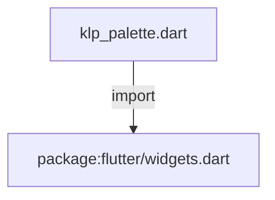
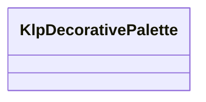

# klp_palette.dart：直接依賴與宣告架構

[回到目錄](README.md) · [來源檔案](../../../../lib/src/foundation/klp_palette.dart)

## 範圍

核心是 `lib/src/foundation/klp_palette.dart`。主要視角為該檔案明寫的 import／export／part；輔助視角為本檔宣告及 extends／implements／with／on 關係。只展開一層外部邊界。

## 直接依賴圖

## 依賴證據

| 關係 | 原始 directive | 來源 |
|---|---|---|
| import | <code>import &#x27;package:flutter/widgets.dart&#x27;;</code> | [lib/src/foundation/klp_palette.dart:1](../../../../lib/src/foundation/klp_palette.dart#L1) |

## 宣告關係圖

本組節點是本檔宣告；沒有箭頭的宣告未在此圖主張互相依賴。

## 宣告與成員證據

成員包含 public 與 private；簽章取自來源，省略函式本體與欄位初始值。`(inferred)` 表示來源未明寫型別；建構子只顯示參數部分，不含初始化列表。

### KlpDecorativePalette

ClassDeclaration · public · [lib/src/foundation/klp_palette.dart:3](../../../../lib/src/foundation/klp_palette.dart#L3)

<code>abstract final class KlpDecorativePalette</code>

來源註解摘要：裝飾用顏色：**不屬於設計語言**，因此不會隨主題改變。 這些顏色出現在「畫一張示意圖」的場合——主題預覽磚要模擬桌布與視窗紅綠燈，那是插圖， 不是介面。它們刻意與 `KlpPalette` 分開：混在一起會讓人誤以為可以拿來上色元件， 而元件用了它們就會在換主題時原地不動。

| 成員 | 可見性 | 簽章／型別 | 來源註解摘要 | 證據 |
|---|---|---|---|---|
| field <code>previewWallpaper</code> | public | <code>static const List&lt;Color&gt; previewWallpaper</code> | 主題預覽磚模擬的桌布漸層。 | [lib/src/foundation/klp_palette.dart:10](../../../../lib/src/foundation/klp_palette.dart#L10) |
| field <code>previewWallpaperStops</code> | public | <code>static const List&lt;double&gt; previewWallpaperStops</code> |  | [lib/src/foundation/klp_palette.dart:17](../../../../lib/src/foundation/klp_palette.dart#L17) |
| field <code>windowTrafficLights</code> | public | <code>static const List&lt;Color&gt; windowTrafficLights</code> | 視窗控制鈕的紅、黃、綠。這是對桌面平台既有慣例的複述，不是本設計系統的色彩選擇。 | [lib/src/foundation/klp_palette.dart:20](../../../../lib/src/foundation/klp_palette.dart#L20) |

## 閱讀說明與限制

箭頭只表示來源明寫的靜態關係；import 不等於呼叫。未分析動態呼叫、欄位的實際物件擁有權、狀態轉移或渲染流程；型別未進行語意解析，繼承目標保留原始型別拼寫。public／private 依 Dart 名稱前綴判斷；public 宣告不代表已由 `lib/kallopis.dart` 匯出。

本頁由 `tool/architecture_atlas` 產生；編輯來源或生成工具後重新產生，避免手改本頁。
