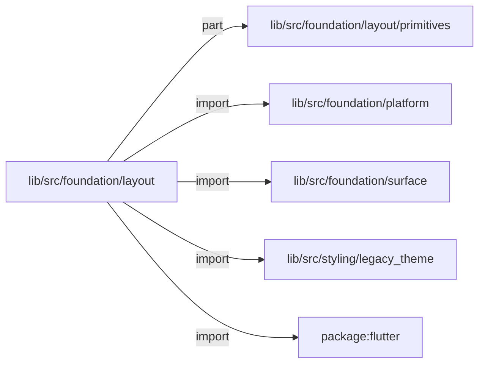
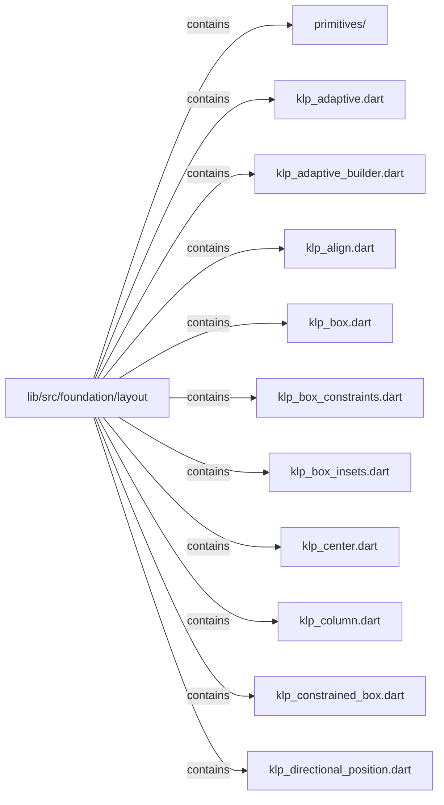
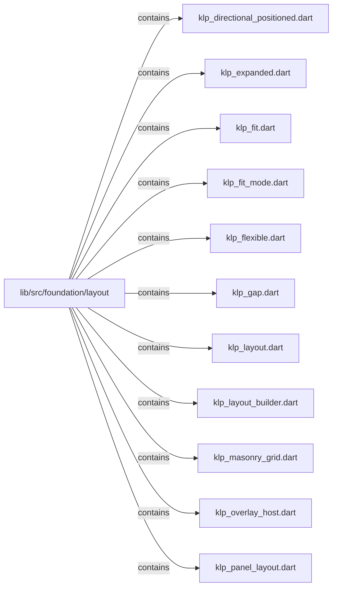
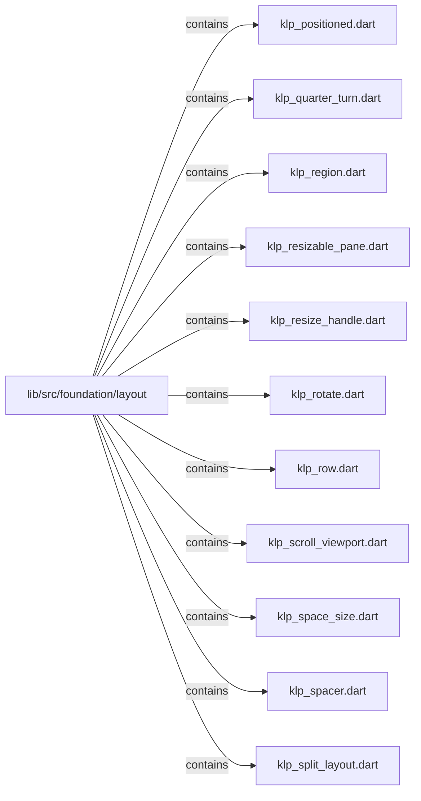
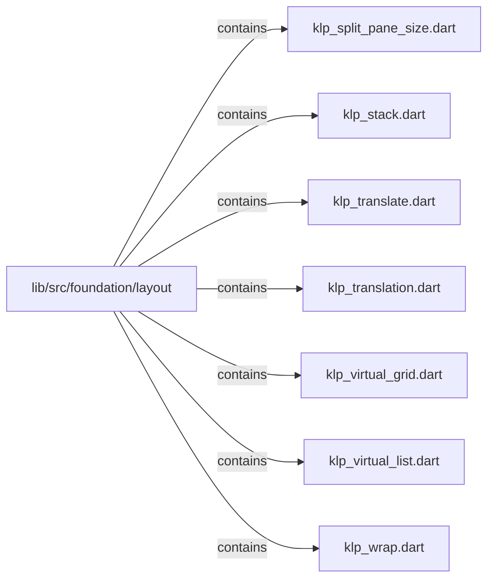

# lib/src/foundation/layout：架構分析入口

[上一層](../README.md)

## 範圍

閱讀 `lib/src/foundation/layout` 的直接子目錄與 Dart 檔案。結構圖表示實際檔案包含關係；依賴圖表示本層檔案明寫的 directives。每個檔案頁另列直接依賴、宣告、欄位、方法、建構子及行號證據。

## 本層直接依賴圖

箭頭以本層 Dart 檔案明寫的 directive 彙總到目標所在目錄或外部套件邊界；不遞迴將子目錄依賴算入本層。相同目標的不同 directive 類型分開計數。

| 目標邊界 | 關係 | directive 數 | 第一筆來源證據 |
|---|---|---|---|
| <code>lib/src/foundation/layout/primitives</code> | part | 2 | [lib/src/foundation/layout/klp_split_layout.dart:11](../../../../../lib/src/foundation/layout/klp_split_layout.dart#L11) |
| <code>lib/src/foundation/platform</code> | import | 3 | [lib/src/foundation/layout/klp_adaptive.dart:3](../../../../../lib/src/foundation/layout/klp_adaptive.dart#L3) |
| <code>lib/src/foundation/surface</code> | import | 3 | [lib/src/foundation/layout/klp_box.dart:3](../../../../../lib/src/foundation/layout/klp_box.dart#L3) |
| <code>lib/src/styling/legacy_theme</code> | import | 6 | [lib/src/foundation/layout/klp_gap.dart:3](../../../../../lib/src/foundation/layout/klp_gap.dart#L3) |
| <code>package:flutter</code> | import | 31 | [lib/src/foundation/layout/klp_adaptive.dart:1](../../../../../lib/src/foundation/layout/klp_adaptive.dart#L1) |

### 同目錄依賴

| 來源 → 目標 | 關係 | 證據 |
|---|---|---|
| <code>klp_adaptive.dart → klp_adaptive_builder.dart</code> | import | [lib/src/foundation/layout/klp_adaptive.dart:6](../../../../../lib/src/foundation/layout/klp_adaptive.dart#L6) |
| <code>klp_adaptive.dart → klp_panel_layout.dart</code> | import | [lib/src/foundation/layout/klp_adaptive.dart:7](../../../../../lib/src/foundation/layout/klp_adaptive.dart#L7) |
| <code>klp_box.dart → klp_gap.dart</code> | import | [lib/src/foundation/layout/klp_box.dart:4](../../../../../lib/src/foundation/layout/klp_box.dart#L4) |
| <code>klp_box.dart → klp_box_insets.dart</code> | import | [lib/src/foundation/layout/klp_box.dart:5](../../../../../lib/src/foundation/layout/klp_box.dart#L5) |
| <code>klp_box.dart → klp_space_size.dart</code> | import | [lib/src/foundation/layout/klp_box.dart:6](../../../../../lib/src/foundation/layout/klp_box.dart#L6) |
| <code>klp_constrained_box.dart → klp_box_constraints.dart</code> | import | [lib/src/foundation/layout/klp_constrained_box.dart:3](../../../../../lib/src/foundation/layout/klp_constrained_box.dart#L3) |
| <code>klp_directional_positioned.dart → klp_directional_position.dart</code> | import | [lib/src/foundation/layout/klp_directional_positioned.dart:3](../../../../../lib/src/foundation/layout/klp_directional_positioned.dart#L3) |
| <code>klp_fit.dart → klp_fit_mode.dart</code> | import | [lib/src/foundation/layout/klp_fit.dart:3](../../../../../lib/src/foundation/layout/klp_fit.dart#L3) |
| <code>klp_gap.dart → klp_space_size.dart</code> | import | [lib/src/foundation/layout/klp_gap.dart:4](../../../../../lib/src/foundation/layout/klp_gap.dart#L4) |
| <code>klp_layout.dart → klp_align.dart</code> | export | [lib/src/foundation/layout/klp_layout.dart:3](../../../../../lib/src/foundation/layout/klp_layout.dart#L3) |
| <code>klp_layout.dart → klp_adaptive.dart</code> | export | [lib/src/foundation/layout/klp_layout.dart:4](../../../../../lib/src/foundation/layout/klp_layout.dart#L4) |
| <code>klp_layout.dart → klp_adaptive_builder.dart</code> | export | [lib/src/foundation/layout/klp_layout.dart:5](../../../../../lib/src/foundation/layout/klp_layout.dart#L5) |
| <code>klp_layout.dart → klp_box.dart</code> | export | [lib/src/foundation/layout/klp_layout.dart:6](../../../../../lib/src/foundation/layout/klp_layout.dart#L6) |
| <code>klp_layout.dart → klp_box_constraints.dart</code> | export | [lib/src/foundation/layout/klp_layout.dart:7](../../../../../lib/src/foundation/layout/klp_layout.dart#L7) |
| <code>klp_layout.dart → klp_box_insets.dart</code> | export | [lib/src/foundation/layout/klp_layout.dart:8](../../../../../lib/src/foundation/layout/klp_layout.dart#L8) |
| <code>klp_layout.dart → klp_center.dart</code> | export | [lib/src/foundation/layout/klp_layout.dart:9](../../../../../lib/src/foundation/layout/klp_layout.dart#L9) |
| <code>klp_layout.dart → klp_column.dart</code> | export | [lib/src/foundation/layout/klp_layout.dart:10](../../../../../lib/src/foundation/layout/klp_layout.dart#L10) |
| <code>klp_layout.dart → klp_constrained_box.dart</code> | export | [lib/src/foundation/layout/klp_layout.dart:11](../../../../../lib/src/foundation/layout/klp_layout.dart#L11) |
| <code>klp_layout.dart → klp_directional_position.dart</code> | export | [lib/src/foundation/layout/klp_layout.dart:12](../../../../../lib/src/foundation/layout/klp_layout.dart#L12) |
| <code>klp_layout.dart → klp_directional_positioned.dart</code> | export | [lib/src/foundation/layout/klp_layout.dart:13](../../../../../lib/src/foundation/layout/klp_layout.dart#L13) |
| <code>klp_layout.dart → klp_expanded.dart</code> | export | [lib/src/foundation/layout/klp_layout.dart:14](../../../../../lib/src/foundation/layout/klp_layout.dart#L14) |
| <code>klp_layout.dart → klp_flexible.dart</code> | export | [lib/src/foundation/layout/klp_layout.dart:15](../../../../../lib/src/foundation/layout/klp_layout.dart#L15) |
| <code>klp_layout.dart → klp_fit.dart</code> | export | [lib/src/foundation/layout/klp_layout.dart:16](../../../../../lib/src/foundation/layout/klp_layout.dart#L16) |
| <code>klp_layout.dart → klp_fit_mode.dart</code> | export | [lib/src/foundation/layout/klp_layout.dart:17](../../../../../lib/src/foundation/layout/klp_layout.dart#L17) |
| <code>klp_layout.dart → klp_gap.dart</code> | export | [lib/src/foundation/layout/klp_layout.dart:18](../../../../../lib/src/foundation/layout/klp_layout.dart#L18) |
| <code>klp_layout.dart → klp_layout_builder.dart</code> | export | [lib/src/foundation/layout/klp_layout.dart:19](../../../../../lib/src/foundation/layout/klp_layout.dart#L19) |
| <code>klp_layout.dart → klp_overlay_host.dart</code> | export | [lib/src/foundation/layout/klp_layout.dart:20](../../../../../lib/src/foundation/layout/klp_layout.dart#L20) |
| <code>klp_layout.dart → klp_panel_layout.dart</code> | export | [lib/src/foundation/layout/klp_layout.dart:21](../../../../../lib/src/foundation/layout/klp_layout.dart#L21) |
| <code>klp_layout.dart → klp_positioned.dart</code> | export | [lib/src/foundation/layout/klp_layout.dart:22](../../../../../lib/src/foundation/layout/klp_layout.dart#L22) |
| <code>klp_layout.dart → klp_quarter_turn.dart</code> | export | [lib/src/foundation/layout/klp_layout.dart:23](../../../../../lib/src/foundation/layout/klp_layout.dart#L23) |
| <code>klp_layout.dart → klp_region.dart</code> | export | [lib/src/foundation/layout/klp_layout.dart:24](../../../../../lib/src/foundation/layout/klp_layout.dart#L24) |
| <code>klp_layout.dart → klp_resizable_pane.dart</code> | export | [lib/src/foundation/layout/klp_layout.dart:25](../../../../../lib/src/foundation/layout/klp_layout.dart#L25) |
| <code>klp_layout.dart → klp_resize_handle.dart</code> | export | [lib/src/foundation/layout/klp_layout.dart:26](../../../../../lib/src/foundation/layout/klp_layout.dart#L26) |
| <code>klp_layout.dart → klp_row.dart</code> | export | [lib/src/foundation/layout/klp_layout.dart:27](../../../../../lib/src/foundation/layout/klp_layout.dart#L27) |
| <code>klp_layout.dart → klp_rotate.dart</code> | export | [lib/src/foundation/layout/klp_layout.dart:28](../../../../../lib/src/foundation/layout/klp_layout.dart#L28) |
| <code>klp_layout.dart → klp_scroll_viewport.dart</code> | export | [lib/src/foundation/layout/klp_layout.dart:29](../../../../../lib/src/foundation/layout/klp_layout.dart#L29) |
| <code>klp_layout.dart → klp_spacer.dart</code> | export | [lib/src/foundation/layout/klp_layout.dart:30](../../../../../lib/src/foundation/layout/klp_layout.dart#L30) |
| <code>klp_layout.dart → klp_space_size.dart</code> | export | [lib/src/foundation/layout/klp_layout.dart:31](../../../../../lib/src/foundation/layout/klp_layout.dart#L31) |
| <code>klp_layout.dart → klp_split_layout.dart</code> | export | [lib/src/foundation/layout/klp_layout.dart:32](../../../../../lib/src/foundation/layout/klp_layout.dart#L32) |
| <code>klp_layout.dart → klp_split_pane_size.dart</code> | export | [lib/src/foundation/layout/klp_layout.dart:33](../../../../../lib/src/foundation/layout/klp_layout.dart#L33) |
| <code>klp_layout.dart → klp_stack.dart</code> | export | [lib/src/foundation/layout/klp_layout.dart:34](../../../../../lib/src/foundation/layout/klp_layout.dart#L34) |
| <code>klp_layout.dart → klp_translate.dart</code> | export | [lib/src/foundation/layout/klp_layout.dart:35](../../../../../lib/src/foundation/layout/klp_layout.dart#L35) |
| <code>klp_layout.dart → klp_translation.dart</code> | export | [lib/src/foundation/layout/klp_layout.dart:36](../../../../../lib/src/foundation/layout/klp_layout.dart#L36) |
| <code>klp_layout.dart → klp_virtual_grid.dart</code> | export | [lib/src/foundation/layout/klp_layout.dart:37](../../../../../lib/src/foundation/layout/klp_layout.dart#L37) |
| <code>klp_layout.dart → klp_virtual_list.dart</code> | export | [lib/src/foundation/layout/klp_layout.dart:38](../../../../../lib/src/foundation/layout/klp_layout.dart#L38) |
| <code>klp_layout.dart → klp_wrap.dart</code> | export | [lib/src/foundation/layout/klp_layout.dart:39](../../../../../lib/src/foundation/layout/klp_layout.dart#L39) |
| <code>klp_rotate.dart → klp_quarter_turn.dart</code> | import | [lib/src/foundation/layout/klp_rotate.dart:3](../../../../../lib/src/foundation/layout/klp_rotate.dart#L3) |
| <code>klp_split_layout.dart → klp_expanded.dart</code> | import | [lib/src/foundation/layout/klp_split_layout.dart:5](../../../../../lib/src/foundation/layout/klp_split_layout.dart#L5) |
| <code>klp_split_layout.dart → klp_gap.dart</code> | import | [lib/src/foundation/layout/klp_split_layout.dart:6](../../../../../lib/src/foundation/layout/klp_split_layout.dart#L6) |
| <code>klp_split_layout.dart → klp_row.dart</code> | import | [lib/src/foundation/layout/klp_split_layout.dart:7](../../../../../lib/src/foundation/layout/klp_split_layout.dart#L7) |
| <code>klp_split_layout.dart → klp_space_size.dart</code> | import | [lib/src/foundation/layout/klp_split_layout.dart:8](../../../../../lib/src/foundation/layout/klp_split_layout.dart#L8) |
| <code>klp_split_layout.dart → klp_split_pane_size.dart</code> | import | [lib/src/foundation/layout/klp_split_layout.dart:9](../../../../../lib/src/foundation/layout/klp_split_layout.dart#L9) |
| <code>klp_translate.dart → klp_translation.dart</code> | import | [lib/src/foundation/layout/klp_translate.dart:3](../../../../../lib/src/foundation/layout/klp_translate.dart#L3) |
| <code>klp_wrap.dart → klp_gap.dart</code> | import | [lib/src/foundation/layout/klp_wrap.dart:3](../../../../../lib/src/foundation/layout/klp_wrap.dart#L3) |
| <code>klp_wrap.dart → klp_space_size.dart</code> | import | [lib/src/foundation/layout/klp_wrap.dart:4](../../../../../lib/src/foundation/layout/klp_wrap.dart#L4) |

## 目錄結構圖

## 子目錄

| 目錄 | 導航 | 來源證據 |
|---|---|---|
| `primitives/` | [架構入口](primitives/README.md) | [來源目錄](../../../../../lib/src/foundation/layout/primitives) |

## 本層檔案

| 檔案 | 宣告 | 細節 | 來源證據 |
|---|---|---|---|
| `klp_adaptive.dart` | KlpAdaptive | [架構與 API](klp_adaptive.md) | [lib/src/foundation/layout/klp_adaptive.dart:1](../../../../../lib/src/foundation/layout/klp_adaptive.dart#L1) |
| `klp_adaptive_builder.dart` | KlpAdaptiveBuilder | [架構與 API](klp_adaptive_builder.md) | [lib/src/foundation/layout/klp_adaptive_builder.dart:1](../../../../../lib/src/foundation/layout/klp_adaptive_builder.dart#L1) |
| `klp_align.dart` | KlpAlign | [架構與 API](klp_align.md) | [lib/src/foundation/layout/klp_align.dart:1](../../../../../lib/src/foundation/layout/klp_align.dart#L1) |
| `klp_box.dart` | KlpBox | [架構與 API](klp_box.md) | [lib/src/foundation/layout/klp_box.dart:1](../../../../../lib/src/foundation/layout/klp_box.dart#L1) |
| `klp_box_constraints.dart` | KlpBoxConstraints | [架構與 API](klp_box_constraints.md) | [lib/src/foundation/layout/klp_box_constraints.dart:1](../../../../../lib/src/foundation/layout/klp_box_constraints.dart#L1) |
| `klp_box_insets.dart` | KlpBoxInsets | [架構與 API](klp_box_insets.md) | [lib/src/foundation/layout/klp_box_insets.dart:1](../../../../../lib/src/foundation/layout/klp_box_insets.dart#L1) |
| `klp_center.dart` | KlpCenter | [架構與 API](klp_center.md) | [lib/src/foundation/layout/klp_center.dart:1](../../../../../lib/src/foundation/layout/klp_center.dart#L1) |
| `klp_column.dart` | KlpColumn | [架構與 API](klp_column.md) | [lib/src/foundation/layout/klp_column.dart:1](../../../../../lib/src/foundation/layout/klp_column.dart#L1) |
| `klp_constrained_box.dart` | KlpConstrainedBox | [架構與 API](klp_constrained_box.md) | [lib/src/foundation/layout/klp_constrained_box.dart:1](../../../../../lib/src/foundation/layout/klp_constrained_box.dart#L1) |
| `klp_directional_position.dart` | KlpDirectionalPosition | [架構與 API](klp_directional_position.md) | [lib/src/foundation/layout/klp_directional_position.dart:1](../../../../../lib/src/foundation/layout/klp_directional_position.dart#L1) |
| `klp_directional_positioned.dart` | KlpDirectionalPositioned | [架構與 API](klp_directional_positioned.md) | [lib/src/foundation/layout/klp_directional_positioned.dart:1](../../../../../lib/src/foundation/layout/klp_directional_positioned.dart#L1) |
| `klp_expanded.dart` | KlpExpanded | [架構與 API](klp_expanded.md) | [lib/src/foundation/layout/klp_expanded.dart:1](../../../../../lib/src/foundation/layout/klp_expanded.dart#L1) |
| `klp_fit.dart` | KlpFit | [架構與 API](klp_fit.md) | [lib/src/foundation/layout/klp_fit.dart:1](../../../../../lib/src/foundation/layout/klp_fit.dart#L1) |
| `klp_fit_mode.dart` | KlpFitMode | [架構與 API](klp_fit_mode.md) | [lib/src/foundation/layout/klp_fit_mode.dart:1](../../../../../lib/src/foundation/layout/klp_fit_mode.dart#L1) |
| `klp_flexible.dart` | KlpFlexible | [架構與 API](klp_flexible.md) | [lib/src/foundation/layout/klp_flexible.dart:1](../../../../../lib/src/foundation/layout/klp_flexible.dart#L1) |
| `klp_gap.dart` | KlpGap | [架構與 API](klp_gap.md) | [lib/src/foundation/layout/klp_gap.dart:1](../../../../../lib/src/foundation/layout/klp_gap.dart#L1) |
| `klp_layout.dart` | 無頂層宣告 | [架構與 API](klp_layout.md) | [lib/src/foundation/layout/klp_layout.dart:1](../../../../../lib/src/foundation/layout/klp_layout.dart#L1) |
| `klp_layout_builder.dart` | KlpLayoutBuilder | [架構與 API](klp_layout_builder.md) | [lib/src/foundation/layout/klp_layout_builder.dart:1](../../../../../lib/src/foundation/layout/klp_layout_builder.dart#L1) |
| `klp_masonry_grid.dart` | KlpMasonryGrid | [架構與 API](klp_masonry_grid.md) | [lib/src/foundation/layout/klp_masonry_grid.dart:1](../../../../../lib/src/foundation/layout/klp_masonry_grid.dart#L1) |
| `klp_overlay_host.dart` | KlpOverlayHost | [架構與 API](klp_overlay_host.md) | [lib/src/foundation/layout/klp_overlay_host.dart:1](../../../../../lib/src/foundation/layout/klp_overlay_host.dart#L1) |
| `klp_panel_layout.dart` | KlpPanelLayout | [架構與 API](klp_panel_layout.md) | [lib/src/foundation/layout/klp_panel_layout.dart:1](../../../../../lib/src/foundation/layout/klp_panel_layout.dart#L1) |
| `klp_positioned.dart` | KlpPositioned | [架構與 API](klp_positioned.md) | [lib/src/foundation/layout/klp_positioned.dart:1](../../../../../lib/src/foundation/layout/klp_positioned.dart#L1) |
| `klp_quarter_turn.dart` | KlpQuarterTurn | [架構與 API](klp_quarter_turn.md) | [lib/src/foundation/layout/klp_quarter_turn.dart:1](../../../../../lib/src/foundation/layout/klp_quarter_turn.dart#L1) |
| `klp_region.dart` | KlpRegion | [架構與 API](klp_region.md) | [lib/src/foundation/layout/klp_region.dart:1](../../../../../lib/src/foundation/layout/klp_region.dart#L1) |
| `klp_resizable_pane.dart` | KlpResizablePane | [架構與 API](klp_resizable_pane.md) | [lib/src/foundation/layout/klp_resizable_pane.dart:1](../../../../../lib/src/foundation/layout/klp_resizable_pane.dart#L1) |
| `klp_resize_handle.dart` | KlpResizeHandle | [架構與 API](klp_resize_handle.md) | [lib/src/foundation/layout/klp_resize_handle.dart:1](../../../../../lib/src/foundation/layout/klp_resize_handle.dart#L1) |
| `klp_rotate.dart` | KlpRotate | [架構與 API](klp_rotate.md) | [lib/src/foundation/layout/klp_rotate.dart:1](../../../../../lib/src/foundation/layout/klp_rotate.dart#L1) |
| `klp_row.dart` | KlpRow | [架構與 API](klp_row.md) | [lib/src/foundation/layout/klp_row.dart:1](../../../../../lib/src/foundation/layout/klp_row.dart#L1) |
| `klp_scroll_viewport.dart` | KlpScrollViewport | [架構與 API](klp_scroll_viewport.md) | [lib/src/foundation/layout/klp_scroll_viewport.dart:1](../../../../../lib/src/foundation/layout/klp_scroll_viewport.dart#L1) |
| `klp_space_size.dart` | KlpSpaceSize | [架構與 API](klp_space_size.md) | [lib/src/foundation/layout/klp_space_size.dart:1](../../../../../lib/src/foundation/layout/klp_space_size.dart#L1) |
| `klp_spacer.dart` | KlpSpacer | [架構與 API](klp_spacer.md) | [lib/src/foundation/layout/klp_spacer.dart:1](../../../../../lib/src/foundation/layout/klp_spacer.dart#L1) |
| `klp_split_layout.dart` | KlpSplitLayout | [架構與 API](klp_split_layout.md) | [lib/src/foundation/layout/klp_split_layout.dart:1](../../../../../lib/src/foundation/layout/klp_split_layout.dart#L1) |
| `klp_split_pane_size.dart` | KlpSplitPaneSize | [架構與 API](klp_split_pane_size.md) | [lib/src/foundation/layout/klp_split_pane_size.dart:1](../../../../../lib/src/foundation/layout/klp_split_pane_size.dart#L1) |
| `klp_stack.dart` | KlpStack | [架構與 API](klp_stack.md) | [lib/src/foundation/layout/klp_stack.dart:1](../../../../../lib/src/foundation/layout/klp_stack.dart#L1) |
| `klp_translate.dart` | KlpTranslate | [架構與 API](klp_translate.md) | [lib/src/foundation/layout/klp_translate.dart:1](../../../../../lib/src/foundation/layout/klp_translate.dart#L1) |
| `klp_translation.dart` | KlpTranslation | [架構與 API](klp_translation.md) | [lib/src/foundation/layout/klp_translation.dart:1](../../../../../lib/src/foundation/layout/klp_translation.dart#L1) |
| `klp_virtual_grid.dart` | KlpVirtualGrid | [架構與 API](klp_virtual_grid.md) | [lib/src/foundation/layout/klp_virtual_grid.dart:1](../../../../../lib/src/foundation/layout/klp_virtual_grid.dart#L1) |
| `klp_virtual_list.dart` | KlpVirtualList | [架構與 API](klp_virtual_list.md) | [lib/src/foundation/layout/klp_virtual_list.dart:1](../../../../../lib/src/foundation/layout/klp_virtual_list.dart#L1) |
| `klp_wrap.dart` | KlpWrap | [架構與 API](klp_wrap.md) | [lib/src/foundation/layout/klp_wrap.dart:1](../../../../../lib/src/foundation/layout/klp_wrap.dart#L1) |

## 閱讀說明

箭頭只表示來源明寫的靜態關係；import 不等於呼叫。未分析動態呼叫、欄位的實際物件擁有權、狀態轉移或渲染流程；型別未進行語意解析，繼承目標保留原始型別拼寫。public／private 依 Dart 名稱前綴判斷；public 宣告不代表已由 `lib/kallopis.dart` 匯出。

本頁的目錄與檔案由來源清冊產生；`manifest.json` 位於本圖集根目錄，可核對 SHA-256 與覆蓋數。人工模組摘要存於 `tool/architecture_atlas/briefs/`，重新生成時保留。
