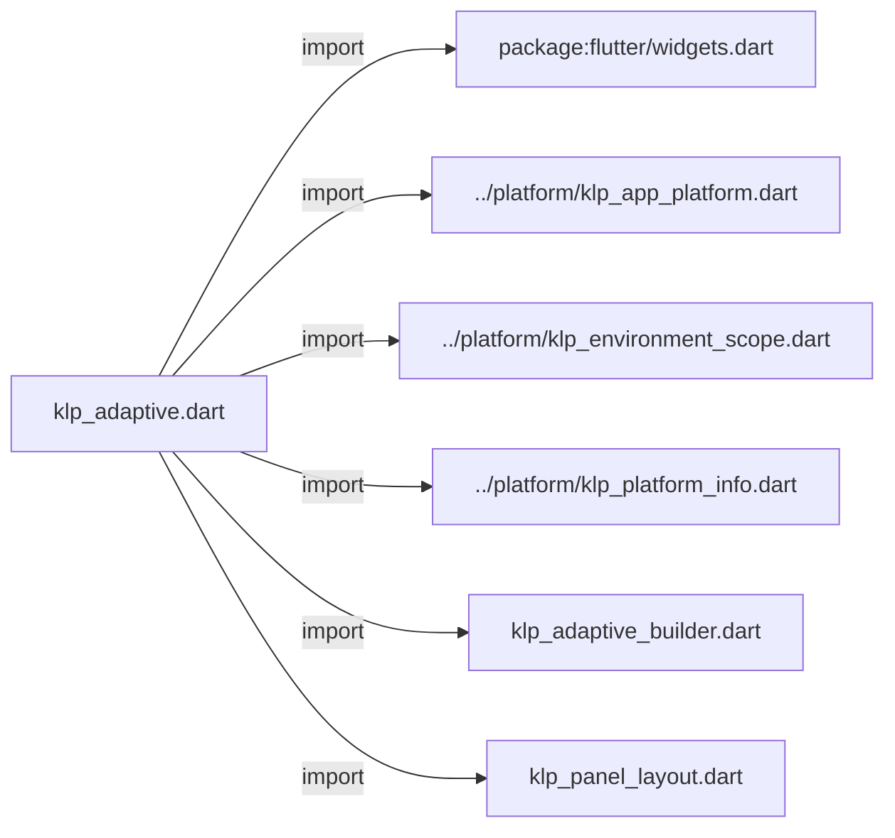
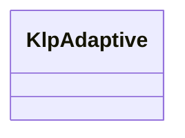
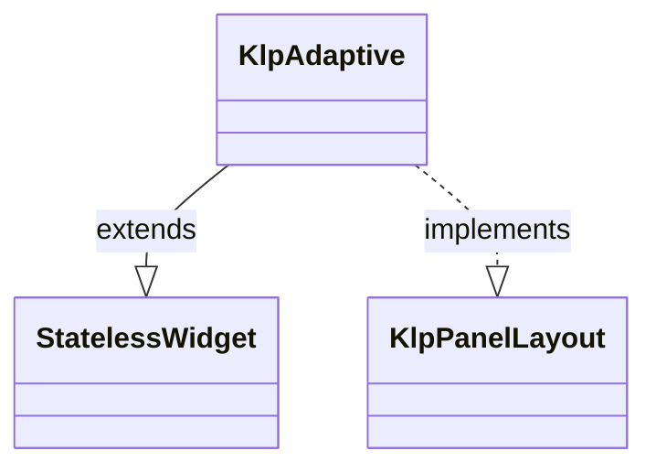

# klp_adaptive.dart：直接依賴與宣告架構

[回到目錄](README.md) · [來源檔案](../../../../../lib/src/foundation/layout/klp_adaptive.dart)

## 範圍

核心是 `lib/src/foundation/layout/klp_adaptive.dart`。主要視角為該檔案明寫的 import／export／part；輔助視角為本檔宣告及 extends／implements／with／on 關係。只展開一層外部邊界。

## 直接依賴圖

## 依賴證據

| 關係 | 原始 directive | 來源 |
|---|---|---|
| import | <code>import &#x27;package:flutter/widgets.dart&#x27;;</code> | [lib/src/foundation/layout/klp_adaptive.dart:1](../../../../../lib/src/foundation/layout/klp_adaptive.dart#L1) |
| import | <code>import &#x27;../platform/klp_app_platform.dart&#x27;;</code> | [lib/src/foundation/layout/klp_adaptive.dart:3](../../../../../lib/src/foundation/layout/klp_adaptive.dart#L3) |
| import | <code>import &#x27;../platform/klp_environment_scope.dart&#x27;;</code> | [lib/src/foundation/layout/klp_adaptive.dart:4](../../../../../lib/src/foundation/layout/klp_adaptive.dart#L4) |
| import | <code>import &#x27;../platform/klp_platform_info.dart&#x27;;</code> | [lib/src/foundation/layout/klp_adaptive.dart:5](../../../../../lib/src/foundation/layout/klp_adaptive.dart#L5) |
| import | <code>import &#x27;klp_adaptive_builder.dart&#x27;;</code> | [lib/src/foundation/layout/klp_adaptive.dart:6](../../../../../lib/src/foundation/layout/klp_adaptive.dart#L6) |
| import | <code>import &#x27;klp_panel_layout.dart&#x27;;</code> | [lib/src/foundation/layout/klp_adaptive.dart:7](../../../../../lib/src/foundation/layout/klp_adaptive.dart#L7) |

## 宣告關係圖

本組節點是本檔宣告；沒有箭頭的宣告未在此圖主張互相依賴。

## 宣告與成員證據

成員包含 public 與 private；簽章取自來源，省略函式本體與欄位初始值。`(inferred)` 表示來源未明寫型別；建構子只顯示參數部分，不含初始化列表。

### KlpAdaptive

ClassDeclaration · public · [lib/src/foundation/layout/klp_adaptive.dart:9](../../../../../lib/src/foundation/layout/klp_adaptive.dart#L9)

<code>class KlpAdaptive extends StatelessWidget implements KlpPanelLayout</code>

來源註解摘要：依明確覆寫、[KlpEnvironmentScope] 或實際執行平台選擇呈現分支。 只處理平台差異，不依據視窗尺寸切換平台策略。分支內部可自行處理 該平台的空間限制。

- `extends` → <code>StatelessWidget</code>：[lib/src/foundation/layout/klp_adaptive.dart:13](../../../../../lib/src/foundation/layout/klp_adaptive.dart#L13)
- `implements` → <code>KlpPanelLayout</code>：[lib/src/foundation/layout/klp_adaptive.dart:13](../../../../../lib/src/foundation/layout/klp_adaptive.dart#L13)

| 成員 | 可見性 | 簽章／型別 | 來源註解摘要 | 證據 |
|---|---|---|---|---|
| constructor <code>KlpAdaptive</code> | public | <code>const KlpAdaptive({ super.key, required this.windows, required this.android, this.platform, this.macos, this.linux, this.ios, this.other, })</code> |  | [lib/src/foundation/layout/klp_adaptive.dart:14](../../../../../lib/src/foundation/layout/klp_adaptive.dart#L14) |
| field <code>windows</code> | public | <code>final KlpAdaptiveBuilder windows</code> |  | [lib/src/foundation/layout/klp_adaptive.dart:25](../../../../../lib/src/foundation/layout/klp_adaptive.dart#L25) |
| field <code>android</code> | public | <code>final KlpAdaptiveBuilder android</code> |  | [lib/src/foundation/layout/klp_adaptive.dart:26](../../../../../lib/src/foundation/layout/klp_adaptive.dart#L26) |
| field <code>platform</code> | public | <code>final KlpAppPlatform? platform</code> |  | [lib/src/foundation/layout/klp_adaptive.dart:27](../../../../../lib/src/foundation/layout/klp_adaptive.dart#L27) |
| field <code>macos</code> | public | <code>final KlpAdaptiveBuilder? macos</code> |  | [lib/src/foundation/layout/klp_adaptive.dart:28](../../../../../lib/src/foundation/layout/klp_adaptive.dart#L28) |
| field <code>linux</code> | public | <code>final KlpAdaptiveBuilder? linux</code> |  | [lib/src/foundation/layout/klp_adaptive.dart:29](../../../../../lib/src/foundation/layout/klp_adaptive.dart#L29) |
| field <code>ios</code> | public | <code>final KlpAdaptiveBuilder? ios</code> |  | [lib/src/foundation/layout/klp_adaptive.dart:30](../../../../../lib/src/foundation/layout/klp_adaptive.dart#L30) |
| field <code>other</code> | public | <code>final KlpAdaptiveBuilder? other</code> |  | [lib/src/foundation/layout/klp_adaptive.dart:31](../../../../../lib/src/foundation/layout/klp_adaptive.dart#L31) |
| method <code>build</code> | public | <code>Widget build(BuildContext context)</code> |  | [lib/src/foundation/layout/klp_adaptive.dart:33](../../../../../lib/src/foundation/layout/klp_adaptive.dart#L33) |
| method <code>buildPanelLayout</code> | public | <code>Widget buildPanelLayout(BuildContext context)</code> |  | [lib/src/foundation/layout/klp_adaptive.dart:49](../../../../../lib/src/foundation/layout/klp_adaptive.dart#L49) |

## 閱讀說明與限制

箭頭只表示來源明寫的靜態關係；import 不等於呼叫。未分析動態呼叫、欄位的實際物件擁有權、狀態轉移或渲染流程；型別未進行語意解析，繼承目標保留原始型別拼寫。public／private 依 Dart 名稱前綴判斷；public 宣告不代表已由 `lib/kallopis.dart` 匯出。

本頁由 `tool/architecture_atlas` 產生；編輯來源或生成工具後重新產生，避免手改本頁。
