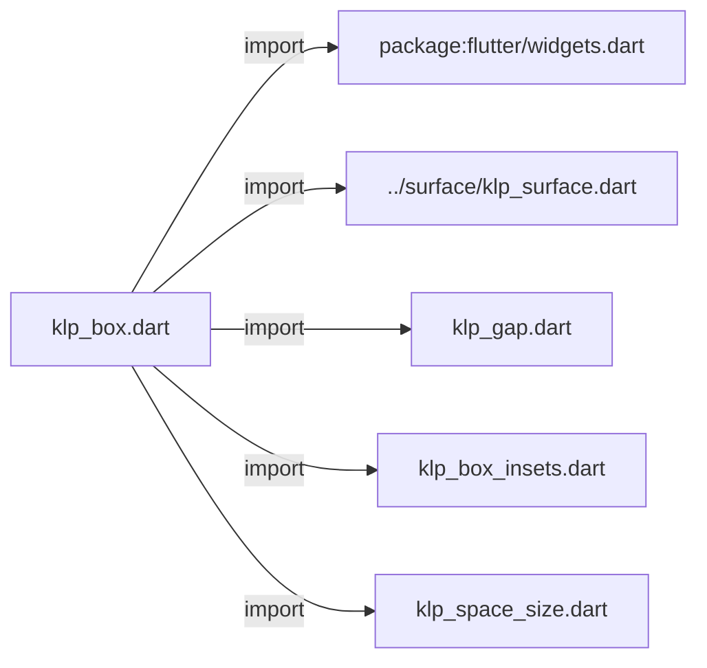
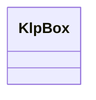
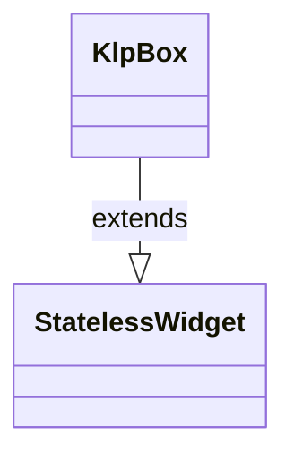

# klp_box.dart：直接依賴與宣告架構

[回到目錄](README.md) · [來源檔案](../../../../../lib/src/foundation/layout/klp_box.dart)

## 範圍

核心是 `lib/src/foundation/layout/klp_box.dart`。主要視角為該檔案明寫的 import／export／part；輔助視角為本檔宣告及 extends／implements／with／on 關係。只展開一層外部邊界。

## 直接依賴圖

## 依賴證據

| 關係 | 原始 directive | 來源 |
|---|---|---|
| import | <code>import &#x27;package:flutter/widgets.dart&#x27;;</code> | [lib/src/foundation/layout/klp_box.dart:1](../../../../../lib/src/foundation/layout/klp_box.dart#L1) |
| import | <code>import &#x27;../surface/klp_surface.dart&#x27;;</code> | [lib/src/foundation/layout/klp_box.dart:3](../../../../../lib/src/foundation/layout/klp_box.dart#L3) |
| import | <code>import &#x27;klp_gap.dart&#x27;;</code> | [lib/src/foundation/layout/klp_box.dart:4](../../../../../lib/src/foundation/layout/klp_box.dart#L4) |
| import | <code>import &#x27;klp_box_insets.dart&#x27;;</code> | [lib/src/foundation/layout/klp_box.dart:5](../../../../../lib/src/foundation/layout/klp_box.dart#L5) |
| import | <code>import &#x27;klp_space_size.dart&#x27;;</code> | [lib/src/foundation/layout/klp_box.dart:6](../../../../../lib/src/foundation/layout/klp_box.dart#L6) |

## 宣告關係圖

本組節點是本檔宣告；沒有箭頭的宣告未在此圖主張互相依賴。

## 宣告與成員證據

成員包含 public 與 private；簽章取自來源，省略函式本體與欄位初始值。`(inferred)` 表示來源未明寫型別；建構子只顯示參數部分，不含初始化列表。

### KlpBox

ClassDeclaration · public · [lib/src/foundation/layout/klp_box.dart:8](../../../../../lib/src/foundation/layout/klp_box.dart#L8)

<code>class KlpBox extends StatelessWidget</code>

來源註解摘要：基礎尺寸與邊距容器排版原語。取代 Container 與 SizedBox。 支援風格介面、風格枚舉（KlpSpaceSize）與傳統尺寸邊距設定。

- `extends` → <code>StatelessWidget</code>：[lib/src/foundation/layout/klp_box.dart:10](../../../../../lib/src/foundation/layout/klp_box.dart#L10)

| 成員 | 可見性 | 簽章／型別 | 來源註解摘要 | 證據 |
|---|---|---|---|---|
| constructor <code>KlpBox</code> | public | <code>const KlpBox({ super.key, this.width, this.height, this.widthSize, this.heightSize, this.padding, this.margin, this.insets, this.marginInsets, this.paddingSize, this.marginSize, this.tone, this.radius, this.child, })</code> |  | [lib/src/foundation/layout/klp_box.dart:11](../../../../../lib/src/foundation/layout/klp_box.dart#L11) |
| constructor <code>shrink</code> | public | <code>const KlpBox.shrink({super.key})</code> |  | [lib/src/foundation/layout/klp_box.dart:28](../../../../../lib/src/foundation/layout/klp_box.dart#L28) |
| constructor <code>expand</code> | public | <code>const KlpBox.expand({super.key, this.child})</code> |  | [lib/src/foundation/layout/klp_box.dart:43](../../../../../lib/src/foundation/layout/klp_box.dart#L43) |
| constructor <code>square</code> | public | <code>const KlpBox.square({super.key, required double dimension, this.child})</code> |  | [lib/src/foundation/layout/klp_box.dart:57](../../../../../lib/src/foundation/layout/klp_box.dart#L57) |
| field <code>width</code> | public | <code>final double? width</code> |  | [lib/src/foundation/layout/klp_box.dart:71](../../../../../lib/src/foundation/layout/klp_box.dart#L71) |
| field <code>height</code> | public | <code>final double? height</code> |  | [lib/src/foundation/layout/klp_box.dart:72](../../../../../lib/src/foundation/layout/klp_box.dart#L72) |
| field <code>widthSize</code> | public | <code>final KlpSpaceSize? widthSize</code> |  | [lib/src/foundation/layout/klp_box.dart:73](../../../../../lib/src/foundation/layout/klp_box.dart#L73) |
| field <code>heightSize</code> | public | <code>final KlpSpaceSize? heightSize</code> |  | [lib/src/foundation/layout/klp_box.dart:74](../../../../../lib/src/foundation/layout/klp_box.dart#L74) |
| field <code>padding</code> | public | <code>final EdgeInsetsGeometry? padding</code> |  | [lib/src/foundation/layout/klp_box.dart:75](../../../../../lib/src/foundation/layout/klp_box.dart#L75) |
| field <code>margin</code> | public | <code>final EdgeInsetsGeometry? margin</code> |  | [lib/src/foundation/layout/klp_box.dart:76](../../../../../lib/src/foundation/layout/klp_box.dart#L76) |
| field <code>insets</code> | public | <code>final KlpBoxInsets? insets</code> |  | [lib/src/foundation/layout/klp_box.dart:77](../../../../../lib/src/foundation/layout/klp_box.dart#L77) |
| field <code>marginInsets</code> | public | <code>final KlpBoxInsets? marginInsets</code> |  | [lib/src/foundation/layout/klp_box.dart:78](../../../../../lib/src/foundation/layout/klp_box.dart#L78) |
| field <code>paddingSize</code> | public | <code>final KlpSpaceSize? paddingSize</code> |  | [lib/src/foundation/layout/klp_box.dart:79](../../../../../lib/src/foundation/layout/klp_box.dart#L79) |
| field <code>marginSize</code> | public | <code>final KlpSpaceSize? marginSize</code> |  | [lib/src/foundation/layout/klp_box.dart:80](../../../../../lib/src/foundation/layout/klp_box.dart#L80) |
| field <code>tone</code> | public | <code>final KlpSurfaceTone? tone</code> |  | [lib/src/foundation/layout/klp_box.dart:81](../../../../../lib/src/foundation/layout/klp_box.dart#L81) |
| field <code>radius</code> | public | <code>final double? radius</code> |  | [lib/src/foundation/layout/klp_box.dart:82](../../../../../lib/src/foundation/layout/klp_box.dart#L82) |
| field <code>child</code> | public | <code>final Widget? child</code> |  | [lib/src/foundation/layout/klp_box.dart:83](../../../../../lib/src/foundation/layout/klp_box.dart#L83) |
| method <code>build</code> | public | <code>Widget build(BuildContext context)</code> |  | [lib/src/foundation/layout/klp_box.dart:85](../../../../../lib/src/foundation/layout/klp_box.dart#L85) |

## 閱讀說明與限制

箭頭只表示來源明寫的靜態關係；import 不等於呼叫。未分析動態呼叫、欄位的實際物件擁有權、狀態轉移或渲染流程；型別未進行語意解析，繼承目標保留原始型別拼寫。public／private 依 Dart 名稱前綴判斷；public 宣告不代表已由 `lib/kallopis.dart` 匯出。

本頁由 `tool/architecture_atlas` 產生；編輯來源或生成工具後重新產生，避免手改本頁。
