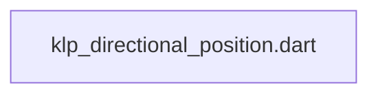
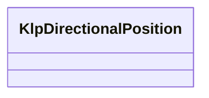

# klp_directional_position.dart：直接依賴與宣告架構

[回到目錄](README.md) · [來源檔案](../../../../../lib/src/foundation/layout/klp_directional_position.dart)

## 範圍

核心是 `lib/src/foundation/layout/klp_directional_position.dart`。主要視角為該檔案明寫的 import／export／part；輔助視角為本檔宣告及 extends／implements／with／on 關係。只展開一層外部邊界。

## 直接依賴圖

## 依賴證據

| 關係 | 原始 directive | 來源 |
|---|---|---|
| 無 | 本檔未宣告 import／export／part | [lib/src/foundation/layout/klp_directional_position.dart:1](../../../../../lib/src/foundation/layout/klp_directional_position.dart#L1) |

## 宣告關係圖

本組節點是本檔宣告；沒有箭頭的宣告未在此圖主張互相依賴。

## 宣告與成員證據

成員包含 public 與 private；簽章取自來源，省略函式本體與欄位初始值。`(inferred)` 表示來源未明寫型別；建構子只顯示參數部分，不含初始化列表。

### KlpDirectionalPosition

ClassDeclaration · public · [lib/src/foundation/layout/klp_directional_position.dart:1](../../../../../lib/src/foundation/layout/klp_directional_position.dart#L1)

<code>class KlpDirectionalPosition</code>

來源註解摘要：方向感知定位原語的幾何介面。

| 成員 | 可見性 | 簽章／型別 | 來源註解摘要 | 證據 |
|---|---|---|---|---|
| constructor <code>KlpDirectionalPosition</code> | public | <code>const KlpDirectionalPosition({ this.start, this.top, this.end, this.bottom, this.width, this.height, })</code> |  | [lib/src/foundation/layout/klp_directional_position.dart:3](../../../../../lib/src/foundation/layout/klp_directional_position.dart#L3) |
| constructor <code>fill</code> | public | <code>const KlpDirectionalPosition.fill()</code> |  | [lib/src/foundation/layout/klp_directional_position.dart:12](../../../../../lib/src/foundation/layout/klp_directional_position.dart#L12) |
| constructor <code>below</code> | public | <code>const KlpDirectionalPosition.below({required this.top})</code> |  | [lib/src/foundation/layout/klp_directional_position.dart:20](../../../../../lib/src/foundation/layout/klp_directional_position.dart#L20) |
| constructor <code>atTop</code> | public | <code>const KlpDirectionalPosition.atTop({required this.height})</code> |  | [lib/src/foundation/layout/klp_directional_position.dart:27](../../../../../lib/src/foundation/layout/klp_directional_position.dart#L27) |
| field <code>start</code> | public | <code>final double? start</code> |  | [lib/src/foundation/layout/klp_directional_position.dart:34](../../../../../lib/src/foundation/layout/klp_directional_position.dart#L34) |
| field <code>top</code> | public | <code>final double? top</code> |  | [lib/src/foundation/layout/klp_directional_position.dart:35](../../../../../lib/src/foundation/layout/klp_directional_position.dart#L35) |
| field <code>end</code> | public | <code>final double? end</code> |  | [lib/src/foundation/layout/klp_directional_position.dart:36](../../../../../lib/src/foundation/layout/klp_directional_position.dart#L36) |
| field <code>bottom</code> | public | <code>final double? bottom</code> |  | [lib/src/foundation/layout/klp_directional_position.dart:37](../../../../../lib/src/foundation/layout/klp_directional_position.dart#L37) |
| field <code>width</code> | public | <code>final double? width</code> |  | [lib/src/foundation/layout/klp_directional_position.dart:38](../../../../../lib/src/foundation/layout/klp_directional_position.dart#L38) |
| field <code>height</code> | public | <code>final double? height</code> |  | [lib/src/foundation/layout/klp_directional_position.dart:39](../../../../../lib/src/foundation/layout/klp_directional_position.dart#L39) |

## 閱讀說明與限制

箭頭只表示來源明寫的靜態關係；import 不等於呼叫。未分析動態呼叫、欄位的實際物件擁有權、狀態轉移或渲染流程；型別未進行語意解析，繼承目標保留原始型別拼寫。public／private 依 Dart 名稱前綴判斷；public 宣告不代表已由 `lib/kallopis.dart` 匯出。

本頁由 `tool/architecture_atlas` 產生；編輯來源或生成工具後重新產生，避免手改本頁。
