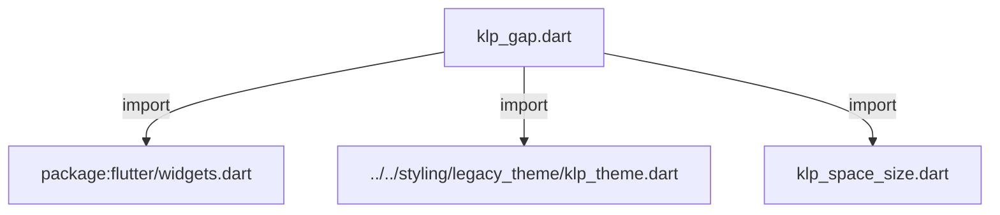
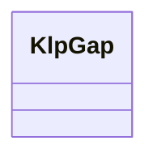
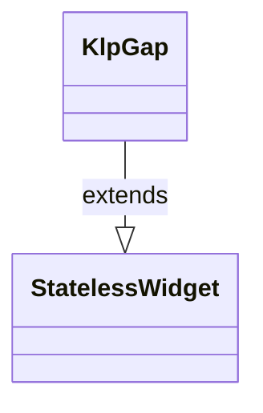

# klp_gap.dart：直接依賴與宣告架構

[回到目錄](README.md) · [來源檔案](../../../../../lib/src/foundation/layout/klp_gap.dart)

## 範圍

核心是 `lib/src/foundation/layout/klp_gap.dart`。主要視角為該檔案明寫的 import／export／part；輔助視角為本檔宣告及 extends／implements／with／on 關係。只展開一層外部邊界。

## 直接依賴圖

## 依賴證據

| 關係 | 原始 directive | 來源 |
|---|---|---|
| import | <code>import &#x27;package:flutter/widgets.dart&#x27;;</code> | [lib/src/foundation/layout/klp_gap.dart:1](../../../../../lib/src/foundation/layout/klp_gap.dart#L1) |
| import | <code>import &#x27;../../styling/legacy_theme/klp_theme.dart&#x27;;</code> | [lib/src/foundation/layout/klp_gap.dart:3](../../../../../lib/src/foundation/layout/klp_gap.dart#L3) |
| import | <code>import &#x27;klp_space_size.dart&#x27;;</code> | [lib/src/foundation/layout/klp_gap.dart:4](../../../../../lib/src/foundation/layout/klp_gap.dart#L4) |

## 宣告關係圖

本組節點是本檔宣告；沒有箭頭的宣告未在此圖主張互相依賴。

## 宣告與成員證據

成員包含 public 與 private；簽章取自來源，省略函式本體與欄位初始值。`(inferred)` 表示來源未明寫型別；建構子只顯示參數部分，不含初始化列表。

### KlpGap

ClassDeclaration · public · [lib/src/foundation/layout/klp_gap.dart:6](../../../../../lib/src/foundation/layout/klp_gap.dart#L6)

<code>class KlpGap extends StatelessWidget</code>

來源註解摘要：間距排版原語。取代 SizedBox 進行彈性與固定距離佔位。 支援風格介面與風格枚舉（KlpSpaceSize）為第一優先真相。

- `extends` → <code>StatelessWidget</code>：[lib/src/foundation/layout/klp_gap.dart:8](../../../../../lib/src/foundation/layout/klp_gap.dart#L8)

| 成員 | 可見性 | 簽章／型別 | 來源註解摘要 | 證據 |
|---|---|---|---|---|
| constructor <code>KlpGap</code> | public | <code>const KlpGap(this.extent, {super.key})</code> | 依據傳統彈性數值指定雙向間距。 | [lib/src/foundation/layout/klp_gap.dart:9](../../../../../lib/src/foundation/layout/klp_gap.dart#L9) |
| constructor <code>space</code> | public | <code>const KlpGap.space(this.size, {super.key})</code> | 依據風格枚舉指定雙向間距。 | [lib/src/foundation/layout/klp_gap.dart:17](../../../../../lib/src/foundation/layout/klp_gap.dart#L17) |
| constructor <code>width</code> | public | <code>const KlpGap.width(this.width, {super.key})</code> | 依據彈性數值指定水平寬度間距。 | [lib/src/foundation/layout/klp_gap.dart:25](../../../../../lib/src/foundation/layout/klp_gap.dart#L25) |
| constructor <code>height</code> | public | <code>const KlpGap.height(this.height, {super.key})</code> | 依據彈性數值指定垂直高度間距。 | [lib/src/foundation/layout/klp_gap.dart:33](../../../../../lib/src/foundation/layout/klp_gap.dart#L33) |
| constructor <code>widthSize</code> | public | <code>const KlpGap.widthSize(this.widthSize, {super.key})</code> | 依據風格枚舉指定水平寬度間距。 | [lib/src/foundation/layout/klp_gap.dart:41](../../../../../lib/src/foundation/layout/klp_gap.dart#L41) |
| constructor <code>heightSize</code> | public | <code>const KlpGap.heightSize(this.heightSize, {super.key})</code> | 依據風格枚舉指定垂直高度間距。 | [lib/src/foundation/layout/klp_gap.dart:49](../../../../../lib/src/foundation/layout/klp_gap.dart#L49) |
| constructor <code>hairline</code> | public | <code>const KlpGap.hairline({super.key})</code> | 快捷建構子：微細間距 | [lib/src/foundation/layout/klp_gap.dart:57](../../../../../lib/src/foundation/layout/klp_gap.dart#L57) |
| constructor <code>tight</code> | public | <code>const KlpGap.tight({super.key})</code> | 快捷建構子：緊密間距 | [lib/src/foundation/layout/klp_gap.dart:66](../../../../../lib/src/foundation/layout/klp_gap.dart#L66) |
| constructor <code>base</code> | public | <code>const KlpGap.base({super.key})</code> | 快捷建構子：標準間距 | [lib/src/foundation/layout/klp_gap.dart:75](../../../../../lib/src/foundation/layout/klp_gap.dart#L75) |
| constructor <code>comfortable</code> | public | <code>const KlpGap.comfortable({super.key})</code> | 快捷建構子：舒適間距 | [lib/src/foundation/layout/klp_gap.dart:84](../../../../../lib/src/foundation/layout/klp_gap.dart#L84) |
| constructor <code>loose</code> | public | <code>const KlpGap.loose({super.key})</code> | 快捷建構子：鬆散間距 | [lib/src/foundation/layout/klp_gap.dart:93](../../../../../lib/src/foundation/layout/klp_gap.dart#L93) |
| constructor <code>section</code> | public | <code>const KlpGap.section({super.key})</code> | 快捷建構子：區塊間距 | [lib/src/foundation/layout/klp_gap.dart:102](../../../../../lib/src/foundation/layout/klp_gap.dart#L102) |
| constructor <code>inline</code> | public | <code>const KlpGap.inline({super.key})</code> | 快捷建構子：內容行內間距 | [lib/src/foundation/layout/klp_gap.dart:111](../../../../../lib/src/foundation/layout/klp_gap.dart#L111) |
| constructor <code>stack</code> | public | <code>const KlpGap.stack({super.key})</code> | 快捷建構子：內容堆疊間距 | [lib/src/foundation/layout/klp_gap.dart:120](../../../../../lib/src/foundation/layout/klp_gap.dart#L120) |
| field <code>size</code> | public | <code>final KlpSpaceSize? size</code> |  | [lib/src/foundation/layout/klp_gap.dart:129](../../../../../lib/src/foundation/layout/klp_gap.dart#L129) |
| field <code>extent</code> | public | <code>final double? extent</code> |  | [lib/src/foundation/layout/klp_gap.dart:130](../../../../../lib/src/foundation/layout/klp_gap.dart#L130) |
| field <code>widthSize</code> | public | <code>final KlpSpaceSize? widthSize</code> |  | [lib/src/foundation/layout/klp_gap.dart:131](../../../../../lib/src/foundation/layout/klp_gap.dart#L131) |
| field <code>heightSize</code> | public | <code>final KlpSpaceSize? heightSize</code> |  | [lib/src/foundation/layout/klp_gap.dart:132](../../../../../lib/src/foundation/layout/klp_gap.dart#L132) |
| field <code>width</code> | public | <code>final double? width</code> |  | [lib/src/foundation/layout/klp_gap.dart:133](../../../../../lib/src/foundation/layout/klp_gap.dart#L133) |
| field <code>height</code> | public | <code>final double? height</code> |  | [lib/src/foundation/layout/klp_gap.dart:134](../../../../../lib/src/foundation/layout/klp_gap.dart#L134) |
| method <code>build</code> | public | <code>Widget build(BuildContext context)</code> |  | [lib/src/foundation/layout/klp_gap.dart:136](../../../../../lib/src/foundation/layout/klp_gap.dart#L136) |
| method <code>resolveSpace</code> | public | <code>static double resolveSpace(BuildContext context, KlpSpaceSize spaceSize)</code> | 介面解析器：將風格枚舉映射至目前 Theme 的單一真相來源 | [lib/src/foundation/layout/klp_gap.dart:156](../../../../../lib/src/foundation/layout/klp_gap.dart#L156) |

## 閱讀說明與限制

箭頭只表示來源明寫的靜態關係；import 不等於呼叫。未分析動態呼叫、欄位的實際物件擁有權、狀態轉移或渲染流程；型別未進行語意解析，繼承目標保留原始型別拼寫。public／private 依 Dart 名稱前綴判斷；public 宣告不代表已由 `lib/kallopis.dart` 匯出。

本頁由 `tool/architecture_atlas` 產生；編輯來源或生成工具後重新產生，避免手改本頁。
