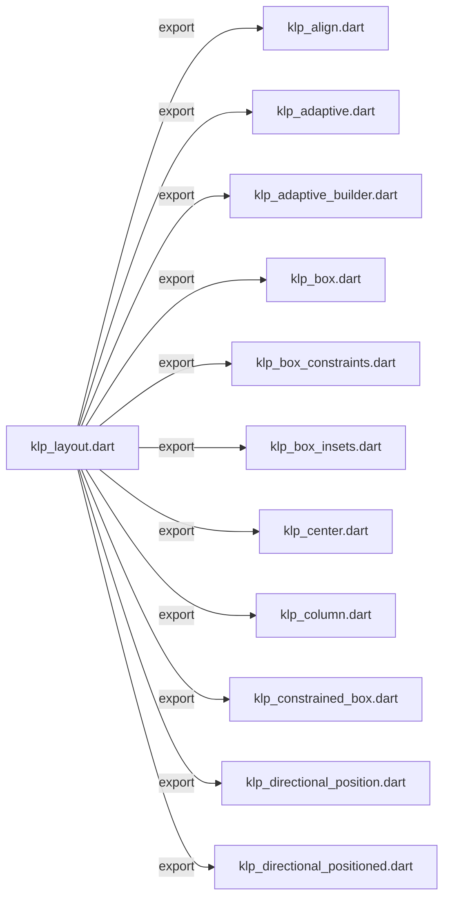
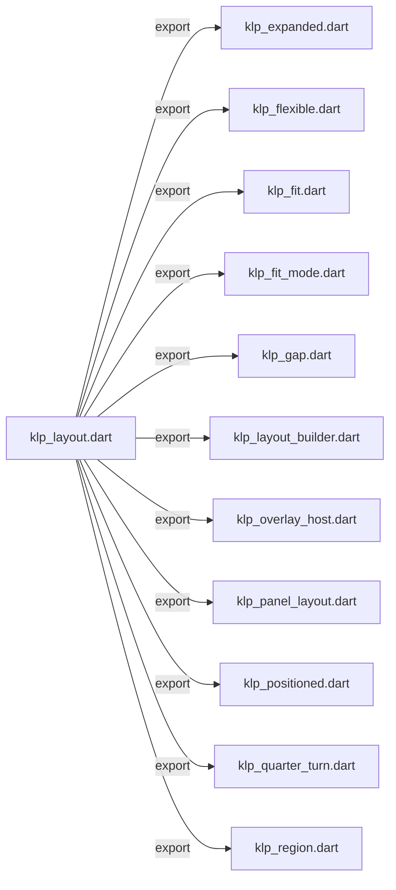
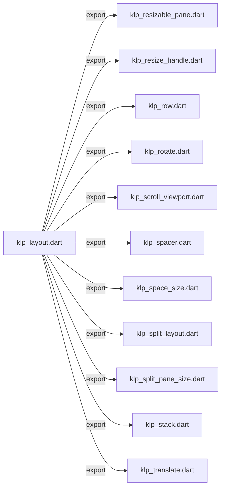
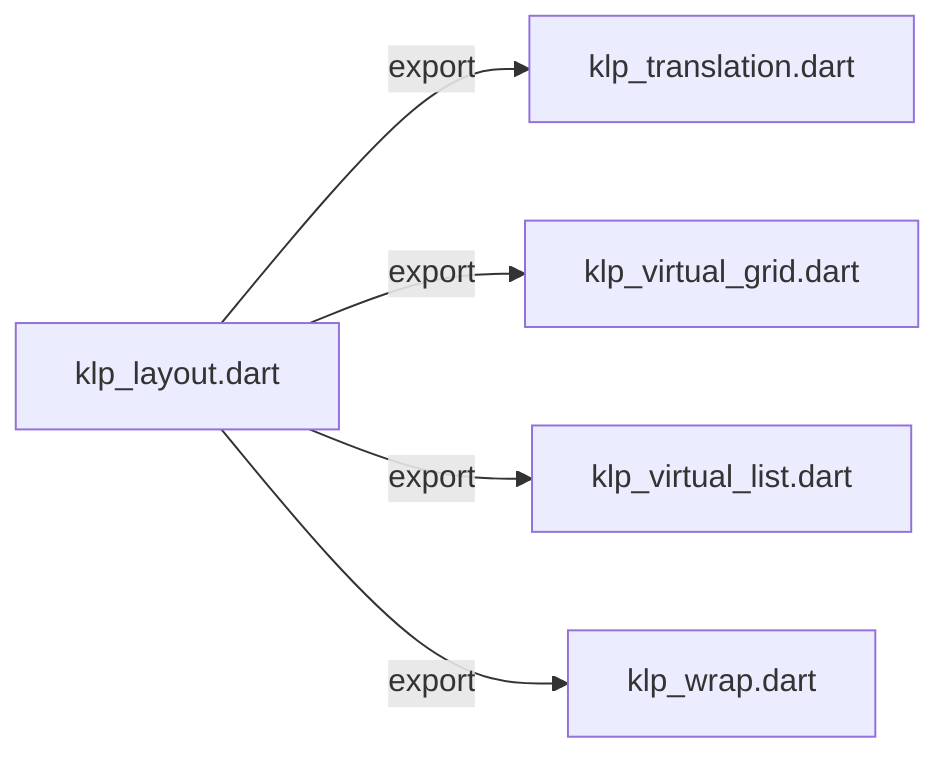

# klp_layout.dart：直接依賴與宣告架構

[回到目錄](README.md) · [來源檔案](../../../../../lib/src/foundation/layout/klp_layout.dart)

## 範圍

核心是 `lib/src/foundation/layout/klp_layout.dart`。主要視角為該檔案明寫的 import／export／part；輔助視角為本檔宣告及 extends／implements／with／on 關係。只展開一層外部邊界。

## 直接依賴圖

## 依賴證據

| 關係 | 原始 directive | 來源 |
|---|---|---|
| export | <code>export &#x27;klp_align.dart&#x27;;</code> | [lib/src/foundation/layout/klp_layout.dart:3](../../../../../lib/src/foundation/layout/klp_layout.dart#L3) |
| export | <code>export &#x27;klp_adaptive.dart&#x27;;</code> | [lib/src/foundation/layout/klp_layout.dart:4](../../../../../lib/src/foundation/layout/klp_layout.dart#L4) |
| export | <code>export &#x27;klp_adaptive_builder.dart&#x27;;</code> | [lib/src/foundation/layout/klp_layout.dart:5](../../../../../lib/src/foundation/layout/klp_layout.dart#L5) |
| export | <code>export &#x27;klp_box.dart&#x27;;</code> | [lib/src/foundation/layout/klp_layout.dart:6](../../../../../lib/src/foundation/layout/klp_layout.dart#L6) |
| export | <code>export &#x27;klp_box_constraints.dart&#x27;;</code> | [lib/src/foundation/layout/klp_layout.dart:7](../../../../../lib/src/foundation/layout/klp_layout.dart#L7) |
| export | <code>export &#x27;klp_box_insets.dart&#x27;;</code> | [lib/src/foundation/layout/klp_layout.dart:8](../../../../../lib/src/foundation/layout/klp_layout.dart#L8) |
| export | <code>export &#x27;klp_center.dart&#x27;;</code> | [lib/src/foundation/layout/klp_layout.dart:9](../../../../../lib/src/foundation/layout/klp_layout.dart#L9) |
| export | <code>export &#x27;klp_column.dart&#x27;;</code> | [lib/src/foundation/layout/klp_layout.dart:10](../../../../../lib/src/foundation/layout/klp_layout.dart#L10) |
| export | <code>export &#x27;klp_constrained_box.dart&#x27;;</code> | [lib/src/foundation/layout/klp_layout.dart:11](../../../../../lib/src/foundation/layout/klp_layout.dart#L11) |
| export | <code>export &#x27;klp_directional_position.dart&#x27;;</code> | [lib/src/foundation/layout/klp_layout.dart:12](../../../../../lib/src/foundation/layout/klp_layout.dart#L12) |
| export | <code>export &#x27;klp_directional_positioned.dart&#x27;;</code> | [lib/src/foundation/layout/klp_layout.dart:13](../../../../../lib/src/foundation/layout/klp_layout.dart#L13) |
| export | <code>export &#x27;klp_expanded.dart&#x27;;</code> | [lib/src/foundation/layout/klp_layout.dart:14](../../../../../lib/src/foundation/layout/klp_layout.dart#L14) |
| export | <code>export &#x27;klp_flexible.dart&#x27;;</code> | [lib/src/foundation/layout/klp_layout.dart:15](../../../../../lib/src/foundation/layout/klp_layout.dart#L15) |
| export | <code>export &#x27;klp_fit.dart&#x27;;</code> | [lib/src/foundation/layout/klp_layout.dart:16](../../../../../lib/src/foundation/layout/klp_layout.dart#L16) |
| export | <code>export &#x27;klp_fit_mode.dart&#x27;;</code> | [lib/src/foundation/layout/klp_layout.dart:17](../../../../../lib/src/foundation/layout/klp_layout.dart#L17) |
| export | <code>export &#x27;klp_gap.dart&#x27;;</code> | [lib/src/foundation/layout/klp_layout.dart:18](../../../../../lib/src/foundation/layout/klp_layout.dart#L18) |
| export | <code>export &#x27;klp_layout_builder.dart&#x27;;</code> | [lib/src/foundation/layout/klp_layout.dart:19](../../../../../lib/src/foundation/layout/klp_layout.dart#L19) |
| export | <code>export &#x27;klp_overlay_host.dart&#x27;;</code> | [lib/src/foundation/layout/klp_layout.dart:20](../../../../../lib/src/foundation/layout/klp_layout.dart#L20) |
| export | <code>export &#x27;klp_panel_layout.dart&#x27;;</code> | [lib/src/foundation/layout/klp_layout.dart:21](../../../../../lib/src/foundation/layout/klp_layout.dart#L21) |
| export | <code>export &#x27;klp_positioned.dart&#x27;;</code> | [lib/src/foundation/layout/klp_layout.dart:22](../../../../../lib/src/foundation/layout/klp_layout.dart#L22) |
| export | <code>export &#x27;klp_quarter_turn.dart&#x27;;</code> | [lib/src/foundation/layout/klp_layout.dart:23](../../../../../lib/src/foundation/layout/klp_layout.dart#L23) |
| export | <code>export &#x27;klp_region.dart&#x27;;</code> | [lib/src/foundation/layout/klp_layout.dart:24](../../../../../lib/src/foundation/layout/klp_layout.dart#L24) |
| export | <code>export &#x27;klp_resizable_pane.dart&#x27;;</code> | [lib/src/foundation/layout/klp_layout.dart:25](../../../../../lib/src/foundation/layout/klp_layout.dart#L25) |
| export | <code>export &#x27;klp_resize_handle.dart&#x27;;</code> | [lib/src/foundation/layout/klp_layout.dart:26](../../../../../lib/src/foundation/layout/klp_layout.dart#L26) |
| export | <code>export &#x27;klp_row.dart&#x27;;</code> | [lib/src/foundation/layout/klp_layout.dart:27](../../../../../lib/src/foundation/layout/klp_layout.dart#L27) |
| export | <code>export &#x27;klp_rotate.dart&#x27;;</code> | [lib/src/foundation/layout/klp_layout.dart:28](../../../../../lib/src/foundation/layout/klp_layout.dart#L28) |
| export | <code>export &#x27;klp_scroll_viewport.dart&#x27;;</code> | [lib/src/foundation/layout/klp_layout.dart:29](../../../../../lib/src/foundation/layout/klp_layout.dart#L29) |
| export | <code>export &#x27;klp_spacer.dart&#x27;;</code> | [lib/src/foundation/layout/klp_layout.dart:30](../../../../../lib/src/foundation/layout/klp_layout.dart#L30) |
| export | <code>export &#x27;klp_space_size.dart&#x27;;</code> | [lib/src/foundation/layout/klp_layout.dart:31](../../../../../lib/src/foundation/layout/klp_layout.dart#L31) |
| export | <code>export &#x27;klp_split_layout.dart&#x27;;</code> | [lib/src/foundation/layout/klp_layout.dart:32](../../../../../lib/src/foundation/layout/klp_layout.dart#L32) |
| export | <code>export &#x27;klp_split_pane_size.dart&#x27;;</code> | [lib/src/foundation/layout/klp_layout.dart:33](../../../../../lib/src/foundation/layout/klp_layout.dart#L33) |
| export | <code>export &#x27;klp_stack.dart&#x27;;</code> | [lib/src/foundation/layout/klp_layout.dart:34](../../../../../lib/src/foundation/layout/klp_layout.dart#L34) |
| export | <code>export &#x27;klp_translate.dart&#x27;;</code> | [lib/src/foundation/layout/klp_layout.dart:35](../../../../../lib/src/foundation/layout/klp_layout.dart#L35) |
| export | <code>export &#x27;klp_translation.dart&#x27;;</code> | [lib/src/foundation/layout/klp_layout.dart:36](../../../../../lib/src/foundation/layout/klp_layout.dart#L36) |
| export | <code>export &#x27;klp_virtual_grid.dart&#x27;;</code> | [lib/src/foundation/layout/klp_layout.dart:37](../../../../../lib/src/foundation/layout/klp_layout.dart#L37) |
| export | <code>export &#x27;klp_virtual_list.dart&#x27;;</code> | [lib/src/foundation/layout/klp_layout.dart:38](../../../../../lib/src/foundation/layout/klp_layout.dart#L38) |
| export | <code>export &#x27;klp_wrap.dart&#x27;;</code> | [lib/src/foundation/layout/klp_layout.dart:39](../../../../../lib/src/foundation/layout/klp_layout.dart#L39) |

## 宣告關係圖

本檔沒有 class／enum／mixin／extension 宣告；頂層函式、變數與 typedef 見下表。

## 宣告與成員證據

成員包含 public 與 private；簽章取自來源，省略函式本體與欄位初始值。`(inferred)` 表示來源未明寫型別；建構子只顯示參數部分，不含初始化列表。

## 閱讀說明與限制

箭頭只表示來源明寫的靜態關係；import 不等於呼叫。未分析動態呼叫、欄位的實際物件擁有權、狀態轉移或渲染流程；型別未進行語意解析，繼承目標保留原始型別拼寫。public／private 依 Dart 名稱前綴判斷；public 宣告不代表已由 `lib/kallopis.dart` 匯出。

本頁由 `tool/architecture_atlas` 產生；編輯來源或生成工具後重新產生，避免手改本頁。
