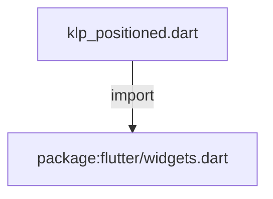
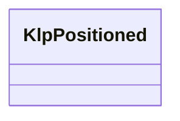
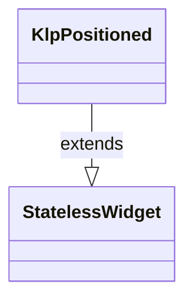

# klp_positioned.dart：直接依賴與宣告架構

[回到目錄](README.md) · [來源檔案](../../../../../lib/src/foundation/layout/klp_positioned.dart)

## 範圍

核心是 `lib/src/foundation/layout/klp_positioned.dart`。主要視角為該檔案明寫的 import／export／part；輔助視角為本檔宣告及 extends／implements／with／on 關係。只展開一層外部邊界。

## 直接依賴圖

## 依賴證據

| 關係 | 原始 directive | 來源 |
|---|---|---|
| import | <code>import &#x27;package:flutter/widgets.dart&#x27;;</code> | [lib/src/foundation/layout/klp_positioned.dart:1](../../../../../lib/src/foundation/layout/klp_positioned.dart#L1) |

## 宣告關係圖

本組節點是本檔宣告；沒有箭頭的宣告未在此圖主張互相依賴。

## 宣告與成員證據

成員包含 public 與 private；簽章取自來源，省略函式本體與欄位初始值。`(inferred)` 表示來源未明寫型別；建構子只顯示參數部分，不含初始化列表。

### KlpPositioned

ClassDeclaration · public · [lib/src/foundation/layout/klp_positioned.dart:3](../../../../../lib/src/foundation/layout/klp_positioned.dart#L3)

<code>class KlpPositioned extends StatelessWidget</code>

來源註解摘要：絕對/相對定位排版原語。取代 Positioned。

- `extends` → <code>StatelessWidget</code>：[lib/src/foundation/layout/klp_positioned.dart:4](../../../../../lib/src/foundation/layout/klp_positioned.dart#L4)

| 成員 | 可見性 | 簽章／型別 | 來源註解摘要 | 證據 |
|---|---|---|---|---|
| constructor <code>KlpPositioned</code> | public | <code>const KlpPositioned({ super.key, this.left, this.top, this.right, this.bottom, this.width, this.height, required this.child, })</code> |  | [lib/src/foundation/layout/klp_positioned.dart:5](../../../../../lib/src/foundation/layout/klp_positioned.dart#L5) |
| constructor <code>fill</code> | public | <code>const KlpPositioned.fill({ super.key, required this.child, })</code> |  | [lib/src/foundation/layout/klp_positioned.dart:16](../../../../../lib/src/foundation/layout/klp_positioned.dart#L16) |
| field <code>left</code> | public | <code>final double? left</code> |  | [lib/src/foundation/layout/klp_positioned.dart:27](../../../../../lib/src/foundation/layout/klp_positioned.dart#L27) |
| field <code>top</code> | public | <code>final double? top</code> |  | [lib/src/foundation/layout/klp_positioned.dart:28](../../../../../lib/src/foundation/layout/klp_positioned.dart#L28) |
| field <code>right</code> | public | <code>final double? right</code> |  | [lib/src/foundation/layout/klp_positioned.dart:29](../../../../../lib/src/foundation/layout/klp_positioned.dart#L29) |
| field <code>bottom</code> | public | <code>final double? bottom</code> |  | [lib/src/foundation/layout/klp_positioned.dart:30](../../../../../lib/src/foundation/layout/klp_positioned.dart#L30) |
| field <code>width</code> | public | <code>final double? width</code> |  | [lib/src/foundation/layout/klp_positioned.dart:31](../../../../../lib/src/foundation/layout/klp_positioned.dart#L31) |
| field <code>height</code> | public | <code>final double? height</code> |  | [lib/src/foundation/layout/klp_positioned.dart:32](../../../../../lib/src/foundation/layout/klp_positioned.dart#L32) |
| field <code>fill</code> | public | <code>final bool fill</code> |  | [lib/src/foundation/layout/klp_positioned.dart:33](../../../../../lib/src/foundation/layout/klp_positioned.dart#L33) |
| field <code>child</code> | public | <code>final Widget child</code> |  | [lib/src/foundation/layout/klp_positioned.dart:34](../../../../../lib/src/foundation/layout/klp_positioned.dart#L34) |
| method <code>build</code> | public | <code>Widget build(BuildContext context)</code> |  | [lib/src/foundation/layout/klp_positioned.dart:36](../../../../../lib/src/foundation/layout/klp_positioned.dart#L36) |

## 閱讀說明與限制

箭頭只表示來源明寫的靜態關係；import 不等於呼叫。未分析動態呼叫、欄位的實際物件擁有權、狀態轉移或渲染流程；型別未進行語意解析，繼承目標保留原始型別拼寫。public／private 依 Dart 名稱前綴判斷；public 宣告不代表已由 `lib/kallopis.dart` 匯出。

本頁由 `tool/architecture_atlas` 產生；編輯來源或生成工具後重新產生，避免手改本頁。
