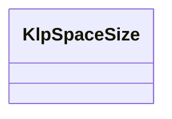

# klp_space_size.dart：直接依賴與宣告架構

[回到目錄](README.md) · [來源檔案](../../../../../lib/src/foundation/layout/klp_space_size.dart)

## 範圍

核心是 `lib/src/foundation/layout/klp_space_size.dart`。主要視角為該檔案明寫的 import／export／part；輔助視角為本檔宣告及 extends／implements／with／on 關係。只展開一層外部邊界。

## 直接依賴圖

## 依賴證據

| 關係 | 原始 directive | 來源 |
|---|---|---|
| 無 | 本檔未宣告 import／export／part | [lib/src/foundation/layout/klp_space_size.dart:1](../../../../../lib/src/foundation/layout/klp_space_size.dart#L1) |

## 宣告關係圖

本組節點是本檔宣告；沒有箭頭的宣告未在此圖主張互相依賴。

## 宣告與成員證據

成員包含 public 與 private；簽章取自來源，省略函式本體與欄位初始值。`(inferred)` 表示來源未明寫型別；建構子只顯示參數部分，不含初始化列表。

### KlpSpaceSize

EnumDeclaration · public · [lib/src/foundation/layout/klp_space_size.dart:4](../../../../../lib/src/foundation/layout/klp_space_size.dart#L4)

<code>enum KlpSpaceSize</code>

來源註解摘要：間距風格的枚舉型態。

| 成員 | 可見性 | 簽章／型別 | 來源註解摘要 | 證據 |
|---|---|---|---|---|
| enum value <code>xxs</code> | public | <code>xxs</code> | 最小固定間距 | [lib/src/foundation/layout/klp_space_size.dart:6](../../../../../lib/src/foundation/layout/klp_space_size.dart#L6) |
| enum value <code>hairline</code> | public | <code>hairline</code> | 微細間距 | [lib/src/foundation/layout/klp_space_size.dart:9](../../../../../lib/src/foundation/layout/klp_space_size.dart#L9) |
| enum value <code>tight</code> | public | <code>tight</code> | 緊密間距 | [lib/src/foundation/layout/klp_space_size.dart:12](../../../../../lib/src/foundation/layout/klp_space_size.dart#L12) |
| enum value <code>base</code> | public | <code>base</code> | 標準基礎間距 | [lib/src/foundation/layout/klp_space_size.dart:15](../../../../../lib/src/foundation/layout/klp_space_size.dart#L15) |
| enum value <code>item</code> | public | <code>item</code> | 同一組合內相鄰項目的間距 | [lib/src/foundation/layout/klp_space_size.dart:18](../../../../../lib/src/foundation/layout/klp_space_size.dart#L18) |
| enum value <code>comfortable</code> | public | <code>comfortable</code> | 舒適間距 | [lib/src/foundation/layout/klp_space_size.dart:21](../../../../../lib/src/foundation/layout/klp_space_size.dart#L21) |
| enum value <code>loose</code> | public | <code>loose</code> | 鬆散間距 | [lib/src/foundation/layout/klp_space_size.dart:24](../../../../../lib/src/foundation/layout/klp_space_size.dart#L24) |
| enum value <code>section</code> | public | <code>section</code> | 區塊間距 | [lib/src/foundation/layout/klp_space_size.dart:27](../../../../../lib/src/foundation/layout/klp_space_size.dart#L27) |
| enum value <code>sectionLarge</code> | public | <code>sectionLarge</code> | 大區塊間距 | [lib/src/foundation/layout/klp_space_size.dart:30](../../../../../lib/src/foundation/layout/klp_space_size.dart#L30) |
| enum value <code>page</code> | public | <code>page</code> | 頁面級間距 | [lib/src/foundation/layout/klp_space_size.dart:33](../../../../../lib/src/foundation/layout/klp_space_size.dart#L33) |
| enum value <code>contentInset</code> | public | <code>contentInset</code> | 內容內縮間距 | [lib/src/foundation/layout/klp_space_size.dart:36](../../../../../lib/src/foundation/layout/klp_space_size.dart#L36) |
| enum value <code>contentInline</code> | public | <code>contentInline</code> | 內容行內間距 | [lib/src/foundation/layout/klp_space_size.dart:39](../../../../../lib/src/foundation/layout/klp_space_size.dart#L39) |
| enum value <code>contentStack</code> | public | <code>contentStack</code> | 內容堆疊間距 | [lib/src/foundation/layout/klp_space_size.dart:42](../../../../../lib/src/foundation/layout/klp_space_size.dart#L42) |
| enum value <code>action</code> | public | <code>action</code> | 動作元件間距 | [lib/src/foundation/layout/klp_space_size.dart:45](../../../../../lib/src/foundation/layout/klp_space_size.dart#L45) |
| enum value <code>controlContent</code> | public | <code>controlContent</code> | 控制項內圖示與文字之間的間距 | [lib/src/foundation/layout/klp_space_size.dart:48](../../../../../lib/src/foundation/layout/klp_space_size.dart#L48) |
| enum value <code>overlayHeading</code> | public | <code>overlayHeading</code> | Overlay 標題與內容間距 | [lib/src/foundation/layout/klp_space_size.dart:51](../../../../../lib/src/foundation/layout/klp_space_size.dart#L51) |
| enum value <code>chromeToolbar</code> | public | <code>chromeToolbar</code> | Chrome 標題與工具列之間的間距 | [lib/src/foundation/layout/klp_space_size.dart:54](../../../../../lib/src/foundation/layout/klp_space_size.dart#L54) |
| enum value <code>navigationRailItem</code> | public | <code>navigationRailItem</code> | Navigation Rail 項目之間的間距 | [lib/src/foundation/layout/klp_space_size.dart:57](../../../../../lib/src/foundation/layout/klp_space_size.dart#L57) |
| enum value <code>navigationRailControl</code> | public | <code>navigationRailControl</code> | Navigation Rail 單一操作項目的方形尺寸 | [lib/src/foundation/layout/klp_space_size.dart:60](../../../../../lib/src/foundation/layout/klp_space_size.dart#L60) |
| enum value <code>commandMenuWidth</code> | public | <code>commandMenuWidth</code> | Command Menu 的標準寬度 | [lib/src/foundation/layout/klp_space_size.dart:63](../../../../../lib/src/foundation/layout/klp_space_size.dart#L63) |
| enum value <code>toastIconSlot</code> | public | <code>toastIconSlot</code> | Toast 圖示占位尺寸 | [lib/src/foundation/layout/klp_space_size.dart:66](../../../../../lib/src/foundation/layout/klp_space_size.dart#L66) |
| enum value <code>skeletonLine</code> | public | <code>skeletonLine</code> | 骨架屏單行高度 | [lib/src/foundation/layout/klp_space_size.dart:69](../../../../../lib/src/foundation/layout/klp_space_size.dart#L69) |
| enum value <code>placeholderAction</code> | public | <code>placeholderAction</code> | Placeholder 動作與內容之間的間距 | [lib/src/foundation/layout/klp_space_size.dart:72](../../../../../lib/src/foundation/layout/klp_space_size.dart#L72) |

## 閱讀說明與限制

箭頭只表示來源明寫的靜態關係；import 不等於呼叫。未分析動態呼叫、欄位的實際物件擁有權、狀態轉移或渲染流程；型別未進行語意解析，繼承目標保留原始型別拼寫。public／private 依 Dart 名稱前綴判斷；public 宣告不代表已由 `lib/kallopis.dart` 匯出。

本頁由 `tool/architecture_atlas` 產生；編輯來源或生成工具後重新產生，避免手改本頁。
