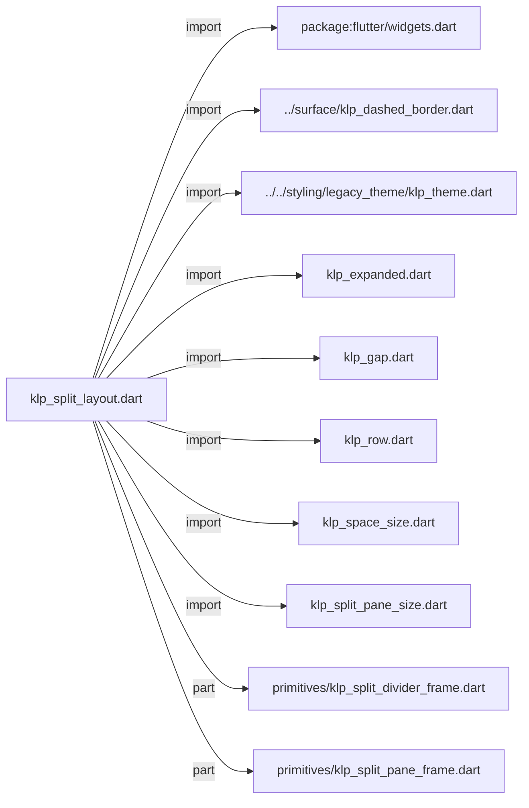
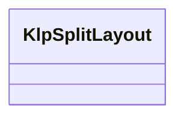
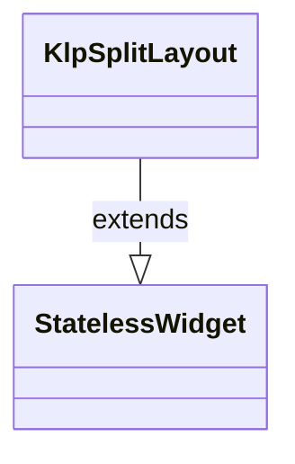

# klp_split_layout.dart：直接依賴與宣告架構

[回到目錄](README.md) · [來源檔案](../../../../../lib/src/foundation/layout/klp_split_layout.dart)

## 範圍

核心是 `lib/src/foundation/layout/klp_split_layout.dart`。主要視角為該檔案明寫的 import／export／part；輔助視角為本檔宣告及 extends／implements／with／on 關係。只展開一層外部邊界。

## 直接依賴圖

## 依賴證據

| 關係 | 原始 directive | 來源 |
|---|---|---|
| import | <code>import &#x27;package:flutter/widgets.dart&#x27;;</code> | [lib/src/foundation/layout/klp_split_layout.dart:1](../../../../../lib/src/foundation/layout/klp_split_layout.dart#L1) |
| import | <code>import &#x27;../surface/klp_dashed_border.dart&#x27;;</code> | [lib/src/foundation/layout/klp_split_layout.dart:3](../../../../../lib/src/foundation/layout/klp_split_layout.dart#L3) |
| import | <code>import &#x27;../../styling/legacy_theme/klp_theme.dart&#x27;;</code> | [lib/src/foundation/layout/klp_split_layout.dart:4](../../../../../lib/src/foundation/layout/klp_split_layout.dart#L4) |
| import | <code>import &#x27;klp_expanded.dart&#x27;;</code> | [lib/src/foundation/layout/klp_split_layout.dart:5](../../../../../lib/src/foundation/layout/klp_split_layout.dart#L5) |
| import | <code>import &#x27;klp_gap.dart&#x27;;</code> | [lib/src/foundation/layout/klp_split_layout.dart:6](../../../../../lib/src/foundation/layout/klp_split_layout.dart#L6) |
| import | <code>import &#x27;klp_row.dart&#x27;;</code> | [lib/src/foundation/layout/klp_split_layout.dart:7](../../../../../lib/src/foundation/layout/klp_split_layout.dart#L7) |
| import | <code>import &#x27;klp_space_size.dart&#x27;;</code> | [lib/src/foundation/layout/klp_split_layout.dart:8](../../../../../lib/src/foundation/layout/klp_split_layout.dart#L8) |
| import | <code>import &#x27;klp_split_pane_size.dart&#x27;;</code> | [lib/src/foundation/layout/klp_split_layout.dart:9](../../../../../lib/src/foundation/layout/klp_split_layout.dart#L9) |
| part | <code>part &#x27;primitives/klp_split_divider_frame.dart&#x27;;</code> | [lib/src/foundation/layout/klp_split_layout.dart:11](../../../../../lib/src/foundation/layout/klp_split_layout.dart#L11) |
| part | <code>part &#x27;primitives/klp_split_pane_frame.dart&#x27;;</code> | [lib/src/foundation/layout/klp_split_layout.dart:12](../../../../../lib/src/foundation/layout/klp_split_layout.dart#L12) |

## 宣告關係圖

本組節點是本檔宣告；沒有箭頭的宣告未在此圖主張互相依賴。

## 宣告與成員證據

成員包含 public 與 private；簽章取自來源，省略函式本體與欄位初始值。`(inferred)` 表示來源未明寫型別；建構子只顯示參數部分，不含初始化列表。

### KlpSplitLayout

ClassDeclaration · public · [lib/src/foundation/layout/klp_split_layout.dart:14](../../../../../lib/src/foundation/layout/klp_split_layout.dart#L14)

<code>class KlpSplitLayout extends StatelessWidget</code>

來源註解摘要：分割版面元件。支援左／中／右或左右分割，以及虛線分隔線。

- `extends` → <code>StatelessWidget</code>：[lib/src/foundation/layout/klp_split_layout.dart:15](../../../../../lib/src/foundation/layout/klp_split_layout.dart#L15)

| 成員 | 可見性 | 簽章／型別 | 來源註解摘要 | 證據 |
|---|---|---|---|---|
| constructor <code>KlpSplitLayout</code> | public | <code>const KlpSplitLayout({ super.key, required this.leading, required this.trailing, this.center, this.leadingSize = KlpSplitPaneSize.primary, this.trailingSize, this.gapSize = KlpSpaceSize.base, this.showDashedDivider = false, })</code> |  | [lib/src/foundation/layout/klp_split_layout.dart:16](../../../../../lib/src/foundation/layout/klp_split_layout.dart#L16) |
| field <code>leading</code> | public | <code>final Widget leading</code> |  | [lib/src/foundation/layout/klp_split_layout.dart:27](../../../../../lib/src/foundation/layout/klp_split_layout.dart#L27) |
| field <code>trailing</code> | public | <code>final Widget trailing</code> |  | [lib/src/foundation/layout/klp_split_layout.dart:28](../../../../../lib/src/foundation/layout/klp_split_layout.dart#L28) |
| field <code>center</code> | public | <code>final Widget? center</code> |  | [lib/src/foundation/layout/klp_split_layout.dart:29](../../../../../lib/src/foundation/layout/klp_split_layout.dart#L29) |
| field <code>leadingSize</code> | public | <code>final KlpSplitPaneSize leadingSize</code> |  | [lib/src/foundation/layout/klp_split_layout.dart:30](../../../../../lib/src/foundation/layout/klp_split_layout.dart#L30) |
| field <code>trailingSize</code> | public | <code>final KlpSplitPaneSize? trailingSize</code> |  | [lib/src/foundation/layout/klp_split_layout.dart:31](../../../../../lib/src/foundation/layout/klp_split_layout.dart#L31) |
| field <code>gapSize</code> | public | <code>final KlpSpaceSize gapSize</code> |  | [lib/src/foundation/layout/klp_split_layout.dart:32](../../../../../lib/src/foundation/layout/klp_split_layout.dart#L32) |
| field <code>showDashedDivider</code> | public | <code>final bool showDashedDivider</code> |  | [lib/src/foundation/layout/klp_split_layout.dart:33](../../../../../lib/src/foundation/layout/klp_split_layout.dart#L33) |
| method <code>build</code> | public | <code>Widget build(BuildContext context)</code> |  | [lib/src/foundation/layout/klp_split_layout.dart:35](../../../../../lib/src/foundation/layout/klp_split_layout.dart#L35) |

## 閱讀說明與限制

箭頭只表示來源明寫的靜態關係；import 不等於呼叫。未分析動態呼叫、欄位的實際物件擁有權、狀態轉移或渲染流程；型別未進行語意解析，繼承目標保留原始型別拼寫。public／private 依 Dart 名稱前綴判斷；public 宣告不代表已由 `lib/kallopis.dart` 匯出。

本頁由 `tool/architecture_atlas` 產生；編輯來源或生成工具後重新產生，避免手改本頁。
