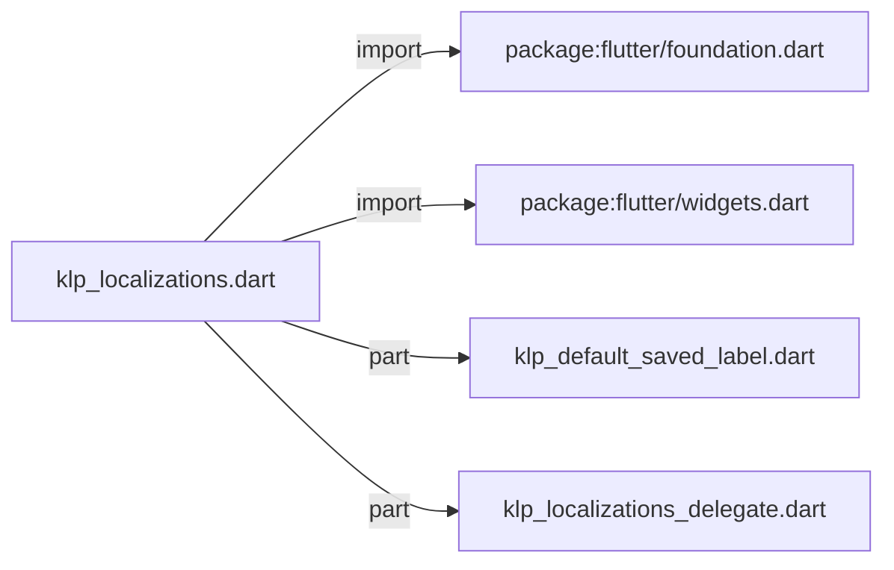
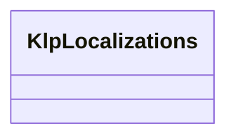

# klp_localizations.dart：直接依賴與宣告架構

[回到目錄](README.md) · [來源檔案](../../../../../lib/src/foundation/localization/klp_localizations.dart)

## 範圍

核心是 `lib/src/foundation/localization/klp_localizations.dart`。主要視角為該檔案明寫的 import／export／part；輔助視角為本檔宣告及 extends／implements／with／on 關係。只展開一層外部邊界。

## 直接依賴圖



## 依賴證據

| 關係 | 原始 directive | 來源 |
|---|---|---|
| import | <code>import &#x27;package:flutter/foundation.dart&#x27;;</code> | [lib/src/foundation/localization/klp_localizations.dart:1](../../../../../lib/src/foundation/localization/klp_localizations.dart#L1) |
| import | <code>import &#x27;package:flutter/widgets.dart&#x27;;</code> | [lib/src/foundation/localization/klp_localizations.dart:2](../../../../../lib/src/foundation/localization/klp_localizations.dart#L2) |
| part | <code>part &#x27;klp_default_saved_label.dart&#x27;;</code> | [lib/src/foundation/localization/klp_localizations.dart:4](../../../../../lib/src/foundation/localization/klp_localizations.dart#L4) |
| part | <code>part &#x27;klp_localizations_delegate.dart&#x27;;</code> | [lib/src/foundation/localization/klp_localizations.dart:5](../../../../../lib/src/foundation/localization/klp_localizations.dart#L5) |

## 宣告關係圖

本組節點是本檔宣告；沒有箭頭的宣告未在此圖主張互相依賴。




## 宣告與成員證據

成員包含 public 與 private；簽章取自來源，省略函式本體與欄位初始值。`(inferred)` 表示來源未明寫型別；建構子只顯示參數部分，不含初始化列表。

### KlpLocalizations

ClassDeclaration · public · [lib/src/foundation/localization/klp_localizations.dart:7](../../../../../lib/src/foundation/localization/klp_localizations.dart#L7)

<code>class KlpLocalizations</code>

來源註解摘要：Kallopis 元件用到的所有使用者可見字串，供呼叫端覆寫。 **這個庫不替產品決定用什麼語言。** 見 [KlpToast.closeLabel] 與 [KlpCalendar] 的既有慣例——本類別把同一條規則套用到庫裡其餘散落的寫死字串上，統一成一個 入口而不是每個元件各自加一組建構子參數。 每個欄位的預設值刻意等於**目前實際顯示的文字**（中文、英文混雜）——這是抽取自 Planist 時就已經寫死的內容，換成別的預設會讓沒有註冊 delegate 的消費者畫面 跟著變。要修正預設文案本身，是產品決策，不是 l10n 機制該做的事。 ## 用法 ```dart MaterialApp( localizationsDelegates: [ const KlpLocalizationsDelegate( KlpLocalizations(toastNowLabel: &#x27;NOW&#x27;), ), ...GlobalMaterialLocalizations.delegates, ], ) ``` 走 [KlpApp] 的消費者不需要手動註冊——[KlpApp] 已經自動掛上內建預設值， 傳入的 [KlpApp.localizationsDelegates] 會與它合併而不是覆蓋。


| 成員 | 可見性 | 簽章／型別 | 來源註解摘要 | 證據 |
|---|---|---|---|---|
| constructor <code>KlpLocalizations</code> | public | <code>const KlpLocalizations({ this.toastNowLabel = &#x27;NOW&#x27;, this.codeViewerCollapseLabel = &#x27;收合&#x27;, this.codeViewerExpandLabel = &#x27;展開&#x27;, this.codeDataCopyLabel = &#x27;Copy&#x27;, this.codeDiffApproveLabel = &#x27;同意&#x27;, this.codeDiffRejectLabel = &#x27;拒絕&#x27;, this.codeTerminalClearLabel = &#x27;Clear&#x27;, this.dataTableSelectAllLabel = &#x27;Select all rows&#x27;, this.dataTableSelectRowLabel = &#x27;Select row&#x27;, this.jsonTreeLoadingLabel = &#x27;Loading...&#x27;, this.jsonTreeInvalidLabel = &#x27;Invalid structured data&#x27;, this.filePreviewOpenExternalLabel = &#x27;Open externally&#x27;, this.filePreviewDownloadLabel = &#x27;Download&#x27;, this.filePreviewLoadingLabel = &#x27;Loading preview...&#x27;, this.filePreviewErrorLabel = &#x27;Preview failed to load&#x27;, this.filePreviewUnsupportedLabel = &#x27;No preview available for this type&#x27;, this.filePreviewEmptyLabel = &#x27;No preview content&#x27;, this.panelToggleLabel = &#x27;切換面板&#x27;, this.savedLabel = _defaultSavedLabel, this.windowMinimizeLabel = &#x27;Minimize window&#x27;, this.windowMaximizeLabel = &#x27;Maximize window&#x27;, this.windowRestoreLabel = &#x27;Restore window&#x27;, this.windowCloseLabel = &#x27;Close window&#x27;, this.searchPreviousResultLabel = &#x27;Previous result&#x27;, this.searchNextResultLabel = &#x27;Next result&#x27;, this.searchCloseLabel = &#x27;Close search&#x27;, this.entityPickerRemoveLabel = &#x27;Remove&#x27;, this.entityPickerApplyLabel = &#x27;Apply&#x27;, this.dockMoreActionsLabel = &#x27;更多操作&#x27;, this.oklchLightnessLabel = &#x27;Lightness&#x27;, this.oklchChromaLabel = &#x27;Chroma&#x27;, this.oklchHueLabel = &#x27;Hue&#x27;, this.oklchAlphaLabel = &#x27;Alpha&#x27;, this.oklchLightnessPlaneLabel = &#x27;Lightness plane&#x27;, this.oklchChromaPlaneLabel = &#x27;Chroma plane&#x27;, this.oklchHuePlaneLabel = &#x27;Hue plane&#x27;, this.oklchOriginalPreviewLabel = &#x27;Clipped original&#x27;, this.oklchFallbackPreviewLabel = &#x27;sRGB fallback&#x27;, this.oklchFallbackWarningLabel = &#x27;Outside sRGB gamut; fallback reduces chroma.&#x27;, this.formOptionsLabel = &#x27;選擇類型&#x27;, this.formPasswordShowLabel = &#x27;顯示密碼&#x27;, this.formPasswordHideLabel = &#x27;隱藏密碼&#x27;, this.formQuantityDecreaseLabel = &#x27;減少&#x27;, this.formQuantityIncreaseLabel = &#x27;增加&#x27;, this.formDateRangeCalendarLabel = &#x27;選擇日期區間&#x27;, this.editorUndoLabel = &#x27;撤銷&#x27;, this.editorRedoLabel = &#x27;重做&#x27;, this.editorMoreLabel = &#x27;更多&#x27;, this.editorSaveLabel = &#x27;保存&#x27;, this.editorUnsavedLabel = &#x27;未保存&#x27;, this.editorSavingLabel = &#x27;保存中&#x27;, this.editorSavedLabel = &#x27;已保存&#x27;, this.editorSaveFailedLabel = &#x27;保存失敗&#x27;, this.editorSaveUnknownLabel = &#x27;保存結果未知&#x27;, this.editorBlockActionsLabel = &#x27;區塊操作&#x27;, this.editorBlockMoveHint = &#x27;按空白鍵開始移動，使用方向鍵選擇位置，再按空白鍵放下&#x27;, this.editorMovePreviousLabel = &#x27;上移&#x27;, this.editorMoveNextLabel = &#x27;下移&#x27;, this.editorParagraphLabel = &#x27;段落&#x27;, this.editorHeading1Label = &#x27;標題 1&#x27;, this.editorHeading2Label = &#x27;標題 2&#x27;, this.editorHeading3Label = &#x27;標題 3&#x27;, this.editorOutdentLabel = &#x27;減少縮排&#x27;, this.editorIndentLabel = &#x27;增加縮排&#x27;, this.editorOrderedListLabel = &#x27;編號清單&#x27;, this.editorUnorderedListLabel = &#x27;項目清單&#x27;, this.editorBlockTypeLabel = &#x27;區塊類型&#x27;, this.editorTaskCompleteLabel = &#x27;完成任務&#x27;, this.editorTaskReopenLabel = &#x27;重新開啟任務&#x27;, this.editorToggleCollapseLabel = &#x27;收合區塊&#x27;, this.editorToggleExpandLabel = &#x27;展開區塊&#x27;, this.editorLoadFailedTitle = &#x27;無法載入正文編輯器&#x27;, this.editorLoadFailedMessage = &#x27;本機編輯器尚未完成啟動，請再試一次。&#x27;, this.editorRetryLabel = &#x27;重試&#x27;, this.editorInterruptedTitle = &#x27;編輯器已中斷&#x27;, this.editorInterruptedMessage = &#x27;編輯器已中斷。請保留此視窗並嘗試儲存；尚未儲存內容不會自動重載。&#x27;, this.editorEnvironmentFailedTitle = &#x27;無法啟動正文編輯器&#x27;, this.editorEnvironmentFailedMessage = &#x27;系統無法建立本機 WebView2 環境。請確認 WebView2 Runtime 已安裝後重新開啟。&#x27;, })</code> |  | [lib/src/foundation/localization/klp_localizations.dart:34](../../../../../lib/src/foundation/localization/klp_localizations.dart#L34) |
| field <code>toastNowLabel</code> | public | <code>final String toastNowLabel</code> | [KlpToast] 時間戳徽章上的文字。 | [lib/src/foundation/localization/klp_localizations.dart:117](../../../../../lib/src/foundation/localization/klp_localizations.dart#L117) |
| field <code>codeViewerCollapseLabel</code> | public | <code>final String codeViewerCollapseLabel</code> | [KlpCodeViewer] 展開／收合鈕在「已展開」狀態下顯示的文字。 | [lib/src/foundation/localization/klp_localizations.dart:120](../../../../../lib/src/foundation/localization/klp_localizations.dart#L120) |
| field <code>codeViewerExpandLabel</code> | public | <code>final String codeViewerExpandLabel</code> | [KlpCodeViewer] 展開／收合鈕在「未展開」狀態下顯示的文字。 | [lib/src/foundation/localization/klp_localizations.dart:123](../../../../../lib/src/foundation/localization/klp_localizations.dart#L123) |
| field <code>codeDataCopyLabel</code> | public | <code>final String codeDataCopyLabel</code> | [KlpDiffViewer] 與 [KlpTerminal] 的複製動作文字。 | [lib/src/foundation/localization/klp_localizations.dart:126](../../../../../lib/src/foundation/localization/klp_localizations.dart#L126) |
| field <code>codeDiffApproveLabel</code> | public | <code>final String codeDiffApproveLabel</code> | [KlpDiffViewer] 的逐行同意動作文字。 | [lib/src/foundation/localization/klp_localizations.dart:129](../../../../../lib/src/foundation/localization/klp_localizations.dart#L129) |
| field <code>codeDiffRejectLabel</code> | public | <code>final String codeDiffRejectLabel</code> | [KlpDiffViewer] 的逐行拒絕動作文字。 | [lib/src/foundation/localization/klp_localizations.dart:132](../../../../../lib/src/foundation/localization/klp_localizations.dart#L132) |
| field <code>codeTerminalClearLabel</code> | public | <code>final String codeTerminalClearLabel</code> | [KlpTerminal] 的清除動作文字。 | [lib/src/foundation/localization/klp_localizations.dart:135](../../../../../lib/src/foundation/localization/klp_localizations.dart#L135) |
| field <code>dataTableSelectAllLabel</code> | public | <code>final String dataTableSelectAllLabel</code> | [KlpDataTable] 全選控制項的無障礙標籤。 | [lib/src/foundation/localization/klp_localizations.dart:138](../../../../../lib/src/foundation/localization/klp_localizations.dart#L138) |
| field <code>dataTableSelectRowLabel</code> | public | <code>final String dataTableSelectRowLabel</code> | [KlpDataTable] 單列選取控制項的無障礙標籤。 | [lib/src/foundation/localization/klp_localizations.dart:141](../../../../../lib/src/foundation/localization/klp_localizations.dart#L141) |
| field <code>jsonTreeLoadingLabel</code> | public | <code>final String jsonTreeLoadingLabel</code> | [KlpJsonTree] 載入中的文字。 | [lib/src/foundation/localization/klp_localizations.dart:144](../../../../../lib/src/foundation/localization/klp_localizations.dart#L144) |
| field <code>jsonTreeInvalidLabel</code> | public | <code>final String jsonTreeInvalidLabel</code> | [KlpJsonTree] 無效資料的文字。 | [lib/src/foundation/localization/klp_localizations.dart:147](../../../../../lib/src/foundation/localization/klp_localizations.dart#L147) |
| field <code>filePreviewOpenExternalLabel</code> | public | <code>final String filePreviewOpenExternalLabel</code> | [KlpFilePreview] 外部開啟動作的文字。 | [lib/src/foundation/localization/klp_localizations.dart:150](../../../../../lib/src/foundation/localization/klp_localizations.dart#L150) |
| field <code>filePreviewDownloadLabel</code> | public | <code>final String filePreviewDownloadLabel</code> | [KlpFilePreview] 下載動作的文字。 | [lib/src/foundation/localization/klp_localizations.dart:153](../../../../../lib/src/foundation/localization/klp_localizations.dart#L153) |
| field <code>filePreviewLoadingLabel</code> | public | <code>final String filePreviewLoadingLabel</code> | [KlpFilePreview] 載入中的文字。 | [lib/src/foundation/localization/klp_localizations.dart:156](../../../../../lib/src/foundation/localization/klp_localizations.dart#L156) |
| field <code>filePreviewErrorLabel</code> | public | <code>final String filePreviewErrorLabel</code> | [KlpFilePreview] 載入失敗的文字。 | [lib/src/foundation/localization/klp_localizations.dart:159](../../../../../lib/src/foundation/localization/klp_localizations.dart#L159) |
| field <code>filePreviewUnsupportedLabel</code> | public | <code>final String filePreviewUnsupportedLabel</code> | [KlpFilePreview] 不支援預覽時的文字。 | [lib/src/foundation/localization/klp_localizations.dart:162](../../../../../lib/src/foundation/localization/klp_localizations.dart#L162) |
| field <code>filePreviewEmptyLabel</code> | public | <code>final String filePreviewEmptyLabel</code> | [KlpFilePreview] 沒有預覽內容時的文字。 | [lib/src/foundation/localization/klp_localizations.dart:165](../../../../../lib/src/foundation/localization/klp_localizations.dart#L165) |
| field <code>panelToggleLabel</code> | public | <code>final String panelToggleLabel</code> | [KlpPaneCollapseControl] 的無障礙標籤預設值。 | [lib/src/foundation/localization/klp_localizations.dart:168](../../../../../lib/src/foundation/localization/klp_localizations.dart#L168) |
| field <code>savedLabel</code> | public | <code>final String Function(String savedAt) savedLabel</code> | [KlpSaveStatusCard] 顯示最後儲存時間的文字，[savedAt] 是呼叫端已格式化好的 時間字串（例如「2 分鐘前」）。 | [lib/src/foundation/localization/klp_localizations.dart:172](../../../../../lib/src/foundation/localization/klp_localizations.dart#L172) |
| field <code>windowMinimizeLabel</code> | public | <code>final String windowMinimizeLabel</code> | [KlpWindowControls] 最小化鈕的無障礙標籤。 | [lib/src/foundation/localization/klp_localizations.dart:175](../../../../../lib/src/foundation/localization/klp_localizations.dart#L175) |
| field <code>windowMaximizeLabel</code> | public | <code>final String windowMaximizeLabel</code> | [KlpWindowControls] 最大化鈕的無障礙標籤。 | [lib/src/foundation/localization/klp_localizations.dart:178](../../../../../lib/src/foundation/localization/klp_localizations.dart#L178) |
| field <code>windowRestoreLabel</code> | public | <code>final String windowRestoreLabel</code> | [KlpWindowControls] 還原視窗鈕的無障礙標籤（視窗已最大化時取代 [windowMaximizeLabel]）。 | [lib/src/foundation/localization/klp_localizations.dart:182](../../../../../lib/src/foundation/localization/klp_localizations.dart#L182) |
| field <code>windowCloseLabel</code> | public | <code>final String windowCloseLabel</code> | [KlpWindowControls] 關閉鈕的無障礙標籤。 | [lib/src/foundation/localization/klp_localizations.dart:185](../../../../../lib/src/foundation/localization/klp_localizations.dart#L185) |
| field <code>searchPreviousResultLabel</code> | public | <code>final String searchPreviousResultLabel</code> | 搜尋列上一筆結果按鈕的無障礙標籤。 | [lib/src/foundation/localization/klp_localizations.dart:188](../../../../../lib/src/foundation/localization/klp_localizations.dart#L188) |
| field <code>searchNextResultLabel</code> | public | <code>final String searchNextResultLabel</code> | 搜尋列下一筆結果按鈕的無障礙標籤。 | [lib/src/foundation/localization/klp_localizations.dart:191](../../../../../lib/src/foundation/localization/klp_localizations.dart#L191) |
| field <code>searchCloseLabel</code> | public | <code>final String searchCloseLabel</code> | 搜尋列關閉按鈕的無障礙標籤。 | [lib/src/foundation/localization/klp_localizations.dart:194](../../../../../lib/src/foundation/localization/klp_localizations.dart#L194) |
| field <code>entityPickerRemoveLabel</code> | public | <code>final String entityPickerRemoveLabel</code> | [KlpEntityPicker] 清除按鈕的文字。 | [lib/src/foundation/localization/klp_localizations.dart:197](../../../../../lib/src/foundation/localization/klp_localizations.dart#L197) |
| field <code>entityPickerApplyLabel</code> | public | <code>final String entityPickerApplyLabel</code> | [KlpEntityPicker] 套用按鈕的文字。 | [lib/src/foundation/localization/klp_localizations.dart:200](../../../../../lib/src/foundation/localization/klp_localizations.dart#L200) |
| field <code>dockMoreActionsLabel</code> | public | <code>final String dockMoreActionsLabel</code> | Dock header 溢位選單與按鈕的無障礙標籤。 | [lib/src/foundation/localization/klp_localizations.dart:203](../../../../../lib/src/foundation/localization/klp_localizations.dart#L203) |
| field <code>oklchLightnessLabel</code> | public | <code>final String oklchLightnessLabel</code> | [KlpOklchColorEditor] 的 Lightness 控制標籤。 | [lib/src/foundation/localization/klp_localizations.dart:206](../../../../../lib/src/foundation/localization/klp_localizations.dart#L206) |
| field <code>oklchChromaLabel</code> | public | <code>final String oklchChromaLabel</code> | [KlpOklchColorEditor] 的 Chroma 控制標籤。 | [lib/src/foundation/localization/klp_localizations.dart:209](../../../../../lib/src/foundation/localization/klp_localizations.dart#L209) |
| field <code>oklchHueLabel</code> | public | <code>final String oklchHueLabel</code> | [KlpOklchColorEditor] 的 Hue 控制標籤。 | [lib/src/foundation/localization/klp_localizations.dart:212](../../../../../lib/src/foundation/localization/klp_localizations.dart#L212) |
| field <code>oklchAlphaLabel</code> | public | <code>final String oklchAlphaLabel</code> | [KlpOklchColorEditor] 的 Alpha 控制標籤。 | [lib/src/foundation/localization/klp_localizations.dart:215](../../../../../lib/src/foundation/localization/klp_localizations.dart#L215) |
| field <code>oklchLightnessPlaneLabel</code> | public | <code>final String oklchLightnessPlaneLabel</code> | [KlpOklchColorPicker] 的 Lightness 平面標籤。 | [lib/src/foundation/localization/klp_localizations.dart:218](../../../../../lib/src/foundation/localization/klp_localizations.dart#L218) |
| field <code>oklchChromaPlaneLabel</code> | public | <code>final String oklchChromaPlaneLabel</code> | [KlpOklchColorPicker] 的 Chroma 平面標籤。 | [lib/src/foundation/localization/klp_localizations.dart:221](../../../../../lib/src/foundation/localization/klp_localizations.dart#L221) |
| field <code>oklchHuePlaneLabel</code> | public | <code>final String oklchHuePlaneLabel</code> | [KlpOklchColorPicker] 的 Hue 平面標籤。 | [lib/src/foundation/localization/klp_localizations.dart:224](../../../../../lib/src/foundation/localization/klp_localizations.dart#L224) |
| field <code>oklchOriginalPreviewLabel</code> | public | <code>final String oklchOriginalPreviewLabel</code> | [KlpOklchColorPicker] 原值裁切預覽的標籤。 | [lib/src/foundation/localization/klp_localizations.dart:227](../../../../../lib/src/foundation/localization/klp_localizations.dart#L227) |
| field <code>oklchFallbackPreviewLabel</code> | public | <code>final String oklchFallbackPreviewLabel</code> | [KlpOklchColorPicker] sRGB fallback 預覽的標籤。 | [lib/src/foundation/localization/klp_localizations.dart:230](../../../../../lib/src/foundation/localization/klp_localizations.dart#L230) |
| field <code>oklchFallbackWarningLabel</code> | public | <code>final String oklchFallbackWarningLabel</code> | [KlpOklchColorPicker] 超出 sRGB 色域時顯示的說明。 | [lib/src/foundation/localization/klp_localizations.dart:233](../../../../../lib/src/foundation/localization/klp_localizations.dart#L233) |
| field <code>formOptionsLabel</code> | public | <code>final String formOptionsLabel</code> | 複合輸入欄位尾端選項按鈕的無障礙標籤。 | [lib/src/foundation/localization/klp_localizations.dart:236](../../../../../lib/src/foundation/localization/klp_localizations.dart#L236) |
| field <code>formPasswordShowLabel</code> | public | <code>final String formPasswordShowLabel</code> | 密碼欄位顯示密碼按鈕的無障礙標籤。 | [lib/src/foundation/localization/klp_localizations.dart:239](../../../../../lib/src/foundation/localization/klp_localizations.dart#L239) |
| field <code>formPasswordHideLabel</code> | public | <code>final String formPasswordHideLabel</code> | 密碼欄位隱藏密碼按鈕的無障礙標籤。 | [lib/src/foundation/localization/klp_localizations.dart:242](../../../../../lib/src/foundation/localization/klp_localizations.dart#L242) |
| field <code>formQuantityDecreaseLabel</code> | public | <code>final String formQuantityDecreaseLabel</code> | 數量欄位減少按鈕的無障礙標籤。 | [lib/src/foundation/localization/klp_localizations.dart:245](../../../../../lib/src/foundation/localization/klp_localizations.dart#L245) |
| field <code>formQuantityIncreaseLabel</code> | public | <code>final String formQuantityIncreaseLabel</code> | 數量欄位增加按鈕的無障礙標籤。 | [lib/src/foundation/localization/klp_localizations.dart:248](../../../../../lib/src/foundation/localization/klp_localizations.dart#L248) |
| field <code>formDateRangeCalendarLabel</code> | public | <code>final String formDateRangeCalendarLabel</code> | 日期區間欄位開啟日曆按鈕的無障礙標籤。 | [lib/src/foundation/localization/klp_localizations.dart:251](../../../../../lib/src/foundation/localization/klp_localizations.dart#L251) |
| field <code>editorUndoLabel</code> | public | <code>final String editorUndoLabel</code> |  | [lib/src/foundation/localization/klp_localizations.dart:253](../../../../../lib/src/foundation/localization/klp_localizations.dart#L253) |
| field <code>editorRedoLabel</code> | public | <code>final String editorRedoLabel</code> |  | [lib/src/foundation/localization/klp_localizations.dart:254](../../../../../lib/src/foundation/localization/klp_localizations.dart#L254) |
| field <code>editorMoreLabel</code> | public | <code>final String editorMoreLabel</code> |  | [lib/src/foundation/localization/klp_localizations.dart:255](../../../../../lib/src/foundation/localization/klp_localizations.dart#L255) |
| field <code>editorSaveLabel</code> | public | <code>final String editorSaveLabel</code> |  | [lib/src/foundation/localization/klp_localizations.dart:256](../../../../../lib/src/foundation/localization/klp_localizations.dart#L256) |
| field <code>editorUnsavedLabel</code> | public | <code>final String editorUnsavedLabel</code> |  | [lib/src/foundation/localization/klp_localizations.dart:257](../../../../../lib/src/foundation/localization/klp_localizations.dart#L257) |
| field <code>editorSavingLabel</code> | public | <code>final String editorSavingLabel</code> |  | [lib/src/foundation/localization/klp_localizations.dart:258](../../../../../lib/src/foundation/localization/klp_localizations.dart#L258) |
| field <code>editorSavedLabel</code> | public | <code>final String editorSavedLabel</code> |  | [lib/src/foundation/localization/klp_localizations.dart:259](../../../../../lib/src/foundation/localization/klp_localizations.dart#L259) |
| field <code>editorSaveFailedLabel</code> | public | <code>final String editorSaveFailedLabel</code> |  | [lib/src/foundation/localization/klp_localizations.dart:260](../../../../../lib/src/foundation/localization/klp_localizations.dart#L260) |
| field <code>editorSaveUnknownLabel</code> | public | <code>final String editorSaveUnknownLabel</code> |  | [lib/src/foundation/localization/klp_localizations.dart:261](../../../../../lib/src/foundation/localization/klp_localizations.dart#L261) |
| field <code>editorBlockActionsLabel</code> | public | <code>final String editorBlockActionsLabel</code> |  | [lib/src/foundation/localization/klp_localizations.dart:262](../../../../../lib/src/foundation/localization/klp_localizations.dart#L262) |
| field <code>editorBlockMoveHint</code> | public | <code>final String editorBlockMoveHint</code> |  | [lib/src/foundation/localization/klp_localizations.dart:263](../../../../../lib/src/foundation/localization/klp_localizations.dart#L263) |
| field <code>editorMovePreviousLabel</code> | public | <code>final String editorMovePreviousLabel</code> |  | [lib/src/foundation/localization/klp_localizations.dart:264](../../../../../lib/src/foundation/localization/klp_localizations.dart#L264) |
| field <code>editorMoveNextLabel</code> | public | <code>final String editorMoveNextLabel</code> |  | [lib/src/foundation/localization/klp_localizations.dart:265](../../../../../lib/src/foundation/localization/klp_localizations.dart#L265) |
| field <code>editorParagraphLabel</code> | public | <code>final String editorParagraphLabel</code> |  | [lib/src/foundation/localization/klp_localizations.dart:266](../../../../../lib/src/foundation/localization/klp_localizations.dart#L266) |
| field <code>editorHeading1Label</code> | public | <code>final String editorHeading1Label</code> |  | [lib/src/foundation/localization/klp_localizations.dart:267](../../../../../lib/src/foundation/localization/klp_localizations.dart#L267) |
| field <code>editorHeading2Label</code> | public | <code>final String editorHeading2Label</code> |  | [lib/src/foundation/localization/klp_localizations.dart:268](../../../../../lib/src/foundation/localization/klp_localizations.dart#L268) |
| field <code>editorHeading3Label</code> | public | <code>final String editorHeading3Label</code> |  | [lib/src/foundation/localization/klp_localizations.dart:269](../../../../../lib/src/foundation/localization/klp_localizations.dart#L269) |
| field <code>editorOutdentLabel</code> | public | <code>final String editorOutdentLabel</code> |  | [lib/src/foundation/localization/klp_localizations.dart:270](../../../../../lib/src/foundation/localization/klp_localizations.dart#L270) |
| field <code>editorIndentLabel</code> | public | <code>final String editorIndentLabel</code> |  | [lib/src/foundation/localization/klp_localizations.dart:271](../../../../../lib/src/foundation/localization/klp_localizations.dart#L271) |
| field <code>editorOrderedListLabel</code> | public | <code>final String editorOrderedListLabel</code> |  | [lib/src/foundation/localization/klp_localizations.dart:272](../../../../../lib/src/foundation/localization/klp_localizations.dart#L272) |
| field <code>editorUnorderedListLabel</code> | public | <code>final String editorUnorderedListLabel</code> |  | [lib/src/foundation/localization/klp_localizations.dart:273](../../../../../lib/src/foundation/localization/klp_localizations.dart#L273) |
| field <code>editorBlockTypeLabel</code> | public | <code>final String editorBlockTypeLabel</code> |  | [lib/src/foundation/localization/klp_localizations.dart:274](../../../../../lib/src/foundation/localization/klp_localizations.dart#L274) |
| field <code>editorTaskCompleteLabel</code> | public | <code>final String editorTaskCompleteLabel</code> |  | [lib/src/foundation/localization/klp_localizations.dart:275](../../../../../lib/src/foundation/localization/klp_localizations.dart#L275) |
| field <code>editorTaskReopenLabel</code> | public | <code>final String editorTaskReopenLabel</code> |  | [lib/src/foundation/localization/klp_localizations.dart:276](../../../../../lib/src/foundation/localization/klp_localizations.dart#L276) |
| field <code>editorToggleCollapseLabel</code> | public | <code>final String editorToggleCollapseLabel</code> |  | [lib/src/foundation/localization/klp_localizations.dart:277](../../../../../lib/src/foundation/localization/klp_localizations.dart#L277) |
| field <code>editorToggleExpandLabel</code> | public | <code>final String editorToggleExpandLabel</code> |  | [lib/src/foundation/localization/klp_localizations.dart:278](../../../../../lib/src/foundation/localization/klp_localizations.dart#L278) |
| field <code>editorLoadFailedTitle</code> | public | <code>final String editorLoadFailedTitle</code> | 編輯器載入與中斷訊息；預設保留既有文案。 | [lib/src/foundation/localization/klp_localizations.dart:281](../../../../../lib/src/foundation/localization/klp_localizations.dart#L281) |
| field <code>editorLoadFailedMessage</code> | public | <code>final String editorLoadFailedMessage</code> |  | [lib/src/foundation/localization/klp_localizations.dart:282](../../../../../lib/src/foundation/localization/klp_localizations.dart#L282) |
| field <code>editorRetryLabel</code> | public | <code>final String editorRetryLabel</code> |  | [lib/src/foundation/localization/klp_localizations.dart:283](../../../../../lib/src/foundation/localization/klp_localizations.dart#L283) |
| field <code>editorInterruptedTitle</code> | public | <code>final String editorInterruptedTitle</code> |  | [lib/src/foundation/localization/klp_localizations.dart:284](../../../../../lib/src/foundation/localization/klp_localizations.dart#L284) |
| field <code>editorInterruptedMessage</code> | public | <code>final String editorInterruptedMessage</code> |  | [lib/src/foundation/localization/klp_localizations.dart:285](../../../../../lib/src/foundation/localization/klp_localizations.dart#L285) |
| field <code>editorEnvironmentFailedTitle</code> | public | <code>final String editorEnvironmentFailedTitle</code> |  | [lib/src/foundation/localization/klp_localizations.dart:286](../../../../../lib/src/foundation/localization/klp_localizations.dart#L286) |
| field <code>editorEnvironmentFailedMessage</code> | public | <code>final String editorEnvironmentFailedMessage</code> |  | [lib/src/foundation/localization/klp_localizations.dart:287](../../../../../lib/src/foundation/localization/klp_localizations.dart#L287) |
| method <code>of</code> | public | <code>static KlpLocalizations of(BuildContext context)</code> | 取得目前子樹適用的字串集合。 沒有註冊 [KlpLocalizationsDelegate] 時回退到內建預設值而非拋錯——這與 `KlpTheme.of` 對缺席 `ThemeExtension` 的處理方式一致：庫被放進一個沒有 設定 Kallopis l10n 的 app 時應該仍能渲染，只是文字长成預設值。 | [lib/src/foundation/localization/klp_localizations.dart:290](../../../../../lib/src/foundation/localization/klp_localizations.dart#L290) |
| method <code>==</code> | public | <code>bool operator ==(Object other)</code> |  | [lib/src/foundation/localization/klp_localizations.dart:300](../../../../../lib/src/foundation/localization/klp_localizations.dart#L300) |
| getter <code>hashCode</code> | public | <code>int get hashCode</code> |  | [lib/src/foundation/localization/klp_localizations.dart:383](../../../../../lib/src/foundation/localization/klp_localizations.dart#L383) |

## 閱讀說明與限制

箭頭只表示來源明寫的靜態關係；import 不等於呼叫。未分析動態呼叫、欄位的實際物件擁有權、狀態轉移或渲染流程；型別未進行語意解析，繼承目標保留原始型別拼寫。public／private 依 Dart 名稱前綴判斷；public 宣告不代表已由 `lib/kallopis.dart` 匯出。

本頁由 `tool/architecture_atlas` 產生；編輯來源或生成工具後重新產生，避免手改本頁。
