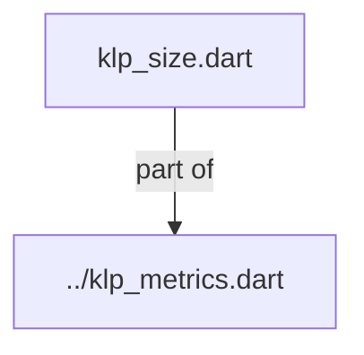
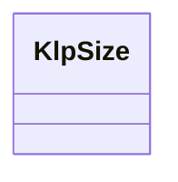

# klp_size.dart：直接依賴與宣告架構

[回到目錄](README.md) · [來源檔案](../../../../../lib/src/foundation/metrics/klp_size.dart)

## 範圍

核心是 `lib/src/foundation/metrics/klp_size.dart`。主要視角為該檔案明寫的 import／export／part；輔助視角為本檔宣告及 extends／implements／with／on 關係。只展開一層外部邊界。

## 直接依賴圖

## 依賴證據

| 關係 | 原始 directive | 來源 |
|---|---|---|
| part of | <code>part of &#x27;../klp_metrics.dart&#x27;;</code> | [lib/src/foundation/metrics/klp_size.dart:1](../../../../../lib/src/foundation/metrics/klp_size.dart#L1) |

## 宣告關係圖

本組節點是本檔宣告；沒有箭頭的宣告未在此圖主張互相依賴。

## 宣告與成員證據

成員包含 public 與 private；簽章取自來源，省略函式本體與欄位初始值。`(inferred)` 表示來源未明寫型別；建構子只顯示參數部分，不含初始化列表。

### KlpSize

ClassDeclaration · public · [lib/src/foundation/metrics/klp_size.dart:3](../../../../../lib/src/foundation/metrics/klp_size.dart#L3)

<code>abstract final class KlpSize</code>

來源註解摘要：舊版 static const 控制項、圖示、面板與 breakpoint 尺寸。

| 成員 | 可見性 | 簽章／型別 | 來源註解摘要 | 證據 |
|---|---|---|---|---|
| field <code>controlSmall</code> | public | <code>static const double controlSmall</code> |  | [lib/src/foundation/metrics/klp_size.dart:5](../../../../../lib/src/foundation/metrics/klp_size.dart#L5) |
| field <code>control</code> | public | <code>static const double control</code> |  | [lib/src/foundation/metrics/klp_size.dart:6](../../../../../lib/src/foundation/metrics/klp_size.dart#L6) |
| field <code>controlLarge</code> | public | <code>static const double controlLarge</code> |  | [lib/src/foundation/metrics/klp_size.dart:7](../../../../../lib/src/foundation/metrics/klp_size.dart#L7) |
| field <code>controlXLarge</code> | public | <code>static const double controlXLarge</code> |  | [lib/src/foundation/metrics/klp_size.dart:8](../../../../../lib/src/foundation/metrics/klp_size.dart#L8) |
| field <code>segmentedDense</code> | public | <code>static const double segmentedDense</code> |  | [lib/src/foundation/metrics/klp_size.dart:9](../../../../../lib/src/foundation/metrics/klp_size.dart#L9) |
| field <code>segmentedDenseItem</code> | public | <code>static const double segmentedDenseItem</code> |  | [lib/src/foundation/metrics/klp_size.dart:10](../../../../../lib/src/foundation/metrics/klp_size.dart#L10) |
| field <code>iconButton</code> | public | <code>static const double iconButton</code> |  | [lib/src/foundation/metrics/klp_size.dart:11](../../../../../lib/src/foundation/metrics/klp_size.dart#L11) |
| field <code>tab</code> | public | <code>static const double tab</code> |  | [lib/src/foundation/metrics/klp_size.dart:12](../../../../../lib/src/foundation/metrics/klp_size.dart#L12) |
| field <code>iconSmall</code> | public | <code>static const double iconSmall</code> |  | [lib/src/foundation/metrics/klp_size.dart:13](../../../../../lib/src/foundation/metrics/klp_size.dart#L13) |
| field <code>iconBase</code> | public | <code>static const double iconBase</code> |  | [lib/src/foundation/metrics/klp_size.dart:14](../../../../../lib/src/foundation/metrics/klp_size.dart#L14) |
| field <code>disclosure</code> | public | <code>static const double disclosure</code> |  | [lib/src/foundation/metrics/klp_size.dart:15](../../../../../lib/src/foundation/metrics/klp_size.dart#L15) |
| field <code>icon</code> | public | <code>static const double icon</code> |  | [lib/src/foundation/metrics/klp_size.dart:16](../../../../../lib/src/foundation/metrics/klp_size.dart#L16) |
| field <code>iconMedium</code> | public | <code>static const double iconMedium</code> |  | [lib/src/foundation/metrics/klp_size.dart:17](../../../../../lib/src/foundation/metrics/klp_size.dart#L17) |
| field <code>iconLarge</code> | public | <code>static const double iconLarge</code> |  | [lib/src/foundation/metrics/klp_size.dart:18](../../../../../lib/src/foundation/metrics/klp_size.dart#L18) |
| field <code>rail</code> | public | <code>static const double rail</code> |  | [lib/src/foundation/metrics/klp_size.dart:19](../../../../../lib/src/foundation/metrics/klp_size.dart#L19) |
| field <code>header</code> | public | <code>static const double header</code> |  | [lib/src/foundation/metrics/klp_size.dart:20](../../../../../lib/src/foundation/metrics/klp_size.dart#L20) |
| field <code>statusBar</code> | public | <code>static const double statusBar</code> |  | [lib/src/foundation/metrics/klp_size.dart:21](../../../../../lib/src/foundation/metrics/klp_size.dart#L21) |
| field <code>listTileTrailingMax</code> | public | <code>static const double listTileTrailingMax</code> |  | [lib/src/foundation/metrics/klp_size.dart:22](../../../../../lib/src/foundation/metrics/klp_size.dart#L22) |
| field <code>primaryPaneBreakpoint</code> | public | <code>static const double primaryPaneBreakpoint</code> |  | [lib/src/foundation/metrics/klp_size.dart:23](../../../../../lib/src/foundation/metrics/klp_size.dart#L23) |
| field <code>primaryPaneContentBreakpoint</code> | public | <code>static const double primaryPaneContentBreakpoint</code> |  | [lib/src/foundation/metrics/klp_size.dart:24](../../../../../lib/src/foundation/metrics/klp_size.dart#L24) |
| field <code>secondaryPaneBreakpoint</code> | public | <code>static const double secondaryPaneBreakpoint</code> |  | [lib/src/foundation/metrics/klp_size.dart:25](../../../../../lib/src/foundation/metrics/klp_size.dart#L25) |
| field <code>sidebar</code> | public | <code>static const double sidebar</code> |  | [lib/src/foundation/metrics/klp_size.dart:26](../../../../../lib/src/foundation/metrics/klp_size.dart#L26) |
| field <code>inspector</code> | public | <code>static const double inspector</code> |  | [lib/src/foundation/metrics/klp_size.dart:27](../../../../../lib/src/foundation/metrics/klp_size.dart#L27) |
| field <code>menu</code> | public | <code>static const double menu</code> |  | [lib/src/foundation/metrics/klp_size.dart:28](../../../../../lib/src/foundation/metrics/klp_size.dart#L28) |
| field <code>commandMenu</code> | public | <code>static const double commandMenu</code> |  | [lib/src/foundation/metrics/klp_size.dart:29](../../../../../lib/src/foundation/metrics/klp_size.dart#L29) |
| field <code>menuHeader</code> | public | <code>static const double menuHeader</code> |  | [lib/src/foundation/metrics/klp_size.dart:30](../../../../../lib/src/foundation/metrics/klp_size.dart#L30) |
| field <code>menuItem</code> | public | <code>static const double menuItem</code> |  | [lib/src/foundation/metrics/klp_size.dart:31](../../../../../lib/src/foundation/metrics/klp_size.dart#L31) |

## 閱讀說明與限制

箭頭只表示來源明寫的靜態關係；import 不等於呼叫。未分析動態呼叫、欄位的實際物件擁有權、狀態轉移或渲染流程；型別未進行語意解析，繼承目標保留原始型別拼寫。public／private 依 Dart 名稱前綴判斷；public 宣告不代表已由 `lib/kallopis.dart` 匯出。

本頁由 `tool/architecture_atlas` 產生；編輯來源或生成工具後重新產生，避免手改本頁。
