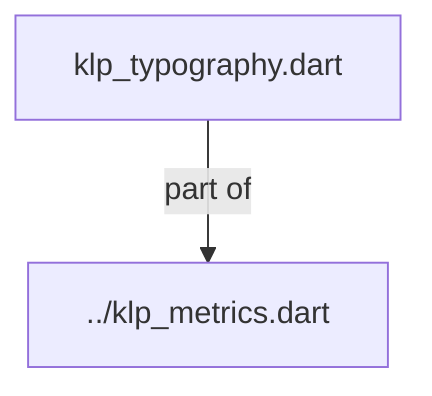
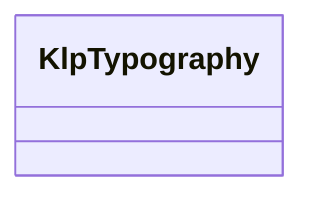

# klp_typography.dart：直接依賴與宣告架構

[回到目錄](README.md) · [來源檔案](../../../../../lib/src/foundation/metrics/klp_typography.dart)

## 範圍

核心是 `lib/src/foundation/metrics/klp_typography.dart`。主要視角為該檔案明寫的 import／export／part；輔助視角為本檔宣告及 extends／implements／with／on 關係。只展開一層外部邊界。

## 直接依賴圖

## 依賴證據

| 關係 | 原始 directive | 來源 |
|---|---|---|
| part of | <code>part of &#x27;../klp_metrics.dart&#x27;;</code> | [lib/src/foundation/metrics/klp_typography.dart:1](../../../../../lib/src/foundation/metrics/klp_typography.dart#L1) |

## 宣告關係圖

本組節點是本檔宣告；沒有箭頭的宣告未在此圖主張互相依賴。

## 宣告與成員證據

成員包含 public 與 private；簽章取自來源，省略函式本體與欄位初始值。`(inferred)` 表示來源未明寫型別；建構子只顯示參數部分，不含初始化列表。

### KlpTypography

ClassDeclaration · public · [lib/src/foundation/metrics/klp_typography.dart:3](../../../../../lib/src/foundation/metrics/klp_typography.dart#L3)

<code>abstract final class KlpTypography</code>

來源註解摘要：舊版 static const 字型階梯；新元件必須改讀 context.klp.type。

| 成員 | 可見性 | 簽章／型別 | 來源註解摘要 | 證據 |
|---|---|---|---|---|
| field <code>sansFamily</code> | public | <code>static const String sansFamily</code> |  | [lib/src/foundation/metrics/klp_typography.dart:5](../../../../../lib/src/foundation/metrics/klp_typography.dart#L5) |
| field <code>sansFallback</code> | public | <code>static const List&lt;String&gt; sansFallback</code> |  | [lib/src/foundation/metrics/klp_typography.dart:6](../../../../../lib/src/foundation/metrics/klp_typography.dart#L6) |
| field <code>monoFamily</code> | public | <code>static const String monoFamily</code> |  | [lib/src/foundation/metrics/klp_typography.dart:13](../../../../../lib/src/foundation/metrics/klp_typography.dart#L13) |
| field <code>monoFallback</code> | public | <code>static const List&lt;String&gt; monoFallback</code> |  | [lib/src/foundation/metrics/klp_typography.dart:14](../../../../../lib/src/foundation/metrics/klp_typography.dart#L14) |
| field <code>uiFamily</code> | public | <code>static const String uiFamily</code> |  | [lib/src/foundation/metrics/klp_typography.dart:21](../../../../../lib/src/foundation/metrics/klp_typography.dart#L21) |
| field <code>uiFallback</code> | public | <code>static const List&lt;String&gt; uiFallback</code> |  | [lib/src/foundation/metrics/klp_typography.dart:22](../../../../../lib/src/foundation/metrics/klp_typography.dart#L22) |
| field <code>bodyFamily</code> | public | <code>static const String bodyFamily</code> |  | [lib/src/foundation/metrics/klp_typography.dart:23](../../../../../lib/src/foundation/metrics/klp_typography.dart#L23) |
| field <code>bodyFallback</code> | public | <code>static const List&lt;String&gt; bodyFallback</code> |  | [lib/src/foundation/metrics/klp_typography.dart:24](../../../../../lib/src/foundation/metrics/klp_typography.dart#L24) |
| field <code>micro</code> | public | <code>static const double micro</code> |  | [lib/src/foundation/metrics/klp_typography.dart:25](../../../../../lib/src/foundation/metrics/klp_typography.dart#L25) |
| field <code>caption</code> | public | <code>static const double caption</code> |  | [lib/src/foundation/metrics/klp_typography.dart:26](../../../../../lib/src/foundation/metrics/klp_typography.dart#L26) |
| field <code>small</code> | public | <code>static const double small</code> |  | [lib/src/foundation/metrics/klp_typography.dart:27](../../../../../lib/src/foundation/metrics/klp_typography.dart#L27) |
| field <code>sub</code> | public | <code>static const double sub</code> |  | [lib/src/foundation/metrics/klp_typography.dart:28](../../../../../lib/src/foundation/metrics/klp_typography.dart#L28) |
| field <code>body</code> | public | <code>static const double body</code> |  | [lib/src/foundation/metrics/klp_typography.dart:29](../../../../../lib/src/foundation/metrics/klp_typography.dart#L29) |
| field <code>lead</code> | public | <code>static const double lead</code> |  | [lib/src/foundation/metrics/klp_typography.dart:30](../../../../../lib/src/foundation/metrics/klp_typography.dart#L30) |
| field <code>h4</code> | public | <code>static const double h4</code> |  | [lib/src/foundation/metrics/klp_typography.dart:31](../../../../../lib/src/foundation/metrics/klp_typography.dart#L31) |
| field <code>h3</code> | public | <code>static const double h3</code> |  | [lib/src/foundation/metrics/klp_typography.dart:32](../../../../../lib/src/foundation/metrics/klp_typography.dart#L32) |
| field <code>section</code> | public | <code>static const double section</code> |  | [lib/src/foundation/metrics/klp_typography.dart:33](../../../../../lib/src/foundation/metrics/klp_typography.dart#L33) |
| field <code>headingSmall</code> | public | <code>static const double headingSmall</code> |  | [lib/src/foundation/metrics/klp_typography.dart:34](../../../../../lib/src/foundation/metrics/klp_typography.dart#L34) |
| field <code>h2</code> | public | <code>static const double h2</code> |  | [lib/src/foundation/metrics/klp_typography.dart:35](../../../../../lib/src/foundation/metrics/klp_typography.dart#L35) |
| field <code>heading</code> | public | <code>static const double heading</code> |  | [lib/src/foundation/metrics/klp_typography.dart:36](../../../../../lib/src/foundation/metrics/klp_typography.dart#L36) |
| field <code>editorHeading</code> | public | <code>static const double editorHeading</code> |  | [lib/src/foundation/metrics/klp_typography.dart:37](../../../../../lib/src/foundation/metrics/klp_typography.dart#L37) |
| field <code>h1</code> | public | <code>static const double h1</code> |  | [lib/src/foundation/metrics/klp_typography.dart:38](../../../../../lib/src/foundation/metrics/klp_typography.dart#L38) |
| field <code>title</code> | public | <code>static const double title</code> |  | [lib/src/foundation/metrics/klp_typography.dart:39](../../../../../lib/src/foundation/metrics/klp_typography.dart#L39) |
| field <code>headline</code> | public | <code>static const double headline</code> |  | [lib/src/foundation/metrics/klp_typography.dart:40](../../../../../lib/src/foundation/metrics/klp_typography.dart#L40) |
| field <code>display</code> | public | <code>static const double display</code> |  | [lib/src/foundation/metrics/klp_typography.dart:41](../../../../../lib/src/foundation/metrics/klp_typography.dart#L41) |
| field <code>hero</code> | public | <code>static const double hero</code> |  | [lib/src/foundation/metrics/klp_typography.dart:42](../../../../../lib/src/foundation/metrics/klp_typography.dart#L42) |
| field <code>microLineHeight</code> | public | <code>static const double microLineHeight</code> |  | [lib/src/foundation/metrics/klp_typography.dart:43](../../../../../lib/src/foundation/metrics/klp_typography.dart#L43) |
| field <code>captionLineHeight</code> | public | <code>static const double captionLineHeight</code> |  | [lib/src/foundation/metrics/klp_typography.dart:44](../../../../../lib/src/foundation/metrics/klp_typography.dart#L44) |
| field <code>subLineHeight</code> | public | <code>static const double subLineHeight</code> |  | [lib/src/foundation/metrics/klp_typography.dart:45](../../../../../lib/src/foundation/metrics/klp_typography.dart#L45) |
| field <code>bodyLineHeight</code> | public | <code>static const double bodyLineHeight</code> |  | [lib/src/foundation/metrics/klp_typography.dart:46](../../../../../lib/src/foundation/metrics/klp_typography.dart#L46) |
| field <code>leadLineHeight</code> | public | <code>static const double leadLineHeight</code> |  | [lib/src/foundation/metrics/klp_typography.dart:47](../../../../../lib/src/foundation/metrics/klp_typography.dart#L47) |
| field <code>h4LineHeight</code> | public | <code>static const double h4LineHeight</code> |  | [lib/src/foundation/metrics/klp_typography.dart:48](../../../../../lib/src/foundation/metrics/klp_typography.dart#L48) |
| field <code>h3LineHeight</code> | public | <code>static const double h3LineHeight</code> |  | [lib/src/foundation/metrics/klp_typography.dart:49](../../../../../lib/src/foundation/metrics/klp_typography.dart#L49) |
| field <code>h2LineHeight</code> | public | <code>static const double h2LineHeight</code> |  | [lib/src/foundation/metrics/klp_typography.dart:50](../../../../../lib/src/foundation/metrics/klp_typography.dart#L50) |
| field <code>h1LineHeight</code> | public | <code>static const double h1LineHeight</code> |  | [lib/src/foundation/metrics/klp_typography.dart:51](../../../../../lib/src/foundation/metrics/klp_typography.dart#L51) |
| field <code>displayLineHeight</code> | public | <code>static const double displayLineHeight</code> |  | [lib/src/foundation/metrics/klp_typography.dart:52](../../../../../lib/src/foundation/metrics/klp_typography.dart#L52) |
| field <code>displayLetterSpacing</code> | public | <code>static const double displayLetterSpacing</code> |  | [lib/src/foundation/metrics/klp_typography.dart:53](../../../../../lib/src/foundation/metrics/klp_typography.dart#L53) |
| field <code>labelLetterSpacing</code> | public | <code>static const double labelLetterSpacing</code> |  | [lib/src/foundation/metrics/klp_typography.dart:54](../../../../../lib/src/foundation/metrics/klp_typography.dart#L54) |
| field <code>uiBaselineOffset</code> | public | <code>static const double uiBaselineOffset</code> |  | [lib/src/foundation/metrics/klp_typography.dart:55](../../../../../lib/src/foundation/metrics/klp_typography.dart#L55) |
| field <code>regular</code> | public | <code>static const FontWeight regular</code> |  | [lib/src/foundation/metrics/klp_typography.dart:56](../../../../../lib/src/foundation/metrics/klp_typography.dart#L56) |
| field <code>medium</code> | public | <code>static const FontWeight medium</code> |  | [lib/src/foundation/metrics/klp_typography.dart:57](../../../../../lib/src/foundation/metrics/klp_typography.dart#L57) |
| field <code>semibold</code> | public | <code>static const FontWeight semibold</code> |  | [lib/src/foundation/metrics/klp_typography.dart:58](../../../../../lib/src/foundation/metrics/klp_typography.dart#L58) |
| field <code>bold</code> | public | <code>static const FontWeight bold</code> |  | [lib/src/foundation/metrics/klp_typography.dart:59](../../../../../lib/src/foundation/metrics/klp_typography.dart#L59) |
| field <code>extraBold</code> | public | <code>static const FontWeight extraBold</code> |  | [lib/src/foundation/metrics/klp_typography.dart:60](../../../../../lib/src/foundation/metrics/klp_typography.dart#L60) |

## 閱讀說明與限制

箭頭只表示來源明寫的靜態關係；import 不等於呼叫。未分析動態呼叫、欄位的實際物件擁有權、狀態轉移或渲染流程；型別未進行語意解析，繼承目標保留原始型別拼寫。public／private 依 Dart 名稱前綴判斷；public 宣告不代表已由 `lib/kallopis.dart` 匯出。

本頁由 `tool/architecture_atlas` 產生；編輯來源或生成工具後重新產生，避免手改本頁。
