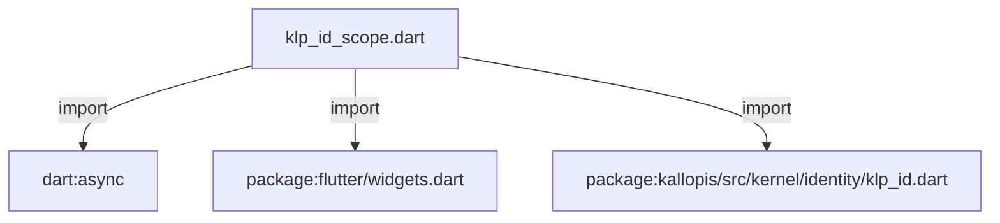
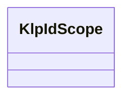
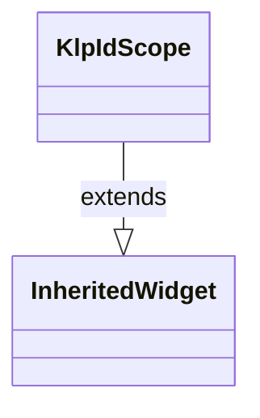

# klp_id_scope.dart：直接依賴與宣告架構

[回到目錄](README.md) · [來源檔案](../../../../../lib/src/foundation/platform/klp_id_scope.dart)

## 範圍

核心是 `lib/src/foundation/platform/klp_id_scope.dart`。主要視角為該檔案明寫的 import／export／part；輔助視角為本檔宣告及 extends／implements／with／on 關係。只展開一層外部邊界。

## 直接依賴圖

## 依賴證據

| 關係 | 原始 directive | 來源 |
|---|---|---|
| import | <code>import &#x27;dart:async&#x27;;</code> | [lib/src/foundation/platform/klp_id_scope.dart:1](../../../../../lib/src/foundation/platform/klp_id_scope.dart#L1) |
| import | <code>import &#x27;package:flutter/widgets.dart&#x27;;</code> | [lib/src/foundation/platform/klp_id_scope.dart:3](../../../../../lib/src/foundation/platform/klp_id_scope.dart#L3) |
| import | <code>import &#x27;package:kallopis/src/kernel/identity/klp_id.dart&#x27;;</code> | [lib/src/foundation/platform/klp_id_scope.dart:5](../../../../../lib/src/foundation/platform/klp_id_scope.dart#L5) |

## 宣告關係圖

本組節點是本檔宣告；沒有箭頭的宣告未在此圖主張互相依賴。

## 宣告與成員證據

成員包含 public 與 private；簽章取自來源，省略函式本體與欄位初始值。`(inferred)` 表示來源未明寫型別；建構子只顯示參數部分，不含初始化列表。

### KlpIdScope

ClassDeclaration · public · [lib/src/foundation/platform/klp_id_scope.dart:7](../../../../../lib/src/foundation/platform/klp_id_scope.dart#L7)

<code>final class KlpIdScope extends InheritedWidget</code>

來源註解摘要：同時提供宣告期 Zone 與渲染期 Widget 樹的識別範圍。

- `extends` → <code>InheritedWidget</code>：[lib/src/foundation/platform/klp_id_scope.dart:8](../../../../../lib/src/foundation/platform/klp_id_scope.dart#L8)

| 成員 | 可見性 | 簽章／型別 | 來源註解摘要 | 證據 |
|---|---|---|---|---|
| field <code>id</code> | public | <code>final KlpId id</code> |  | [lib/src/foundation/platform/klp_id_scope.dart:9](../../../../../lib/src/foundation/platform/klp_id_scope.dart#L9) |
| constructor <code>KlpIdScope</code> | public | <code>const KlpIdScope({super.key, required this.id, required super.child})</code> |  | [lib/src/foundation/platform/klp_id_scope.dart:11](../../../../../lib/src/foundation/platform/klp_id_scope.dart#L11) |
| method <code>run</code> | public | <code>static R run&lt;R&gt;(KlpId scope, R Function() action)</code> | 在目前宣告流程建立可巢狀繼承的識別範圍。 | [lib/src/foundation/platform/klp_id_scope.dart:13](../../../../../lib/src/foundation/platform/klp_id_scope.dart#L13) |
| getter <code>current</code> | public | <code>static KlpId? get current</code> | 取得目前宣告期 Zone 內的識別範圍。 | [lib/src/foundation/platform/klp_id_scope.dart:19](../../../../../lib/src/foundation/platform/klp_id_scope.dart#L19) |
| method <code>of</code> | public | <code>static KlpId of(BuildContext context)</code> | 訂閱最近的渲染期識別範圍；缺少祖先時明確拋錯。 | [lib/src/foundation/platform/klp_id_scope.dart:22](../../../../../lib/src/foundation/platform/klp_id_scope.dart#L22) |
| method <code>maybeOf</code> | public | <code>static KlpId? maybeOf(BuildContext context)</code> | 訂閱最近的渲染期識別範圍；未注入時回傳 null。 | [lib/src/foundation/platform/klp_id_scope.dart:32](../../../../../lib/src/foundation/platform/klp_id_scope.dart#L32) |
| method <code>childOf</code> | public | <code>static KlpId childOf(BuildContext context, String leaf)</code> | 以目前渲染期範圍建立子識別碼。 | [lib/src/foundation/platform/klp_id_scope.dart:37](../../../../../lib/src/foundation/platform/klp_id_scope.dart#L37) |
| method <code>updateShouldNotify</code> | public | <code>bool updateShouldNotify(KlpIdScope oldWidget)</code> |  | [lib/src/foundation/platform/klp_id_scope.dart:40](../../../../../lib/src/foundation/platform/klp_id_scope.dart#L40) |

## 閱讀說明與限制

箭頭只表示來源明寫的靜態關係；import 不等於呼叫。未分析動態呼叫、欄位的實際物件擁有權、狀態轉移或渲染流程；型別未進行語意解析，繼承目標保留原始型別拼寫。public／private 依 Dart 名稱前綴判斷；public 宣告不代表已由 `lib/kallopis.dart` 匯出。

本頁由 `tool/architecture_atlas` 產生；編輯來源或生成工具後重新產生，避免手改本頁。
