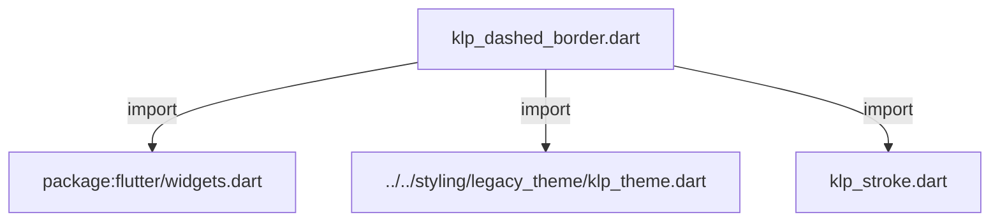
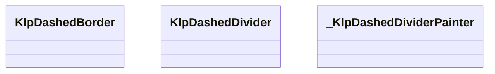
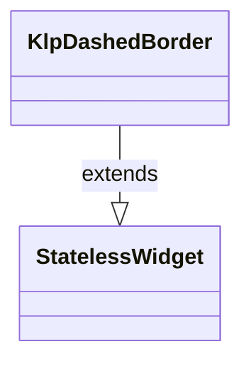
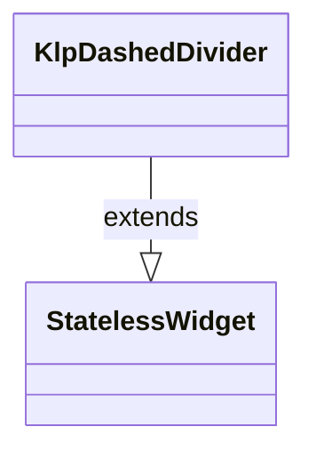
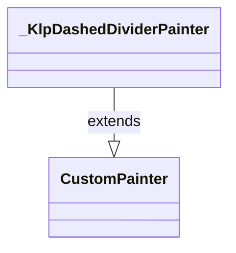

# klp_dashed_border.dart：直接依賴與宣告架構

[回到目錄](README.md) · [來源檔案](../../../../../lib/src/foundation/surface/klp_dashed_border.dart)

## 範圍

核心是 `lib/src/foundation/surface/klp_dashed_border.dart`。主要視角為該檔案明寫的 import／export／part；輔助視角為本檔宣告及 extends／implements／with／on 關係。只展開一層外部邊界。

## 直接依賴圖

## 依賴證據

| 關係 | 原始 directive | 來源 |
|---|---|---|
| import | <code>import &#x27;package:flutter/widgets.dart&#x27;;</code> | [lib/src/foundation/surface/klp_dashed_border.dart:1](../../../../../lib/src/foundation/surface/klp_dashed_border.dart#L1) |
| import | <code>import &#x27;../../styling/legacy_theme/klp_theme.dart&#x27;;</code> | [lib/src/foundation/surface/klp_dashed_border.dart:3](../../../../../lib/src/foundation/surface/klp_dashed_border.dart#L3) |
| import | <code>import &#x27;klp_stroke.dart&#x27;;</code> | [lib/src/foundation/surface/klp_dashed_border.dart:4](../../../../../lib/src/foundation/surface/klp_dashed_border.dart#L4) |

## 宣告關係圖

本組節點是本檔宣告；沒有箭頭的宣告未在此圖主張互相依賴。

## 宣告與成員證據

成員包含 public 與 private；簽章取自來源，省略函式本體與欄位初始值。`(inferred)` 表示來源未明寫型別；建構子只顯示參數部分，不含初始化列表。

### KlpDashedBorder

ClassDeclaration · public · [lib/src/foundation/surface/klp_dashed_border.dart:6](../../../../../lib/src/foundation/surface/klp_dashed_border.dart#L6)

<code>class KlpDashedBorder extends StatelessWidget</code>

來源註解摘要：虛線邊框容器。為子元件提供自訂粗細、圓角、顏色與虛線間距的虛線外框。 預設使用 theme 的 [KlpShapeTheme.dashedOpacity] 輔助線顏色與 [KlpShapeTheme.control] 圓角。

- `extends` → <code>StatelessWidget</code>：[lib/src/foundation/surface/klp_dashed_border.dart:9](../../../../../lib/src/foundation/surface/klp_dashed_border.dart#L9)

| 成員 | 可見性 | 簽章／型別 | 來源註解摘要 | 證據 |
|---|---|---|---|---|
| constructor <code>KlpDashedBorder</code> | public | <code>const KlpDashedBorder({ super.key, required this.child, this.color, this.radius, this.width, this.dashLength, this.gapLength, this.opacity, })</code> |  | [lib/src/foundation/surface/klp_dashed_border.dart:10](../../../../../lib/src/foundation/surface/klp_dashed_border.dart#L10) |
| field <code>child</code> | public | <code>final Widget child</code> | 包裹之子元件。 | [lib/src/foundation/surface/klp_dashed_border.dart:22](../../../../../lib/src/foundation/surface/klp_dashed_border.dart#L22) |
| field <code>color</code> | public | <code>final Color? color</code> | 虛線顏色。`null` 時取自 theme 的 [KlpThemeData.guide]。 | [lib/src/foundation/surface/klp_dashed_border.dart:25](../../../../../lib/src/foundation/surface/klp_dashed_border.dart#L25) |
| field <code>radius</code> | public | <code>final double? radius</code> | 邊角圓角半徑。`null` 時取自 theme 的 [KlpShapeTheme.control]。 | [lib/src/foundation/surface/klp_dashed_border.dart:28](../../../../../lib/src/foundation/surface/klp_dashed_border.dart#L28) |
| field <code>width</code> | public | <code>final double? width</code> | 虛線線寬（粗細）。`null` 時取自 theme 的 [KlpShapeTheme.hairline]。 | [lib/src/foundation/surface/klp_dashed_border.dart:31](../../../../../lib/src/foundation/surface/klp_dashed_border.dart#L31) |
| field <code>dashLength</code> | public | <code>final double? dashLength</code> | 每段虛線長度。`null` 時取自 theme 的 [KlpShapeTheme.dashedLength]。 | [lib/src/foundation/surface/klp_dashed_border.dart:34](../../../../../lib/src/foundation/surface/klp_dashed_border.dart#L34) |
| field <code>gapLength</code> | public | <code>final double? gapLength</code> | 虛線間隔長度。`null` 時取自 theme 的 [KlpShapeTheme.dashedGap]。 | [lib/src/foundation/surface/klp_dashed_border.dart:37](../../../../../lib/src/foundation/surface/klp_dashed_border.dart#L37) |
| field <code>opacity</code> | public | <code>final double? opacity</code> | 透明度。 | [lib/src/foundation/surface/klp_dashed_border.dart:40](../../../../../lib/src/foundation/surface/klp_dashed_border.dart#L40) |
| method <code>build</code> | public | <code>Widget build(BuildContext context)</code> |  | [lib/src/foundation/surface/klp_dashed_border.dart:42](../../../../../lib/src/foundation/surface/klp_dashed_border.dart#L42) |

### KlpDashedDivider

ClassDeclaration · public · [lib/src/foundation/surface/klp_dashed_border.dart:57](../../../../../lib/src/foundation/surface/klp_dashed_border.dart#L57)

<code>class KlpDashedDivider extends StatelessWidget</code>

來源註解摘要：虛線分隔線。支援水平與垂直兩種方向，以及自訂線寬、顏色與虛線間距。 預設使用 theme 的 [KlpShapeTheme.hairline] 粗細與 [KlpShapeTheme.dashedOpacity] 輔助線顏色。

- `extends` → <code>StatelessWidget</code>：[lib/src/foundation/surface/klp_dashed_border.dart:60](../../../../../lib/src/foundation/surface/klp_dashed_border.dart#L60)

| 成員 | 可見性 | 簽章／型別 | 來源註解摘要 | 證據 |
|---|---|---|---|---|
| constructor <code>KlpDashedDivider</code> | public | <code>const KlpDashedDivider({ super.key, this.vertical = false, this.width, this.color, this.dashLength, this.gapLength, this.opacity, })</code> |  | [lib/src/foundation/surface/klp_dashed_border.dart:61](../../../../../lib/src/foundation/surface/klp_dashed_border.dart#L61) |
| field <code>vertical</code> | public | <code>final bool vertical</code> | 是否為垂直分隔線。預設為 `false`（水平分隔線）。 | [lib/src/foundation/surface/klp_dashed_border.dart:72](../../../../../lib/src/foundation/surface/klp_dashed_border.dart#L72) |
| field <code>width</code> | public | <code>final double? width</code> | 分隔線線寬（粗細）。`null` 時取自 theme 的 [KlpShapeTheme.hairline]。 | [lib/src/foundation/surface/klp_dashed_border.dart:75](../../../../../lib/src/foundation/surface/klp_dashed_border.dart#L75) |
| field <code>color</code> | public | <code>final Color? color</code> | 虛線顏色。`null` 時取自 theme 的 [KlpThemeData.guide]。 | [lib/src/foundation/surface/klp_dashed_border.dart:78](../../../../../lib/src/foundation/surface/klp_dashed_border.dart#L78) |
| field <code>dashLength</code> | public | <code>final double? dashLength</code> | 每段虛線長度。`null` 時取自 theme 的 [KlpShapeTheme.dashedLength]。 | [lib/src/foundation/surface/klp_dashed_border.dart:81](../../../../../lib/src/foundation/surface/klp_dashed_border.dart#L81) |
| field <code>gapLength</code> | public | <code>final double? gapLength</code> | 虛線間隔長度。`null` 時取自 theme 的 [KlpShapeTheme.dashedGap]。 | [lib/src/foundation/surface/klp_dashed_border.dart:84](../../../../../lib/src/foundation/surface/klp_dashed_border.dart#L84) |
| field <code>opacity</code> | public | <code>final double? opacity</code> | 透明度。 | [lib/src/foundation/surface/klp_dashed_border.dart:87](../../../../../lib/src/foundation/surface/klp_dashed_border.dart#L87) |
| method <code>build</code> | public | <code>Widget build(BuildContext context)</code> |  | [lib/src/foundation/surface/klp_dashed_border.dart:89](../../../../../lib/src/foundation/surface/klp_dashed_border.dart#L89) |

### _KlpDashedDividerPainter

ClassDeclaration · private · [lib/src/foundation/surface/klp_dashed_border.dart:116](../../../../../lib/src/foundation/surface/klp_dashed_border.dart#L116)

<code>class _KlpDashedDividerPainter extends CustomPainter</code>

- `extends` → <code>CustomPainter</code>：[lib/src/foundation/surface/klp_dashed_border.dart:116](../../../../../lib/src/foundation/surface/klp_dashed_border.dart#L116)

| 成員 | 可見性 | 簽章／型別 | 來源註解摘要 | 證據 |
|---|---|---|---|---|
| constructor <code>_KlpDashedDividerPainter</code> | private | <code>const _KlpDashedDividerPainter({ required this.color, required this.width, required this.dashLength, required this.gapLength, this.vertical = false, })</code> |  | [lib/src/foundation/surface/klp_dashed_border.dart:117](../../../../../lib/src/foundation/surface/klp_dashed_border.dart#L117) |
| field <code>color</code> | public | <code>final Color color</code> |  | [lib/src/foundation/surface/klp_dashed_border.dart:125](../../../../../lib/src/foundation/surface/klp_dashed_border.dart#L125) |
| field <code>width</code> | public | <code>final double width</code> |  | [lib/src/foundation/surface/klp_dashed_border.dart:126](../../../../../lib/src/foundation/surface/klp_dashed_border.dart#L126) |
| field <code>dashLength</code> | public | <code>final double dashLength</code> |  | [lib/src/foundation/surface/klp_dashed_border.dart:127](../../../../../lib/src/foundation/surface/klp_dashed_border.dart#L127) |
| field <code>gapLength</code> | public | <code>final double gapLength</code> |  | [lib/src/foundation/surface/klp_dashed_border.dart:128](../../../../../lib/src/foundation/surface/klp_dashed_border.dart#L128) |
| field <code>vertical</code> | public | <code>final bool vertical</code> |  | [lib/src/foundation/surface/klp_dashed_border.dart:129](../../../../../lib/src/foundation/surface/klp_dashed_border.dart#L129) |
| method <code>paint</code> | public | <code>void paint(Canvas canvas, Size size)</code> |  | [lib/src/foundation/surface/klp_dashed_border.dart:131](../../../../../lib/src/foundation/surface/klp_dashed_border.dart#L131) |
| method <code>shouldRepaint</code> | public | <code>bool shouldRepaint(covariant _KlpDashedDividerPainter oldDelegate)</code> |  | [lib/src/foundation/surface/klp_dashed_border.dart:162](../../../../../lib/src/foundation/surface/klp_dashed_border.dart#L162) |

## 閱讀說明與限制

箭頭只表示來源明寫的靜態關係；import 不等於呼叫。未分析動態呼叫、欄位的實際物件擁有權、狀態轉移或渲染流程；型別未進行語意解析，繼承目標保留原始型別拼寫。public／private 依 Dart 名稱前綴判斷；public 宣告不代表已由 `lib/kallopis.dart` 匯出。

本頁由 `tool/architecture_atlas` 產生；編輯來源或生成工具後重新產生，避免手改本頁。
