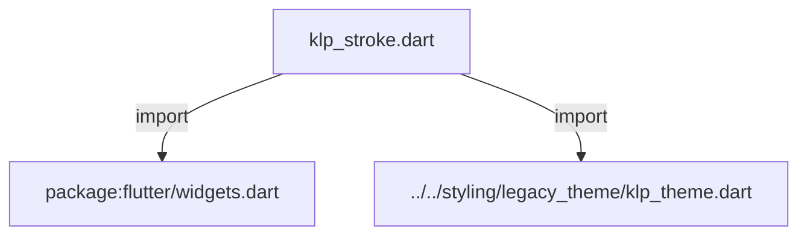
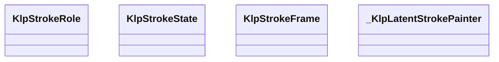
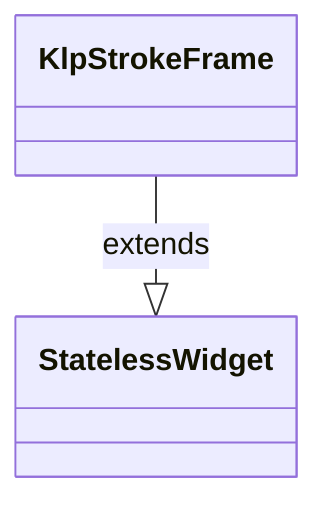
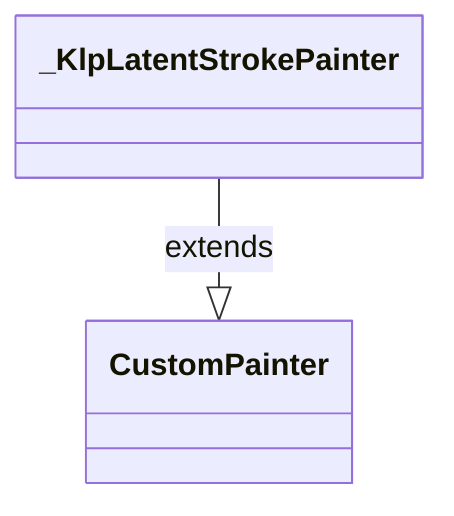

# klp_stroke.dart：直接依賴與宣告架構

[回到目錄](README.md) · [來源檔案](../../../../../lib/src/foundation/surface/klp_stroke.dart)

## 範圍

核心是 `lib/src/foundation/surface/klp_stroke.dart`。主要視角為該檔案明寫的 import／export／part；輔助視角為本檔宣告及 extends／implements／with／on 關係。只展開一層外部邊界。

## 直接依賴圖

## 依賴證據

| 關係 | 原始 directive | 來源 |
|---|---|---|
| import | <code>import &#x27;package:flutter/widgets.dart&#x27;;</code> | [lib/src/foundation/surface/klp_stroke.dart:1](../../../../../lib/src/foundation/surface/klp_stroke.dart#L1) |
| import | <code>import &#x27;../../styling/legacy_theme/klp_theme.dart&#x27;;</code> | [lib/src/foundation/surface/klp_stroke.dart:3](../../../../../lib/src/foundation/surface/klp_stroke.dart#L3) |

## 宣告關係圖

本組節點是本檔宣告；沒有箭頭的宣告未在此圖主張互相依賴。

## 宣告與成員證據

成員包含 public 與 private；簽章取自來源，省略函式本體與欄位初始值。`(inferred)` 表示來源未明寫型別；建構子只顯示參數部分，不含初始化列表。

### KlpStrokeRole

EnumDeclaration · public · [lib/src/foundation/surface/klp_stroke.dart:5](../../../../../lib/src/foundation/surface/klp_stroke.dart#L5)

<code>enum KlpStrokeRole</code>

| 成員 | 可見性 | 簽章／型別 | 來源註解摘要 | 證據 |
|---|---|---|---|---|
| enum value <code>structure</code> | public | <code>structure</code> |  | [lib/src/foundation/surface/klp_stroke.dart:5](../../../../../lib/src/foundation/surface/klp_stroke.dart#L5) |
| enum value <code>latent</code> | public | <code>latent</code> |  | [lib/src/foundation/surface/klp_stroke.dart:5](../../../../../lib/src/foundation/surface/klp_stroke.dart#L5) |
| enum value <code>field</code> | public | <code>field</code> |  | [lib/src/foundation/surface/klp_stroke.dart:5](../../../../../lib/src/foundation/surface/klp_stroke.dart#L5) |

### KlpStrokeState

EnumDeclaration · public · [lib/src/foundation/surface/klp_stroke.dart:7](../../../../../lib/src/foundation/surface/klp_stroke.dart#L7)

<code>enum KlpStrokeState</code>

| 成員 | 可見性 | 簽章／型別 | 來源註解摘要 | 證據 |
|---|---|---|---|---|
| enum value <code>rest</code> | public | <code>rest</code> |  | [lib/src/foundation/surface/klp_stroke.dart:7](../../../../../lib/src/foundation/surface/klp_stroke.dart#L7) |
| enum value <code>hovered</code> | public | <code>hovered</code> |  | [lib/src/foundation/surface/klp_stroke.dart:7](../../../../../lib/src/foundation/surface/klp_stroke.dart#L7) |
| enum value <code>focused</code> | public | <code>focused</code> |  | [lib/src/foundation/surface/klp_stroke.dart:7](../../../../../lib/src/foundation/surface/klp_stroke.dart#L7) |
| enum value <code>selected</code> | public | <code>selected</code> |  | [lib/src/foundation/surface/klp_stroke.dart:7](../../../../../lib/src/foundation/surface/klp_stroke.dart#L7) |
| enum value <code>disabled</code> | public | <code>disabled</code> |  | [lib/src/foundation/surface/klp_stroke.dart:7](../../../../../lib/src/foundation/surface/klp_stroke.dart#L7) |

### KlpStrokeFrame

ClassDeclaration · public · [lib/src/foundation/surface/klp_stroke.dart:9](../../../../../lib/src/foundation/surface/klp_stroke.dart#L9)

<code>class KlpStrokeFrame extends StatelessWidget</code>

- `extends` → <code>StatelessWidget</code>：[lib/src/foundation/surface/klp_stroke.dart:9](../../../../../lib/src/foundation/surface/klp_stroke.dart#L9)

| 成員 | 可見性 | 簽章／型別 | 來源註解摘要 | 證據 |
|---|---|---|---|---|
| constructor <code>KlpStrokeFrame</code> | public | <code>const KlpStrokeFrame({ super.key, required this.role, required this.child, this.state = KlpStrokeState.rest, this.color, this.radius, this.width, this.dashLength, this.gapLength, this.opacity, })</code> |  | [lib/src/foundation/surface/klp_stroke.dart:10](../../../../../lib/src/foundation/surface/klp_stroke.dart#L10) |
| field <code>role</code> | public | <code>final KlpStrokeRole role</code> |  | [lib/src/foundation/surface/klp_stroke.dart:26](../../../../../lib/src/foundation/surface/klp_stroke.dart#L26) |
| field <code>child</code> | public | <code>final Widget child</code> |  | [lib/src/foundation/surface/klp_stroke.dart:27](../../../../../lib/src/foundation/surface/klp_stroke.dart#L27) |
| field <code>state</code> | public | <code>final KlpStrokeState state</code> |  | [lib/src/foundation/surface/klp_stroke.dart:28](../../../../../lib/src/foundation/surface/klp_stroke.dart#L28) |
| field <code>color</code> | public | <code>final Color? color</code> |  | [lib/src/foundation/surface/klp_stroke.dart:29](../../../../../lib/src/foundation/surface/klp_stroke.dart#L29) |
| field <code>radius</code> | public | <code>final double? radius</code> | 以下皆為 `null` 表示沿用 theme。指定值只用於刻意偏離的場合—— 建構子預設值是編譯期常數，讀不到 theme。 | [lib/src/foundation/surface/klp_stroke.dart:33](../../../../../lib/src/foundation/surface/klp_stroke.dart#L33) |
| field <code>width</code> | public | <code>final double? width</code> |  | [lib/src/foundation/surface/klp_stroke.dart:34](../../../../../lib/src/foundation/surface/klp_stroke.dart#L34) |
| field <code>dashLength</code> | public | <code>final double? dashLength</code> |  | [lib/src/foundation/surface/klp_stroke.dart:35](../../../../../lib/src/foundation/surface/klp_stroke.dart#L35) |
| field <code>gapLength</code> | public | <code>final double? gapLength</code> |  | [lib/src/foundation/surface/klp_stroke.dart:36](../../../../../lib/src/foundation/surface/klp_stroke.dart#L36) |
| field <code>opacity</code> | public | <code>final double? opacity</code> |  | [lib/src/foundation/surface/klp_stroke.dart:37](../../../../../lib/src/foundation/surface/klp_stroke.dart#L37) |
| method <code>build</code> | public | <code>Widget build(BuildContext context)</code> |  | [lib/src/foundation/surface/klp_stroke.dart:39](../../../../../lib/src/foundation/surface/klp_stroke.dart#L39) |
| method <code>_fieldFillState</code> | private | <code>KlpFieldFillState _fieldFillState()</code> |  | [lib/src/foundation/surface/klp_stroke.dart:79](../../../../../lib/src/foundation/surface/klp_stroke.dart#L79) |

### _KlpLatentStrokePainter

ClassDeclaration · private · [lib/src/foundation/surface/klp_stroke.dart:90](../../../../../lib/src/foundation/surface/klp_stroke.dart#L90)

<code>class _KlpLatentStrokePainter extends CustomPainter</code>

- `extends` → <code>CustomPainter</code>：[lib/src/foundation/surface/klp_stroke.dart:90](../../../../../lib/src/foundation/surface/klp_stroke.dart#L90)

| 成員 | 可見性 | 簽章／型別 | 來源註解摘要 | 證據 |
|---|---|---|---|---|
| constructor <code>_KlpLatentStrokePainter</code> | private | <code>const _KlpLatentStrokePainter({ required this.color, required this.radius, required this.width, required this.dashLength, required this.gapLength, })</code> |  | [lib/src/foundation/surface/klp_stroke.dart:91](../../../../../lib/src/foundation/surface/klp_stroke.dart#L91) |
| field <code>color</code> | public | <code>final Color color</code> |  | [lib/src/foundation/surface/klp_stroke.dart:99](../../../../../lib/src/foundation/surface/klp_stroke.dart#L99) |
| field <code>radius</code> | public | <code>final double radius</code> |  | [lib/src/foundation/surface/klp_stroke.dart:100](../../../../../lib/src/foundation/surface/klp_stroke.dart#L100) |
| field <code>width</code> | public | <code>final double width</code> |  | [lib/src/foundation/surface/klp_stroke.dart:101](../../../../../lib/src/foundation/surface/klp_stroke.dart#L101) |
| field <code>dashLength</code> | public | <code>final double dashLength</code> |  | [lib/src/foundation/surface/klp_stroke.dart:102](../../../../../lib/src/foundation/surface/klp_stroke.dart#L102) |
| field <code>gapLength</code> | public | <code>final double gapLength</code> |  | [lib/src/foundation/surface/klp_stroke.dart:103](../../../../../lib/src/foundation/surface/klp_stroke.dart#L103) |
| method <code>paint</code> | public | <code>void paint(Canvas canvas, Size size)</code> |  | [lib/src/foundation/surface/klp_stroke.dart:105](../../../../../lib/src/foundation/surface/klp_stroke.dart#L105) |
| method <code>shouldRepaint</code> | public | <code>bool shouldRepaint(covariant _KlpLatentStrokePainter oldDelegate)</code> |  | [lib/src/foundation/surface/klp_stroke.dart:139](../../../../../lib/src/foundation/surface/klp_stroke.dart#L139) |

## 閱讀說明與限制

箭頭只表示來源明寫的靜態關係；import 不等於呼叫。未分析動態呼叫、欄位的實際物件擁有權、狀態轉移或渲染流程；型別未進行語意解析，繼承目標保留原始型別拼寫。public／private 依 Dart 名稱前綴判斷；public 宣告不代表已由 `lib/kallopis.dart` 匯出。

本頁由 `tool/architecture_atlas` 產生；編輯來源或生成工具後重新產生，避免手改本頁。
