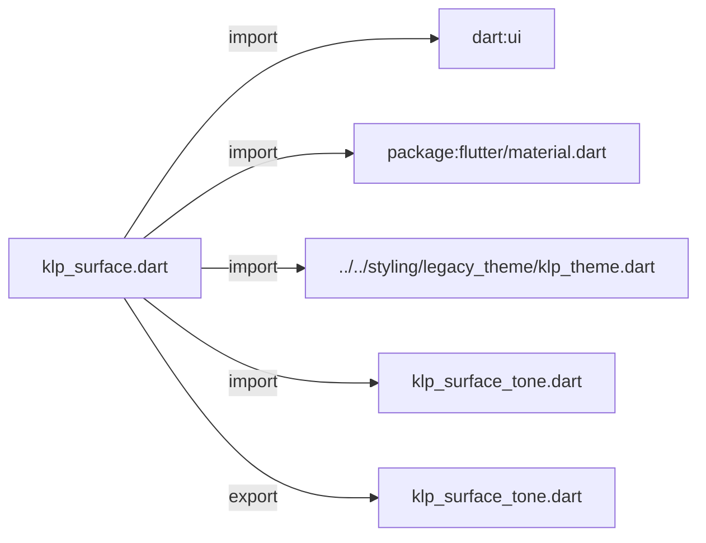
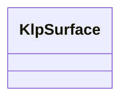
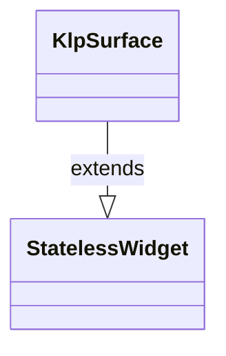

# klp_surface.dart：直接依賴與宣告架構

[回到目錄](README.md) · [來源檔案](../../../../../lib/src/foundation/surface/klp_surface.dart)

## 範圍

核心是 `lib/src/foundation/surface/klp_surface.dart`。主要視角為該檔案明寫的 import／export／part；輔助視角為本檔宣告及 extends／implements／with／on 關係。只展開一層外部邊界。

## 直接依賴圖

## 依賴證據

| 關係 | 原始 directive | 來源 |
|---|---|---|
| import | <code>import &#x27;dart:ui&#x27; show ImageFilter;</code> | [lib/src/foundation/surface/klp_surface.dart:1](../../../../../lib/src/foundation/surface/klp_surface.dart#L1) |
| import | <code>import &#x27;package:flutter/material.dart&#x27;;</code> | [lib/src/foundation/surface/klp_surface.dart:3](../../../../../lib/src/foundation/surface/klp_surface.dart#L3) |
| import | <code>import &#x27;../../styling/legacy_theme/klp_theme.dart&#x27;;</code> | [lib/src/foundation/surface/klp_surface.dart:5](../../../../../lib/src/foundation/surface/klp_surface.dart#L5) |
| import | <code>import &#x27;klp_surface_tone.dart&#x27;;</code> | [lib/src/foundation/surface/klp_surface.dart:6](../../../../../lib/src/foundation/surface/klp_surface.dart#L6) |
| export | <code>export &#x27;klp_surface_tone.dart&#x27;;</code> | [lib/src/foundation/surface/klp_surface.dart:8](../../../../../lib/src/foundation/surface/klp_surface.dart#L8) |

## 宣告關係圖

本組節點是本檔宣告；沒有箭頭的宣告未在此圖主張互相依賴。

## 宣告與成員證據

成員包含 public 與 private；簽章取自來源，省略函式本體與欄位初始值。`(inferred)` 表示來源未明寫型別；建構子只顯示參數部分，不含初始化列表。

### KlpSurface

ClassDeclaration · public · [lib/src/foundation/surface/klp_surface.dart:10](../../../../../lib/src/foundation/surface/klp_surface.dart#L10)

<code>class KlpSurface extends StatelessWidget</code>

來源註解摘要：有底色的容器，是所有區塊的基底。`tone` 指定它在表面階層中的位置， 支援邊框、微漸層、外發光與霧化透明（毛玻璃）等多種原生 Box 視覺效果。

- `extends` → <code>StatelessWidget</code>：[lib/src/foundation/surface/klp_surface.dart:12](../../../../../lib/src/foundation/surface/klp_surface.dart#L12)

| 成員 | 可見性 | 簽章／型別 | 來源註解摘要 | 證據 |
|---|---|---|---|---|
| constructor <code>KlpSurface</code> | public | <code>const KlpSurface({ super.key, required this.child, this.tone = KlpSurfaceTone.base, this.radius, this.padding, this.border, this.gradient, this.shadows, this.frosted = false, this.blurSigma, })</code> |  | [lib/src/foundation/surface/klp_surface.dart:13](../../../../../lib/src/foundation/surface/klp_surface.dart#L13) |
| field <code>child</code> | public | <code>final Widget child</code> |  | [lib/src/foundation/surface/klp_surface.dart:26](../../../../../lib/src/foundation/surface/klp_surface.dart#L26) |
| field <code>tone</code> | public | <code>final KlpSurfaceTone tone</code> |  | [lib/src/foundation/surface/klp_surface.dart:27](../../../../../lib/src/foundation/surface/klp_surface.dart#L27) |
| field <code>radius</code> | public | <code>final double? radius</code> |  | [lib/src/foundation/surface/klp_surface.dart:28](../../../../../lib/src/foundation/surface/klp_surface.dart#L28) |
| field <code>padding</code> | public | <code>final EdgeInsetsGeometry? padding</code> |  | [lib/src/foundation/surface/klp_surface.dart:29](../../../../../lib/src/foundation/surface/klp_surface.dart#L29) |
| field <code>border</code> | public | <code>final BoxBorder? border</code> |  | [lib/src/foundation/surface/klp_surface.dart:30](../../../../../lib/src/foundation/surface/klp_surface.dart#L30) |
| field <code>gradient</code> | public | <code>final Gradient? gradient</code> |  | [lib/src/foundation/surface/klp_surface.dart:31](../../../../../lib/src/foundation/surface/klp_surface.dart#L31) |
| field <code>shadows</code> | public | <code>final List&lt;BoxShadow&gt;? shadows</code> |  | [lib/src/foundation/surface/klp_surface.dart:32](../../../../../lib/src/foundation/surface/klp_surface.dart#L32) |
| field <code>frosted</code> | public | <code>final bool frosted</code> |  | [lib/src/foundation/surface/klp_surface.dart:33](../../../../../lib/src/foundation/surface/klp_surface.dart#L33) |
| field <code>blurSigma</code> | public | <code>final double? blurSigma</code> |  | [lib/src/foundation/surface/klp_surface.dart:34](../../../../../lib/src/foundation/surface/klp_surface.dart#L34) |
| method <code>build</code> | public | <code>Widget build(BuildContext context)</code> |  | [lib/src/foundation/surface/klp_surface.dart:36](../../../../../lib/src/foundation/surface/klp_surface.dart#L36) |

## 閱讀說明與限制

箭頭只表示來源明寫的靜態關係；import 不等於呼叫。未分析動態呼叫、欄位的實際物件擁有權、狀態轉移或渲染流程；型別未進行語意解析，繼承目標保留原始型別拼寫。public／private 依 Dart 名稱前綴判斷；public 宣告不代表已由 `lib/kallopis.dart` 匯出。

本頁由 `tool/architecture_atlas` 產生；編輯來源或生成工具後重新產生，避免手改本頁。
