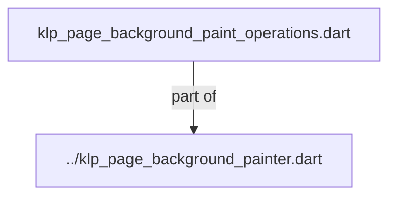
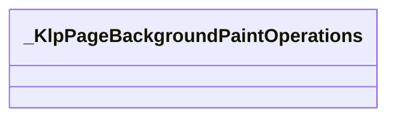
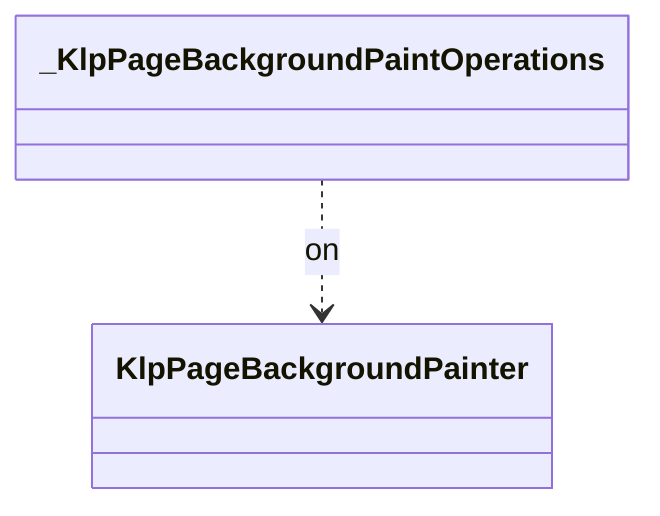

# klp_page_background_paint_operations.dart：直接依賴與宣告架構

[回到目錄](README.md) · [來源檔案](../../../../../../../lib/src/foundation/surface/page_background/internal/klp_page_background_paint_operations.dart)

## 範圍

核心是 `lib/src/foundation/surface/page_background/internal/klp_page_background_paint_operations.dart`。主要視角為該檔案明寫的 import／export／part；輔助視角為本檔宣告及 extends／implements／with／on 關係。只展開一層外部邊界。

## 直接依賴圖

## 依賴證據

| 關係 | 原始 directive | 來源 |
|---|---|---|
| part of | <code>part of &#x27;../klp_page_background_painter.dart&#x27;;</code> | [lib/src/foundation/surface/page_background/internal/klp_page_background_paint_operations.dart:1](../../../../../../../lib/src/foundation/surface/page_background/internal/klp_page_background_paint_operations.dart#L1) |

## 宣告關係圖

本組節點是本檔宣告；沒有箭頭的宣告未在此圖主張互相依賴。

## 宣告與成員證據

成員包含 public 與 private；簽章取自來源，省略函式本體與欄位初始值。`(inferred)` 表示來源未明寫型別；建構子只顯示參數部分，不含初始化列表。

### _KlpPageBackgroundPaintOperations

ExtensionDeclaration · private · [lib/src/foundation/surface/page_background/internal/klp_page_background_paint_operations.dart:3](../../../../../../../lib/src/foundation/surface/page_background/internal/klp_page_background_paint_operations.dart#L3)

<code>extension _KlpPageBackgroundPaintOperations on KlpPageBackgroundPainter</code>

- `on` → <code>KlpPageBackgroundPainter</code>：[lib/src/foundation/surface/page_background/internal/klp_page_background_paint_operations.dart:3](../../../../../../../lib/src/foundation/surface/page_background/internal/klp_page_background_paint_operations.dart#L3)

| 成員 | 可見性 | 簽章／型別 | 來源註解摘要 | 證據 |
|---|---|---|---|---|
| method <code>_paintRuled</code> | private | <code>void _paintRuled( Canvas canvas, Size size, KlpRuledPageBackgroundRecipe recipe, )</code> |  | [lib/src/foundation/surface/page_background/internal/klp_page_background_paint_operations.dart:4](../../../../../../../lib/src/foundation/surface/page_background/internal/klp_page_background_paint_operations.dart#L4) |
| method <code>_paintPeriodic</code> | private | <code>void _paintPeriodic( Canvas canvas, Size size, KlpPeriodicPageBackgroundRecipe recipe, { required bool dots, })</code> |  | [lib/src/foundation/surface/page_background/internal/klp_page_background_paint_operations.dart:21](../../../../../../../lib/src/foundation/surface/page_background/internal/klp_page_background_paint_operations.dart#L21) |
| method <code>_paintDots</code> | private | <code>void _paintDots( Canvas canvas, Size size, KlpPeriodicPageBackgroundRecipe recipe, int divisionCount, double spacing, int firstColumn, int firstRow, )</code> |  | [lib/src/foundation/surface/page_background/internal/klp_page_background_paint_operations.dart:72](../../../../../../../lib/src/foundation/surface/page_background/internal/klp_page_background_paint_operations.dart#L72) |
| method <code>_paintCustom</code> | private | <code>void _paintCustom(Canvas canvas, KlpCustomPageBackgroundRecipe recipe)</code> |  | [lib/src/foundation/surface/page_background/internal/klp_page_background_paint_operations.dart:110](../../../../../../../lib/src/foundation/surface/page_background/internal/klp_page_background_paint_operations.dart#L110) |
| method <code>_paintFor</code> | private | <code>Paint _paintFor( KlpPageBackgroundAxisStyle axis, KlpPageBackgroundStrokeBehavior behavior, { double? defaultWidth, })</code> |  | [lib/src/foundation/surface/page_background/internal/klp_page_background_paint_operations.dart:137](../../../../../../../lib/src/foundation/surface/page_background/internal/klp_page_background_paint_operations.dart#L137) |

## 閱讀說明與限制

箭頭只表示來源明寫的靜態關係；import 不等於呼叫。未分析動態呼叫、欄位的實際物件擁有權、狀態轉移或渲染流程；型別未進行語意解析，繼承目標保留原始型別拼寫。public／private 依 Dart 名稱前綴判斷；public 宣告不代表已由 `lib/kallopis.dart` 匯出。

本頁由 `tool/architecture_atlas` 產生；編輯來源或生成工具後重新產生，避免手改本頁。
