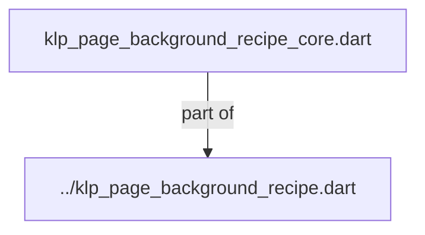
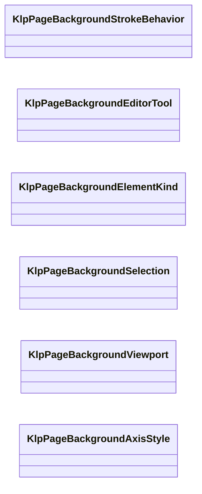

# klp_page_background_recipe_core.dart：直接依賴與宣告架構

[回到目錄](README.md) · [來源檔案](../../../../../../../lib/src/foundation/surface/page_background/internal/klp_page_background_recipe_core.dart)

## 範圍

核心是 `lib/src/foundation/surface/page_background/internal/klp_page_background_recipe_core.dart`。主要視角為該檔案明寫的 import／export／part；輔助視角為本檔宣告及 extends／implements／with／on 關係。只展開一層外部邊界。

## 直接依賴圖

## 依賴證據

| 關係 | 原始 directive | 來源 |
|---|---|---|
| part of | <code>part of &#x27;../klp_page_background_recipe.dart&#x27;;</code> | [lib/src/foundation/surface/page_background/internal/klp_page_background_recipe_core.dart:1](../../../../../../../lib/src/foundation/surface/page_background/internal/klp_page_background_recipe_core.dart#L1) |

## 宣告關係圖

本組節點是本檔宣告；沒有箭頭的宣告未在此圖主張互相依賴。

## 宣告與成員證據

成員包含 public 與 private；簽章取自來源，省略函式本體與欄位初始值。`(inferred)` 表示來源未明寫型別；建構子只顯示參數部分，不含初始化列表。

### KlpPageBackgroundStrokeBehavior

EnumDeclaration · public · [lib/src/foundation/surface/page_background/internal/klp_page_background_recipe_core.dart:3](../../../../../../../lib/src/foundation/surface/page_background/internal/klp_page_background_recipe_core.dart#L3)

<code>enum KlpPageBackgroundStrokeBehavior</code>

來源註解摘要：線寬固定於 viewport，或隨 viewport scale 一起縮放。

| 成員 | 可見性 | 簽章／型別 | 來源註解摘要 | 證據 |
|---|---|---|---|---|
| enum value <code>fixed</code> | public | <code>fixed</code> |  | [lib/src/foundation/surface/page_background/internal/klp_page_background_recipe_core.dart:4](../../../../../../../lib/src/foundation/surface/page_background/internal/klp_page_background_recipe_core.dart#L4) |
| enum value <code>scaled</code> | public | <code>scaled</code> |  | [lib/src/foundation/surface/page_background/internal/klp_page_background_recipe_core.dart:4](../../../../../../../lib/src/foundation/surface/page_background/internal/klp_page_background_recipe_core.dart#L4) |

### KlpPageBackgroundEditorTool

EnumDeclaration · public · [lib/src/foundation/surface/page_background/internal/klp_page_background_recipe_core.dart:6](../../../../../../../lib/src/foundation/surface/page_background/internal/klp_page_background_recipe_core.dart#L6)

<code>enum KlpPageBackgroundEditorTool</code>

來源註解摘要：背景編輯器目前使用的工具。

| 成員 | 可見性 | 簽章／型別 | 來源註解摘要 | 證據 |
|---|---|---|---|---|
| enum value <code>connect</code> | public | <code>connect</code> |  | [lib/src/foundation/surface/page_background/internal/klp_page_background_recipe_core.dart:7](../../../../../../../lib/src/foundation/surface/page_background/internal/klp_page_background_recipe_core.dart#L7) |
| enum value <code>select</code> | public | <code>select</code> |  | [lib/src/foundation/surface/page_background/internal/klp_page_background_recipe_core.dart:7](../../../../../../../lib/src/foundation/surface/page_background/internal/klp_page_background_recipe_core.dart#L7) |
| enum value <code>delete</code> | public | <code>delete</code> |  | [lib/src/foundation/surface/page_background/internal/klp_page_background_recipe_core.dart:7](../../../../../../../lib/src/foundation/surface/page_background/internal/klp_page_background_recipe_core.dart#L7) |

### KlpPageBackgroundElementKind

EnumDeclaration · public · [lib/src/foundation/surface/page_background/internal/klp_page_background_recipe_core.dart:9](../../../../../../../lib/src/foundation/surface/page_background/internal/klp_page_background_recipe_core.dart#L9)

<code>enum KlpPageBackgroundElementKind</code>

來源註解摘要：可被選取的背景圖元種類。

| 成員 | 可見性 | 簽章／型別 | 來源註解摘要 | 證據 |
|---|---|---|---|---|
| enum value <code>point</code> | public | <code>point</code> |  | [lib/src/foundation/surface/page_background/internal/klp_page_background_recipe_core.dart:10](../../../../../../../lib/src/foundation/surface/page_background/internal/klp_page_background_recipe_core.dart#L10) |
| enum value <code>line</code> | public | <code>line</code> |  | [lib/src/foundation/surface/page_background/internal/klp_page_background_recipe_core.dart:10](../../../../../../../lib/src/foundation/surface/page_background/internal/klp_page_background_recipe_core.dart#L10) |

### KlpPageBackgroundSelection

ClassDeclaration · public · [lib/src/foundation/surface/page_background/internal/klp_page_background_recipe_core.dart:12](../../../../../../../lib/src/foundation/surface/page_background/internal/klp_page_background_recipe_core.dart#L12)

<code>class KlpPageBackgroundSelection</code>

來源註解摘要：背景編輯器的單一選取結果；選取狀態不會寫入 recipe。

| 成員 | 可見性 | 簽章／型別 | 來源註解摘要 | 證據 |
|---|---|---|---|---|
| constructor <code>point</code> | public | <code>const KlpPageBackgroundSelection.point(this.id)</code> |  | [lib/src/foundation/surface/page_background/internal/klp_page_background_recipe_core.dart:15](../../../../../../../lib/src/foundation/surface/page_background/internal/klp_page_background_recipe_core.dart#L15) |
| constructor <code>line</code> | public | <code>const KlpPageBackgroundSelection.line(this.id)</code> |  | [lib/src/foundation/surface/page_background/internal/klp_page_background_recipe_core.dart:16](../../../../../../../lib/src/foundation/surface/page_background/internal/klp_page_background_recipe_core.dart#L16) |
| field <code>kind</code> | public | <code>final KlpPageBackgroundElementKind kind</code> |  | [lib/src/foundation/surface/page_background/internal/klp_page_background_recipe_core.dart:18](../../../../../../../lib/src/foundation/surface/page_background/internal/klp_page_background_recipe_core.dart#L18) |
| field <code>id</code> | public | <code>final int id</code> |  | [lib/src/foundation/surface/page_background/internal/klp_page_background_recipe_core.dart:19](../../../../../../../lib/src/foundation/surface/page_background/internal/klp_page_background_recipe_core.dart#L19) |
| method <code>==</code> | public | <code>bool operator ==(Object other)</code> |  | [lib/src/foundation/surface/page_background/internal/klp_page_background_recipe_core.dart:21](../../../../../../../lib/src/foundation/surface/page_background/internal/klp_page_background_recipe_core.dart#L21) |
| getter <code>hashCode</code> | public | <code>int get hashCode</code> |  | [lib/src/foundation/surface/page_background/internal/klp_page_background_recipe_core.dart:26](../../../../../../../lib/src/foundation/surface/page_background/internal/klp_page_background_recipe_core.dart#L26) |

### KlpPageBackgroundViewport

ClassDeclaration · public · [lib/src/foundation/surface/page_background/internal/klp_page_background_recipe_core.dart:30](../../../../../../../lib/src/foundation/surface/page_background/internal/klp_page_background_recipe_core.dart#L30)

<code>class KlpPageBackgroundViewport</code>

來源註解摘要：頁面座標與 viewport 座標之間的單一轉換來源。

| 成員 | 可見性 | 簽章／型別 | 來源註解摘要 | 證據 |
|---|---|---|---|---|
| constructor <code>KlpPageBackgroundViewport</code> | public | <code>KlpPageBackgroundViewport({this.origin = Offset.zero, this.scale = 1})</code> |  | [lib/src/foundation/surface/page_background/internal/klp_page_background_recipe_core.dart:33](../../../../../../../lib/src/foundation/surface/page_background/internal/klp_page_background_recipe_core.dart#L33) |
| field <code>origin</code> | public | <code>final Offset origin</code> |  | [lib/src/foundation/surface/page_background/internal/klp_page_background_recipe_core.dart:38](../../../../../../../lib/src/foundation/surface/page_background/internal/klp_page_background_recipe_core.dart#L38) |
| field <code>scale</code> | public | <code>final double scale</code> |  | [lib/src/foundation/surface/page_background/internal/klp_page_background_recipe_core.dart:39](../../../../../../../lib/src/foundation/surface/page_background/internal/klp_page_background_recipe_core.dart#L39) |
| method <code>pageToViewport</code> | public | <code>Offset pageToViewport(Offset position)</code> |  | [lib/src/foundation/surface/page_background/internal/klp_page_background_recipe_core.dart:41](../../../../../../../lib/src/foundation/surface/page_background/internal/klp_page_background_recipe_core.dart#L41) |
| method <code>viewportToPage</code> | public | <code>Offset viewportToPage(Offset position)</code> |  | [lib/src/foundation/surface/page_background/internal/klp_page_background_recipe_core.dart:42](../../../../../../../lib/src/foundation/surface/page_background/internal/klp_page_background_recipe_core.dart#L42) |
| method <code>==</code> | public | <code>bool operator ==(Object other)</code> |  | [lib/src/foundation/surface/page_background/internal/klp_page_background_recipe_core.dart:44](../../../../../../../lib/src/foundation/surface/page_background/internal/klp_page_background_recipe_core.dart#L44) |
| getter <code>hashCode</code> | public | <code>int get hashCode</code> |  | [lib/src/foundation/surface/page_background/internal/klp_page_background_recipe_core.dart:49](../../../../../../../lib/src/foundation/surface/page_background/internal/klp_page_background_recipe_core.dart#L49) |

### KlpPageBackgroundAxisStyle

ClassDeclaration · public · [lib/src/foundation/surface/page_background/internal/klp_page_background_recipe_core.dart:53](../../../../../../../lib/src/foundation/surface/page_background/internal/klp_page_background_recipe_core.dart#L53)

<code>class KlpPageBackgroundAxisStyle</code>

來源註解摘要：主軸、次軸、線或點的執行期外觀；null 代表沿用 semantic theme。

| 成員 | 可見性 | 簽章／型別 | 來源註解摘要 | 證據 |
|---|---|---|---|---|
| constructor <code>KlpPageBackgroundAxisStyle</code> | public | <code>KlpPageBackgroundAxisStyle({this.color, this.width})</code> |  | [lib/src/foundation/surface/page_background/internal/klp_page_background_recipe_core.dart:56](../../../../../../../lib/src/foundation/surface/page_background/internal/klp_page_background_recipe_core.dart#L56) |
| field <code>color</code> | public | <code>final Color? color</code> |  | [lib/src/foundation/surface/page_background/internal/klp_page_background_recipe_core.dart:61](../../../../../../../lib/src/foundation/surface/page_background/internal/klp_page_background_recipe_core.dart#L61) |
| field <code>width</code> | public | <code>final double? width</code> |  | [lib/src/foundation/surface/page_background/internal/klp_page_background_recipe_core.dart:62](../../../../../../../lib/src/foundation/surface/page_background/internal/klp_page_background_recipe_core.dart#L62) |
| method <code>copyWith</code> | public | <code>KlpPageBackgroundAxisStyle copyWith({Color? color, double? width})</code> |  | [lib/src/foundation/surface/page_background/internal/klp_page_background_recipe_core.dart:64](../../../../../../../lib/src/foundation/surface/page_background/internal/klp_page_background_recipe_core.dart#L64) |
| method <code>==</code> | public | <code>bool operator ==(Object other)</code> |  | [lib/src/foundation/surface/page_background/internal/klp_page_background_recipe_core.dart:68](../../../../../../../lib/src/foundation/surface/page_background/internal/klp_page_background_recipe_core.dart#L68) |
| getter <code>hashCode</code> | public | <code>int get hashCode</code> |  | [lib/src/foundation/surface/page_background/internal/klp_page_background_recipe_core.dart:73](../../../../../../../lib/src/foundation/surface/page_background/internal/klp_page_background_recipe_core.dart#L73) |

## 閱讀說明與限制

箭頭只表示來源明寫的靜態關係；import 不等於呼叫。未分析動態呼叫、欄位的實際物件擁有權、狀態轉移或渲染流程；型別未進行語意解析，繼承目標保留原始型別拼寫。public／private 依 Dart 名稱前綴判斷；public 宣告不代表已由 `lib/kallopis.dart` 匯出。

本頁由 `tool/architecture_atlas` 產生；編輯來源或生成工具後重新產生，避免手改本頁。
