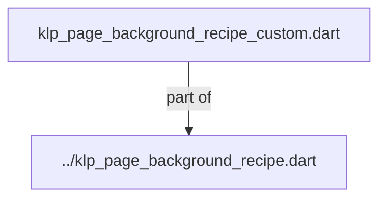
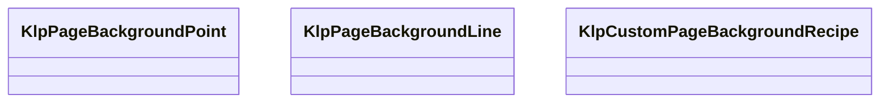
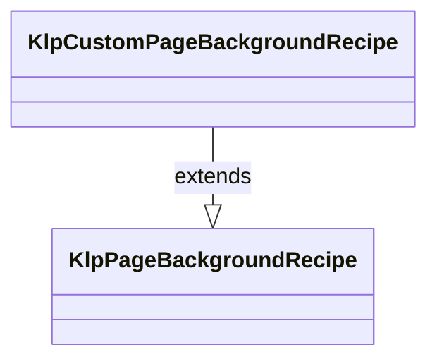

# klp_page_background_recipe_custom.dart：直接依賴與宣告架構

[回到目錄](README.md) · [來源檔案](../../../../../../../lib/src/foundation/surface/page_background/internal/klp_page_background_recipe_custom.dart)

## 範圍

核心是 `lib/src/foundation/surface/page_background/internal/klp_page_background_recipe_custom.dart`。主要視角為該檔案明寫的 import／export／part；輔助視角為本檔宣告及 extends／implements／with／on 關係。只展開一層外部邊界。

## 直接依賴圖

## 依賴證據

| 關係 | 原始 directive | 來源 |
|---|---|---|
| part of | <code>part of &#x27;../klp_page_background_recipe.dart&#x27;;</code> | [lib/src/foundation/surface/page_background/internal/klp_page_background_recipe_custom.dart:1](../../../../../../../lib/src/foundation/surface/page_background/internal/klp_page_background_recipe_custom.dart#L1) |

## 宣告關係圖

本組節點是本檔宣告；沒有箭頭的宣告未在此圖主張互相依賴。

## 宣告與成員證據

成員包含 public 與 private；簽章取自來源，省略函式本體與欄位初始值。`(inferred)` 表示來源未明寫型別；建構子只顯示參數部分，不含初始化列表。

### KlpPageBackgroundPoint

ClassDeclaration · public · [lib/src/foundation/surface/page_background/internal/klp_page_background_recipe_custom.dart:3](../../../../../../../lib/src/foundation/surface/page_background/internal/klp_page_background_recipe_custom.dart#L3)

<code>class KlpPageBackgroundPoint</code>

來源註解摘要：自訂背景在頁面座標中的單一節點。

| 成員 | 可見性 | 簽章／型別 | 來源註解摘要 | 證據 |
|---|---|---|---|---|
| constructor <code>KlpPageBackgroundPoint</code> | public | <code>const KlpPageBackgroundPoint({required this.id, required this.position})</code> |  | [lib/src/foundation/surface/page_background/internal/klp_page_background_recipe_custom.dart:6](../../../../../../../lib/src/foundation/surface/page_background/internal/klp_page_background_recipe_custom.dart#L6) |
| field <code>id</code> | public | <code>final int id</code> |  | [lib/src/foundation/surface/page_background/internal/klp_page_background_recipe_custom.dart:7](../../../../../../../lib/src/foundation/surface/page_background/internal/klp_page_background_recipe_custom.dart#L7) |
| field <code>position</code> | public | <code>final Offset position</code> |  | [lib/src/foundation/surface/page_background/internal/klp_page_background_recipe_custom.dart:8](../../../../../../../lib/src/foundation/surface/page_background/internal/klp_page_background_recipe_custom.dart#L8) |
| method <code>==</code> | public | <code>bool operator ==(Object other)</code> |  | [lib/src/foundation/surface/page_background/internal/klp_page_background_recipe_custom.dart:10](../../../../../../../lib/src/foundation/surface/page_background/internal/klp_page_background_recipe_custom.dart#L10) |
| getter <code>hashCode</code> | public | <code>int get hashCode</code> |  | [lib/src/foundation/surface/page_background/internal/klp_page_background_recipe_custom.dart:15](../../../../../../../lib/src/foundation/surface/page_background/internal/klp_page_background_recipe_custom.dart#L15) |

### KlpPageBackgroundLine

ClassDeclaration · public · [lib/src/foundation/surface/page_background/internal/klp_page_background_recipe_custom.dart:19](../../../../../../../lib/src/foundation/surface/page_background/internal/klp_page_background_recipe_custom.dart#L19)

<code>class KlpPageBackgroundLine</code>

來源註解摘要：以兩個 point id 表示端點的直線。

| 成員 | 可見性 | 簽章／型別 | 來源註解摘要 | 證據 |
|---|---|---|---|---|
| constructor <code>KlpPageBackgroundLine</code> | public | <code>const KlpPageBackgroundLine({ required this.id, required this.startPointId, required this.endPointId, })</code> |  | [lib/src/foundation/surface/page_background/internal/klp_page_background_recipe_custom.dart:22](../../../../../../../lib/src/foundation/surface/page_background/internal/klp_page_background_recipe_custom.dart#L22) |
| field <code>id</code> | public | <code>final int id</code> |  | [lib/src/foundation/surface/page_background/internal/klp_page_background_recipe_custom.dart:27](../../../../../../../lib/src/foundation/surface/page_background/internal/klp_page_background_recipe_custom.dart#L27) |
| field <code>startPointId</code> | public | <code>final int startPointId</code> |  | [lib/src/foundation/surface/page_background/internal/klp_page_background_recipe_custom.dart:28](../../../../../../../lib/src/foundation/surface/page_background/internal/klp_page_background_recipe_custom.dart#L28) |
| field <code>endPointId</code> | public | <code>final int endPointId</code> |  | [lib/src/foundation/surface/page_background/internal/klp_page_background_recipe_custom.dart:29](../../../../../../../lib/src/foundation/surface/page_background/internal/klp_page_background_recipe_custom.dart#L29) |
| method <code>==</code> | public | <code>bool operator ==(Object other)</code> |  | [lib/src/foundation/surface/page_background/internal/klp_page_background_recipe_custom.dart:31](../../../../../../../lib/src/foundation/surface/page_background/internal/klp_page_background_recipe_custom.dart#L31) |
| getter <code>hashCode</code> | public | <code>int get hashCode</code> |  | [lib/src/foundation/surface/page_background/internal/klp_page_background_recipe_custom.dart:39](../../../../../../../lib/src/foundation/surface/page_background/internal/klp_page_background_recipe_custom.dart#L39) |

### KlpCustomPageBackgroundRecipe

ClassDeclaration · public · [lib/src/foundation/surface/page_background/internal/klp_page_background_recipe_custom.dart:43](../../../../../../../lib/src/foundation/surface/page_background/internal/klp_page_background_recipe_custom.dart#L43)

<code>final class KlpCustomPageBackgroundRecipe extends KlpPageBackgroundRecipe</code>

來源註解摘要：只允許 point 與 line 的自訂背景資料，不保存產品狀態。

- `extends` → <code>KlpPageBackgroundRecipe</code>：[lib/src/foundation/surface/page_background/internal/klp_page_background_recipe_custom.dart:44](../../../../../../../lib/src/foundation/surface/page_background/internal/klp_page_background_recipe_custom.dart#L44)

| 成員 | 可見性 | 簽章／型別 | 來源註解摘要 | 證據 |
|---|---|---|---|---|
| constructor <code>KlpCustomPageBackgroundRecipe</code> | public | <code>KlpCustomPageBackgroundRecipe({ List&lt;KlpPageBackgroundPoint&gt; points = const [], List&lt;KlpPageBackgroundLine&gt; lines = const [], KlpPageBackgroundAxisStyle? pointStyle, KlpPageBackgroundAxisStyle? lineStyle, this.snapSpacing, this.strokeBehavior = KlpPageBackgroundStrokeBehavior.fixed, })</code> |  | [lib/src/foundation/surface/page_background/internal/klp_page_background_recipe_custom.dart:45](../../../../../../../lib/src/foundation/surface/page_background/internal/klp_page_background_recipe_custom.dart#L45) |
| field <code>points</code> | public | <code>final List&lt;KlpPageBackgroundPoint&gt; points</code> |  | [lib/src/foundation/surface/page_background/internal/klp_page_background_recipe_custom.dart:63](../../../../../../../lib/src/foundation/surface/page_background/internal/klp_page_background_recipe_custom.dart#L63) |
| field <code>lines</code> | public | <code>final List&lt;KlpPageBackgroundLine&gt; lines</code> |  | [lib/src/foundation/surface/page_background/internal/klp_page_background_recipe_custom.dart:64](../../../../../../../lib/src/foundation/surface/page_background/internal/klp_page_background_recipe_custom.dart#L64) |
| field <code>pointStyle</code> | public | <code>final KlpPageBackgroundAxisStyle pointStyle</code> |  | [lib/src/foundation/surface/page_background/internal/klp_page_background_recipe_custom.dart:65](../../../../../../../lib/src/foundation/surface/page_background/internal/klp_page_background_recipe_custom.dart#L65) |
| field <code>lineStyle</code> | public | <code>final KlpPageBackgroundAxisStyle lineStyle</code> |  | [lib/src/foundation/surface/page_background/internal/klp_page_background_recipe_custom.dart:66](../../../../../../../lib/src/foundation/surface/page_background/internal/klp_page_background_recipe_custom.dart#L66) |
| field <code>snapSpacing</code> | public | <code>final double? snapSpacing</code> |  | [lib/src/foundation/surface/page_background/internal/klp_page_background_recipe_custom.dart:67](../../../../../../../lib/src/foundation/surface/page_background/internal/klp_page_background_recipe_custom.dart#L67) |
| field <code>strokeBehavior</code> | public | <code>final KlpPageBackgroundStrokeBehavior strokeBehavior</code> |  | [lib/src/foundation/surface/page_background/internal/klp_page_background_recipe_custom.dart:68](../../../../../../../lib/src/foundation/surface/page_background/internal/klp_page_background_recipe_custom.dart#L68) |
| getter <code>nextPointId</code> | public | <code>int get nextPointId</code> |  | [lib/src/foundation/surface/page_background/internal/klp_page_background_recipe_custom.dart:70](../../../../../../../lib/src/foundation/surface/page_background/internal/klp_page_background_recipe_custom.dart#L70) |
| getter <code>nextLineId</code> | public | <code>int get nextLineId</code> |  | [lib/src/foundation/surface/page_background/internal/klp_page_background_recipe_custom.dart:71](../../../../../../../lib/src/foundation/surface/page_background/internal/klp_page_background_recipe_custom.dart#L71) |
| method <code>pointById</code> | public | <code>KlpPageBackgroundPoint? pointById(int id)</code> |  | [lib/src/foundation/surface/page_background/internal/klp_page_background_recipe_custom.dart:73](../../../../../../../lib/src/foundation/surface/page_background/internal/klp_page_background_recipe_custom.dart#L73) |
| method <code>copyWith</code> | public | <code>KlpCustomPageBackgroundRecipe copyWith({ List&lt;KlpPageBackgroundPoint&gt;? points, List&lt;KlpPageBackgroundLine&gt;? lines, KlpPageBackgroundAxisStyle? pointStyle, KlpPageBackgroundAxisStyle? lineStyle, double? snapSpacing, KlpPageBackgroundStrokeBehavior? strokeBehavior, })</code> |  | [lib/src/foundation/surface/page_background/internal/klp_page_background_recipe_custom.dart:80](../../../../../../../lib/src/foundation/surface/page_background/internal/klp_page_background_recipe_custom.dart#L80) |
| method <code>removePoint</code> | public | <code>KlpCustomPageBackgroundRecipe removePoint(int id)</code> |  | [lib/src/foundation/surface/page_background/internal/klp_page_background_recipe_custom.dart:98](../../../../../../../lib/src/foundation/surface/page_background/internal/klp_page_background_recipe_custom.dart#L98) |
| method <code>removeLine</code> | public | <code>KlpCustomPageBackgroundRecipe removeLine(int id)</code> |  | [lib/src/foundation/surface/page_background/internal/klp_page_background_recipe_custom.dart:111](../../../../../../../lib/src/foundation/surface/page_background/internal/klp_page_background_recipe_custom.dart#L111) |
| method <code>==</code> | public | <code>bool operator ==(Object other)</code> |  | [lib/src/foundation/surface/page_background/internal/klp_page_background_recipe_custom.dart:120](../../../../../../../lib/src/foundation/surface/page_background/internal/klp_page_background_recipe_custom.dart#L120) |
| getter <code>hashCode</code> | public | <code>int get hashCode</code> |  | [lib/src/foundation/surface/page_background/internal/klp_page_background_recipe_custom.dart:131](../../../../../../../lib/src/foundation/surface/page_background/internal/klp_page_background_recipe_custom.dart#L131) |

### _validateElements

FunctionDeclaration · private · [lib/src/foundation/surface/page_background/internal/klp_page_background_recipe_custom.dart:142](../../../../../../../lib/src/foundation/surface/page_background/internal/klp_page_background_recipe_custom.dart#L142)

<code>void _validateElements( List&lt;KlpPageBackgroundPoint&gt; points, List&lt;KlpPageBackgroundLine&gt; lines, )</code>

### _nextId

FunctionDeclaration · private · [lib/src/foundation/surface/page_background/internal/klp_page_background_recipe_custom.dart:173](../../../../../../../lib/src/foundation/surface/page_background/internal/klp_page_background_recipe_custom.dart#L173)

<code>int _nextId(Iterable&lt;int&gt; ids)</code>

### _isFiniteOffset

FunctionDeclaration · private · [lib/src/foundation/surface/page_background/internal/klp_page_background_recipe_custom.dart:181](../../../../../../../lib/src/foundation/surface/page_background/internal/klp_page_background_recipe_custom.dart#L181)

<code>bool _isFiniteOffset(Offset value)</code>

### _requirePositiveFinite

FunctionDeclaration · private · [lib/src/foundation/surface/page_background/internal/klp_page_background_recipe_custom.dart:183](../../../../../../../lib/src/foundation/surface/page_background/internal/klp_page_background_recipe_custom.dart#L183)

<code>void _requirePositiveFinite(double value, String name)</code>

## 閱讀說明與限制

箭頭只表示來源明寫的靜態關係；import 不等於呼叫。未分析動態呼叫、欄位的實際物件擁有權、狀態轉移或渲染流程；型別未進行語意解析，繼承目標保留原始型別拼寫。public／private 依 Dart 名稱前綴判斷；public 宣告不代表已由 `lib/kallopis.dart` 匯出。

本頁由 `tool/architecture_atlas` 產生；編輯來源或生成工具後重新產生，避免手改本頁。
