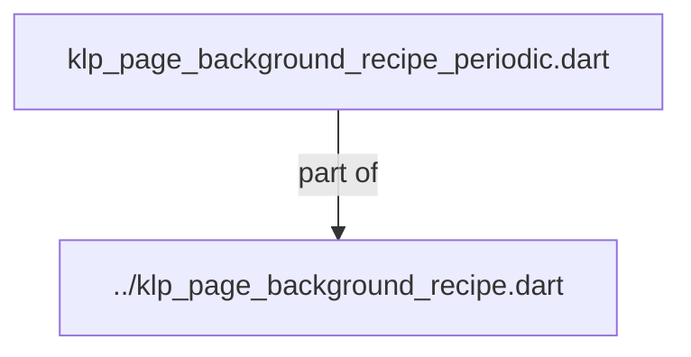
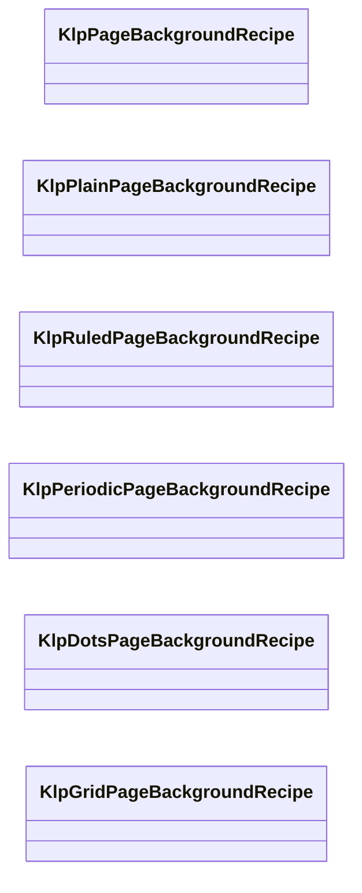
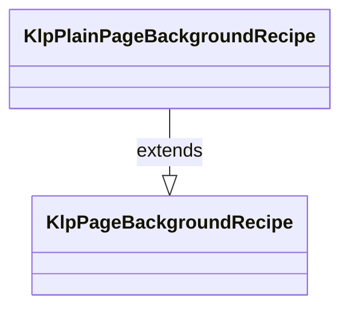
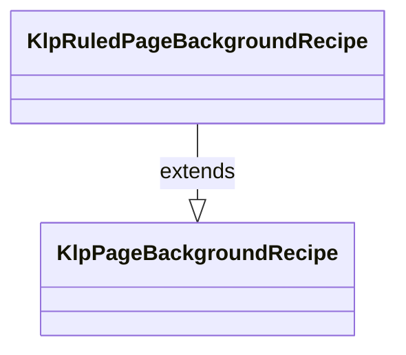
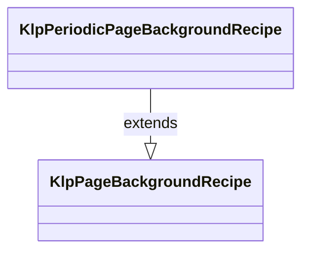
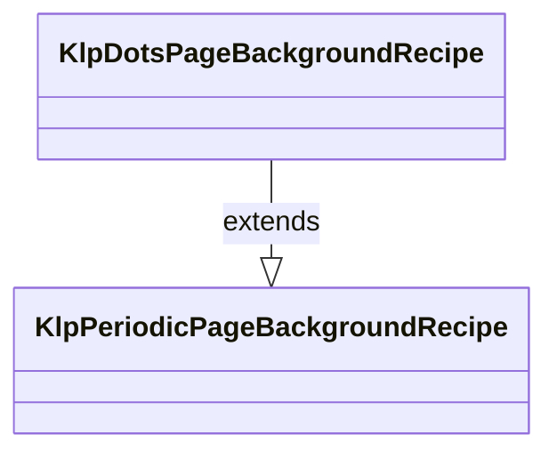
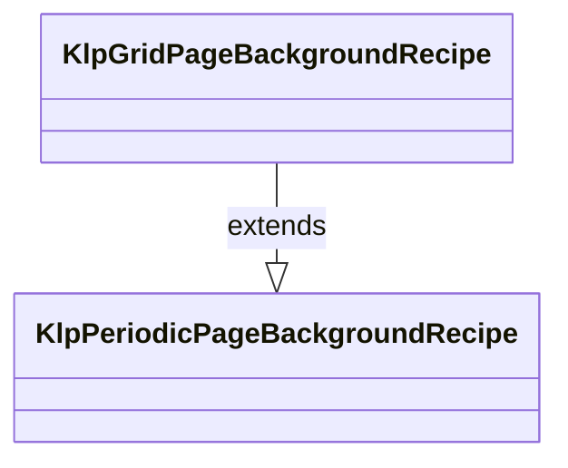

# klp_page_background_recipe_periodic.dart：直接依賴與宣告架構

[回到目錄](README.md) · [來源檔案](../../../../../../../lib/src/foundation/surface/page_background/internal/klp_page_background_recipe_periodic.dart)

## 範圍

核心是 `lib/src/foundation/surface/page_background/internal/klp_page_background_recipe_periodic.dart`。主要視角為該檔案明寫的 import／export／part；輔助視角為本檔宣告及 extends／implements／with／on 關係。只展開一層外部邊界。

## 直接依賴圖

## 依賴證據

| 關係 | 原始 directive | 來源 |
|---|---|---|
| part of | <code>part of &#x27;../klp_page_background_recipe.dart&#x27;;</code> | [lib/src/foundation/surface/page_background/internal/klp_page_background_recipe_periodic.dart:1](../../../../../../../lib/src/foundation/surface/page_background/internal/klp_page_background_recipe_periodic.dart#L1) |

## 宣告關係圖

本組節點是本檔宣告；沒有箭頭的宣告未在此圖主張互相依賴。

## 宣告與成員證據

成員包含 public 與 private；簽章取自來源，省略函式本體與欄位初始值。`(inferred)` 表示來源未明寫型別；建構子只顯示參數部分，不含初始化列表。

### KlpPageBackgroundRecipe

ClassDeclaration · public · [lib/src/foundation/surface/page_background/internal/klp_page_background_recipe_periodic.dart:3](../../../../../../../lib/src/foundation/surface/page_background/internal/klp_page_background_recipe_periodic.dart#L3)

<code>sealed class KlpPageBackgroundRecipe</code>

來源註解摘要：頁面背景的不可變視覺 recipe。

| 成員 | 可見性 | 簽章／型別 | 來源註解摘要 | 證據 |
|---|---|---|---|---|
| constructor <code>KlpPageBackgroundRecipe</code> | public | <code>const KlpPageBackgroundRecipe()</code> |  | [lib/src/foundation/surface/page_background/internal/klp_page_background_recipe_periodic.dart:6](../../../../../../../lib/src/foundation/surface/page_background/internal/klp_page_background_recipe_periodic.dart#L6) |

### KlpPlainPageBackgroundRecipe

ClassDeclaration · public · [lib/src/foundation/surface/page_background/internal/klp_page_background_recipe_periodic.dart:9](../../../../../../../lib/src/foundation/surface/page_background/internal/klp_page_background_recipe_periodic.dart#L9)

<code>final class KlpPlainPageBackgroundRecipe extends KlpPageBackgroundRecipe</code>

來源註解摘要：只呈現目前 theme 頁面表面的背景。

- `extends` → <code>KlpPageBackgroundRecipe</code>：[lib/src/foundation/surface/page_background/internal/klp_page_background_recipe_periodic.dart:10](../../../../../../../lib/src/foundation/surface/page_background/internal/klp_page_background_recipe_periodic.dart#L10)

| 成員 | 可見性 | 簽章／型別 | 來源註解摘要 | 證據 |
|---|---|---|---|---|
| constructor <code>KlpPlainPageBackgroundRecipe</code> | public | <code>const KlpPlainPageBackgroundRecipe()</code> |  | [lib/src/foundation/surface/page_background/internal/klp_page_background_recipe_periodic.dart:11](../../../../../../../lib/src/foundation/surface/page_background/internal/klp_page_background_recipe_periodic.dart#L11) |
| method <code>==</code> | public | <code>bool operator ==(Object other)</code> |  | [lib/src/foundation/surface/page_background/internal/klp_page_background_recipe_periodic.dart:13](../../../../../../../lib/src/foundation/surface/page_background/internal/klp_page_background_recipe_periodic.dart#L13) |
| getter <code>hashCode</code> | public | <code>int get hashCode</code> |  | [lib/src/foundation/surface/page_background/internal/klp_page_background_recipe_periodic.dart:16](../../../../../../../lib/src/foundation/surface/page_background/internal/klp_page_background_recipe_periodic.dart#L16) |

### KlpRuledPageBackgroundRecipe

ClassDeclaration · public · [lib/src/foundation/surface/page_background/internal/klp_page_background_recipe_periodic.dart:20](../../../../../../../lib/src/foundation/surface/page_background/internal/klp_page_background_recipe_periodic.dart#L20)

<code>final class KlpRuledPageBackgroundRecipe extends KlpPageBackgroundRecipe</code>

來源註解摘要：等距橫線背景，不決定內容行高或文件排版。

- `extends` → <code>KlpPageBackgroundRecipe</code>：[lib/src/foundation/surface/page_background/internal/klp_page_background_recipe_periodic.dart:21](../../../../../../../lib/src/foundation/surface/page_background/internal/klp_page_background_recipe_periodic.dart#L21)

| 成員 | 可見性 | 簽章／型別 | 來源註解摘要 | 證據 |
|---|---|---|---|---|
| constructor <code>KlpRuledPageBackgroundRecipe</code> | public | <code>KlpRuledPageBackgroundRecipe({ KlpPageBackgroundAxisStyle? axis, this.spacing, this.strokeBehavior = KlpPageBackgroundStrokeBehavior.fixed, })</code> |  | [lib/src/foundation/surface/page_background/internal/klp_page_background_recipe_periodic.dart:22](../../../../../../../lib/src/foundation/surface/page_background/internal/klp_page_background_recipe_periodic.dart#L22) |
| field <code>axis</code> | public | <code>final KlpPageBackgroundAxisStyle axis</code> |  | [lib/src/foundation/surface/page_background/internal/klp_page_background_recipe_periodic.dart:33](../../../../../../../lib/src/foundation/surface/page_background/internal/klp_page_background_recipe_periodic.dart#L33) |
| field <code>spacing</code> | public | <code>final double? spacing</code> |  | [lib/src/foundation/surface/page_background/internal/klp_page_background_recipe_periodic.dart:34](../../../../../../../lib/src/foundation/surface/page_background/internal/klp_page_background_recipe_periodic.dart#L34) |
| field <code>strokeBehavior</code> | public | <code>final KlpPageBackgroundStrokeBehavior strokeBehavior</code> |  | [lib/src/foundation/surface/page_background/internal/klp_page_background_recipe_periodic.dart:35](../../../../../../../lib/src/foundation/surface/page_background/internal/klp_page_background_recipe_periodic.dart#L35) |
| method <code>copyWith</code> | public | <code>KlpRuledPageBackgroundRecipe copyWith({ KlpPageBackgroundAxisStyle? axis, double? spacing, KlpPageBackgroundStrokeBehavior? strokeBehavior, })</code> |  | [lib/src/foundation/surface/page_background/internal/klp_page_background_recipe_periodic.dart:37](../../../../../../../lib/src/foundation/surface/page_background/internal/klp_page_background_recipe_periodic.dart#L37) |
| method <code>==</code> | public | <code>bool operator ==(Object other)</code> |  | [lib/src/foundation/surface/page_background/internal/klp_page_background_recipe_periodic.dart:49](../../../../../../../lib/src/foundation/surface/page_background/internal/klp_page_background_recipe_periodic.dart#L49) |
| getter <code>hashCode</code> | public | <code>int get hashCode</code> |  | [lib/src/foundation/surface/page_background/internal/klp_page_background_recipe_periodic.dart:57](../../../../../../../lib/src/foundation/surface/page_background/internal/klp_page_background_recipe_periodic.dart#L57) |

### KlpPeriodicPageBackgroundRecipe

ClassDeclaration · public · [lib/src/foundation/surface/page_background/internal/klp_page_background_recipe_periodic.dart:61](../../../../../../../lib/src/foundation/surface/page_background/internal/klp_page_background_recipe_periodic.dart#L61)

<code>sealed class KlpPeriodicPageBackgroundRecipe extends KlpPageBackgroundRecipe</code>

來源註解摘要：具有主軸與次軸週期的背景共用契約。

- `extends` → <code>KlpPageBackgroundRecipe</code>：[lib/src/foundation/surface/page_background/internal/klp_page_background_recipe_periodic.dart:62](../../../../../../../lib/src/foundation/surface/page_background/internal/klp_page_background_recipe_periodic.dart#L62)

| 成員 | 可見性 | 簽章／型別 | 來源註解摘要 | 證據 |
|---|---|---|---|---|
| constructor <code>KlpPeriodicPageBackgroundRecipe</code> | public | <code>KlpPeriodicPageBackgroundRecipe({ KlpPageBackgroundAxisStyle? minorAxis, KlpPageBackgroundAxisStyle? majorAxis, this.majorSpacing, this.minorAxisCount = 0, this.strokeBehavior = KlpPageBackgroundStrokeBehavior.fixed, })</code> |  | [lib/src/foundation/surface/page_background/internal/klp_page_background_recipe_periodic.dart:63](../../../../../../../lib/src/foundation/surface/page_background/internal/klp_page_background_recipe_periodic.dart#L63) |
| field <code>minorAxis</code> | public | <code>final KlpPageBackgroundAxisStyle minorAxis</code> |  | [lib/src/foundation/surface/page_background/internal/klp_page_background_recipe_periodic.dart:84](../../../../../../../lib/src/foundation/surface/page_background/internal/klp_page_background_recipe_periodic.dart#L84) |
| field <code>majorAxis</code> | public | <code>final KlpPageBackgroundAxisStyle majorAxis</code> |  | [lib/src/foundation/surface/page_background/internal/klp_page_background_recipe_periodic.dart:85](../../../../../../../lib/src/foundation/surface/page_background/internal/klp_page_background_recipe_periodic.dart#L85) |
| field <code>majorSpacing</code> | public | <code>final double? majorSpacing</code> |  | [lib/src/foundation/surface/page_background/internal/klp_page_background_recipe_periodic.dart:86](../../../../../../../lib/src/foundation/surface/page_background/internal/klp_page_background_recipe_periodic.dart#L86) |
| field <code>minorAxisCount</code> | public | <code>final int minorAxisCount</code> |  | [lib/src/foundation/surface/page_background/internal/klp_page_background_recipe_periodic.dart:87](../../../../../../../lib/src/foundation/surface/page_background/internal/klp_page_background_recipe_periodic.dart#L87) |
| field <code>strokeBehavior</code> | public | <code>final KlpPageBackgroundStrokeBehavior strokeBehavior</code> |  | [lib/src/foundation/surface/page_background/internal/klp_page_background_recipe_periodic.dart:88](../../../../../../../lib/src/foundation/surface/page_background/internal/klp_page_background_recipe_periodic.dart#L88) |
| getter <code>minorSpacing</code> | public | <code>double? get minorSpacing</code> |  | [lib/src/foundation/surface/page_background/internal/klp_page_background_recipe_periodic.dart:90](../../../../../../../lib/src/foundation/surface/page_background/internal/klp_page_background_recipe_periodic.dart#L90) |
| method <code>equalsPeriodic</code> | public | <code>bool equalsPeriodic(KlpPeriodicPageBackgroundRecipe other)</code> |  | [lib/src/foundation/surface/page_background/internal/klp_page_background_recipe_periodic.dart:95](../../../../../../../lib/src/foundation/surface/page_background/internal/klp_page_background_recipe_periodic.dart#L95) |
| getter <code>periodicHashCode</code> | public | <code>int get periodicHashCode</code> |  | [lib/src/foundation/surface/page_background/internal/klp_page_background_recipe_periodic.dart:103](../../../../../../../lib/src/foundation/surface/page_background/internal/klp_page_background_recipe_periodic.dart#L103) |

### KlpDotsPageBackgroundRecipe

ClassDeclaration · public · [lib/src/foundation/surface/page_background/internal/klp_page_background_recipe_periodic.dart:112](../../../../../../../lib/src/foundation/surface/page_background/internal/klp_page_background_recipe_periodic.dart#L112)

<code>final class KlpDotsPageBackgroundRecipe extends KlpPeriodicPageBackgroundRecipe</code>

來源註解摘要：以點徑呈現主次週期的背景。

- `extends` → <code>KlpPeriodicPageBackgroundRecipe</code>：[lib/src/foundation/surface/page_background/internal/klp_page_background_recipe_periodic.dart:114](../../../../../../../lib/src/foundation/surface/page_background/internal/klp_page_background_recipe_periodic.dart#L114)

| 成員 | 可見性 | 簽章／型別 | 來源註解摘要 | 證據 |
|---|---|---|---|---|
| constructor <code>KlpDotsPageBackgroundRecipe</code> | public | <code>KlpDotsPageBackgroundRecipe({ super.minorAxis, super.majorAxis, super.majorSpacing, super.minorAxisCount, super.strokeBehavior, })</code> |  | [lib/src/foundation/surface/page_background/internal/klp_page_background_recipe_periodic.dart:115](../../../../../../../lib/src/foundation/surface/page_background/internal/klp_page_background_recipe_periodic.dart#L115) |
| method <code>copyWith</code> | public | <code>KlpDotsPageBackgroundRecipe copyWith({ KlpPageBackgroundAxisStyle? minorAxis, KlpPageBackgroundAxisStyle? majorAxis, double? majorSpacing, int? minorAxisCount, KlpPageBackgroundStrokeBehavior? strokeBehavior, })</code> |  | [lib/src/foundation/surface/page_background/internal/klp_page_background_recipe_periodic.dart:123](../../../../../../../lib/src/foundation/surface/page_background/internal/klp_page_background_recipe_periodic.dart#L123) |
| method <code>==</code> | public | <code>bool operator ==(Object other)</code> |  | [lib/src/foundation/surface/page_background/internal/klp_page_background_recipe_periodic.dart:139](../../../../../../../lib/src/foundation/surface/page_background/internal/klp_page_background_recipe_periodic.dart#L139) |
| getter <code>hashCode</code> | public | <code>int get hashCode</code> |  | [lib/src/foundation/surface/page_background/internal/klp_page_background_recipe_periodic.dart:142](../../../../../../../lib/src/foundation/surface/page_background/internal/klp_page_background_recipe_periodic.dart#L142) |

### KlpGridPageBackgroundRecipe

ClassDeclaration · public · [lib/src/foundation/surface/page_background/internal/klp_page_background_recipe_periodic.dart:146](../../../../../../../lib/src/foundation/surface/page_background/internal/klp_page_background_recipe_periodic.dart#L146)

<code>final class KlpGridPageBackgroundRecipe extends KlpPeriodicPageBackgroundRecipe</code>

來源註解摘要：以水平與垂直線呈現主次週期的背景。

- `extends` → <code>KlpPeriodicPageBackgroundRecipe</code>：[lib/src/foundation/surface/page_background/internal/klp_page_background_recipe_periodic.dart:148](../../../../../../../lib/src/foundation/surface/page_background/internal/klp_page_background_recipe_periodic.dart#L148)

| 成員 | 可見性 | 簽章／型別 | 來源註解摘要 | 證據 |
|---|---|---|---|---|
| constructor <code>KlpGridPageBackgroundRecipe</code> | public | <code>KlpGridPageBackgroundRecipe({ super.minorAxis, super.majorAxis, super.majorSpacing, super.minorAxisCount, super.strokeBehavior, })</code> |  | [lib/src/foundation/surface/page_background/internal/klp_page_background_recipe_periodic.dart:149](../../../../../../../lib/src/foundation/surface/page_background/internal/klp_page_background_recipe_periodic.dart#L149) |
| method <code>copyWith</code> | public | <code>KlpGridPageBackgroundRecipe copyWith({ KlpPageBackgroundAxisStyle? minorAxis, KlpPageBackgroundAxisStyle? majorAxis, double? majorSpacing, int? minorAxisCount, KlpPageBackgroundStrokeBehavior? strokeBehavior, })</code> |  | [lib/src/foundation/surface/page_background/internal/klp_page_background_recipe_periodic.dart:157](../../../../../../../lib/src/foundation/surface/page_background/internal/klp_page_background_recipe_periodic.dart#L157) |
| method <code>==</code> | public | <code>bool operator ==(Object other)</code> |  | [lib/src/foundation/surface/page_background/internal/klp_page_background_recipe_periodic.dart:173](../../../../../../../lib/src/foundation/surface/page_background/internal/klp_page_background_recipe_periodic.dart#L173) |
| getter <code>hashCode</code> | public | <code>int get hashCode</code> |  | [lib/src/foundation/surface/page_background/internal/klp_page_background_recipe_periodic.dart:176](../../../../../../../lib/src/foundation/surface/page_background/internal/klp_page_background_recipe_periodic.dart#L176) |

## 閱讀說明與限制

箭頭只表示來源明寫的靜態關係；import 不等於呼叫。未分析動態呼叫、欄位的實際物件擁有權、狀態轉移或渲染流程；型別未進行語意解析，繼承目標保留原始型別拼寫。public／private 依 Dart 名稱前綴判斷；public 宣告不代表已由 `lib/kallopis.dart` 匯出。

本頁由 `tool/architecture_atlas` 產生；編輯來源或生成工具後重新產生，避免手改本頁。
