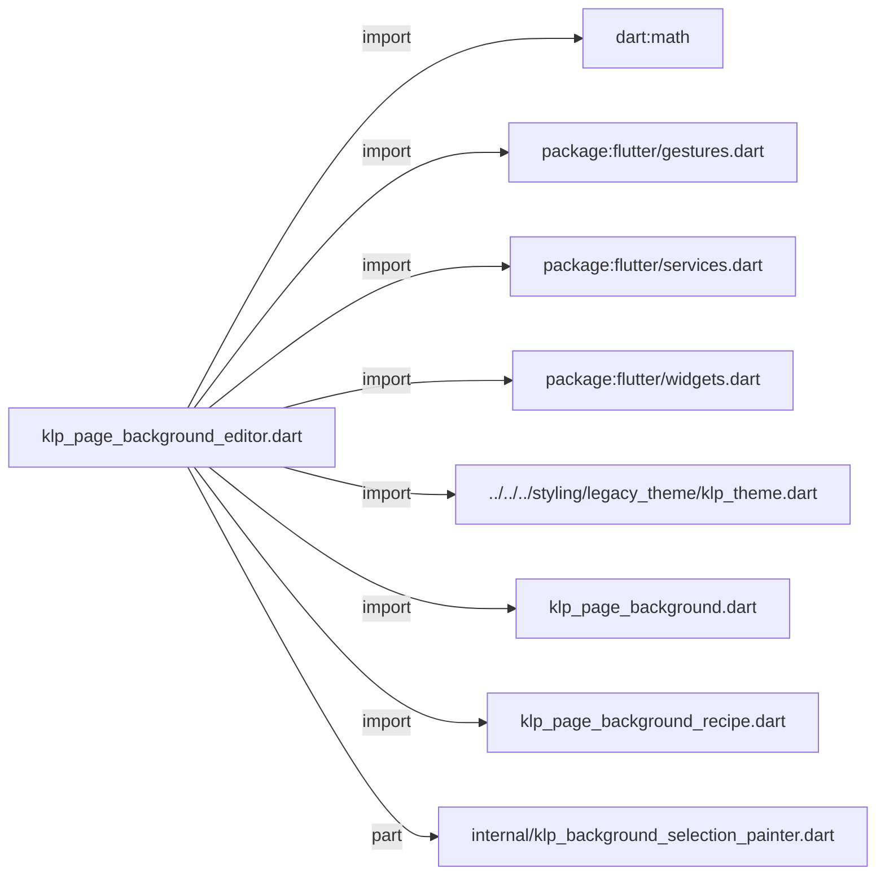
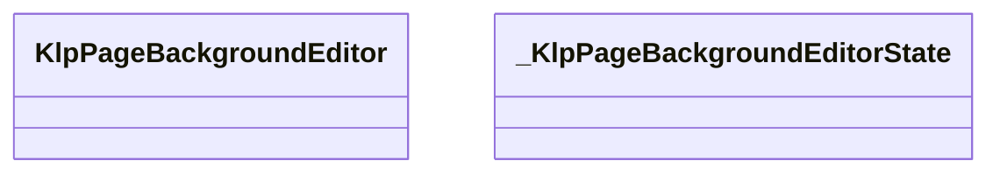
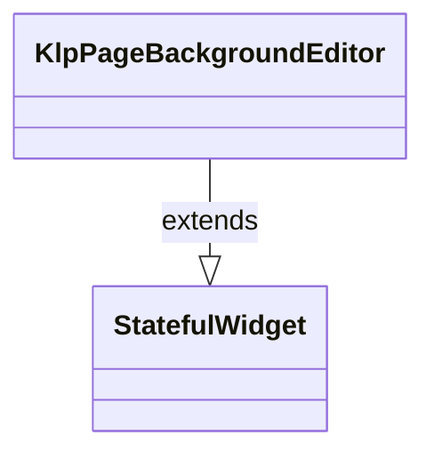
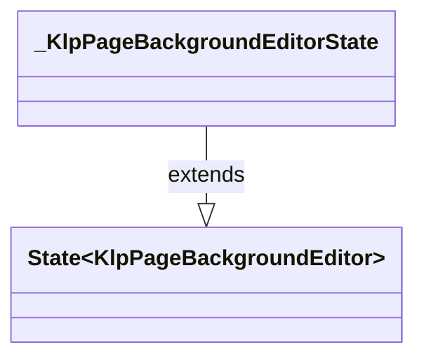

# klp_page_background_editor.dart：直接依賴與宣告架構

[回到目錄](README.md) · [來源檔案](../../../../../../lib/src/foundation/surface/page_background/klp_page_background_editor.dart)

## 範圍

核心是 `lib/src/foundation/surface/page_background/klp_page_background_editor.dart`。主要視角為該檔案明寫的 import／export／part；輔助視角為本檔宣告及 extends／implements／with／on 關係。只展開一層外部邊界。

## 直接依賴圖

## 依賴證據

| 關係 | 原始 directive | 來源 |
|---|---|---|
| import | <code>import &#x27;dart:math&#x27; as math;</code> | [lib/src/foundation/surface/page_background/klp_page_background_editor.dart:1](../../../../../../lib/src/foundation/surface/page_background/klp_page_background_editor.dart#L1) |
| import | <code>import &#x27;package:flutter/gestures.dart&#x27;;</code> | [lib/src/foundation/surface/page_background/klp_page_background_editor.dart:3](../../../../../../lib/src/foundation/surface/page_background/klp_page_background_editor.dart#L3) |
| import | <code>import &#x27;package:flutter/services.dart&#x27;;</code> | [lib/src/foundation/surface/page_background/klp_page_background_editor.dart:4](../../../../../../lib/src/foundation/surface/page_background/klp_page_background_editor.dart#L4) |
| import | <code>import &#x27;package:flutter/widgets.dart&#x27;;</code> | [lib/src/foundation/surface/page_background/klp_page_background_editor.dart:5](../../../../../../lib/src/foundation/surface/page_background/klp_page_background_editor.dart#L5) |
| import | <code>import &#x27;../../../styling/legacy_theme/klp_theme.dart&#x27;;</code> | [lib/src/foundation/surface/page_background/klp_page_background_editor.dart:7](../../../../../../lib/src/foundation/surface/page_background/klp_page_background_editor.dart#L7) |
| import | <code>import &#x27;klp_page_background.dart&#x27;;</code> | [lib/src/foundation/surface/page_background/klp_page_background_editor.dart:8](../../../../../../lib/src/foundation/surface/page_background/klp_page_background_editor.dart#L8) |
| import | <code>import &#x27;klp_page_background_recipe.dart&#x27;;</code> | [lib/src/foundation/surface/page_background/klp_page_background_editor.dart:9](../../../../../../lib/src/foundation/surface/page_background/klp_page_background_editor.dart#L9) |
| part | <code>part &#x27;internal/klp_background_selection_painter.dart&#x27;;</code> | [lib/src/foundation/surface/page_background/klp_page_background_editor.dart:11](../../../../../../lib/src/foundation/surface/page_background/klp_page_background_editor.dart#L11) |

## 宣告關係圖

本組節點是本檔宣告；沒有箭頭的宣告未在此圖主張互相依賴。

## 宣告與成員證據

成員包含 public 與 private；簽章取自來源，省略函式本體與欄位初始值。`(inferred)` 表示來源未明寫型別；建構子只顯示參數部分，不含初始化列表。

### KlpPageBackgroundEditor

ClassDeclaration · public · [lib/src/foundation/surface/page_background/klp_page_background_editor.dart:13](../../../../../../lib/src/foundation/surface/page_background/klp_page_background_editor.dart#L13)

<code>class KlpPageBackgroundEditor extends StatefulWidget</code>

來源註解摘要：編輯受限 point／line 背景 recipe 的受控視覺元件。

- `extends` → <code>StatefulWidget</code>：[lib/src/foundation/surface/page_background/klp_page_background_editor.dart:14](../../../../../../lib/src/foundation/surface/page_background/klp_page_background_editor.dart#L14)

| 成員 | 可見性 | 簽章／型別 | 來源註解摘要 | 證據 |
|---|---|---|---|---|
| constructor <code>KlpPageBackgroundEditor</code> | public | <code>const KlpPageBackgroundEditor({ super.key, required this.recipe, required this.tool, required this.onChanged, this.viewport, this.onSelectionChanged, this.child, })</code> |  | [lib/src/foundation/surface/page_background/klp_page_background_editor.dart:15](../../../../../../lib/src/foundation/surface/page_background/klp_page_background_editor.dart#L15) |
| field <code>recipe</code> | public | <code>final KlpCustomPageBackgroundRecipe recipe</code> |  | [lib/src/foundation/surface/page_background/klp_page_background_editor.dart:25](../../../../../../lib/src/foundation/surface/page_background/klp_page_background_editor.dart#L25) |
| field <code>tool</code> | public | <code>final KlpPageBackgroundEditorTool tool</code> |  | [lib/src/foundation/surface/page_background/klp_page_background_editor.dart:26](../../../../../../lib/src/foundation/surface/page_background/klp_page_background_editor.dart#L26) |
| field <code>onChanged</code> | public | <code>final ValueChanged&lt;KlpCustomPageBackgroundRecipe&gt; onChanged</code> |  | [lib/src/foundation/surface/page_background/klp_page_background_editor.dart:27](../../../../../../lib/src/foundation/surface/page_background/klp_page_background_editor.dart#L27) |
| field <code>viewport</code> | public | <code>final KlpPageBackgroundViewport? viewport</code> |  | [lib/src/foundation/surface/page_background/klp_page_background_editor.dart:28](../../../../../../lib/src/foundation/surface/page_background/klp_page_background_editor.dart#L28) |
| field <code>onSelectionChanged</code> | public | <code>final ValueChanged&lt;KlpPageBackgroundSelection?&gt;? onSelectionChanged</code> |  | [lib/src/foundation/surface/page_background/klp_page_background_editor.dart:29](../../../../../../lib/src/foundation/surface/page_background/klp_page_background_editor.dart#L29) |
| field <code>child</code> | public | <code>final Widget? child</code> |  | [lib/src/foundation/surface/page_background/klp_page_background_editor.dart:30](../../../../../../lib/src/foundation/surface/page_background/klp_page_background_editor.dart#L30) |
| method <code>createState</code> | public | <code>State&lt;KlpPageBackgroundEditor&gt; createState()</code> |  | [lib/src/foundation/surface/page_background/klp_page_background_editor.dart:32](../../../../../../lib/src/foundation/surface/page_background/klp_page_background_editor.dart#L32) |

### _KlpPageBackgroundEditorState

ClassDeclaration · private · [lib/src/foundation/surface/page_background/klp_page_background_editor.dart:36](../../../../../../lib/src/foundation/surface/page_background/klp_page_background_editor.dart#L36)

<code>class _KlpPageBackgroundEditorState extends State&lt;KlpPageBackgroundEditor&gt;</code>

- `extends` → <code>State&lt;KlpPageBackgroundEditor&gt;</code>：[lib/src/foundation/surface/page_background/klp_page_background_editor.dart:36](../../../../../../lib/src/foundation/surface/page_background/klp_page_background_editor.dart#L36)

| 成員 | 可見性 | 簽章／型別 | 來源註解摘要 | 證據 |
|---|---|---|---|---|
| field <code>_chainPointId</code> | private | <code>int? _chainPointId</code> |  | [lib/src/foundation/surface/page_background/klp_page_background_editor.dart:37](../../../../../../lib/src/foundation/surface/page_background/klp_page_background_editor.dart#L37) |
| field <code>_selection</code> | private | <code>KlpPageBackgroundSelection? _selection</code> |  | [lib/src/foundation/surface/page_background/klp_page_background_editor.dart:38](../../../../../../lib/src/foundation/surface/page_background/klp_page_background_editor.dart#L38) |
| getter <code>_viewport</code> | private | <code>KlpPageBackgroundViewport get _viewport</code> |  | [lib/src/foundation/surface/page_background/klp_page_background_editor.dart:40](../../../../../../lib/src/foundation/surface/page_background/klp_page_background_editor.dart#L40) |
| method <code>didUpdateWidget</code> | public | <code>void didUpdateWidget(covariant KlpPageBackgroundEditor oldWidget)</code> |  | [lib/src/foundation/surface/page_background/klp_page_background_editor.dart:42](../../../../../../lib/src/foundation/surface/page_background/klp_page_background_editor.dart#L42) |
| method <code>build</code> | public | <code>Widget build(BuildContext context)</code> |  | [lib/src/foundation/surface/page_background/klp_page_background_editor.dart:57](../../../../../../lib/src/foundation/surface/page_background/klp_page_background_editor.dart#L57) |
| method <code>_handleKeyEvent</code> | private | <code>KeyEventResult _handleKeyEvent(FocusNode node, KeyEvent event)</code> |  | [lib/src/foundation/surface/page_background/klp_page_background_editor.dart:87](../../../../../../lib/src/foundation/surface/page_background/klp_page_background_editor.dart#L87) |
| method <code>_handlePointerDown</code> | private | <code>void _handlePointerDown(PointerDownEvent event)</code> |  | [lib/src/foundation/surface/page_background/klp_page_background_editor.dart:95](../../../../../../lib/src/foundation/surface/page_background/klp_page_background_editor.dart#L95) |
| method <code>_connect</code> | private | <code>void _connect(Offset pagePosition, KlpPageBackgroundSelection? hit)</code> |  | [lib/src/foundation/surface/page_background/klp_page_background_editor.dart:110](../../../../../../lib/src/foundation/surface/page_background/klp_page_background_editor.dart#L110) |
| method <code>_snap</code> | private | <code>Offset _snap(Offset position)</code> |  | [lib/src/foundation/surface/page_background/klp_page_background_editor.dart:136](../../../../../../lib/src/foundation/surface/page_background/klp_page_background_editor.dart#L136) |
| method <code>_delete</code> | private | <code>void _delete(KlpPageBackgroundSelection? hit)</code> |  | [lib/src/foundation/surface/page_background/klp_page_background_editor.dart:141](../../../../../../lib/src/foundation/surface/page_background/klp_page_background_editor.dart#L141) |
| method <code>_hitTest</code> | private | <code>KlpPageBackgroundSelection? _hitTest(Offset position)</code> |  | [lib/src/foundation/surface/page_background/klp_page_background_editor.dart:151](../../../../../../lib/src/foundation/surface/page_background/klp_page_background_editor.dart#L151) |
| method <code>_setSelection</code> | private | <code>void _setSelection(KlpPageBackgroundSelection? selection)</code> |  | [lib/src/foundation/surface/page_background/klp_page_background_editor.dart:170](../../../../../../lib/src/foundation/surface/page_background/klp_page_background_editor.dart#L170) |

## 閱讀說明與限制

箭頭只表示來源明寫的靜態關係；import 不等於呼叫。未分析動態呼叫、欄位的實際物件擁有權、狀態轉移或渲染流程；型別未進行語意解析，繼承目標保留原始型別拼寫。public／private 依 Dart 名稱前綴判斷；public 宣告不代表已由 `lib/kallopis.dart` 匯出。

本頁由 `tool/architecture_atlas` 產生；編輯來源或生成工具後重新產生，避免手改本頁。
