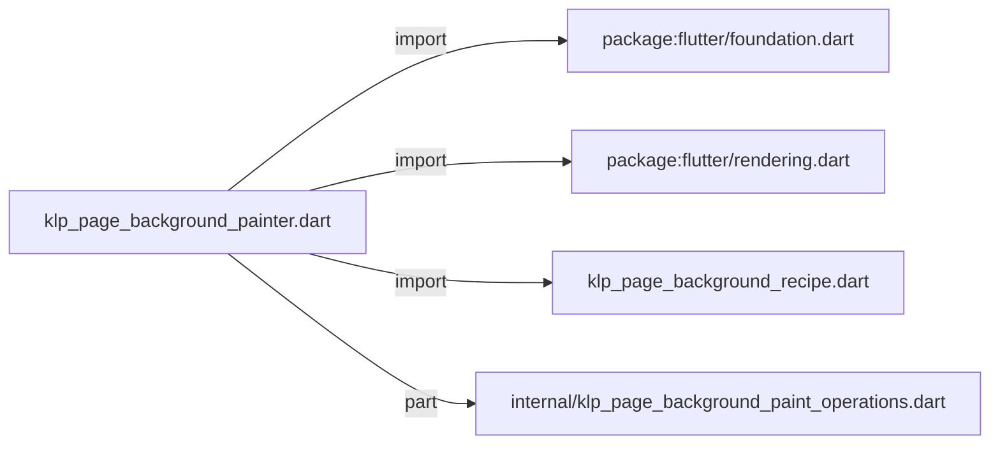
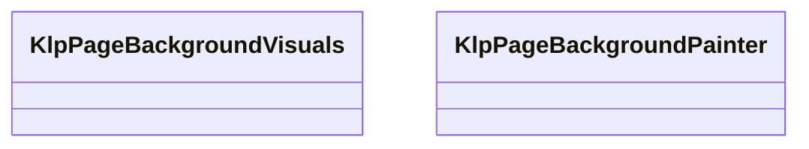
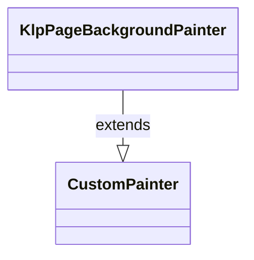

# klp_page_background_painter.dart：直接依賴與宣告架構

[回到目錄](README.md) · [來源檔案](../../../../../../lib/src/foundation/surface/page_background/klp_page_background_painter.dart)

## 範圍

核心是 `lib/src/foundation/surface/page_background/klp_page_background_painter.dart`。主要視角為該檔案明寫的 import／export／part；輔助視角為本檔宣告及 extends／implements／with／on 關係。只展開一層外部邊界。

## 直接依賴圖

## 依賴證據

| 關係 | 原始 directive | 來源 |
|---|---|---|
| import | <code>import &#x27;package:flutter/foundation.dart&#x27;;</code> | [lib/src/foundation/surface/page_background/klp_page_background_painter.dart:1](../../../../../../lib/src/foundation/surface/page_background/klp_page_background_painter.dart#L1) |
| import | <code>import &#x27;package:flutter/rendering.dart&#x27;;</code> | [lib/src/foundation/surface/page_background/klp_page_background_painter.dart:2](../../../../../../lib/src/foundation/surface/page_background/klp_page_background_painter.dart#L2) |
| import | <code>import &#x27;klp_page_background_recipe.dart&#x27;;</code> | [lib/src/foundation/surface/page_background/klp_page_background_painter.dart:4](../../../../../../lib/src/foundation/surface/page_background/klp_page_background_painter.dart#L4) |
| part | <code>part &#x27;internal/klp_page_background_paint_operations.dart&#x27;;</code> | [lib/src/foundation/surface/page_background/klp_page_background_painter.dart:6](../../../../../../lib/src/foundation/surface/page_background/klp_page_background_painter.dart#L6) |

## 宣告關係圖

本組節點是本檔宣告；沒有箭頭的宣告未在此圖主張互相依賴。

## 宣告與成員證據

成員包含 public 與 private；簽章取自來源，省略函式本體與欄位初始值。`(inferred)` 表示來源未明寫型別；建構子只顯示參數部分，不含初始化列表。

### KlpPageBackgroundVisuals

ClassDeclaration · public · [lib/src/foundation/surface/page_background/klp_page_background_painter.dart:8](../../../../../../lib/src/foundation/surface/page_background/klp_page_background_painter.dart#L8)

<code>class KlpPageBackgroundVisuals</code>

來源註解摘要：Renderer 已解析的 semantic 預設值。

| 成員 | 可見性 | 簽章／型別 | 來源註解摘要 | 證據 |
|---|---|---|---|---|
| constructor <code>KlpPageBackgroundVisuals</code> | public | <code>const KlpPageBackgroundVisuals({ required this.surface, required this.pattern, required this.spacing, required this.markWidth, required this.dotWidth, })</code> |  | [lib/src/foundation/surface/page_background/klp_page_background_painter.dart:11](../../../../../../lib/src/foundation/surface/page_background/klp_page_background_painter.dart#L11) |
| field <code>surface</code> | public | <code>final Color surface</code> |  | [lib/src/foundation/surface/page_background/klp_page_background_painter.dart:19](../../../../../../lib/src/foundation/surface/page_background/klp_page_background_painter.dart#L19) |
| field <code>pattern</code> | public | <code>final Color pattern</code> |  | [lib/src/foundation/surface/page_background/klp_page_background_painter.dart:20](../../../../../../lib/src/foundation/surface/page_background/klp_page_background_painter.dart#L20) |
| field <code>spacing</code> | public | <code>final double spacing</code> |  | [lib/src/foundation/surface/page_background/klp_page_background_painter.dart:21](../../../../../../lib/src/foundation/surface/page_background/klp_page_background_painter.dart#L21) |
| field <code>markWidth</code> | public | <code>final double markWidth</code> |  | [lib/src/foundation/surface/page_background/klp_page_background_painter.dart:22](../../../../../../lib/src/foundation/surface/page_background/klp_page_background_painter.dart#L22) |
| field <code>dotWidth</code> | public | <code>final double dotWidth</code> |  | [lib/src/foundation/surface/page_background/klp_page_background_painter.dart:23](../../../../../../lib/src/foundation/surface/page_background/klp_page_background_painter.dart#L23) |
| method <code>==</code> | public | <code>bool operator ==(Object other)</code> |  | [lib/src/foundation/surface/page_background/klp_page_background_painter.dart:25](../../../../../../lib/src/foundation/surface/page_background/klp_page_background_painter.dart#L25) |
| getter <code>hashCode</code> | public | <code>int get hashCode</code> |  | [lib/src/foundation/surface/page_background/klp_page_background_painter.dart:35](../../../../../../lib/src/foundation/surface/page_background/klp_page_background_painter.dart#L35) |

### KlpPageBackgroundPainter

ClassDeclaration · public · [lib/src/foundation/surface/page_background/klp_page_background_painter.dart:39](../../../../../../lib/src/foundation/surface/page_background/klp_page_background_painter.dart#L39)

<code>class KlpPageBackgroundPainter extends CustomPainter</code>

來源註解摘要：所有頁面背景 recipe 共用的 renderer。

- `extends` → <code>CustomPainter</code>：[lib/src/foundation/surface/page_background/klp_page_background_painter.dart:40](../../../../../../lib/src/foundation/surface/page_background/klp_page_background_painter.dart#L40)

| 成員 | 可見性 | 簽章／型別 | 來源註解摘要 | 證據 |
|---|---|---|---|---|
| constructor <code>KlpPageBackgroundPainter</code> | public | <code>const KlpPageBackgroundPainter({ required this.recipe, required this.viewport, required this.visuals, })</code> |  | [lib/src/foundation/surface/page_background/klp_page_background_painter.dart:41](../../../../../../lib/src/foundation/surface/page_background/klp_page_background_painter.dart#L41) |
| field <code>recipe</code> | public | <code>final KlpPageBackgroundRecipe recipe</code> |  | [lib/src/foundation/surface/page_background/klp_page_background_painter.dart:47](../../../../../../lib/src/foundation/surface/page_background/klp_page_background_painter.dart#L47) |
| field <code>viewport</code> | public | <code>final KlpPageBackgroundViewport viewport</code> |  | [lib/src/foundation/surface/page_background/klp_page_background_painter.dart:48](../../../../../../lib/src/foundation/surface/page_background/klp_page_background_painter.dart#L48) |
| field <code>visuals</code> | public | <code>final KlpPageBackgroundVisuals visuals</code> |  | [lib/src/foundation/surface/page_background/klp_page_background_painter.dart:49](../../../../../../lib/src/foundation/surface/page_background/klp_page_background_painter.dart#L49) |
| method <code>paint</code> | public | <code>void paint(Canvas canvas, Size size)</code> |  | [lib/src/foundation/surface/page_background/klp_page_background_painter.dart:51](../../../../../../lib/src/foundation/surface/page_background/klp_page_background_painter.dart#L51) |
| method <code>resolveMarkWidth</code> | public | <code>double resolveMarkWidth( KlpPageBackgroundAxisStyle axis, KlpPageBackgroundStrokeBehavior behavior, { double? defaultWidth, })</code> |  | [lib/src/foundation/surface/page_background/klp_page_background_painter.dart:70](../../../../../../lib/src/foundation/surface/page_background/klp_page_background_painter.dart#L70) |
| method <code>_toViewportCoordinate</code> | private | <code>double _toViewportCoordinate(double coordinate, double origin)</code> |  | [lib/src/foundation/surface/page_background/klp_page_background_painter.dart:80](../../../../../../lib/src/foundation/surface/page_background/klp_page_background_painter.dart#L80) |
| method <code>shouldRepaint</code> | public | <code>bool shouldRepaint(covariant KlpPageBackgroundPainter oldDelegate)</code> |  | [lib/src/foundation/surface/page_background/klp_page_background_painter.dart:82](../../../../../../lib/src/foundation/surface/page_background/klp_page_background_painter.dart#L82) |

## 閱讀說明與限制

箭頭只表示來源明寫的靜態關係；import 不等於呼叫。未分析動態呼叫、欄位的實際物件擁有權、狀態轉移或渲染流程；型別未進行語意解析，繼承目標保留原始型別拼寫。public／private 依 Dart 名稱前綴判斷；public 宣告不代表已由 `lib/kallopis.dart` 匯出。

本頁由 `tool/architecture_atlas` 產生；編輯來源或生成工具後重新產生，避免手改本頁。
