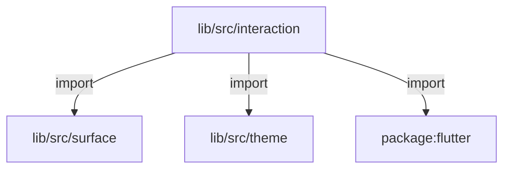
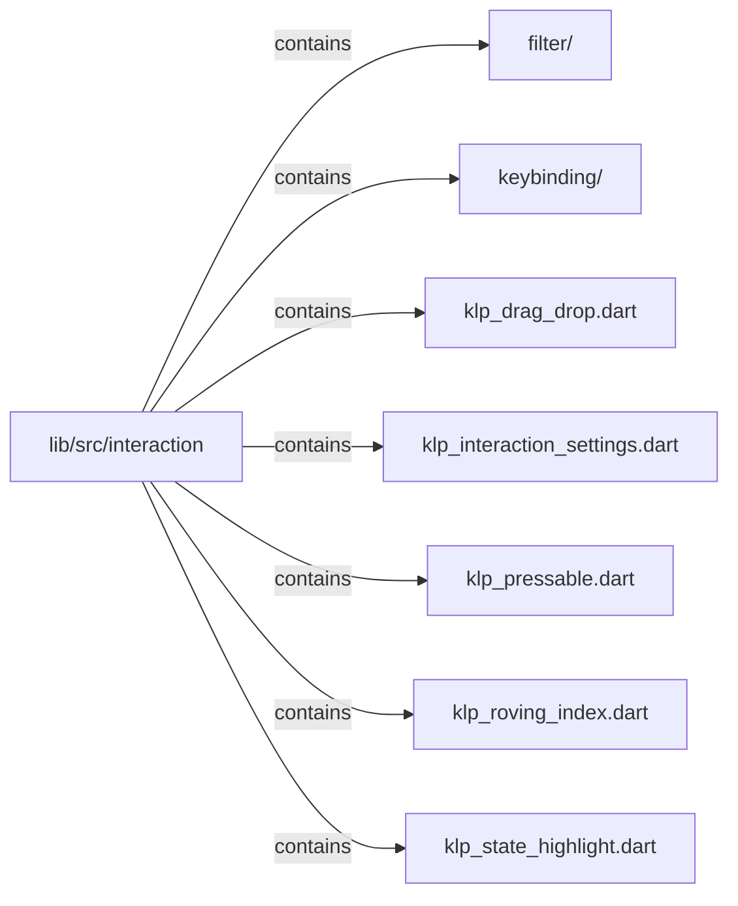

# lib/src/interaction：架構分析入口

[上一層](../README.md)

## 範圍

閱讀 `lib/src/interaction` 的直接子目錄與 Dart 檔案。結構圖表示實際檔案包含關係；依賴圖表示本層檔案明寫的 directives。每個檔案頁另列直接依賴、宣告、欄位、方法、建構子及行號證據。

## 模組閱讀重點

## 分析入口

`interaction/` 包含按壓與長按、狀態高亮、roving index，以及拖放提示與篩選／選取工具列。KlpPressable 負責 hover、focus、selected 視覺與輸入處理，KlpRovingIndex 則提供不依賴 widget 的索引運算。此目錄無巢狀子目錄；filter bar 的組裝職責高於單純互動原語。

| 想查的問題 | 符號與來源 |
| --- | --- |
| 按壓和高亮入口？ | KlpPressable — `lib/src/interaction/klp_pressable.dart:8` |
| 長按門檻如何覆寫？ | KlpInteractionSettings.thresholdOf — `lib/src/interaction/klp_interaction_settings.dart:21` |
| 選項索引怎麼移動？ | KlpRovingIndex.move — `lib/src/interaction/klp_roving_index.dart:17` |
| 篩選與批次選取 UI？ | KlpFilterBar／KlpSelectionToolbar — `lib/src/interaction/klp_filter_bar.dart:29`、`lib/src/interaction/klp_filter_bar.dart:213` |

重要關係：

- `KlpPressable` → `context.klpLongPressThreshold`：didChangeDependencies 更新動畫控制器門檻（`lib/src/interaction/klp_pressable.dart:64`）；settings 優先使用區域覆寫，否則取 theme（`lib/src/interaction/klp_interaction_settings.dart:21`）。
- `KlpPressable.build` → `Listener`／`InkWell`：分別處理 pointer 與 tap／hover／focus，背景 wash 取自 theme（`lib/src/interaction/klp_pressable.dart:142`、`lib/src/interaction/klp_pressable.dart:152`）。
- `interaction ↔ controls` 為目錄層級雙向依賴：filter bar 引入 button，button 引入 pressable（`lib/src/interaction/klp_filter_bar.dart:3`、`lib/src/controls/klp_button.dart:6`）。

import 僅顯示靜態依賴；輸入事件的先後必須另看 callback 實作。

## 本層直接依賴圖

箭頭以本層 Dart 檔案明寫的 directive 彙總到目標所在目錄或外部套件邊界；不遞迴將子目錄依賴算入本層。相同目標的不同 directive 類型分開計數。

| 目標邊界 | 關係 | directive 數 | 第一筆來源證據 |
|---|---|---|---|
| <code>lib/src/surface</code> | import | 2 | [lib/src/interaction/klp_drag_drop.dart:4](../../../../lib/src/interaction/klp_drag_drop.dart#L4) |
| <code>lib/src/theme</code> | import | 5 | [lib/src/interaction/klp_drag_drop.dart:3](../../../../lib/src/interaction/klp_drag_drop.dart#L3) |
| <code>package:flutter</code> | import | 4 | [lib/src/interaction/klp_drag_drop.dart:1](../../../../lib/src/interaction/klp_drag_drop.dart#L1) |

### 同目錄依賴

| 來源 → 目標 | 關係 | 證據 |
|---|---|---|
| <code>klp_pressable.dart → klp_interaction_settings.dart</code> | import | [lib/src/interaction/klp_pressable.dart:3](../../../../lib/src/interaction/klp_pressable.dart#L3) |

## 目錄結構圖

## 子目錄

| 目錄 | 導航 | 來源證據 |
|---|---|---|
| `filter/` | [架構入口](filter/README.md) | [來源目錄](../../../../lib/src/interaction/filter) |
| `keybinding/` | [架構入口](keybinding/README.md) | [來源目錄](../../../../lib/src/interaction/keybinding) |

## 本層檔案

| 檔案 | 宣告 | 細節 | 來源證據 |
|---|---|---|---|
| `klp_drag_drop.dart` | KlpDropTarget, KlpDragPreview, KlpDropIndicator | [架構與 API](klp_drag_drop.md) | [lib/src/interaction/klp_drag_drop.dart:1](../../../../lib/src/interaction/klp_drag_drop.dart#L1) |
| `klp_interaction_settings.dart` | KlpInteractionSettings, KlpInteractionSettingsContext | [架構與 API](klp_interaction_settings.md) | [lib/src/interaction/klp_interaction_settings.dart:1](../../../../lib/src/interaction/klp_interaction_settings.dart#L1) |
| `klp_pressable.dart` | KlpPressable, _KlpPressableState | [架構與 API](klp_pressable.md) | [lib/src/interaction/klp_pressable.dart:1](../../../../lib/src/interaction/klp_pressable.dart#L1) |
| `klp_roving_index.dart` | KlpRovingIndex | [架構與 API](klp_roving_index.md) | [lib/src/interaction/klp_roving_index.dart:1](../../../../lib/src/interaction/klp_roving_index.dart#L1) |
| `klp_state_highlight.dart` | KlpHighlightState, KlpStateHighlight | [架構與 API](klp_state_highlight.md) | [lib/src/interaction/klp_state_highlight.dart:1](../../../../lib/src/interaction/klp_state_highlight.dart#L1) |

## 閱讀說明

箭頭只表示來源明寫的靜態關係；import 不等於呼叫。未分析動態呼叫、欄位的實際物件擁有權、狀態轉移或渲染流程；型別未進行語意解析，繼承目標保留原始型別拼寫。public／private 依 Dart 名稱前綴判斷；public 宣告不代表已由 `lib/kallopis.dart` 匯出。

本頁的目錄與檔案由來源清冊產生；`manifest.json` 位於本圖集根目錄，可核對 SHA-256 與覆蓋數。人工模組摘要存於 `tool/architecture_atlas/briefs/`，重新生成時保留。
