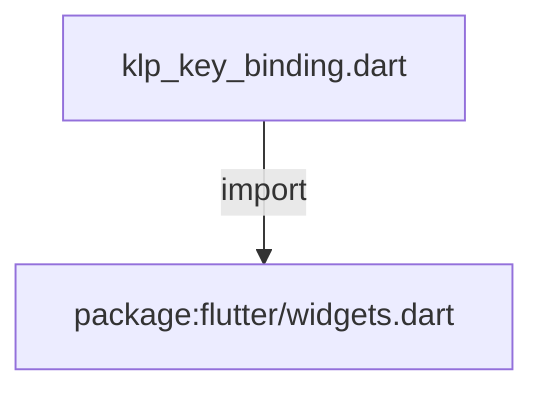
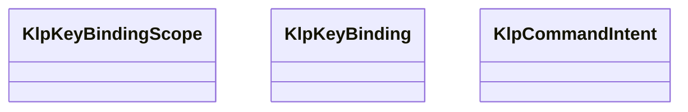
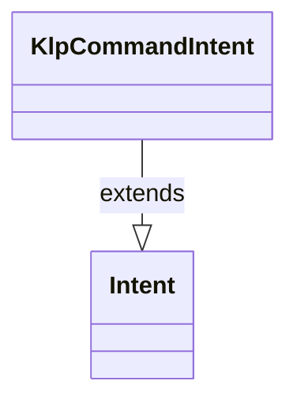

# klp_key_binding.dart：直接依賴與宣告架構

[回到目錄](README.md) · [來源檔案](../../../../../lib/src/interaction/keybinding/klp_key_binding.dart)

## 範圍

核心是 `lib/src/interaction/keybinding/klp_key_binding.dart`。主要視角為該檔案明寫的 import／export／part；輔助視角為本檔宣告及 extends／implements／with／on 關係。只展開一層外部邊界。

## 直接依賴圖

## 依賴證據

| 關係 | 原始 directive | 來源 |
|---|---|---|
| import | <code>import &#x27;package:flutter/widgets.dart&#x27;;</code> | [lib/src/interaction/keybinding/klp_key_binding.dart:1](../../../../../lib/src/interaction/keybinding/klp_key_binding.dart#L1) |

## 宣告關係圖

本組節點是本檔宣告；沒有箭頭的宣告未在此圖主張互相依賴。

## 宣告與成員證據

成員包含 public 與 private；簽章取自來源，省略函式本體與欄位初始值。`(inferred)` 表示來源未明寫型別；建構子只顯示參數部分，不含初始化列表。

### KlpKeyBindingScope

EnumDeclaration · public · [lib/src/interaction/keybinding/klp_key_binding.dart:3](../../../../../lib/src/interaction/keybinding/klp_key_binding.dart#L3)

<code>enum KlpKeyBindingScope</code>

來源註解摘要：快捷鍵解析的責任層級。數值越小，解析優先權越高。

| 成員 | 可見性 | 簽章／型別 | 來源註解摘要 | 證據 |
|---|---|---|---|---|
| enum value <code>component</code> | public | <code>component</code> |  | [lib/src/interaction/keybinding/klp_key_binding.dart:4](../../../../../lib/src/interaction/keybinding/klp_key_binding.dart#L4) |
| enum value <code>region</code> | public | <code>region</code> |  | [lib/src/interaction/keybinding/klp_key_binding.dart:4](../../../../../lib/src/interaction/keybinding/klp_key_binding.dart#L4) |
| enum value <code>page</code> | public | <code>page</code> |  | [lib/src/interaction/keybinding/klp_key_binding.dart:4](../../../../../lib/src/interaction/keybinding/klp_key_binding.dart#L4) |
| enum value <code>app</code> | public | <code>app</code> |  | [lib/src/interaction/keybinding/klp_key_binding.dart:4](../../../../../lib/src/interaction/keybinding/klp_key_binding.dart#L4) |

### KlpKeyBinding

ClassDeclaration · public · [lib/src/interaction/keybinding/klp_key_binding.dart:6](../../../../../lib/src/interaction/keybinding/klp_key_binding.dart#L6)

<code>class KlpKeyBinding</code>

來源註解摘要：一筆產品或元件快捷鍵宣告。

| 成員 | 可見性 | 簽章／型別 | 來源註解摘要 | 證據 |
|---|---|---|---|---|
| constructor <code>KlpKeyBinding</code> | public | <code>const KlpKeyBinding({ required this.commandId, required this.activator, required this.scope, this.scopeId, this.enabled = true, })</code> |  | [lib/src/interaction/keybinding/klp_key_binding.dart:8](../../../../../lib/src/interaction/keybinding/klp_key_binding.dart#L8) |
| field <code>commandId</code> | public | <code>final String commandId</code> |  | [lib/src/interaction/keybinding/klp_key_binding.dart:16](../../../../../lib/src/interaction/keybinding/klp_key_binding.dart#L16) |
| field <code>activator</code> | public | <code>final ShortcutActivator activator</code> |  | [lib/src/interaction/keybinding/klp_key_binding.dart:17](../../../../../lib/src/interaction/keybinding/klp_key_binding.dart#L17) |
| field <code>scope</code> | public | <code>final KlpKeyBindingScope scope</code> |  | [lib/src/interaction/keybinding/klp_key_binding.dart:18](../../../../../lib/src/interaction/keybinding/klp_key_binding.dart#L18) |
| field <code>scopeId</code> | public | <code>final String? scopeId</code> |  | [lib/src/interaction/keybinding/klp_key_binding.dart:19](../../../../../lib/src/interaction/keybinding/klp_key_binding.dart#L19) |
| field <code>enabled</code> | public | <code>final bool enabled</code> |  | [lib/src/interaction/keybinding/klp_key_binding.dart:20](../../../../../lib/src/interaction/keybinding/klp_key_binding.dart#L20) |

### KlpCommandIntent

ClassDeclaration · public · [lib/src/interaction/keybinding/klp_key_binding.dart:23](../../../../../lib/src/interaction/keybinding/klp_key_binding.dart#L23)

<code>class KlpCommandIntent extends Intent</code>

來源註解摘要：將解析後的命令傳給 Flutter `Actions` 系統。

- `extends` → <code>Intent</code>：[lib/src/interaction/keybinding/klp_key_binding.dart:24](../../../../../lib/src/interaction/keybinding/klp_key_binding.dart#L24)

| 成員 | 可見性 | 簽章／型別 | 來源註解摘要 | 證據 |
|---|---|---|---|---|
| constructor <code>KlpCommandIntent</code> | public | <code>const KlpCommandIntent(this.commandId)</code> |  | [lib/src/interaction/keybinding/klp_key_binding.dart:25](../../../../../lib/src/interaction/keybinding/klp_key_binding.dart#L25) |
| field <code>commandId</code> | public | <code>final String commandId</code> |  | [lib/src/interaction/keybinding/klp_key_binding.dart:27](../../../../../lib/src/interaction/keybinding/klp_key_binding.dart#L27) |

## 閱讀說明與限制

箭頭只表示來源明寫的靜態關係；import 不等於呼叫。未分析動態呼叫、欄位的實際物件擁有權、狀態轉移或渲染流程；型別未進行語意解析，繼承目標保留原始型別拼寫。public／private 依 Dart 名稱前綴判斷；public 宣告不代表已由 `lib/kallopis.dart` 匯出。

本頁由 `tool/architecture_atlas` 產生；編輯來源或生成工具後重新產生，避免手改本頁。
