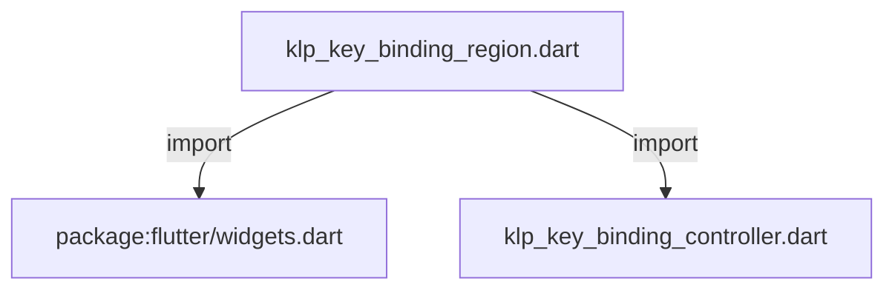
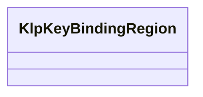
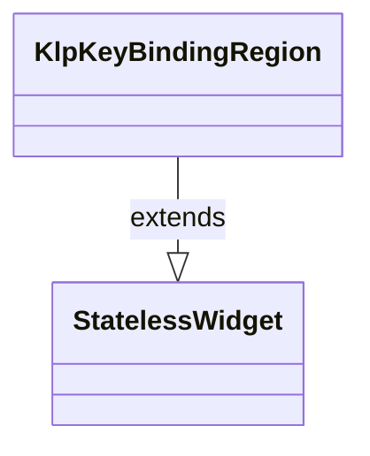

# klp_key_binding_region.dart：直接依賴與宣告架構

[回到目錄](README.md) · [來源檔案](../../../../../lib/src/interaction/keybinding/klp_key_binding_region.dart)

## 範圍

核心是 `lib/src/interaction/keybinding/klp_key_binding_region.dart`。主要視角為該檔案明寫的 import／export／part；輔助視角為本檔宣告及 extends／implements／with／on 關係。只展開一層外部邊界。

## 直接依賴圖

## 依賴證據

| 關係 | 原始 directive | 來源 |
|---|---|---|
| import | <code>import &#x27;package:flutter/widgets.dart&#x27;;</code> | [lib/src/interaction/keybinding/klp_key_binding_region.dart:1](../../../../../lib/src/interaction/keybinding/klp_key_binding_region.dart#L1) |
| import | <code>import &#x27;klp_key_binding_controller.dart&#x27;;</code> | [lib/src/interaction/keybinding/klp_key_binding_region.dart:3](../../../../../lib/src/interaction/keybinding/klp_key_binding_region.dart#L3) |

## 宣告關係圖

本組節點是本檔宣告；沒有箭頭的宣告未在此圖主張互相依賴。

## 宣告與成員證據

成員包含 public 與 private；簽章取自來源，省略函式本體與欄位初始值。`(inferred)` 表示來源未明寫型別；建構子只顯示參數部分，不含初始化列表。

### KlpKeyBindingRegion

ClassDeclaration · public · [lib/src/interaction/keybinding/klp_key_binding_region.dart:5](../../../../../lib/src/interaction/keybinding/klp_key_binding_region.dart#L5)

<code>class KlpKeyBindingRegion extends StatelessWidget</code>

來源註解摘要：宣告一個可成為快捷鍵 active scope 的畫面區域。

- `extends` → <code>StatelessWidget</code>：[lib/src/interaction/keybinding/klp_key_binding_region.dart:6](../../../../../lib/src/interaction/keybinding/klp_key_binding_region.dart#L6)

| 成員 | 可見性 | 簽章／型別 | 來源註解摘要 | 證據 |
|---|---|---|---|---|
| constructor <code>KlpKeyBindingRegion</code> | public | <code>const KlpKeyBindingRegion({ super.key, required this.controller, required this.regionId, required this.child, this.pageId, this.focusNode, this.autofocus = false, })</code> |  | [lib/src/interaction/keybinding/klp_key_binding_region.dart:7](../../../../../lib/src/interaction/keybinding/klp_key_binding_region.dart#L7) |
| field <code>controller</code> | public | <code>final KlpKeyBindingController controller</code> |  | [lib/src/interaction/keybinding/klp_key_binding_region.dart:17](../../../../../lib/src/interaction/keybinding/klp_key_binding_region.dart#L17) |
| field <code>regionId</code> | public | <code>final String regionId</code> |  | [lib/src/interaction/keybinding/klp_key_binding_region.dart:18](../../../../../lib/src/interaction/keybinding/klp_key_binding_region.dart#L18) |
| field <code>pageId</code> | public | <code>final String? pageId</code> |  | [lib/src/interaction/keybinding/klp_key_binding_region.dart:19](../../../../../lib/src/interaction/keybinding/klp_key_binding_region.dart#L19) |
| field <code>child</code> | public | <code>final Widget child</code> |  | [lib/src/interaction/keybinding/klp_key_binding_region.dart:20](../../../../../lib/src/interaction/keybinding/klp_key_binding_region.dart#L20) |
| field <code>focusNode</code> | public | <code>final FocusNode? focusNode</code> |  | [lib/src/interaction/keybinding/klp_key_binding_region.dart:21](../../../../../lib/src/interaction/keybinding/klp_key_binding_region.dart#L21) |
| field <code>autofocus</code> | public | <code>final bool autofocus</code> |  | [lib/src/interaction/keybinding/klp_key_binding_region.dart:22](../../../../../lib/src/interaction/keybinding/klp_key_binding_region.dart#L22) |
| method <code>_activate</code> | private | <code>void _activate()</code> |  | [lib/src/interaction/keybinding/klp_key_binding_region.dart:24](../../../../../lib/src/interaction/keybinding/klp_key_binding_region.dart#L24) |
| method <code>build</code> | public | <code>Widget build(BuildContext context)</code> |  | [lib/src/interaction/keybinding/klp_key_binding_region.dart:26](../../../../../lib/src/interaction/keybinding/klp_key_binding_region.dart#L26) |

## 閱讀說明與限制

箭頭只表示來源明寫的靜態關係；import 不等於呼叫。未分析動態呼叫、欄位的實際物件擁有權、狀態轉移或渲染流程；型別未進行語意解析，繼承目標保留原始型別拼寫。public／private 依 Dart 名稱前綴判斷；public 宣告不代表已由 `lib/kallopis.dart` 匯出。

本頁由 `tool/architecture_atlas` 產生；編輯來源或生成工具後重新產生，避免手改本頁。
