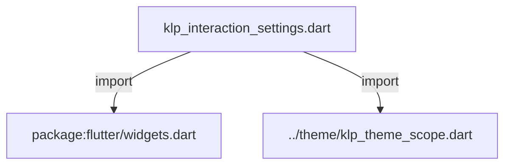
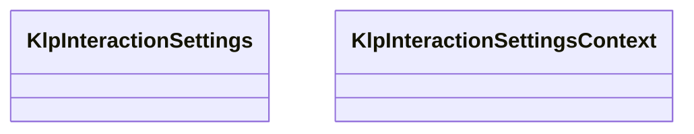
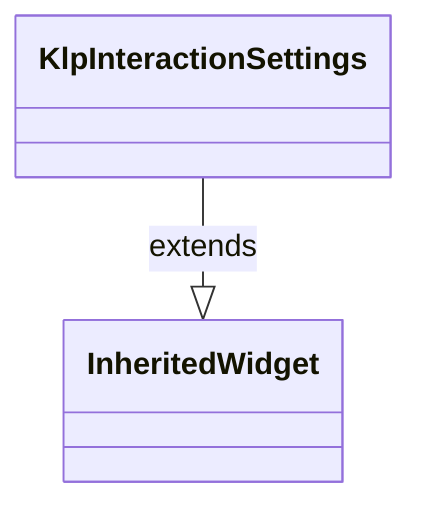
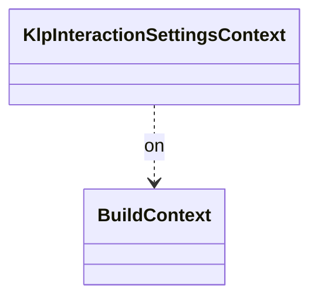

# klp_interaction_settings.dart：直接依賴與宣告架構

[回到目錄](README.md) · [來源檔案](../../../../lib/src/interaction/klp_interaction_settings.dart)

## 範圍

核心是 `lib/src/interaction/klp_interaction_settings.dart`。主要視角為該檔案明寫的 import／export／part；輔助視角為本檔宣告及 extends／implements／with／on 關係。只展開一層外部邊界。

## 直接依賴圖

## 依賴證據

| 關係 | 原始 directive | 來源 |
|---|---|---|
| import | <code>import &#x27;package:flutter/widgets.dart&#x27;;</code> | [lib/src/interaction/klp_interaction_settings.dart:1](../../../../lib/src/interaction/klp_interaction_settings.dart#L1) |
| import | <code>import &#x27;../theme/klp_theme_scope.dart&#x27;;</code> | [lib/src/interaction/klp_interaction_settings.dart:3](../../../../lib/src/interaction/klp_interaction_settings.dart#L3) |

## 宣告關係圖

本組節點是本檔宣告；沒有箭頭的宣告未在此圖主張互相依賴。

## 宣告與成員證據

成員包含 public 與 private；簽章取自來源，省略函式本體與欄位初始值。`(inferred)` 表示來源未明寫型別；建構子只顯示參數部分，不含初始化列表。

### KlpInteractionSettings

ClassDeclaration · public · [lib/src/interaction/klp_interaction_settings.dart:5](../../../../lib/src/interaction/klp_interaction_settings.dart#L5)

<code>class KlpInteractionSettings extends InheritedWidget</code>

來源註解摘要：長按門檻的區域覆寫。 門檻的**預設值來自 theme**（`KlpMotionTheme.longPressThreshold`），這個 InheritedWidget 只負責「某一小塊 UI 要用不一樣的門檻」。原本它自己持有一份 `defaultThreshold` 常數， 與 theme 構成同一條規則的兩份實作——兩份實作必然靜默分岔，改了 theme 卻沒改這裡時 不會有任何錯誤，只是門檻沒變。

- `extends` → <code>InheritedWidget</code>：[lib/src/interaction/klp_interaction_settings.dart:11](../../../../lib/src/interaction/klp_interaction_settings.dart#L11)

| 成員 | 可見性 | 簽章／型別 | 來源註解摘要 | 證據 |
|---|---|---|---|---|
| constructor <code>KlpInteractionSettings</code> | public | <code>const KlpInteractionSettings({ super.key, required super.child, this.longPressThreshold, })</code> |  | [lib/src/interaction/klp_interaction_settings.dart:12](../../../../lib/src/interaction/klp_interaction_settings.dart#L12) |
| field <code>longPressThreshold</code> | public | <code>final Duration? longPressThreshold</code> | `null` 表示沿用 theme 的值。 | [lib/src/interaction/klp_interaction_settings.dart:19](../../../../lib/src/interaction/klp_interaction_settings.dart#L19) |
| method <code>thresholdOf</code> | public | <code>static Duration thresholdOf(BuildContext context)</code> |  | [lib/src/interaction/klp_interaction_settings.dart:21](../../../../lib/src/interaction/klp_interaction_settings.dart#L21) |
| method <code>updateShouldNotify</code> | public | <code>bool updateShouldNotify(KlpInteractionSettings oldWidget)</code> |  | [lib/src/interaction/klp_interaction_settings.dart:28](../../../../lib/src/interaction/klp_interaction_settings.dart#L28) |

### KlpInteractionSettingsContext

ExtensionDeclaration · public · [lib/src/interaction/klp_interaction_settings.dart:34](../../../../lib/src/interaction/klp_interaction_settings.dart#L34)

<code>extension KlpInteractionSettingsContext on BuildContext</code>

- `on` → <code>BuildContext</code>：[lib/src/interaction/klp_interaction_settings.dart:34](../../../../lib/src/interaction/klp_interaction_settings.dart#L34)

| 成員 | 可見性 | 簽章／型別 | 來源註解摘要 | 證據 |
|---|---|---|---|---|
| getter <code>klpLongPressThreshold</code> | public | <code>Duration get klpLongPressThreshold</code> |  | [lib/src/interaction/klp_interaction_settings.dart:35](../../../../lib/src/interaction/klp_interaction_settings.dart#L35) |

## 閱讀說明與限制

箭頭只表示來源明寫的靜態關係；import 不等於呼叫。未分析動態呼叫、欄位的實際物件擁有權、狀態轉移或渲染流程；型別未進行語意解析，繼承目標保留原始型別拼寫。public／private 依 Dart 名稱前綴判斷；public 宣告不代表已由 `lib/kallopis.dart` 匯出。

本頁由 `tool/architecture_atlas` 產生；編輯來源或生成工具後重新產生，避免手改本頁。
