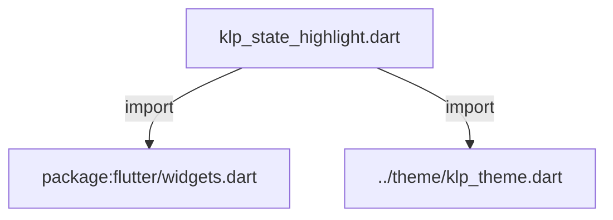
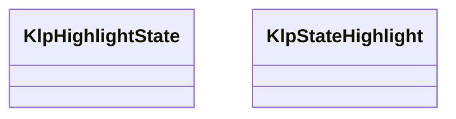
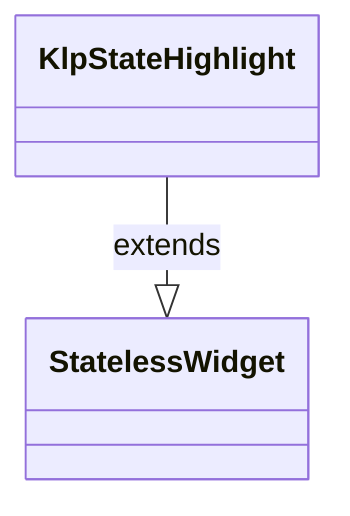

# klp_state_highlight.dart：直接依賴與宣告架構

[回到目錄](README.md) · [來源檔案](../../../../lib/src/interaction/klp_state_highlight.dart)

## 範圍

核心是 `lib/src/interaction/klp_state_highlight.dart`。主要視角為該檔案明寫的 import／export／part；輔助視角為本檔宣告及 extends／implements／with／on 關係。只展開一層外部邊界。

## 直接依賴圖

## 依賴證據

| 關係 | 原始 directive | 來源 |
|---|---|---|
| import | <code>import &#x27;package:flutter/widgets.dart&#x27;;</code> | [lib/src/interaction/klp_state_highlight.dart:1](../../../../lib/src/interaction/klp_state_highlight.dart#L1) |
| import | <code>import &#x27;../theme/klp_theme.dart&#x27;;</code> | [lib/src/interaction/klp_state_highlight.dart:3](../../../../lib/src/interaction/klp_state_highlight.dart#L3) |

## 宣告關係圖

本組節點是本檔宣告；沒有箭頭的宣告未在此圖主張互相依賴。

## 宣告與成員證據

成員包含 public 與 private；簽章取自來源，省略函式本體與欄位初始值。`(inferred)` 表示來源未明寫型別；建構子只顯示參數部分，不含初始化列表。

### KlpHighlightState

EnumDeclaration · public · [lib/src/interaction/klp_state_highlight.dart:5](../../../../lib/src/interaction/klp_state_highlight.dart#L5)

<code>enum KlpHighlightState</code>

來源註解摘要：元件的狀態強度。 這個庫只承認兩種互動狀態的視覺強度，元件不得自行發明第三種——同一個狀態在不同 元件長得不一樣，是這個庫先前最明顯的不一致來源。

| 成員 | 可見性 | 簽章／型別 | 來源註解摘要 | 證據 |
|---|---|---|---|---|
| enum value <code>none</code> | public | <code>none</code> | 沒有狀態，不畫任何東西。 | [lib/src/interaction/klp_state_highlight.dart:10](../../../../lib/src/interaction/klp_state_highlight.dart#L10) |
| enum value <code>hover</code> | public | <code>hover</code> | 指標懸停或鍵盤聚焦。中性的低強度高亮。 | [lib/src/interaction/klp_state_highlight.dart:13](../../../../lib/src/interaction/klp_state_highlight.dart#L13) |
| enum value <code>selected</code> | public | <code>selected</code> | 受控的選取狀態。跟隨 interaction 色，強度較高。 | [lib/src/interaction/klp_state_highlight.dart:16](../../../../lib/src/interaction/klp_state_highlight.dart#L16) |

### KlpStateHighlight

ClassDeclaration · public · [lib/src/interaction/klp_state_highlight.dart:20](../../../../lib/src/interaction/klp_state_highlight.dart#L20)

<code>class KlpStateHighlight extends StatelessWidget</code>

來源註解摘要：疊在內容上的狀態高亮。 **hover 與 selected 一律以高亮色表達，不畫邊框。** 先前這兩個狀態在庫裡有兩套 語彙——`KlpPressable` 用高亮、表單與 explorer 用虛線框——同一件事兩種畫法， 消費者無從預期。 高亮以 [Stack] 疊在內容之上而不是換掉內容的底色：後者會逼每個元件自己知道 「我原本的底色是什麼、混上去之後該是什麼」，而那正是元件不該知道的事。

- `extends` → <code>StatelessWidget</code>：[lib/src/interaction/klp_state_highlight.dart:28](../../../../lib/src/interaction/klp_state_highlight.dart#L28)

| 成員 | 可見性 | 簽章／型別 | 來源註解摘要 | 證據 |
|---|---|---|---|---|
| constructor <code>KlpStateHighlight</code> | public | <code>const KlpStateHighlight({ super.key, required this.state, required this.child, this.borderRadius, })</code> |  | [lib/src/interaction/klp_state_highlight.dart:29](../../../../lib/src/interaction/klp_state_highlight.dart#L29) |
| field <code>state</code> | public | <code>final KlpHighlightState state</code> |  | [lib/src/interaction/klp_state_highlight.dart:36](../../../../lib/src/interaction/klp_state_highlight.dart#L36) |
| field <code>borderRadius</code> | public | <code>final BorderRadius? borderRadius</code> | `null` 表示沿用 theme 的控制項圓角。 | [lib/src/interaction/klp_state_highlight.dart:39](../../../../lib/src/interaction/klp_state_highlight.dart#L39) |
| field <code>child</code> | public | <code>final Widget child</code> |  | [lib/src/interaction/klp_state_highlight.dart:41](../../../../lib/src/interaction/klp_state_highlight.dart#L41) |
| method <code>build</code> | public | <code>Widget build(BuildContext context)</code> |  | [lib/src/interaction/klp_state_highlight.dart:43](../../../../lib/src/interaction/klp_state_highlight.dart#L43) |

## 閱讀說明與限制

箭頭只表示來源明寫的靜態關係；import 不等於呼叫。未分析動態呼叫、欄位的實際物件擁有權、狀態轉移或渲染流程；型別未進行語意解析，繼承目標保留原始型別拼寫。public／private 依 Dart 名稱前綴判斷；public 宣告不代表已由 `lib/kallopis.dart` 匯出。

本頁由 `tool/architecture_atlas` 產生；編輯來源或生成工具後重新產生，避免手改本頁。
