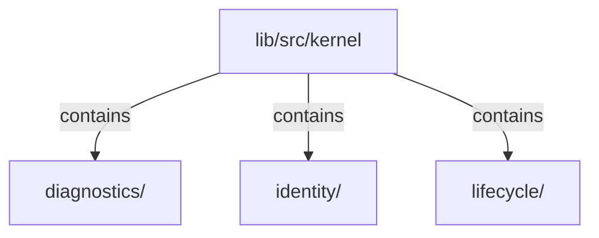

# lib/src/kernel：架構分析入口

[上一層](../README.md)

## 範圍

閱讀 `lib/src/kernel` 的直接子目錄與 Dart 檔案。結構圖表示實際檔案包含關係；依賴圖表示本層檔案明寫的 directives。每個檔案頁另列直接依賴、宣告、欄位、方法、建構子及行號證據。

## 模組閱讀重點

## 分析入口

`diagnostics/klp_contract_error.dart` 在結構或註冊違約時回報穩定 code 與 message。

`identity/internal/klp_identifier.dart` 是 slot 與 semantic 識別字彙共用的格式判斷，避免兩份正則規則分岔；各呼叫者仍保有其診斷代碼及語境。這不是放置識別的正規化或全域 identity 管理器。

`identity/klp_placement_id.dart` 不可變地保存 scope 各段與 local id，提供值比較與雜湊。它是結構快照、安裝資源與呈現 key 的共用識別；斜線、空白及 Unicode 不會因字串前綴編碼而碰撞。

`lifecycle/internal/klp_frame_lease.dart` 管理已提交畫面的操作資格；撤銷後舊 callback 不能再啟動功能。`klp_run_lifecycle_actions.dart` 逐一執行生命週期步驟，即使個別步驟失敗也繼續後續清理；單一錯誤保留原始原因與堆疊，多個錯誤由 `klp_lifecycle_exception.dart` 完整保存。

Frame lease 可派生受限子 lease，有效性同時受本地啟用條件與整條父鏈限制；祖先撤銷或隱藏後，子 scope 無法重新取得操作資格。它只管理操作採納，不宣稱停止既有外部非同步 I/O。

這些內部工具供 runtime 及應用宿主管理提交與清理，不是公開的 consumer lifecycle hook。結構化放置識別已落地，完整能力生命週期與平台恢復模型仍待實作，不要把計畫目錄當作現有能力。

## 本層直接依賴圖

箭頭以本層 Dart 檔案明寫的 directive 彙總到目標所在目錄或外部套件邊界；不遞迴將子目錄依賴算入本層。相同目標的不同 directive 類型分開計數。

本層檔案未宣告跨目錄依賴；子目錄依賴請循下一層入口閱讀。

| 目標邊界 | 關係 | directive 數 | 第一筆來源證據 |
|---|---|---|---|
| 無 | — | 0 | 來源清單見本層檔案 |

## 目錄結構圖

## 子目錄

| 目錄 | 導航 | 來源證據 |
|---|---|---|
| `diagnostics/` | [架構入口](diagnostics/README.md) | [來源目錄](../../../../lib/src/kernel/diagnostics) |
| `identity/` | [架構入口](identity/README.md) | [來源目錄](../../../../lib/src/kernel/identity) |
| `lifecycle/` | [架構入口](lifecycle/README.md) | [來源目錄](../../../../lib/src/kernel/lifecycle) |

## 本層檔案

| 檔案 | 宣告 | 細節 | 來源證據 |
|---|---|---|---|
| 無 | 本層沒有 Dart 檔案 | — | — |

## 閱讀說明

箭頭只表示來源明寫的靜態關係；import 不等於呼叫。未分析動態呼叫、欄位的實際物件擁有權、狀態轉移或渲染流程；型別未進行語意解析，繼承目標保留原始型別拼寫。public／private 依 Dart 名稱前綴判斷；public 宣告不代表已由 `lib/kallopis.dart` 匯出。

本頁的目錄與檔案由來源清冊產生；`manifest.json` 位於本圖集根目錄，可核對 SHA-256 與覆蓋數。人工模組摘要存於 `tool/architecture_atlas/briefs/`，重新生成時保留。
