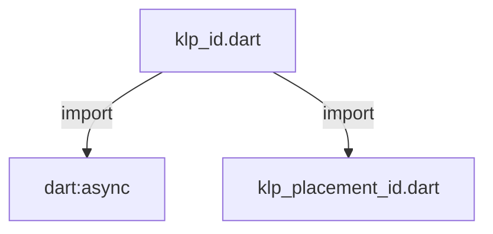
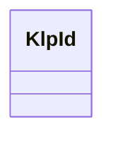

# klp_id.dart：直接依賴與宣告架構

[回到目錄](README.md) · [來源檔案](../../../../../lib/src/kernel/identity/klp_id.dart)

## 範圍

核心是 `lib/src/kernel/identity/klp_id.dart`。主要視角為該檔案明寫的 import／export／part；輔助視角為本檔宣告及 extends／implements／with／on 關係。只展開一層外部邊界。

## 直接依賴圖

## 依賴證據

| 關係 | 原始 directive | 來源 |
|---|---|---|
| import | <code>import &#x27;dart:async&#x27;;</code> | [lib/src/kernel/identity/klp_id.dart:1](../../../../../lib/src/kernel/identity/klp_id.dart#L1) |
| import | <code>import &#x27;klp_placement_id.dart&#x27;;</code> | [lib/src/kernel/identity/klp_id.dart:3](../../../../../lib/src/kernel/identity/klp_id.dart#L3) |

## 宣告關係圖

本組節點是本檔宣告；沒有箭頭的宣告未在此圖主張互相依賴。

## 宣告與成員證據

成員包含 public 與 private；簽章取自來源，省略函式本體與欄位初始值。`(inferred)` 表示來源未明寫型別；建構子只顯示參數部分，不含初始化列表。

### KlpId

ClassDeclaration · public · [lib/src/kernel/identity/klp_id.dart:5](../../../../../lib/src/kernel/identity/klp_id.dart#L5)

<code>final class KlpId</code>

來源註解摘要：規範化樹狀命名空間與型別安全識別碼。 內部維護樹狀節點與享元快取（Flyweight Pattern）： - 同一路徑節點在全域保證唯一實例，多處建立相同識別時自動查詢既有節點，避免重複配置。 - 嚴格禁止外部隨意使用純字串注入 ID，支援透過 `child()`、`of()`、`from()` 或 `/` 運算子建構。 - 提供完整樹狀導覽能力（`parent`、`children`、`root`、`ancestors`）。

| 成員 | 可見性 | 簽章／型別 | 來源註解摘要 | 證據 |
|---|---|---|---|---|
| field <code>name</code> | public | <code>final String name</code> | 當前節點段名稱。 | [lib/src/kernel/identity/klp_id.dart:13](../../../../../lib/src/kernel/identity/klp_id.dart#L13) |
| field <code>parent</code> | public | <code>final KlpId? parent</code> | 父節點引用（若為根節點則為 null）。 | [lib/src/kernel/identity/klp_id.dart:16](../../../../../lib/src/kernel/identity/klp_id.dart#L16) |
| field <code>_children</code> | private | <code>final Map&lt;String, KlpId&gt; _children</code> | 子節點快取樹：以子名稱為鍵，保證同路徑子實例唯一性。 | [lib/src/kernel/identity/klp_id.dart:19](../../../../../lib/src/kernel/identity/klp_id.dart#L19) |
| field <code>segments</code> | public | <code>late final List&lt;String&gt; segments</code> | 完整路徑清單（自根至當前節點）。 | [lib/src/kernel/identity/klp_id.dart:22](../../../../../lib/src/kernel/identity/klp_id.dart#L22) |
| field <code>value</code> | public | <code>late final String value</code> | 點分隔之完整限定字串（例如 `planist.workspace.sidebar`）。 | [lib/src/kernel/identity/klp_id.dart:27](../../../../../lib/src/kernel/identity/klp_id.dart#L27) |
| field <code>_roots</code> | private | <code>static final Map&lt;String, KlpId&gt; _roots</code> | 全域根節點快取表。 | [lib/src/kernel/identity/klp_id.dart:30](../../../../../lib/src/kernel/identity/klp_id.dart#L30) |
| getter <code>current</code> | public | <code>static KlpId? get current</code> | 讀取目前宣告期 Zone 注入的識別範圍；未進入 Scope 時回傳 null。 | [lib/src/kernel/identity/klp_id.dart:32](../../../../../lib/src/kernel/identity/klp_id.dart#L32) |
| method <code>leaf</code> | public | <code>static KlpId leaf(String name)</code> | 由目前宣告期 Scope 建立子節點；缺少 Scope 時建立根節點。 | [lib/src/kernel/identity/klp_id.dart:35](../../../../../lib/src/kernel/identity/klp_id.dart#L35) |
| constructor <code>_</code> | private | <code>KlpId._(this.name, [this.parent])</code> | 私有建構子：保證節點只能透過樹狀架構或工廠函式生成。 | [lib/src/kernel/identity/klp_id.dart:38](../../../../../lib/src/kernel/identity/klp_id.dart#L38) |
| constructor <code>root</code> | public | <code>factory KlpId.root(String namespace)</code> | 建立或自樹狀快取中取得根命名空間識別碼。 若該根節點已存在，直接回傳既有唯一實例。 | [lib/src/kernel/identity/klp_id.dart:50](../../../../../lib/src/kernel/identity/klp_id.dart#L50) |
| constructor <code>of</code> | public | <code>factory KlpId.of(KlpId parent, String leaf)</code> | 工廠函式：自指定父命名空間建立或取得子節點。 | [lib/src/kernel/identity/klp_id.dart:65](../../../../../lib/src/kernel/identity/klp_id.dart#L65) |
| constructor <code>from</code> | public | <code>factory KlpId.from(Iterable&lt;String&gt; segments)</code> | 工廠函式：自多個路徑段解析並取得樹狀節點（保證唯一實例）。 | [lib/src/kernel/identity/klp_id.dart:70](../../../../../lib/src/kernel/identity/klp_id.dart#L70) |
| constructor <code>parse</code> | public | <code>factory KlpId.parse(String path)</code> | 工廠函式：自點分隔字串解析並取得樹狀節點（例如 `planist.workspace.router`）。 | [lib/src/kernel/identity/klp_id.dart:88](../../../../../lib/src/kernel/identity/klp_id.dart#L88) |
| method <code>child</code> | public | <code>KlpId child(String leaf)</code> | 建立或自當前節點快取取得子節點（若已存在直接回傳既有物件）。 | [lib/src/kernel/identity/klp_id.dart:97](../../../../../lib/src/kernel/identity/klp_id.dart#L97) |
| method <code>/</code> | public | <code>KlpId operator /(String leaf)</code> | 支援以語意化 `/` 運算子串接子節點。 | [lib/src/kernel/identity/klp_id.dart:110](../../../../../lib/src/kernel/identity/klp_id.dart#L110) |
| getter <code>segment</code> | public | <code>String get segment</code> | 當前節點段名稱。 | [lib/src/kernel/identity/klp_id.dart:113](../../../../../lib/src/kernel/identity/klp_id.dart#L113) |
| getter <code>scope</code> | public | <code>List&lt;String&gt; get scope</code> | 所屬作用域路徑段（排除當前葉節點）。 | [lib/src/kernel/identity/klp_id.dart:116](../../../../../lib/src/kernel/identity/klp_id.dart#L116) |
| getter <code>rootNode</code> | public | <code>KlpId get rootNode</code> | 取得當前節點之最頂層根節點。 | [lib/src/kernel/identity/klp_id.dart:120](../../../../../lib/src/kernel/identity/klp_id.dart#L120) |
| getter <code>isRoot</code> | public | <code>bool get isRoot</code> | 是否為根節點。 | [lib/src/kernel/identity/klp_id.dart:123](../../../../../lib/src/kernel/identity/klp_id.dart#L123) |
| getter <code>directChildren</code> | public | <code>Iterable&lt;KlpId&gt; get directChildren</code> | 取得所有已實例化之直接子節點集合。 | [lib/src/kernel/identity/klp_id.dart:126](../../../../../lib/src/kernel/identity/klp_id.dart#L126) |
| getter <code>ancestors</code> | public | <code>List&lt;KlpId&gt; get ancestors</code> | 取得自根節點至當前節點之所有祖先節點清單（由近至遠）。 | [lib/src/kernel/identity/klp_id.dart:129](../../../../../lib/src/kernel/identity/klp_id.dart#L129) |
| method <code>toPlacementId</code> | public | <code>KlpPlacementId toPlacementId()</code> | 內部安全轉換為 Kallopis 放置識別碼。 | [lib/src/kernel/identity/klp_id.dart:140](../../../../../lib/src/kernel/identity/klp_id.dart#L140) |
| method <code>==</code> | public | <code>bool operator ==(Object other)</code> |  | [lib/src/kernel/identity/klp_id.dart:144](../../../../../lib/src/kernel/identity/klp_id.dart#L144) |
| getter <code>hashCode</code> | public | <code>int get hashCode</code> |  | [lib/src/kernel/identity/klp_id.dart:154](../../../../../lib/src/kernel/identity/klp_id.dart#L154) |
| method <code>toString</code> | public | <code>String toString()</code> |  | [lib/src/kernel/identity/klp_id.dart:157](../../../../../lib/src/kernel/identity/klp_id.dart#L157) |

## 閱讀說明與限制

箭頭只表示來源明寫的靜態關係；import 不等於呼叫。未分析動態呼叫、欄位的實際物件擁有權、狀態轉移或渲染流程；型別未進行語意解析，繼承目標保留原始型別拼寫。public／private 依 Dart 名稱前綴判斷；public 宣告不代表已由 `lib/kallopis.dart` 匯出。

本頁由 `tool/architecture_atlas` 產生；編輯來源或生成工具後重新產生，避免手改本頁。
