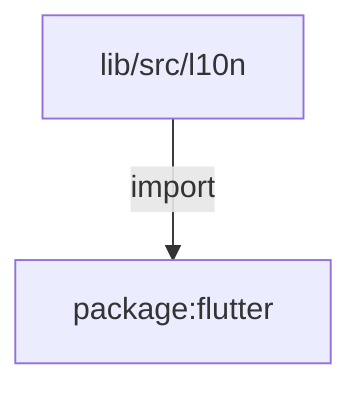
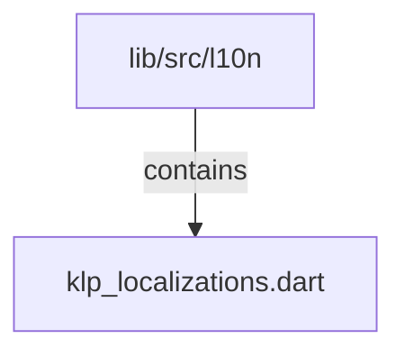

# lib/src/l10n：架構分析入口

[上一層](../README.md)

## 範圍

閱讀 `lib/src/l10n` 的直接子目錄與 Dart 檔案。結構圖表示實際檔案包含關係；依賴圖表示本層檔案明寫的 directives。每個檔案頁另列直接依賴、宣告、欄位、方法、建構子及行號證據。

## 模組閱讀重點

## 分析入口

`l10n/` 的 KlpLocalizations 是共用元件文案集合，KlpLocalizationsDelegate 則把一組 overrides 提供給 Flutter Localizations。現行 delegate 不依 locale 自動挑翻譯；load 直接同步回傳同一組 overrides。此目錄只有一個來源檔，沒有巢狀子目錄或 locale 翻譯資料夾。

| 想查的問題 | 符號與來源 |
| --- | --- |
| 文案欄位與預設值在哪？ | KlpLocalizations — `lib/src/l10n/klp_localizations.dart:36` |
| 缺少 Localizations 時怎麼辦？ | KlpLocalizations.of — `lib/src/l10n/klp_localizations.dart:171` |
| locale 是否影響載入？ | KlpLocalizationsDelegate.isSupported／load — `lib/src/l10n/klp_localizations.dart:263`、`lib/src/l10n/klp_localizations.dart:266` |
| App 如何註冊？ | _KlpAppState.build — `lib/src/app/klp_app.dart:288` |

重要關係：

- `KlpLocalizations.of` → Flutter `Localizations.of`：查不到時回退 const KlpLocalizations（`lib/src/l10n/klp_localizations.dart:172`）。
- `KlpLocalizationsDelegate.load` → `SynchronousFuture(overrides)`：沒有遠端載入或 locale 查表（`lib/src/l10n/klp_localizations.dart:266`）。
- `KlpApp` → `KlpLocalizationsDelegate`：將內建 delegate 和外部 delegates 放入 MaterialApp.localizationsDelegates（`lib/src/app/klp_app.dart:288`）；覆寫優先序仍須依 Flutter Localizations 行為核對，不能只用清單位置推導。

import 代表編譯期依賴，不代表文案載入順序。

## 本層直接依賴圖

箭頭以本層 Dart 檔案明寫的 directive 彙總到目標所在目錄或外部套件邊界；不遞迴將子目錄依賴算入本層。相同目標的不同 directive 類型分開計數。

| 目標邊界 | 關係 | directive 數 | 第一筆來源證據 |
|---|---|---|---|
| <code>package:flutter</code> | import | 2 | [lib/src/l10n/klp_localizations.dart:1](../../../../lib/src/l10n/klp_localizations.dart#L1) |

## 目錄結構圖

## 子目錄

| 目錄 | 導航 | 來源證據 |
|---|---|---|
| 無 | 目前沒有下一層目錄 | — |

## 本層檔案

| 檔案 | 宣告 | 細節 | 來源證據 |
|---|---|---|---|
| `klp_localizations.dart` | _defaultSavedLabel, KlpLocalizations, KlpLocalizationsDelegate | [架構與 API](klp_localizations.md) | [lib/src/l10n/klp_localizations.dart:1](../../../../lib/src/l10n/klp_localizations.dart#L1) |

## 閱讀說明

箭頭只表示來源明寫的靜態關係；import 不等於呼叫。未分析動態呼叫、欄位的實際物件擁有權、狀態轉移或渲染流程；型別未進行語意解析，繼承目標保留原始型別拼寫。public／private 依 Dart 名稱前綴判斷；public 宣告不代表已由 `lib/kallopis.dart` 匯出。

本頁的目錄與檔案由來源清冊產生；`manifest.json` 位於本圖集根目錄，可核對 SHA-256 與覆蓋數。人工模組摘要存於 `tool/architecture_atlas/briefs/`，重新生成時保留。
