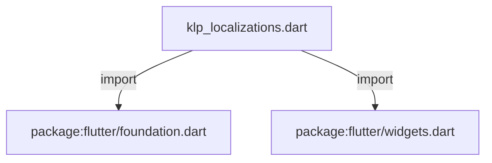
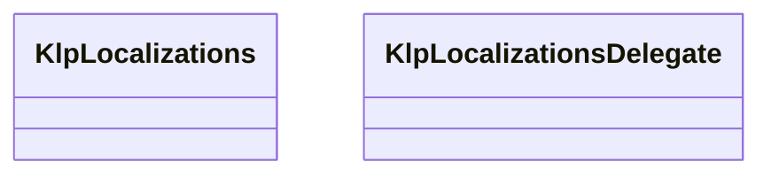
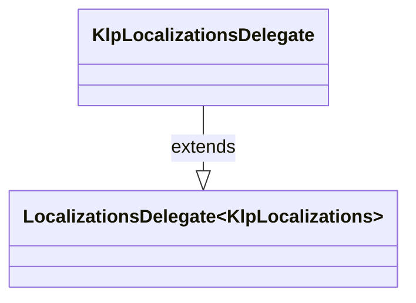

# klp_localizations.dart：直接依賴與宣告架構

[回到目錄](README.md) · [來源檔案](../../../../lib/src/l10n/klp_localizations.dart)

## 範圍

核心是 `lib/src/l10n/klp_localizations.dart`。主要視角為該檔案明寫的 import／export／part；輔助視角為本檔宣告及 extends／implements／with／on 關係。只展開一層外部邊界。

## 直接依賴圖



## 依賴證據

| 關係 | 原始 directive | 來源 |
|---|---|---|
| import | <code>import &#x27;package:flutter/foundation.dart&#x27;;</code> | [lib/src/l10n/klp_localizations.dart:1](../../../../lib/src/l10n/klp_localizations.dart#L1) |
| import | <code>import &#x27;package:flutter/widgets.dart&#x27;;</code> | [lib/src/l10n/klp_localizations.dart:2](../../../../lib/src/l10n/klp_localizations.dart#L2) |

## 宣告關係圖

本組節點是本檔宣告；沒有箭頭的宣告未在此圖主張互相依賴。






## 宣告與成員證據

成員包含 public 與 private；簽章取自來源，省略函式本體與欄位初始值。`(inferred)` 表示來源未明寫型別；建構子只顯示參數部分，不含初始化列表。

### _defaultSavedLabel

FunctionDeclaration · private · [lib/src/l10n/klp_localizations.dart:4](../../../../lib/src/l10n/klp_localizations.dart#L4)

<code>String _defaultSavedLabel(String savedAt)</code>

來源註解摘要：[KlpLocalizations.savedLabel] 的預設實作。 頂層函式而非閉包，這樣才能當成 `const` 建構子的預設值——閉包在 `const` 語境下不合法。


### KlpLocalizations

ClassDeclaration · public · [lib/src/l10n/klp_localizations.dart:10](../../../../lib/src/l10n/klp_localizations.dart#L10)

<code>class KlpLocalizations</code>

來源註解摘要：Kallopis 元件用到的所有使用者可見字串，供呼叫端覆寫。 **這個庫不替產品決定用什麼語言。** 見 [KlpToast.closeLabel] 與 [KlpCalendar] 的既有慣例——本類別把同一條規則套用到庫裡其餘散落的寫死字串上，統一成一個 入口而不是每個元件各自加一組建構子參數。 每個欄位的預設值刻意等於**目前實際顯示的文字**（中文、英文混雜）——這是抽取自 Planist 時就已經寫死的內容，換成別的預設會讓沒有註冊 delegate 的消費者畫面 跟著變。要修正預設文案本身，是產品決策，不是 l10n 機制該做的事。 ## 用法 ```dart MaterialApp( localizationsDelegates: [ const KlpLocalizationsDelegate( KlpLocalizations(toastNowLabel: &#x27;NOW&#x27;), ), ...GlobalMaterialLocalizations.delegates, ], ) ``` 走 [KlpApp] 的消費者不需要手動註冊——[KlpApp] 已經自動掛上內建預設值， 傳入的 [KlpApp.localizationsDelegates] 會與它合併而不是覆蓋。


| 成員 | 可見性 | 簽章／型別 | 來源註解摘要 | 證據 |
|---|---|---|---|---|
| constructor <code>KlpLocalizations</code> | public | <code>const KlpLocalizations({ this.toastNowLabel = &#x27;NOW&#x27;, this.codeViewerCollapseLabel = &#x27;收合&#x27;, this.codeViewerExpandLabel = &#x27;展開&#x27;, this.panelToggleLabel = &#x27;切換面板&#x27;, this.savedLabel = _defaultSavedLabel, this.windowMinimizeLabel = &#x27;Minimize window&#x27;, this.windowMaximizeLabel = &#x27;Maximize window&#x27;, this.windowRestoreLabel = &#x27;Restore window&#x27;, this.windowCloseLabel = &#x27;Close window&#x27;, this.searchPreviousResultLabel = &#x27;Previous result&#x27;, this.searchNextResultLabel = &#x27;Next result&#x27;, this.searchCloseLabel = &#x27;Close search&#x27;, this.entityPickerRemoveLabel = &#x27;Remove&#x27;, this.entityPickerApplyLabel = &#x27;Apply&#x27;, this.dockMoreActionsLabel = &#x27;更多操作&#x27;, this.oklchLightnessLabel = &#x27;Lightness&#x27;, this.oklchChromaLabel = &#x27;Chroma&#x27;, this.oklchHueLabel = &#x27;Hue&#x27;, this.oklchAlphaLabel = &#x27;Alpha&#x27;, this.oklchLightnessPlaneLabel = &#x27;Lightness plane&#x27;, this.oklchChromaPlaneLabel = &#x27;Chroma plane&#x27;, this.oklchHuePlaneLabel = &#x27;Hue plane&#x27;, this.oklchOriginalPreviewLabel = &#x27;Clipped original&#x27;, this.oklchFallbackPreviewLabel = &#x27;sRGB fallback&#x27;, this.oklchFallbackWarningLabel = &#x27;Outside sRGB gamut; fallback reduces chroma.&#x27;, this.formOptionsLabel = &#x27;選擇類型&#x27;, this.formPasswordShowLabel = &#x27;顯示密碼&#x27;, this.formPasswordHideLabel = &#x27;隱藏密碼&#x27;, this.formQuantityDecreaseLabel = &#x27;減少&#x27;, this.formQuantityIncreaseLabel = &#x27;增加&#x27;, this.formDateRangeCalendarLabel = &#x27;選擇日期區間&#x27;, })</code> |  | [lib/src/l10n/klp_localizations.dart:37](../../../../lib/src/l10n/klp_localizations.dart#L37) |
| field <code>toastNowLabel</code> | public | <code>final String toastNowLabel</code> | [KlpToast] 時間戳徽章上的文字。 | [lib/src/l10n/klp_localizations.dart:72](../../../../lib/src/l10n/klp_localizations.dart#L72) |
| field <code>codeViewerCollapseLabel</code> | public | <code>final String codeViewerCollapseLabel</code> | [KlpCodeViewer] 展開／收合鈕在「已展開」狀態下顯示的文字。 | [lib/src/l10n/klp_localizations.dart:75](../../../../lib/src/l10n/klp_localizations.dart#L75) |
| field <code>codeViewerExpandLabel</code> | public | <code>final String codeViewerExpandLabel</code> | [KlpCodeViewer] 展開／收合鈕在「未展開」狀態下顯示的文字。 | [lib/src/l10n/klp_localizations.dart:78](../../../../lib/src/l10n/klp_localizations.dart#L78) |
| field <code>panelToggleLabel</code> | public | <code>final String panelToggleLabel</code> | [KlpPaneCollapseControl] 的無障礙標籤預設值。 | [lib/src/l10n/klp_localizations.dart:81](../../../../lib/src/l10n/klp_localizations.dart#L81) |
| field <code>savedLabel</code> | public | <code>final String Function(String savedAt) savedLabel</code> | [KlpSaveStatusCard] 顯示最後儲存時間的文字，[savedAt] 是呼叫端已格式化好的 時間字串（例如「2 分鐘前」）。 | [lib/src/l10n/klp_localizations.dart:85](../../../../lib/src/l10n/klp_localizations.dart#L85) |
| field <code>windowMinimizeLabel</code> | public | <code>final String windowMinimizeLabel</code> | [KlpWindowControls] 最小化鈕的無障礙標籤。 | [lib/src/l10n/klp_localizations.dart:88](../../../../lib/src/l10n/klp_localizations.dart#L88) |
| field <code>windowMaximizeLabel</code> | public | <code>final String windowMaximizeLabel</code> | [KlpWindowControls] 最大化鈕的無障礙標籤。 | [lib/src/l10n/klp_localizations.dart:91](../../../../lib/src/l10n/klp_localizations.dart#L91) |
| field <code>windowRestoreLabel</code> | public | <code>final String windowRestoreLabel</code> | [KlpWindowControls] 還原視窗鈕的無障礙標籤（視窗已最大化時取代 [windowMaximizeLabel]）。 | [lib/src/l10n/klp_localizations.dart:95](../../../../lib/src/l10n/klp_localizations.dart#L95) |
| field <code>windowCloseLabel</code> | public | <code>final String windowCloseLabel</code> | [KlpWindowControls] 關閉鈕的無障礙標籤。 | [lib/src/l10n/klp_localizations.dart:98](../../../../lib/src/l10n/klp_localizations.dart#L98) |
| field <code>searchPreviousResultLabel</code> | public | <code>final String searchPreviousResultLabel</code> | 搜尋列上一筆結果按鈕的無障礙標籤。 | [lib/src/l10n/klp_localizations.dart:101](../../../../lib/src/l10n/klp_localizations.dart#L101) |
| field <code>searchNextResultLabel</code> | public | <code>final String searchNextResultLabel</code> | 搜尋列下一筆結果按鈕的無障礙標籤。 | [lib/src/l10n/klp_localizations.dart:104](../../../../lib/src/l10n/klp_localizations.dart#L104) |
| field <code>searchCloseLabel</code> | public | <code>final String searchCloseLabel</code> | 搜尋列關閉按鈕的無障礙標籤。 | [lib/src/l10n/klp_localizations.dart:107](../../../../lib/src/l10n/klp_localizations.dart#L107) |
| field <code>entityPickerRemoveLabel</code> | public | <code>final String entityPickerRemoveLabel</code> | [KlpEntityPicker] 清除按鈕的文字。 | [lib/src/l10n/klp_localizations.dart:110](../../../../lib/src/l10n/klp_localizations.dart#L110) |
| field <code>entityPickerApplyLabel</code> | public | <code>final String entityPickerApplyLabel</code> | [KlpEntityPicker] 套用按鈕的文字。 | [lib/src/l10n/klp_localizations.dart:113](../../../../lib/src/l10n/klp_localizations.dart#L113) |
| field <code>dockMoreActionsLabel</code> | public | <code>final String dockMoreActionsLabel</code> | Dock header 溢位選單與按鈕的無障礙標籤。 | [lib/src/l10n/klp_localizations.dart:116](../../../../lib/src/l10n/klp_localizations.dart#L116) |
| field <code>oklchLightnessLabel</code> | public | <code>final String oklchLightnessLabel</code> | [KlpOklchColorEditor] 的 Lightness 控制標籤。 | [lib/src/l10n/klp_localizations.dart:119](../../../../lib/src/l10n/klp_localizations.dart#L119) |
| field <code>oklchChromaLabel</code> | public | <code>final String oklchChromaLabel</code> | [KlpOklchColorEditor] 的 Chroma 控制標籤。 | [lib/src/l10n/klp_localizations.dart:122](../../../../lib/src/l10n/klp_localizations.dart#L122) |
| field <code>oklchHueLabel</code> | public | <code>final String oklchHueLabel</code> | [KlpOklchColorEditor] 的 Hue 控制標籤。 | [lib/src/l10n/klp_localizations.dart:125](../../../../lib/src/l10n/klp_localizations.dart#L125) |
| field <code>oklchAlphaLabel</code> | public | <code>final String oklchAlphaLabel</code> | [KlpOklchColorEditor] 的 Alpha 控制標籤。 | [lib/src/l10n/klp_localizations.dart:128](../../../../lib/src/l10n/klp_localizations.dart#L128) |
| field <code>oklchLightnessPlaneLabel</code> | public | <code>final String oklchLightnessPlaneLabel</code> | [KlpOklchColorPicker] 的 Lightness 平面標籤。 | [lib/src/l10n/klp_localizations.dart:131](../../../../lib/src/l10n/klp_localizations.dart#L131) |
| field <code>oklchChromaPlaneLabel</code> | public | <code>final String oklchChromaPlaneLabel</code> | [KlpOklchColorPicker] 的 Chroma 平面標籤。 | [lib/src/l10n/klp_localizations.dart:134](../../../../lib/src/l10n/klp_localizations.dart#L134) |
| field <code>oklchHuePlaneLabel</code> | public | <code>final String oklchHuePlaneLabel</code> | [KlpOklchColorPicker] 的 Hue 平面標籤。 | [lib/src/l10n/klp_localizations.dart:137](../../../../lib/src/l10n/klp_localizations.dart#L137) |
| field <code>oklchOriginalPreviewLabel</code> | public | <code>final String oklchOriginalPreviewLabel</code> | [KlpOklchColorPicker] 原值裁切預覽的標籤。 | [lib/src/l10n/klp_localizations.dart:140](../../../../lib/src/l10n/klp_localizations.dart#L140) |
| field <code>oklchFallbackPreviewLabel</code> | public | <code>final String oklchFallbackPreviewLabel</code> | [KlpOklchColorPicker] sRGB fallback 預覽的標籤。 | [lib/src/l10n/klp_localizations.dart:143](../../../../lib/src/l10n/klp_localizations.dart#L143) |
| field <code>oklchFallbackWarningLabel</code> | public | <code>final String oklchFallbackWarningLabel</code> | [KlpOklchColorPicker] 超出 sRGB 色域時顯示的說明。 | [lib/src/l10n/klp_localizations.dart:146](../../../../lib/src/l10n/klp_localizations.dart#L146) |
| field <code>formOptionsLabel</code> | public | <code>final String formOptionsLabel</code> | 複合輸入欄位尾端選項按鈕的無障礙標籤。 | [lib/src/l10n/klp_localizations.dart:149](../../../../lib/src/l10n/klp_localizations.dart#L149) |
| field <code>formPasswordShowLabel</code> | public | <code>final String formPasswordShowLabel</code> | 密碼欄位顯示密碼按鈕的無障礙標籤。 | [lib/src/l10n/klp_localizations.dart:152](../../../../lib/src/l10n/klp_localizations.dart#L152) |
| field <code>formPasswordHideLabel</code> | public | <code>final String formPasswordHideLabel</code> | 密碼欄位隱藏密碼按鈕的無障礙標籤。 | [lib/src/l10n/klp_localizations.dart:155](../../../../lib/src/l10n/klp_localizations.dart#L155) |
| field <code>formQuantityDecreaseLabel</code> | public | <code>final String formQuantityDecreaseLabel</code> | 數量欄位減少按鈕的無障礙標籤。 | [lib/src/l10n/klp_localizations.dart:158](../../../../lib/src/l10n/klp_localizations.dart#L158) |
| field <code>formQuantityIncreaseLabel</code> | public | <code>final String formQuantityIncreaseLabel</code> | 數量欄位增加按鈕的無障礙標籤。 | [lib/src/l10n/klp_localizations.dart:161](../../../../lib/src/l10n/klp_localizations.dart#L161) |
| field <code>formDateRangeCalendarLabel</code> | public | <code>final String formDateRangeCalendarLabel</code> | 日期區間欄位開啟日曆按鈕的無障礙標籤。 | [lib/src/l10n/klp_localizations.dart:164](../../../../lib/src/l10n/klp_localizations.dart#L164) |
| method <code>of</code> | public | <code>static KlpLocalizations of(BuildContext context)</code> | 取得目前子樹適用的字串集合。 沒有註冊 [KlpLocalizationsDelegate] 時回退到內建預設值而非拋錯——這與 `KlpTheme.of` 對缺席 `ThemeExtension` 的處理方式一致：庫被放進一個沒有 設定 Kallopis l10n 的 app 時應該仍能渲染，只是文字长成預設值。 | [lib/src/l10n/klp_localizations.dart:166](../../../../lib/src/l10n/klp_localizations.dart#L166) |
| method <code>==</code> | public | <code>bool operator ==(Object other)</code> |  | [lib/src/l10n/klp_localizations.dart:176](../../../../lib/src/l10n/klp_localizations.dart#L176) |
| getter <code>hashCode</code> | public | <code>int get hashCode</code> |  | [lib/src/l10n/klp_localizations.dart:212](../../../../lib/src/l10n/klp_localizations.dart#L212) |

### KlpLocalizationsDelegate

ClassDeclaration · public · [lib/src/l10n/klp_localizations.dart:248](../../../../lib/src/l10n/klp_localizations.dart#L248)

<code>class KlpLocalizationsDelegate extends LocalizationsDelegate&lt;KlpLocalizations&gt;</code>

來源註解摘要：[KlpLocalizations] 的註冊入口。 不做任何依 [Locale] 切換字串的機制——庫本身不內建多語系翻譯，只提供「換一組 字串」的鉤子，實際的多語系邏輯（例如依 [Locale] 選字串）由消費者在建構 [overrides] 之前自己決定。[isSupported] 固定回傳 `true`：接不接受某個 locale 是 `MaterialApp`／消費者自己 `supportedLocales` 的責任，不歸這個 delegate 管。

- `extends` → <code>LocalizationsDelegate&lt;KlpLocalizations&gt;</code>：[lib/src/l10n/klp_localizations.dart:255](../../../../lib/src/l10n/klp_localizations.dart#L255)

| 成員 | 可見性 | 簽章／型別 | 來源註解摘要 | 證據 |
|---|---|---|---|---|
| constructor <code>KlpLocalizationsDelegate</code> | public | <code>const KlpLocalizationsDelegate([this.overrides = const KlpLocalizations()])</code> |  | [lib/src/l10n/klp_localizations.dart:256](../../../../lib/src/l10n/klp_localizations.dart#L256) |
| field <code>overrides</code> | public | <code>final KlpLocalizations overrides</code> | 要套用的字串集合。預設為 [KlpLocalizations] 的內建預設值——顯式註冊這個 delegate 但不覆寫任何欄位，效果等同完全不註冊。 | [lib/src/l10n/klp_localizations.dart:260](../../../../lib/src/l10n/klp_localizations.dart#L260) |
| method <code>isSupported</code> | public | <code>bool isSupported(Locale locale)</code> |  | [lib/src/l10n/klp_localizations.dart:262](../../../../lib/src/l10n/klp_localizations.dart#L262) |
| method <code>load</code> | public | <code>Future&lt;KlpLocalizations&gt; load(Locale locale)</code> |  | [lib/src/l10n/klp_localizations.dart:265](../../../../lib/src/l10n/klp_localizations.dart#L265) |
| method <code>shouldReload</code> | public | <code>bool shouldReload(KlpLocalizationsDelegate old)</code> |  | [lib/src/l10n/klp_localizations.dart:268](../../../../lib/src/l10n/klp_localizations.dart#L268) |

## 閱讀說明與限制

箭頭只表示來源明寫的靜態關係；import 不等於呼叫。未分析動態呼叫、欄位的實際物件擁有權、狀態轉移或渲染流程；型別未進行語意解析，繼承目標保留原始型別拼寫。public／private 依 Dart 名稱前綴判斷；public 宣告不代表已由 `lib/kallopis.dart` 匯出。

本頁由 `tool/architecture_atlas` 產生；編輯來源或生成工具後重新產生，避免手改本頁。
