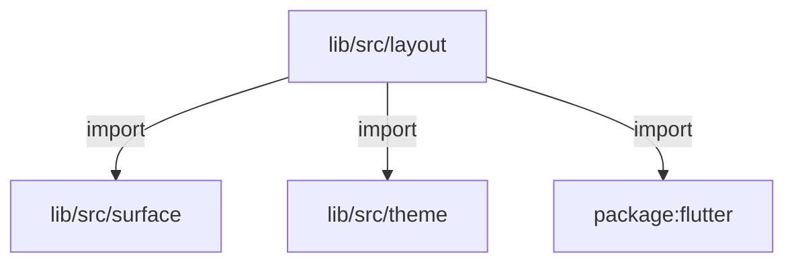
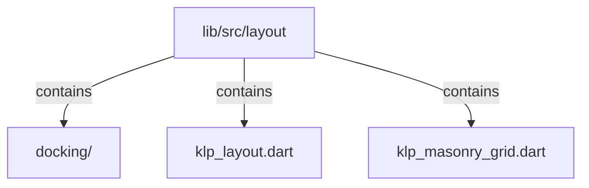

# lib/src/layout：架構分析入口

[上一層](../README.md)

## 範圍

閱讀 `lib/src/layout` 的直接子目錄與 Dart 檔案。結構圖表示實際檔案包含關係；依賴圖表示本層檔案明寫的 directives。每個檔案頁另列直接依賴、宣告、欄位、方法、建構子及行號證據。

## 模組閱讀重點

## 分析入口

`layout/` 包含區域／分割布局、尺寸把手、捲動與虛擬列表／網格包裝，以及 KlpMasonryGrid。KlpResizablePane 只以輸入 width 建立 SizedBox；拖曳變化透過 KlpResizeHandle.onDelta 回報。此目錄無巢狀子目錄；目前 masonry 依索引輪流分欄，沒有量測欄高後挑最短欄的排程。

| 想查的問題 | 符號與來源 |
| --- | --- |
| 區域與分割入口？ | KlpRegion／KlpSplitLayout — `lib/src/layout/klp_layout.dart:8`、`lib/src/layout/klp_layout.dart:48` |
| 尺寸誰更新？ | KlpResizablePane／KlpResizeHandle — `lib/src/layout/klp_layout.dart:110`、`lib/src/layout/klp_layout.dart:123` |
| 虛擬列表與網格在哪？ | KlpVirtualList／KlpVirtualGrid — `lib/src/layout/klp_layout.dart:216`、`lib/src/layout/klp_layout.dart:242` |
| 瀑布流如何分欄？ | KlpMasonryGrid.build — `lib/src/layout/klp_masonry_grid.dart:17` |

重要關係：

- `KlpResizeHandle` → `onDelta`：依 axis 回報 dx 或 dy（`lib/src/layout/klp_layout.dart:158`、`lib/src/layout/klp_layout.dart:162`），沒有在自身保存 pane width。
- `KlpMasonryGrid.build` → theme／LayoutBuilder：gap 與預設最小欄寬取自 theme，依可用寬度算欄數，再以 index % count 分派 children（`lib/src/layout/klp_masonry_grid.dart:18`、`lib/src/layout/klp_masonry_grid.dart:30`）。
- `klp_layout.dart` → surface 模組：直接引入 KlpDashedBorder 與 KlpSurface（`lib/src/layout/klp_layout.dart:3`）。

import 不是執行順序；尺寸變更路線應追蹤 callback 的消費者。

## 本層直接依賴圖

箭頭以本層 Dart 檔案明寫的 directive 彙總到目標所在目錄或外部套件邊界；不遞迴將子目錄依賴算入本層。相同目標的不同 directive 類型分開計數。

| 目標邊界 | 關係 | directive 數 | 第一筆來源證據 |
|---|---|---|---|
| <code>lib/src/surface</code> | import | 2 | [lib/src/layout/klp_layout.dart:3](../../../../lib/src/layout/klp_layout.dart#L3) |
| <code>lib/src/theme</code> | import | 2 | [lib/src/layout/klp_layout.dart:5](../../../../lib/src/layout/klp_layout.dart#L5) |
| <code>package:flutter</code> | import | 2 | [lib/src/layout/klp_layout.dart:1](../../../../lib/src/layout/klp_layout.dart#L1) |

## 目錄結構圖

## 子目錄

| 目錄 | 導航 | 來源證據 |
|---|---|---|
| `docking/` | [架構入口](docking/README.md) | [來源目錄](../../../../lib/src/layout/docking) |

## 本層檔案

| 檔案 | 宣告 | 細節 | 來源證據 |
|---|---|---|---|
| `klp_layout.dart` | KlpRegion, KlpSplitLayout, KlpResizablePane, KlpResizeHandle, KlpScrollViewport, KlpVirtualList, KlpVirtualGrid, KlpOverlayHost | [架構與 API](klp_layout.md) | [lib/src/layout/klp_layout.dart:1](../../../../lib/src/layout/klp_layout.dart#L1) |
| `klp_masonry_grid.dart` | KlpMasonryGrid | [架構與 API](klp_masonry_grid.md) | [lib/src/layout/klp_masonry_grid.dart:1](../../../../lib/src/layout/klp_masonry_grid.dart#L1) |

## 閱讀說明

箭頭只表示來源明寫的靜態關係；import 不等於呼叫。未分析動態呼叫、欄位的實際物件擁有權、狀態轉移或渲染流程；型別未進行語意解析，繼承目標保留原始型別拼寫。public／private 依 Dart 名稱前綴判斷；public 宣告不代表已由 `lib/kallopis.dart` 匯出。

本頁的目錄與檔案由來源清冊產生；`manifest.json` 位於本圖集根目錄，可核對 SHA-256 與覆蓋數。人工模組摘要存於 `tool/architecture_atlas/briefs/`，重新生成時保留。
