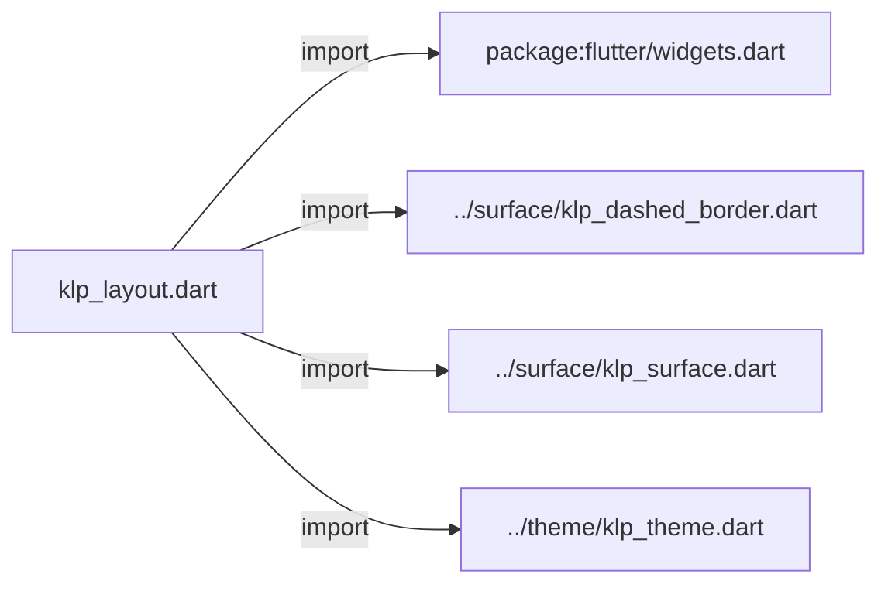
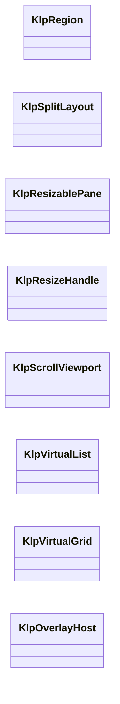
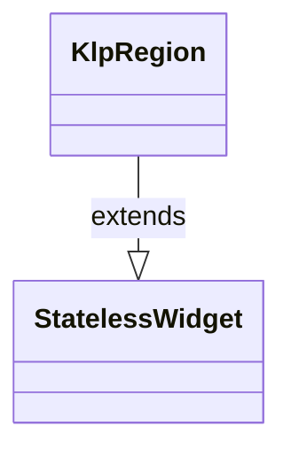
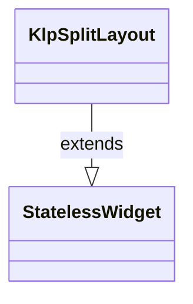
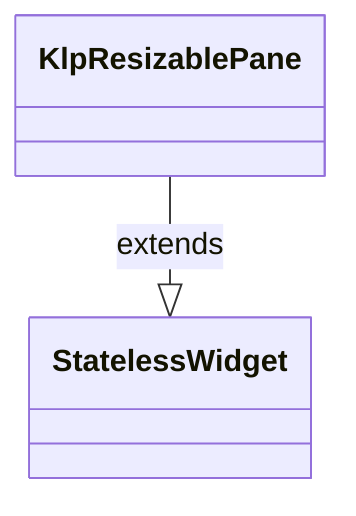
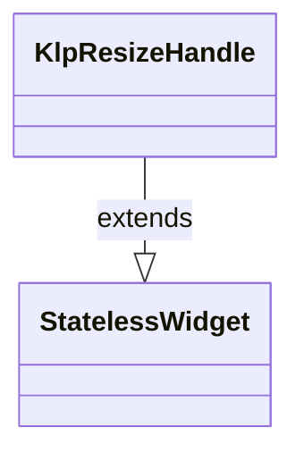
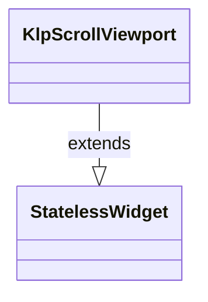
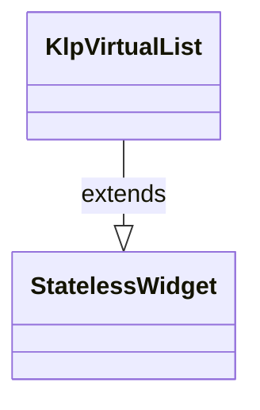
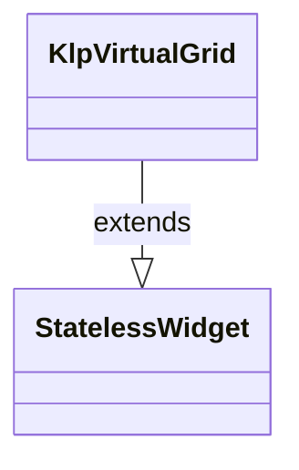
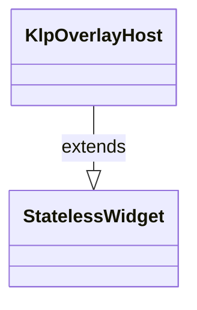

# klp_layout.dart：直接依賴與宣告架構

[回到目錄](README.md) · [來源檔案](../../../../lib/src/layout/klp_layout.dart)

## 範圍

核心是 `lib/src/layout/klp_layout.dart`。主要視角為該檔案明寫的 import／export／part；輔助視角為本檔宣告及 extends／implements／with／on 關係。只展開一層外部邊界。

## 直接依賴圖

## 依賴證據

| 關係 | 原始 directive | 來源 |
|---|---|---|
| import | <code>import &#x27;package:flutter/widgets.dart&#x27;;</code> | [lib/src/layout/klp_layout.dart:1](../../../../lib/src/layout/klp_layout.dart#L1) |
| import | <code>import &#x27;../surface/klp_dashed_border.dart&#x27;;</code> | [lib/src/layout/klp_layout.dart:3](../../../../lib/src/layout/klp_layout.dart#L3) |
| import | <code>import &#x27;../surface/klp_surface.dart&#x27;;</code> | [lib/src/layout/klp_layout.dart:4](../../../../lib/src/layout/klp_layout.dart#L4) |
| import | <code>import &#x27;../theme/klp_theme.dart&#x27;;</code> | [lib/src/layout/klp_layout.dart:5](../../../../lib/src/layout/klp_layout.dart#L5) |

## 宣告關係圖

本組節點是本檔宣告；沒有箭頭的宣告未在此圖主張互相依賴。

## 宣告與成員證據

成員包含 public 與 private；簽章取自來源，省略函式本體與欄位初始值。`(inferred)` 表示來源未明寫型別；建構子只顯示參數部分，不含初始化列表。

### KlpRegion

ClassDeclaration · public · [lib/src/layout/klp_layout.dart:7](../../../../lib/src/layout/klp_layout.dart#L7)

<code>class KlpRegion extends StatelessWidget</code>

來源註解摘要：區域容器。包裝標題、主要內容與頁尾。

- `extends` → <code>StatelessWidget</code>：[lib/src/layout/klp_layout.dart:8](../../../../lib/src/layout/klp_layout.dart#L8)

| 成員 | 可見性 | 簽章／型別 | 來源註解摘要 | 證據 |
|---|---|---|---|---|
| constructor <code>KlpRegion</code> | public | <code>const KlpRegion({ super.key, required this.content, this.header, this.footer, this.tone = KlpSurfaceTone.base, this.padding, })</code> |  | [lib/src/layout/klp_layout.dart:9](../../../../lib/src/layout/klp_layout.dart#L9) |
| field <code>header</code> | public | <code>final Widget? header</code> |  | [lib/src/layout/klp_layout.dart:18](../../../../lib/src/layout/klp_layout.dart#L18) |
| field <code>content</code> | public | <code>final Widget content</code> |  | [lib/src/layout/klp_layout.dart:19](../../../../lib/src/layout/klp_layout.dart#L19) |
| field <code>footer</code> | public | <code>final Widget? footer</code> |  | [lib/src/layout/klp_layout.dart:20](../../../../lib/src/layout/klp_layout.dart#L20) |
| field <code>tone</code> | public | <code>final KlpSurfaceTone tone</code> |  | [lib/src/layout/klp_layout.dart:21](../../../../lib/src/layout/klp_layout.dart#L21) |
| field <code>padding</code> | public | <code>final EdgeInsetsGeometry? padding</code> | `null` 表示沿用 theme 的面板內距。內容不應該貼著面板邊緣—— 傳 [EdgeInsets.zero] 才是刻意讓內容自己貼邊（例如內部自帶捲動區）。 | [lib/src/layout/klp_layout.dart:25](../../../../lib/src/layout/klp_layout.dart#L25) |
| method <code>build</code> | public | <code>Widget build(BuildContext context)</code> |  | [lib/src/layout/klp_layout.dart:27](../../../../lib/src/layout/klp_layout.dart#L27) |

### KlpSplitLayout

ClassDeclaration · public · [lib/src/layout/klp_layout.dart:47](../../../../lib/src/layout/klp_layout.dart#L47)

<code>class KlpSplitLayout extends StatelessWidget</code>

來源註解摘要：分割版面原語。支援左/中/右或左右分割，以及虛線分隔線。

- `extends` → <code>StatelessWidget</code>：[lib/src/layout/klp_layout.dart:48](../../../../lib/src/layout/klp_layout.dart#L48)

| 成員 | 可見性 | 簽章／型別 | 來源註解摘要 | 證據 |
|---|---|---|---|---|
| constructor <code>KlpSplitLayout</code> | public | <code>const KlpSplitLayout({ super.key, required this.leading, required this.trailing, this.center, this.leadingWidth, this.trailingWidth, this.gap, this.showDashedDivider = false, })</code> |  | [lib/src/layout/klp_layout.dart:49](../../../../lib/src/layout/klp_layout.dart#L49) |
| field <code>leading</code> | public | <code>final Widget leading</code> |  | [lib/src/layout/klp_layout.dart:60](../../../../lib/src/layout/klp_layout.dart#L60) |
| field <code>trailing</code> | public | <code>final Widget trailing</code> |  | [lib/src/layout/klp_layout.dart:61](../../../../lib/src/layout/klp_layout.dart#L61) |
| field <code>center</code> | public | <code>final Widget? center</code> |  | [lib/src/layout/klp_layout.dart:62](../../../../lib/src/layout/klp_layout.dart#L62) |
| field <code>leadingWidth</code> | public | <code>final double? leadingWidth</code> |  | [lib/src/layout/klp_layout.dart:63](../../../../lib/src/layout/klp_layout.dart#L63) |
| field <code>trailingWidth</code> | public | <code>final double? trailingWidth</code> |  | [lib/src/layout/klp_layout.dart:64](../../../../lib/src/layout/klp_layout.dart#L64) |
| field <code>gap</code> | public | <code>final double? gap</code> |  | [lib/src/layout/klp_layout.dart:65](../../../../lib/src/layout/klp_layout.dart#L65) |
| field <code>showDashedDivider</code> | public | <code>final bool showDashedDivider</code> |  | [lib/src/layout/klp_layout.dart:66](../../../../lib/src/layout/klp_layout.dart#L66) |
| method <code>build</code> | public | <code>Widget build(BuildContext context)</code> |  | [lib/src/layout/klp_layout.dart:68](../../../../lib/src/layout/klp_layout.dart#L68) |

### KlpResizablePane

ClassDeclaration · public · [lib/src/layout/klp_layout.dart:109](../../../../lib/src/layout/klp_layout.dart#L109)

<code>class KlpResizablePane extends StatelessWidget</code>

來源註解摘要：寬度可調節面板容器。

- `extends` → <code>StatelessWidget</code>：[lib/src/layout/klp_layout.dart:110](../../../../lib/src/layout/klp_layout.dart#L110)

| 成員 | 可見性 | 簽章／型別 | 來源註解摘要 | 證據 |
|---|---|---|---|---|
| constructor <code>KlpResizablePane</code> | public | <code>const KlpResizablePane({super.key, required this.width, required this.child})</code> |  | [lib/src/layout/klp_layout.dart:111](../../../../lib/src/layout/klp_layout.dart#L111) |
| field <code>width</code> | public | <code>final double width</code> |  | [lib/src/layout/klp_layout.dart:113](../../../../lib/src/layout/klp_layout.dart#L113) |
| field <code>child</code> | public | <code>final Widget child</code> |  | [lib/src/layout/klp_layout.dart:114](../../../../lib/src/layout/klp_layout.dart#L114) |
| method <code>build</code> | public | <code>Widget build(BuildContext context)</code> |  | [lib/src/layout/klp_layout.dart:116](../../../../lib/src/layout/klp_layout.dart#L116) |

### KlpResizeHandle

ClassDeclaration · public · [lib/src/layout/klp_layout.dart:122](../../../../lib/src/layout/klp_layout.dart#L122)

<code>class KlpResizeHandle extends StatelessWidget</code>

來源註解摘要：拖曳調整水平或垂直尺寸的把手。

- `extends` → <code>StatelessWidget</code>：[lib/src/layout/klp_layout.dart:123](../../../../lib/src/layout/klp_layout.dart#L123)

| 成員 | 可見性 | 簽章／型別 | 來源註解摘要 | 證據 |
|---|---|---|---|---|
| constructor <code>KlpResizeHandle</code> | public | <code>const KlpResizeHandle({ super.key, required this.onDelta, this.axis = Axis.horizontal, this.onDragStart, this.onDragEnd, this.semanticLabel, this.width, this.height, this.enabled = true, })</code> |  | [lib/src/layout/klp_layout.dart:124](../../../../lib/src/layout/klp_layout.dart#L124) |
| field <code>axis</code> | public | <code>final Axis axis</code> |  | [lib/src/layout/klp_layout.dart:136](../../../../lib/src/layout/klp_layout.dart#L136) |
| field <code>onDelta</code> | public | <code>final ValueChanged&lt;double&gt; onDelta</code> |  | [lib/src/layout/klp_layout.dart:137](../../../../lib/src/layout/klp_layout.dart#L137) |
| field <code>onDragStart</code> | public | <code>final VoidCallback? onDragStart</code> |  | [lib/src/layout/klp_layout.dart:138](../../../../lib/src/layout/klp_layout.dart#L138) |
| field <code>onDragEnd</code> | public | <code>final VoidCallback? onDragEnd</code> |  | [lib/src/layout/klp_layout.dart:139](../../../../lib/src/layout/klp_layout.dart#L139) |
| field <code>semanticLabel</code> | public | <code>final String? semanticLabel</code> |  | [lib/src/layout/klp_layout.dart:140](../../../../lib/src/layout/klp_layout.dart#L140) |
| field <code>width</code> | public | <code>final double? width</code> |  | [lib/src/layout/klp_layout.dart:141](../../../../lib/src/layout/klp_layout.dart#L141) |
| field <code>height</code> | public | <code>final double? height</code> |  | [lib/src/layout/klp_layout.dart:142](../../../../lib/src/layout/klp_layout.dart#L142) |
| field <code>enabled</code> | public | <code>final bool enabled</code> |  | [lib/src/layout/klp_layout.dart:143](../../../../lib/src/layout/klp_layout.dart#L143) |
| method <code>build</code> | public | <code>Widget build(BuildContext context)</code> |  | [lib/src/layout/klp_layout.dart:145](../../../../lib/src/layout/klp_layout.dart#L145) |
| method <code>_resolveCursor</code> | private | <code>MouseCursor _resolveCursor(bool isHorizontal)</code> |  | [lib/src/layout/klp_layout.dart:190](../../../../lib/src/layout/klp_layout.dart#L190) |

### KlpScrollViewport

ClassDeclaration · public · [lib/src/layout/klp_layout.dart:196](../../../../lib/src/layout/klp_layout.dart#L196)

<code>class KlpScrollViewport extends StatelessWidget</code>

來源註解摘要：具備主題捲軸樣式的單向捲動容器。

- `extends` → <code>StatelessWidget</code>：[lib/src/layout/klp_layout.dart:197](../../../../lib/src/layout/klp_layout.dart#L197)

| 成員 | 可見性 | 簽章／型別 | 來源註解摘要 | 證據 |
|---|---|---|---|---|
| constructor <code>KlpScrollViewport</code> | public | <code>const KlpScrollViewport({ super.key, required this.child, this.controller, this.padding, })</code> |  | [lib/src/layout/klp_layout.dart:198](../../../../lib/src/layout/klp_layout.dart#L198) |
| field <code>child</code> | public | <code>final Widget child</code> |  | [lib/src/layout/klp_layout.dart:205](../../../../lib/src/layout/klp_layout.dart#L205) |
| field <code>controller</code> | public | <code>final ScrollController? controller</code> |  | [lib/src/layout/klp_layout.dart:206](../../../../lib/src/layout/klp_layout.dart#L206) |
| field <code>padding</code> | public | <code>final EdgeInsetsGeometry? padding</code> |  | [lib/src/layout/klp_layout.dart:207](../../../../lib/src/layout/klp_layout.dart#L207) |
| method <code>build</code> | public | <code>Widget build(BuildContext context)</code> |  | [lib/src/layout/klp_layout.dart:209](../../../../lib/src/layout/klp_layout.dart#L209) |

### KlpVirtualList

ClassDeclaration · public · [lib/src/layout/klp_layout.dart:219](../../../../lib/src/layout/klp_layout.dart#L219)

<code>class KlpVirtualList extends StatelessWidget</code>

來源註解摘要：長清單虛擬化捲動檢視。

- `extends` → <code>StatelessWidget</code>：[lib/src/layout/klp_layout.dart:220](../../../../lib/src/layout/klp_layout.dart#L220)

| 成員 | 可見性 | 簽章／型別 | 來源註解摘要 | 證據 |
|---|---|---|---|---|
| constructor <code>KlpVirtualList</code> | public | <code>const KlpVirtualList({ super.key, required this.itemCount, required this.itemBuilder, this.controller, this.padding, })</code> |  | [lib/src/layout/klp_layout.dart:221](../../../../lib/src/layout/klp_layout.dart#L221) |
| field <code>itemCount</code> | public | <code>final int itemCount</code> |  | [lib/src/layout/klp_layout.dart:229](../../../../lib/src/layout/klp_layout.dart#L229) |
| field <code>itemBuilder</code> | public | <code>final IndexedWidgetBuilder itemBuilder</code> |  | [lib/src/layout/klp_layout.dart:230](../../../../lib/src/layout/klp_layout.dart#L230) |
| field <code>controller</code> | public | <code>final ScrollController? controller</code> |  | [lib/src/layout/klp_layout.dart:231](../../../../lib/src/layout/klp_layout.dart#L231) |
| field <code>padding</code> | public | <code>final EdgeInsetsGeometry? padding</code> |  | [lib/src/layout/klp_layout.dart:232](../../../../lib/src/layout/klp_layout.dart#L232) |
| method <code>build</code> | public | <code>Widget build(BuildContext context)</code> |  | [lib/src/layout/klp_layout.dart:234](../../../../lib/src/layout/klp_layout.dart#L234) |

### KlpVirtualGrid

ClassDeclaration · public · [lib/src/layout/klp_layout.dart:245](../../../../lib/src/layout/klp_layout.dart#L245)

<code>class KlpVirtualGrid extends StatelessWidget</code>

來源註解摘要：格狀虛擬化捲動檢視。

- `extends` → <code>StatelessWidget</code>：[lib/src/layout/klp_layout.dart:246](../../../../lib/src/layout/klp_layout.dart#L246)

| 成員 | 可見性 | 簽章／型別 | 來源註解摘要 | 證據 |
|---|---|---|---|---|
| constructor <code>KlpVirtualGrid</code> | public | <code>const KlpVirtualGrid({ super.key, required this.itemCount, required this.itemBuilder, this.minimumItemWidth = 240, this.crossAxisCount, this.spacing, this.childAspectRatio = 1.0, })</code> |  | [lib/src/layout/klp_layout.dart:247](../../../../lib/src/layout/klp_layout.dart#L247) |
| field <code>itemCount</code> | public | <code>final int itemCount</code> |  | [lib/src/layout/klp_layout.dart:257](../../../../lib/src/layout/klp_layout.dart#L257) |
| field <code>itemBuilder</code> | public | <code>final IndexedWidgetBuilder itemBuilder</code> |  | [lib/src/layout/klp_layout.dart:258](../../../../lib/src/layout/klp_layout.dart#L258) |
| field <code>minimumItemWidth</code> | public | <code>final double minimumItemWidth</code> |  | [lib/src/layout/klp_layout.dart:259](../../../../lib/src/layout/klp_layout.dart#L259) |
| field <code>crossAxisCount</code> | public | <code>final int? crossAxisCount</code> |  | [lib/src/layout/klp_layout.dart:260](../../../../lib/src/layout/klp_layout.dart#L260) |
| field <code>spacing</code> | public | <code>final double? spacing</code> |  | [lib/src/layout/klp_layout.dart:261](../../../../lib/src/layout/klp_layout.dart#L261) |
| field <code>childAspectRatio</code> | public | <code>final double childAspectRatio</code> |  | [lib/src/layout/klp_layout.dart:262](../../../../lib/src/layout/klp_layout.dart#L262) |
| method <code>build</code> | public | <code>Widget build(BuildContext context)</code> |  | [lib/src/layout/klp_layout.dart:264](../../../../lib/src/layout/klp_layout.dart#L264) |

### KlpOverlayHost

ClassDeclaration · public · [lib/src/layout/klp_layout.dart:290](../../../../lib/src/layout/klp_layout.dart#L290)

<code>class KlpOverlayHost extends StatelessWidget</code>

來源註解摘要：浮層容器掛載點。

- `extends` → <code>StatelessWidget</code>：[lib/src/layout/klp_layout.dart:291](../../../../lib/src/layout/klp_layout.dart#L291)

| 成員 | 可見性 | 簽章／型別 | 來源註解摘要 | 證據 |
|---|---|---|---|---|
| constructor <code>KlpOverlayHost</code> | public | <code>const KlpOverlayHost({super.key, required this.child, this.overlay})</code> |  | [lib/src/layout/klp_layout.dart:292](../../../../lib/src/layout/klp_layout.dart#L292) |
| field <code>child</code> | public | <code>final Widget child</code> |  | [lib/src/layout/klp_layout.dart:294](../../../../lib/src/layout/klp_layout.dart#L294) |
| field <code>overlay</code> | public | <code>final Widget? overlay</code> |  | [lib/src/layout/klp_layout.dart:295](../../../../lib/src/layout/klp_layout.dart#L295) |
| method <code>build</code> | public | <code>Widget build(BuildContext context)</code> |  | [lib/src/layout/klp_layout.dart:297](../../../../lib/src/layout/klp_layout.dart#L297) |

## 閱讀說明與限制

箭頭只表示來源明寫的靜態關係；import 不等於呼叫。未分析動態呼叫、欄位的實際物件擁有權、狀態轉移或渲染流程；型別未進行語意解析，繼承目標保留原始型別拼寫。public／private 依 Dart 名稱前綴判斷；public 宣告不代表已由 `lib/kallopis.dart` 匯出。

本頁由 `tool/architecture_atlas` 產生；編輯來源或生成工具後重新產生，避免手改本頁。
