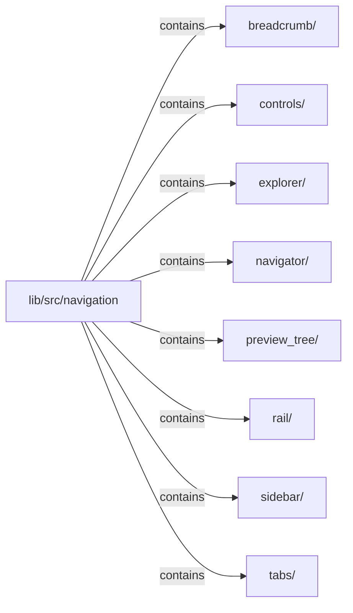

# lib/src/navigation：架構分析入口

[上一層](../README.md)

## 範圍

閱讀 `lib/src/navigation` 的直接子目錄與 Dart 檔案。結構圖表示實際檔案包含關係；依賴圖表示本層檔案明寫的 directives。每個檔案頁另列直接依賴、宣告、欄位、方法、建構子及行號證據。

## 模組閱讀重點

## 分析入口

此目錄包含一般 navigator、tabs、breadcrumb，以及 `explorer/`、`rail/`、`sidebar/` 三個獨立組件群。`KlpNavigator` 自己持有 widget state，不能僅憑名称視為 Flutter 或產品路由器。閱讀子目錄時保留 models、容器與 item 的分工，避免將所有導覽行為歸到單一 navigator。

| 想回答的問題 | 精確符號與來源 |
| --- | --- |
| 一般導覽的狀態入口在哪裡？ | `KlpNavigator`、`_KlpNavigatorState`：lib/src/navigation/klp_navigator.dart:16、49 |
| Explorer 與 Rail 各自從哪裡開始？ | `KlpExplorer`：lib/src/navigation/explorer/klp_explorer.dart:12；`KlpNavigationRail`：lib/src/navigation/rail/klp_navigation_rail.dart:13 |
| Sidebar 的版面外框在哪裡？ | `KlpSidebarFrame`：lib/src/navigation/sidebar/klp_sidebar_frame.dart:10 |

重要依賴：`klp_navigator.dart:10` 匯入自身 models，:5–6 匯入 pressable／state highlight，:7 匯入 surface。這些是靜態依賴，路由跳轉與事件先後需另外沿回呼驗證。

## 本層直接依賴圖

箭頭以本層 Dart 檔案明寫的 directive 彙總到目標所在目錄或外部套件邊界；不遞迴將子目錄依賴算入本層。相同目標的不同 directive 類型分開計數。

本層檔案未宣告跨目錄依賴；子目錄依賴請循下一層入口閱讀。

| 目標邊界 | 關係 | directive 數 | 第一筆來源證據 |
|---|---|---|---|
| 無 | — | 0 | 來源清單見本層檔案 |

## 目錄結構圖

## 子目錄

| 目錄 | 導航 | 來源證據 |
|---|---|---|
| `breadcrumb/` | [架構入口](breadcrumb/README.md) | [來源目錄](../../../../lib/src/navigation/breadcrumb) |
| `controls/` | [架構入口](controls/README.md) | [來源目錄](../../../../lib/src/navigation/controls) |
| `explorer/` | [架構入口](explorer/README.md) | [來源目錄](../../../../lib/src/navigation/explorer) |
| `navigator/` | [架構入口](navigator/README.md) | [來源目錄](../../../../lib/src/navigation/navigator) |
| `preview_tree/` | [架構入口](preview_tree/README.md) | [來源目錄](../../../../lib/src/navigation/preview_tree) |
| `rail/` | [架構入口](rail/README.md) | [來源目錄](../../../../lib/src/navigation/rail) |
| `sidebar/` | [架構入口](sidebar/README.md) | [來源目錄](../../../../lib/src/navigation/sidebar) |
| `tabs/` | [架構入口](tabs/README.md) | [來源目錄](../../../../lib/src/navigation/tabs) |

## 本層檔案

| 檔案 | 宣告 | 細節 | 來源證據 |
|---|---|---|---|
| 無 | 本層沒有 Dart 檔案 | — | — |

## 閱讀說明

箭頭只表示來源明寫的靜態關係；import 不等於呼叫。未分析動態呼叫、欄位的實際物件擁有權、狀態轉移或渲染流程；型別未進行語意解析，繼承目標保留原始型別拼寫。public／private 依 Dart 名稱前綴判斷；public 宣告不代表已由 `lib/kallopis.dart` 匯出。

本頁的目錄與檔案由來源清冊產生；`manifest.json` 位於本圖集根目錄，可核對 SHA-256 與覆蓋數。人工模組摘要存於 `tool/architecture_atlas/briefs/`，重新生成時保留。
