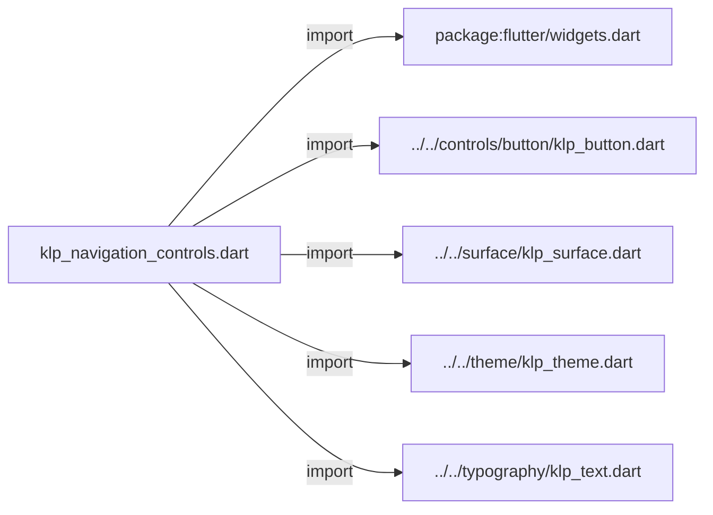
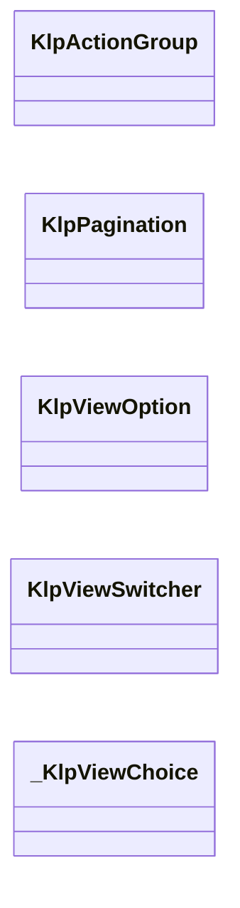
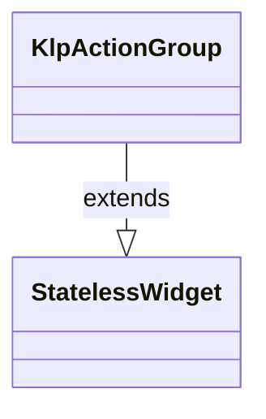
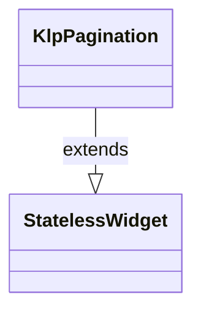
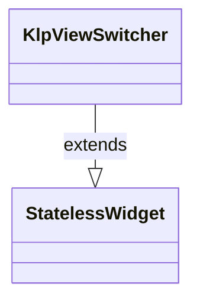
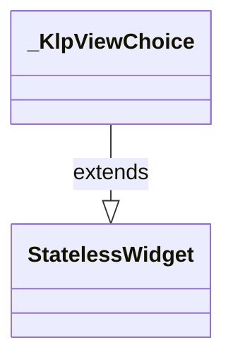

# klp_navigation_controls.dart：直接依賴與宣告架構

[回到目錄](README.md) · [來源檔案](../../../../../lib/src/navigation/controls/klp_navigation_controls.dart)

## 範圍

核心是 `lib/src/navigation/controls/klp_navigation_controls.dart`。主要視角為該檔案明寫的 import／export／part；輔助視角為本檔宣告及 extends／implements／with／on 關係。只展開一層外部邊界。

## 直接依賴圖

## 依賴證據

| 關係 | 原始 directive | 來源 |
|---|---|---|
| import | <code>import &#x27;package:flutter/widgets.dart&#x27;;</code> | [lib/src/navigation/controls/klp_navigation_controls.dart:1](../../../../../lib/src/navigation/controls/klp_navigation_controls.dart#L1) |
| import | <code>import &#x27;../../controls/button/klp_button.dart&#x27;;</code> | [lib/src/navigation/controls/klp_navigation_controls.dart:3](../../../../../lib/src/navigation/controls/klp_navigation_controls.dart#L3) |
| import | <code>import &#x27;../../surface/klp_surface.dart&#x27;;</code> | [lib/src/navigation/controls/klp_navigation_controls.dart:4](../../../../../lib/src/navigation/controls/klp_navigation_controls.dart#L4) |
| import | <code>import &#x27;../../theme/klp_theme.dart&#x27;;</code> | [lib/src/navigation/controls/klp_navigation_controls.dart:5](../../../../../lib/src/navigation/controls/klp_navigation_controls.dart#L5) |
| import | <code>import &#x27;../../typography/klp_text.dart&#x27;;</code> | [lib/src/navigation/controls/klp_navigation_controls.dart:6](../../../../../lib/src/navigation/controls/klp_navigation_controls.dart#L6) |

## 宣告關係圖

本組節點是本檔宣告；沒有箭頭的宣告未在此圖主張互相依賴。

## 宣告與成員證據

成員包含 public 與 private；簽章取自來源，省略函式本體與欄位初始值。`(inferred)` 表示來源未明寫型別；建構子只顯示參數部分，不含初始化列表。

### KlpActionGroup

ClassDeclaration · public · [lib/src/navigation/controls/klp_navigation_controls.dart:8](../../../../../lib/src/navigation/controls/klp_navigation_controls.dart#L8)

<code>class KlpActionGroup extends StatelessWidget</code>

來源註解摘要：一組動作按鈕的容器，寬度不足時自動換行，換行時保留與同一行相同的間距。 只負責排版間距——按鈕本身的樣式、順序、是否停用都由 [children] 自行決定。

- `extends` → <code>StatelessWidget</code>：[lib/src/navigation/controls/klp_navigation_controls.dart:11](../../../../../lib/src/navigation/controls/klp_navigation_controls.dart#L11)

| 成員 | 可見性 | 簽章／型別 | 來源註解摘要 | 證據 |
|---|---|---|---|---|
| constructor <code>KlpActionGroup</code> | public | <code>const KlpActionGroup({super.key, required this.children})</code> |  | [lib/src/navigation/controls/klp_navigation_controls.dart:12](../../../../../lib/src/navigation/controls/klp_navigation_controls.dart#L12) |
| field <code>children</code> | public | <code>final List&lt;Widget&gt; children</code> |  | [lib/src/navigation/controls/klp_navigation_controls.dart:14](../../../../../lib/src/navigation/controls/klp_navigation_controls.dart#L14) |
| method <code>build</code> | public | <code>Widget build(BuildContext context)</code> |  | [lib/src/navigation/controls/klp_navigation_controls.dart:16](../../../../../lib/src/navigation/controls/klp_navigation_controls.dart#L16) |

### KlpPagination

ClassDeclaration · public · [lib/src/navigation/controls/klp_navigation_controls.dart:26](../../../../../lib/src/navigation/controls/klp_navigation_controls.dart#L26)

<code>class KlpPagination extends StatelessWidget</code>

來源註解摘要：上一頁／頁碼／下一頁的簡易分頁控制項。 頁碼從 1 開始（不是從 0）；在第一頁或最後一頁時對應按鈕會自動停用， 呼叫端不需要自己判斷邊界。不提供跳頁輸入框或頁碼清單，適合頁數不多、 只需要前後翻頁的場合。

- `extends` → <code>StatelessWidget</code>：[lib/src/navigation/controls/klp_navigation_controls.dart:31](../../../../../lib/src/navigation/controls/klp_navigation_controls.dart#L31)

| 成員 | 可見性 | 簽章／型別 | 來源註解摘要 | 證據 |
|---|---|---|---|---|
| constructor <code>KlpPagination</code> | public | <code>const KlpPagination({ super.key, required this.page, required this.pageCount, required this.previousLabel, required this.nextLabel, required this.onPageChanged, })</code> |  | [lib/src/navigation/controls/klp_navigation_controls.dart:32](../../../../../lib/src/navigation/controls/klp_navigation_controls.dart#L32) |
| field <code>page</code> | public | <code>final int page</code> |  | [lib/src/navigation/controls/klp_navigation_controls.dart:41](../../../../../lib/src/navigation/controls/klp_navigation_controls.dart#L41) |
| field <code>pageCount</code> | public | <code>final int pageCount</code> |  | [lib/src/navigation/controls/klp_navigation_controls.dart:42](../../../../../lib/src/navigation/controls/klp_navigation_controls.dart#L42) |
| field <code>previousLabel</code> | public | <code>final String previousLabel</code> |  | [lib/src/navigation/controls/klp_navigation_controls.dart:43](../../../../../lib/src/navigation/controls/klp_navigation_controls.dart#L43) |
| field <code>nextLabel</code> | public | <code>final String nextLabel</code> |  | [lib/src/navigation/controls/klp_navigation_controls.dart:44](../../../../../lib/src/navigation/controls/klp_navigation_controls.dart#L44) |
| field <code>onPageChanged</code> | public | <code>final ValueChanged&lt;int&gt;? onPageChanged</code> |  | [lib/src/navigation/controls/klp_navigation_controls.dart:45](../../../../../lib/src/navigation/controls/klp_navigation_controls.dart#L45) |
| method <code>build</code> | public | <code>Widget build(BuildContext context)</code> |  | [lib/src/navigation/controls/klp_navigation_controls.dart:47](../../../../../lib/src/navigation/controls/klp_navigation_controls.dart#L47) |

### KlpViewOption

ClassDeclaration · public · [lib/src/navigation/controls/klp_navigation_controls.dart:75](../../../../../lib/src/navigation/controls/klp_navigation_controls.dart#L75)

<code>class KlpViewOption</code>

來源註解摘要：[KlpViewSwitcher] 裡的一個檢視選項：識別碼、顯示文字，以及選填的圖示。

| 成員 | 可見性 | 簽章／型別 | 來源註解摘要 | 證據 |
|---|---|---|---|---|
| constructor <code>KlpViewOption</code> | public | <code>const KlpViewOption({required this.id, required this.label, this.icon})</code> |  | [lib/src/navigation/controls/klp_navigation_controls.dart:78](../../../../../lib/src/navigation/controls/klp_navigation_controls.dart#L78) |
| field <code>id</code> | public | <code>final String id</code> |  | [lib/src/navigation/controls/klp_navigation_controls.dart:80](../../../../../lib/src/navigation/controls/klp_navigation_controls.dart#L80) |
| field <code>label</code> | public | <code>final String label</code> |  | [lib/src/navigation/controls/klp_navigation_controls.dart:81](../../../../../lib/src/navigation/controls/klp_navigation_controls.dart#L81) |
| field <code>icon</code> | public | <code>final Widget? icon</code> |  | [lib/src/navigation/controls/klp_navigation_controls.dart:82](../../../../../lib/src/navigation/controls/klp_navigation_controls.dart#L82) |

### KlpViewSwitcher

ClassDeclaration · public · [lib/src/navigation/controls/klp_navigation_controls.dart:85](../../../../../lib/src/navigation/controls/klp_navigation_controls.dart#L85)

<code>class KlpViewSwitcher extends StatelessWidget</code>

來源註解摘要：同層級檢視切換器（例如「清單／看板」），以緊貼的膠囊按鈕組呈現， 選中項會有底色標示。 與 [KlpSegmentedControl] 的差異在於視覺重量更輕——[KlpViewSwitcher] 用 inset 表面搭配 hairline 間距，適合放在工具列這類次要控制的位置；需要更 強調的主要切換時請用 [KlpSegmentedControl]。

- `extends` → <code>StatelessWidget</code>：[lib/src/navigation/controls/klp_navigation_controls.dart:91](../../../../../lib/src/navigation/controls/klp_navigation_controls.dart#L91)

| 成員 | 可見性 | 簽章／型別 | 來源註解摘要 | 證據 |
|---|---|---|---|---|
| constructor <code>KlpViewSwitcher</code> | public | <code>const KlpViewSwitcher({ super.key, required this.options, required this.selectedId, required this.onSelected, })</code> |  | [lib/src/navigation/controls/klp_navigation_controls.dart:92](../../../../../lib/src/navigation/controls/klp_navigation_controls.dart#L92) |
| field <code>options</code> | public | <code>final List&lt;KlpViewOption&gt; options</code> |  | [lib/src/navigation/controls/klp_navigation_controls.dart:99](../../../../../lib/src/navigation/controls/klp_navigation_controls.dart#L99) |
| field <code>selectedId</code> | public | <code>final String selectedId</code> |  | [lib/src/navigation/controls/klp_navigation_controls.dart:100](../../../../../lib/src/navigation/controls/klp_navigation_controls.dart#L100) |
| field <code>onSelected</code> | public | <code>final ValueChanged&lt;String&gt;? onSelected</code> |  | [lib/src/navigation/controls/klp_navigation_controls.dart:101](../../../../../lib/src/navigation/controls/klp_navigation_controls.dart#L101) |
| method <code>build</code> | public | <code>Widget build(BuildContext context)</code> |  | [lib/src/navigation/controls/klp_navigation_controls.dart:103](../../../../../lib/src/navigation/controls/klp_navigation_controls.dart#L103) |

### _KlpViewChoice

ClassDeclaration · private · [lib/src/navigation/controls/klp_navigation_controls.dart:129](../../../../../lib/src/navigation/controls/klp_navigation_controls.dart#L129)

<code>class _KlpViewChoice extends StatelessWidget</code>

- `extends` → <code>StatelessWidget</code>：[lib/src/navigation/controls/klp_navigation_controls.dart:129](../../../../../lib/src/navigation/controls/klp_navigation_controls.dart#L129)

| 成員 | 可見性 | 簽章／型別 | 來源註解摘要 | 證據 |
|---|---|---|---|---|
| constructor <code>_KlpViewChoice</code> | private | <code>const _KlpViewChoice({ required this.option, required this.selected, required this.onPressed, })</code> |  | [lib/src/navigation/controls/klp_navigation_controls.dart:130](../../../../../lib/src/navigation/controls/klp_navigation_controls.dart#L130) |
| field <code>option</code> | public | <code>final KlpViewOption option</code> |  | [lib/src/navigation/controls/klp_navigation_controls.dart:136](../../../../../lib/src/navigation/controls/klp_navigation_controls.dart#L136) |
| field <code>selected</code> | public | <code>final bool selected</code> |  | [lib/src/navigation/controls/klp_navigation_controls.dart:137](../../../../../lib/src/navigation/controls/klp_navigation_controls.dart#L137) |
| field <code>onPressed</code> | public | <code>final VoidCallback? onPressed</code> |  | [lib/src/navigation/controls/klp_navigation_controls.dart:138](../../../../../lib/src/navigation/controls/klp_navigation_controls.dart#L138) |
| method <code>build</code> | public | <code>Widget build(BuildContext context)</code> |  | [lib/src/navigation/controls/klp_navigation_controls.dart:140](../../../../../lib/src/navigation/controls/klp_navigation_controls.dart#L140) |

## 閱讀說明與限制

箭頭只表示來源明寫的靜態關係；import 不等於呼叫。未分析動態呼叫、欄位的實際物件擁有權、狀態轉移或渲染流程；型別未進行語意解析，繼承目標保留原始型別拼寫。public／private 依 Dart 名稱前綴判斷；public 宣告不代表已由 `lib/kallopis.dart` 匯出。

本頁由 `tool/architecture_atlas` 產生；編輯來源或生成工具後重新產生，避免手改本頁。
