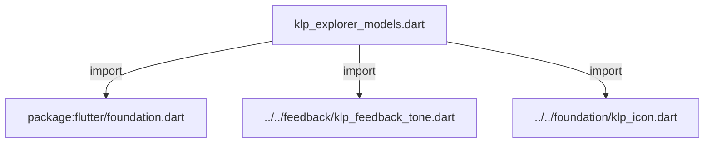
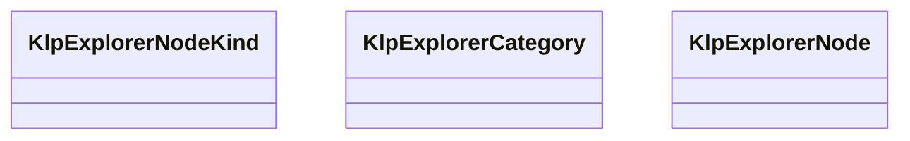

# klp_explorer_models.dart：直接依賴與宣告架構

[回到目錄](README.md) · [來源檔案](../../../../../lib/src/navigation/explorer/klp_explorer_models.dart)

## 範圍

核心是 `lib/src/navigation/explorer/klp_explorer_models.dart`。主要視角為該檔案明寫的 import／export／part；輔助視角為本檔宣告及 extends／implements／with／on 關係。只展開一層外部邊界。

## 直接依賴圖

## 依賴證據

| 關係 | 原始 directive | 來源 |
|---|---|---|
| import | <code>import &#x27;package:flutter/foundation.dart&#x27;;</code> | [lib/src/navigation/explorer/klp_explorer_models.dart:1](../../../../../lib/src/navigation/explorer/klp_explorer_models.dart#L1) |
| import | <code>import &#x27;../../feedback/klp_feedback_tone.dart&#x27;;</code> | [lib/src/navigation/explorer/klp_explorer_models.dart:3](../../../../../lib/src/navigation/explorer/klp_explorer_models.dart#L3) |
| import | <code>import &#x27;../../foundation/klp_icon.dart&#x27;;</code> | [lib/src/navigation/explorer/klp_explorer_models.dart:4](../../../../../lib/src/navigation/explorer/klp_explorer_models.dart#L4) |

## 宣告關係圖

本組節點是本檔宣告；沒有箭頭的宣告未在此圖主張互相依賴。

## 宣告與成員證據

成員包含 public 與 private；簽章取自來源，省略函式本體與欄位初始值。`(inferred)` 表示來源未明寫型別；建構子只顯示參數部分，不含初始化列表。

### KlpExplorerNodeKind

EnumDeclaration · public · [lib/src/navigation/explorer/klp_explorer_models.dart:6](../../../../../lib/src/navigation/explorer/klp_explorer_models.dart#L6)

<code>enum KlpExplorerNodeKind</code>

來源註解摘要：Explorer 元素節點的資料類型。

| 成員 | 可見性 | 簽章／型別 | 來源註解摘要 | 證據 |
|---|---|---|---|---|
| enum value <code>folder</code> | public | <code>folder</code> |  | [lib/src/navigation/explorer/klp_explorer_models.dart:7](../../../../../lib/src/navigation/explorer/klp_explorer_models.dart#L7) |
| enum value <code>file</code> | public | <code>file</code> |  | [lib/src/navigation/explorer/klp_explorer_models.dart:7](../../../../../lib/src/navigation/explorer/klp_explorer_models.dart#L7) |

### KlpExplorerCategory

ClassDeclaration · public · [lib/src/navigation/explorer/klp_explorer_models.dart:9](../../../../../lib/src/navigation/explorer/klp_explorer_models.dart#L9)

<code>class KlpExplorerCategory</code>

來源註解摘要：Explorer 的分類資料模型。 分類只負責命名一組節點與宣告是否可收合；尺寸、內距與 排版由 `KlpExplorer` 統一管理。

| 成員 | 可見性 | 簽章／型別 | 來源註解摘要 | 證據 |
|---|---|---|---|---|
| constructor <code>KlpExplorerCategory</code> | public | <code>const KlpExplorerCategory({ required this.id, required this.label, this.nodes = const [], this.expanded = true, this.collapsible = true, })</code> |  | [lib/src/navigation/explorer/klp_explorer_models.dart:15](../../../../../lib/src/navigation/explorer/klp_explorer_models.dart#L15) |
| field <code>id</code> | public | <code>final String id</code> |  | [lib/src/navigation/explorer/klp_explorer_models.dart:23](../../../../../lib/src/navigation/explorer/klp_explorer_models.dart#L23) |
| field <code>label</code> | public | <code>final String label</code> |  | [lib/src/navigation/explorer/klp_explorer_models.dart:24](../../../../../lib/src/navigation/explorer/klp_explorer_models.dart#L24) |
| field <code>nodes</code> | public | <code>final List&lt;KlpExplorerNode&gt; nodes</code> |  | [lib/src/navigation/explorer/klp_explorer_models.dart:25](../../../../../lib/src/navigation/explorer/klp_explorer_models.dart#L25) |
| field <code>expanded</code> | public | <code>final bool expanded</code> |  | [lib/src/navigation/explorer/klp_explorer_models.dart:26](../../../../../lib/src/navigation/explorer/klp_explorer_models.dart#L26) |
| field <code>collapsible</code> | public | <code>final bool collapsible</code> |  | [lib/src/navigation/explorer/klp_explorer_models.dart:27](../../../../../lib/src/navigation/explorer/klp_explorer_models.dart#L27) |

### KlpExplorerNode

ClassDeclaration · public · [lib/src/navigation/explorer/klp_explorer_models.dart:30](../../../../../lib/src/navigation/explorer/klp_explorer_models.dart#L30)

<code>class KlpExplorerNode</code>

來源註解摘要：Explorer 的單一元素節點。 資料夾與檔案共用同一種節點模型；是否呈現遞迴階層，由 `KlpExplorer.allowNesting` 決定，不由產品自行編排 Widget。

| 成員 | 可見性 | 簽章／型別 | 來源註解摘要 | 證據 |
|---|---|---|---|---|
| constructor <code>KlpExplorerNode</code> | public | <code>const KlpExplorerNode({ required this.id, required this.label, required this.kind, this.icon, this.children = const [], this.expanded = false, this.selected = false, this.badge, this.tone, this.data, })</code> |  | [lib/src/navigation/explorer/klp_explorer_models.dart:36](../../../../../lib/src/navigation/explorer/klp_explorer_models.dart#L36) |
| field <code>id</code> | public | <code>final String id</code> |  | [lib/src/navigation/explorer/klp_explorer_models.dart:49](../../../../../lib/src/navigation/explorer/klp_explorer_models.dart#L49) |
| field <code>label</code> | public | <code>final String label</code> |  | [lib/src/navigation/explorer/klp_explorer_models.dart:50](../../../../../lib/src/navigation/explorer/klp_explorer_models.dart#L50) |
| field <code>kind</code> | public | <code>final KlpExplorerNodeKind kind</code> |  | [lib/src/navigation/explorer/klp_explorer_models.dart:51](../../../../../lib/src/navigation/explorer/klp_explorer_models.dart#L51) |
| field <code>icon</code> | public | <code>final KlpIconData? icon</code> |  | [lib/src/navigation/explorer/klp_explorer_models.dart:52](../../../../../lib/src/navigation/explorer/klp_explorer_models.dart#L52) |
| field <code>children</code> | public | <code>final List&lt;KlpExplorerNode&gt; children</code> | 子節點；只有 [KlpExplorerNodeKind.folder] 會呈現其內容。 | [lib/src/navigation/explorer/klp_explorer_models.dart:55](../../../../../lib/src/navigation/explorer/klp_explorer_models.dart#L55) |
| field <code>expanded</code> | public | <code>final bool expanded</code> |  | [lib/src/navigation/explorer/klp_explorer_models.dart:56](../../../../../lib/src/navigation/explorer/klp_explorer_models.dart#L56) |
| field <code>selected</code> | public | <code>final bool selected</code> |  | [lib/src/navigation/explorer/klp_explorer_models.dart:57](../../../../../lib/src/navigation/explorer/klp_explorer_models.dart#L57) |
| field <code>badge</code> | public | <code>final String? badge</code> |  | [lib/src/navigation/explorer/klp_explorer_models.dart:58](../../../../../lib/src/navigation/explorer/klp_explorer_models.dart#L58) |
| field <code>tone</code> | public | <code>final KlpFeedbackTone? tone</code> |  | [lib/src/navigation/explorer/klp_explorer_models.dart:59](../../../../../lib/src/navigation/explorer/klp_explorer_models.dart#L59) |
| field <code>data</code> | public | <code>final Object? data</code> |  | [lib/src/navigation/explorer/klp_explorer_models.dart:60](../../../../../lib/src/navigation/explorer/klp_explorer_models.dart#L60) |
| getter <code>isFolder</code> | public | <code>bool get isFolder</code> |  | [lib/src/navigation/explorer/klp_explorer_models.dart:62](../../../../../lib/src/navigation/explorer/klp_explorer_models.dart#L62) |

## 閱讀說明與限制

箭頭只表示來源明寫的靜態關係；import 不等於呼叫。未分析動態呼叫、欄位的實際物件擁有權、狀態轉移或渲染流程；型別未進行語意解析，繼承目標保留原始型別拼寫。public／private 依 Dart 名稱前綴判斷；public 宣告不代表已由 `lib/kallopis.dart` 匯出。

本頁由 `tool/architecture_atlas` 產生；編輯來源或生成工具後重新產生，避免手改本頁。
