# klp_file_explorer.dart：直接依賴與宣告架構

[回到目錄](README.md) · [來源檔案](../../../../../lib/src/navigation/explorer/klp_file_explorer.dart)

## 範圍

核心是 `lib/src/navigation/explorer/klp_file_explorer.dart`。主要視角為該檔案明寫的 import／export／part；輔助視角為本檔宣告及 extends／implements／with／on 關係。只展開一層外部邊界。

## 直接依賴圖

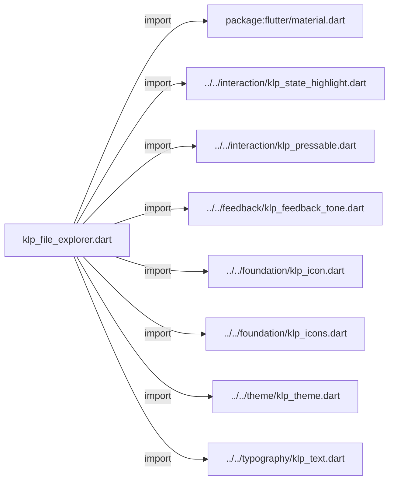

## 依賴證據

| 關係 | 原始 directive | 來源 |
|---|---|---|
| import | <code>import &#x27;package:flutter/material.dart&#x27;;</code> | [lib/src/navigation/explorer/klp_file_explorer.dart:1](../../../../../lib/src/navigation/explorer/klp_file_explorer.dart#L1) |
| import | <code>import &#x27;../../interaction/klp_state_highlight.dart&#x27;;</code> | [lib/src/navigation/explorer/klp_file_explorer.dart:3](../../../../../lib/src/navigation/explorer/klp_file_explorer.dart#L3) |
| import | <code>import &#x27;../../interaction/klp_pressable.dart&#x27;;</code> | [lib/src/navigation/explorer/klp_file_explorer.dart:4](../../../../../lib/src/navigation/explorer/klp_file_explorer.dart#L4) |
| import | <code>import &#x27;../../feedback/klp_feedback_tone.dart&#x27;;</code> | [lib/src/navigation/explorer/klp_file_explorer.dart:5](../../../../../lib/src/navigation/explorer/klp_file_explorer.dart#L5) |
| import | <code>import &#x27;../../foundation/klp_icon.dart&#x27;;</code> | [lib/src/navigation/explorer/klp_file_explorer.dart:6](../../../../../lib/src/navigation/explorer/klp_file_explorer.dart#L6) |
| import | <code>import &#x27;../../foundation/klp_icons.dart&#x27;;</code> | [lib/src/navigation/explorer/klp_file_explorer.dart:7](../../../../../lib/src/navigation/explorer/klp_file_explorer.dart#L7) |
| import | <code>import &#x27;../../theme/klp_theme.dart&#x27;;</code> | [lib/src/navigation/explorer/klp_file_explorer.dart:8](../../../../../lib/src/navigation/explorer/klp_file_explorer.dart#L8) |
| import | <code>import &#x27;../../typography/klp_text.dart&#x27;;</code> | [lib/src/navigation/explorer/klp_file_explorer.dart:9](../../../../../lib/src/navigation/explorer/klp_file_explorer.dart#L9) |

## 宣告關係圖

本組節點是本檔宣告；沒有箭頭的宣告未在此圖主張互相依賴。

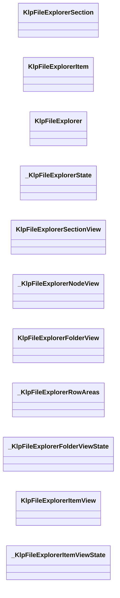

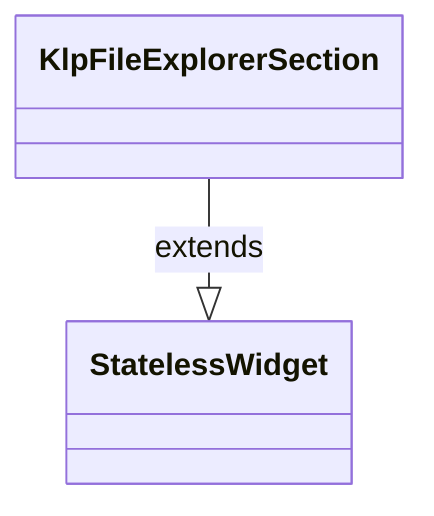

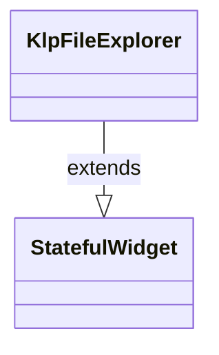

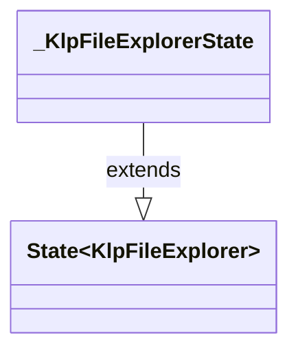

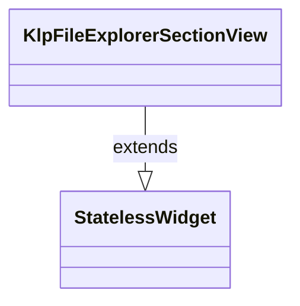

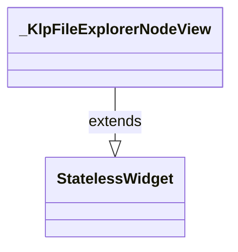

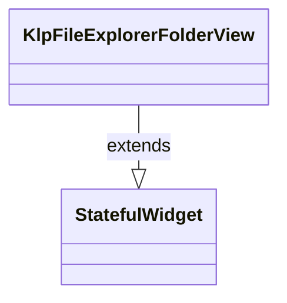

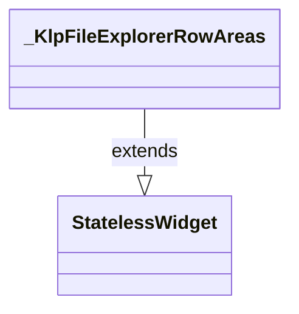

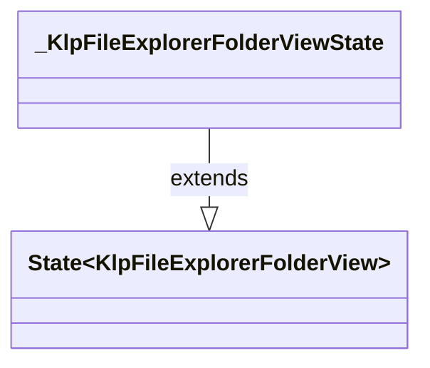

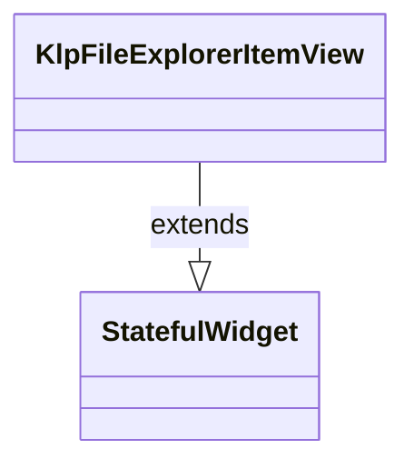

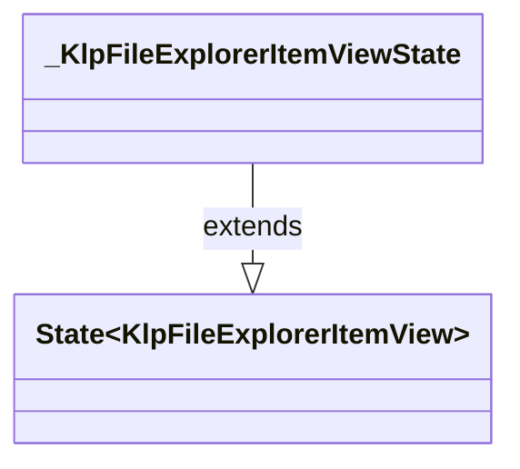

## 宣告與成員證據

成員包含 public 與 private；簽章取自來源，省略函式本體與欄位初始值。`(inferred)` 表示來源未明寫型別；建構子只顯示參數部分，不含初始化列表。

### KlpFileExplorerSection

ClassDeclaration · public · [lib/src/navigation/explorer/klp_file_explorer.dart:11](../../../../../lib/src/navigation/explorer/klp_file_explorer.dart#L11)

<code>class KlpFileExplorerSection extends StatelessWidget</code>

來源註解摘要：檔案瀏覽器中的分類資料模型（例如「釘選」、「筆記」）。

- `extends` → <code>StatelessWidget</code>：[lib/src/navigation/explorer/klp_file_explorer.dart:13](../../../../../lib/src/navigation/explorer/klp_file_explorer.dart#L13)

| 成員 | 可見性 | 簽章／型別 | 來源註解摘要 | 證據 |
|---|---|---|---|---|
| constructor <code>KlpFileExplorerSection</code> | public | <code>const KlpFileExplorerSection({ super.key, required this.id, required this.title, this.items = const [], this.expanded = true, this.collapsible = true, this.trailing, })</code> |  | [lib/src/navigation/explorer/klp_file_explorer.dart:14](../../../../../lib/src/navigation/explorer/klp_file_explorer.dart#L14) |
| constructor <code>_render</code> | private | <code>KlpFileExplorerSection._render({ required KlpFileExplorerSection section, required Widget child, })</code> |  | [lib/src/navigation/explorer/klp_file_explorer.dart:24](../../../../../lib/src/navigation/explorer/klp_file_explorer.dart#L24) |
| field <code>id</code> | public | <code>final String id</code> |  | [lib/src/navigation/explorer/klp_file_explorer.dart:36](../../../../../lib/src/navigation/explorer/klp_file_explorer.dart#L36) |
| field <code>title</code> | public | <code>final String title</code> |  | [lib/src/navigation/explorer/klp_file_explorer.dart:37](../../../../../lib/src/navigation/explorer/klp_file_explorer.dart#L37) |
| field <code>items</code> | public | <code>final List&lt;KlpFileExplorerItem&gt; items</code> |  | [lib/src/navigation/explorer/klp_file_explorer.dart:38](../../../../../lib/src/navigation/explorer/klp_file_explorer.dart#L38) |
| field <code>expanded</code> | public | <code>final bool expanded</code> |  | [lib/src/navigation/explorer/klp_file_explorer.dart:39](../../../../../lib/src/navigation/explorer/klp_file_explorer.dart#L39) |
| field <code>collapsible</code> | public | <code>final bool collapsible</code> |  | [lib/src/navigation/explorer/klp_file_explorer.dart:40](../../../../../lib/src/navigation/explorer/klp_file_explorer.dart#L40) |
| field <code>trailing</code> | public | <code>final Widget? trailing</code> |  | [lib/src/navigation/explorer/klp_file_explorer.dart:41](../../../../../lib/src/navigation/explorer/klp_file_explorer.dart#L41) |
| field <code>_renderedChild</code> | private | <code>final Widget? _renderedChild</code> |  | [lib/src/navigation/explorer/klp_file_explorer.dart:42](../../../../../lib/src/navigation/explorer/klp_file_explorer.dart#L42) |
| method <code>build</code> | public | <code>Widget build(BuildContext context)</code> |  | [lib/src/navigation/explorer/klp_file_explorer.dart:44](../../../../../lib/src/navigation/explorer/klp_file_explorer.dart#L44) |

### KlpFileExplorerItem

ClassDeclaration · public · [lib/src/navigation/explorer/klp_file_explorer.dart:50](../../../../../lib/src/navigation/explorer/klp_file_explorer.dart#L50)

<code>class KlpFileExplorerItem</code>

來源註解摘要：檔案瀏覽器中的節點資料模型（可為折疊資料夾或一般檔案項目）。

| 成員 | 可見性 | 簽章／型別 | 來源註解摘要 | 證據 |
|---|---|---|---|---|
| constructor <code>KlpFileExplorerItem</code> | public | <code>const KlpFileExplorerItem({ required this.id, required this.label, this.icon, this.children = const [], this.folder = false, this.expanded = false, this.selected = false, this.badge, this.tone, this.trailing, this.data, })</code> |  | [lib/src/navigation/explorer/klp_file_explorer.dart:53](../../../../../lib/src/navigation/explorer/klp_file_explorer.dart#L53) |
| field <code>id</code> | public | <code>final String id</code> |  | [lib/src/navigation/explorer/klp_file_explorer.dart:67](../../../../../lib/src/navigation/explorer/klp_file_explorer.dart#L67) |
| field <code>label</code> | public | <code>final String label</code> |  | [lib/src/navigation/explorer/klp_file_explorer.dart:68](../../../../../lib/src/navigation/explorer/klp_file_explorer.dart#L68) |
| field <code>icon</code> | public | <code>final KlpIconData? icon</code> |  | [lib/src/navigation/explorer/klp_file_explorer.dart:69](../../../../../lib/src/navigation/explorer/klp_file_explorer.dart#L69) |
| field <code>children</code> | public | <code>final List&lt;KlpFileExplorerItem&gt; children</code> |  | [lib/src/navigation/explorer/klp_file_explorer.dart:70](../../../../../lib/src/navigation/explorer/klp_file_explorer.dart#L70) |
| field <code>folder</code> | public | <code>final bool folder</code> |  | [lib/src/navigation/explorer/klp_file_explorer.dart:71](../../../../../lib/src/navigation/explorer/klp_file_explorer.dart#L71) |
| field <code>expanded</code> | public | <code>final bool expanded</code> |  | [lib/src/navigation/explorer/klp_file_explorer.dart:72](../../../../../lib/src/navigation/explorer/klp_file_explorer.dart#L72) |
| field <code>selected</code> | public | <code>final bool selected</code> |  | [lib/src/navigation/explorer/klp_file_explorer.dart:73](../../../../../lib/src/navigation/explorer/klp_file_explorer.dart#L73) |
| field <code>badge</code> | public | <code>final String? badge</code> |  | [lib/src/navigation/explorer/klp_file_explorer.dart:74](../../../../../lib/src/navigation/explorer/klp_file_explorer.dart#L74) |
| field <code>tone</code> | public | <code>final KlpFeedbackTone? tone</code> |  | [lib/src/navigation/explorer/klp_file_explorer.dart:75](../../../../../lib/src/navigation/explorer/klp_file_explorer.dart#L75) |
| field <code>trailing</code> | public | <code>final Widget? trailing</code> |  | [lib/src/navigation/explorer/klp_file_explorer.dart:76](../../../../../lib/src/navigation/explorer/klp_file_explorer.dart#L76) |
| field <code>data</code> | public | <code>final Object? data</code> |  | [lib/src/navigation/explorer/klp_file_explorer.dart:77](../../../../../lib/src/navigation/explorer/klp_file_explorer.dart#L77) |
| getter <code>isFolder</code> | public | <code>bool get isFolder</code> |  | [lib/src/navigation/explorer/klp_file_explorer.dart:79](../../../../../lib/src/navigation/explorer/klp_file_explorer.dart#L79) |

### KlpFileExplorer

ClassDeclaration · public · [lib/src/navigation/explorer/klp_file_explorer.dart:82](../../../../../lib/src/navigation/explorer/klp_file_explorer.dart#L82)

<code>class KlpFileExplorer extends StatefulWidget</code>

來源註解摘要：檔案瀏覽器（File Explorer）。 支援分類分組（可折疊）、資料夾樹狀結構（可展開）與一般檔案節點選取。 支援受控（傳入 `expandedSectionIds` / `expandedItemIds` / `selectedId`） 與非受控（讀取各 Section 與 Item 的 `expanded` / `selected` 屬性）兩種模式。

- `extends` → <code>StatefulWidget</code>：[lib/src/navigation/explorer/klp_file_explorer.dart:87](../../../../../lib/src/navigation/explorer/klp_file_explorer.dart#L87)

| 成員 | 可見性 | 簽章／型別 | 來源註解摘要 | 證據 |
|---|---|---|---|---|
| constructor <code>KlpFileExplorer</code> | public | <code>const KlpFileExplorer({ super.key, required this.sections, this.expandedSectionIds, this.expandedItemIds, this.selectedId, this.onSectionToggle, this.onItemToggle, this.onItemSelected, this.indent, this.emptyStateSections = const [], this.scrollController, this.sectionPadding, this.sectionMargin, this.itemPadding, })</code> |  | [lib/src/navigation/explorer/klp_file_explorer.dart:88](../../../../../lib/src/navigation/explorer/klp_file_explorer.dart#L88) |
| field <code>sections</code> | public | <code>final List&lt;KlpFileExplorerSection&gt; sections</code> |  | [lib/src/navigation/explorer/klp_file_explorer.dart:105](../../../../../lib/src/navigation/explorer/klp_file_explorer.dart#L105) |
| field <code>expandedSectionIds</code> | public | <code>final Set&lt;String&gt;? expandedSectionIds</code> |  | [lib/src/navigation/explorer/klp_file_explorer.dart:106](../../../../../lib/src/navigation/explorer/klp_file_explorer.dart#L106) |
| field <code>expandedItemIds</code> | public | <code>final Set&lt;String&gt;? expandedItemIds</code> |  | [lib/src/navigation/explorer/klp_file_explorer.dart:107](../../../../../lib/src/navigation/explorer/klp_file_explorer.dart#L107) |
| field <code>selectedId</code> | public | <code>final String? selectedId</code> |  | [lib/src/navigation/explorer/klp_file_explorer.dart:108](../../../../../lib/src/navigation/explorer/klp_file_explorer.dart#L108) |
| field <code>onSectionToggle</code> | public | <code>final ValueChanged&lt;String&gt;? onSectionToggle</code> |  | [lib/src/navigation/explorer/klp_file_explorer.dart:109](../../../../../lib/src/navigation/explorer/klp_file_explorer.dart#L109) |
| field <code>onItemToggle</code> | public | <code>final ValueChanged&lt;String&gt;? onItemToggle</code> |  | [lib/src/navigation/explorer/klp_file_explorer.dart:110](../../../../../lib/src/navigation/explorer/klp_file_explorer.dart#L110) |
| field <code>onItemSelected</code> | public | <code>final ValueChanged&lt;String&gt;? onItemSelected</code> |  | [lib/src/navigation/explorer/klp_file_explorer.dart:111](../../../../../lib/src/navigation/explorer/klp_file_explorer.dart#L111) |
| field <code>indent</code> | public | <code>final double? indent</code> |  | [lib/src/navigation/explorer/klp_file_explorer.dart:112](../../../../../lib/src/navigation/explorer/klp_file_explorer.dart#L112) |
| field <code>scrollController</code> | public | <code>final ScrollController? scrollController</code> |  | [lib/src/navigation/explorer/klp_file_explorer.dart:113](../../../../../lib/src/navigation/explorer/klp_file_explorer.dart#L113) |
| field <code>sectionPadding</code> | public | <code>final EdgeInsetsGeometry? sectionPadding</code> |  | [lib/src/navigation/explorer/klp_file_explorer.dart:114](../../../../../lib/src/navigation/explorer/klp_file_explorer.dart#L114) |
| field <code>sectionMargin</code> | public | <code>final EdgeInsetsGeometry? sectionMargin</code> |  | [lib/src/navigation/explorer/klp_file_explorer.dart:115](../../../../../lib/src/navigation/explorer/klp_file_explorer.dart#L115) |
| field <code>itemPadding</code> | public | <code>final EdgeInsetsGeometry? itemPadding</code> |  | [lib/src/navigation/explorer/klp_file_explorer.dart:116](../../../../../lib/src/navigation/explorer/klp_file_explorer.dart#L116) |
| field <code>emptyStateSections</code> | public | <code>final List&lt;KlpFileExplorerSection&gt; emptyStateSections</code> | [sections] 沒有資料時仍需保留的視覺分區。 這只描述 Explorer 結構，不會把 placeholder section 寫回資料模型。 | [lib/src/navigation/explorer/klp_file_explorer.dart:121](../../../../../lib/src/navigation/explorer/klp_file_explorer.dart#L121) |
| method <code>createState</code> | public | <code>State&lt;KlpFileExplorer&gt; createState()</code> |  | [lib/src/navigation/explorer/klp_file_explorer.dart:123](../../../../../lib/src/navigation/explorer/klp_file_explorer.dart#L123) |

### _KlpFileExplorerState

ClassDeclaration · private · [lib/src/navigation/explorer/klp_file_explorer.dart:127](../../../../../lib/src/navigation/explorer/klp_file_explorer.dart#L127)

<code>class _KlpFileExplorerState extends State&lt;KlpFileExplorer&gt;</code>

- `extends` → <code>State&lt;KlpFileExplorer&gt;</code>：[lib/src/navigation/explorer/klp_file_explorer.dart:127](../../../../../lib/src/navigation/explorer/klp_file_explorer.dart#L127)

| 成員 | 可見性 | 簽章／型別 | 來源註解摘要 | 證據 |
|---|---|---|---|---|
| field <code>_internalExpandedSections</code> | private | <code>late Set&lt;String&gt; _internalExpandedSections</code> |  | [lib/src/navigation/explorer/klp_file_explorer.dart:128](../../../../../lib/src/navigation/explorer/klp_file_explorer.dart#L128) |
| field <code>_internalExpandedItems</code> | private | <code>late Set&lt;String&gt; _internalExpandedItems</code> |  | [lib/src/navigation/explorer/klp_file_explorer.dart:129](../../../../../lib/src/navigation/explorer/klp_file_explorer.dart#L129) |
| field <code>_internalSelectedId</code> | private | <code>String? _internalSelectedId</code> |  | [lib/src/navigation/explorer/klp_file_explorer.dart:130](../../../../../lib/src/navigation/explorer/klp_file_explorer.dart#L130) |
| method <code>initState</code> | public | <code>void initState()</code> |  | [lib/src/navigation/explorer/klp_file_explorer.dart:132](../../../../../lib/src/navigation/explorer/klp_file_explorer.dart#L132) |
| method <code>_collectExpandedItems</code> | private | <code>void _collectExpandedItems( List&lt;KlpFileExplorerSection&gt; sections, Set&lt;String&gt; target, )</code> |  | [lib/src/navigation/explorer/klp_file_explorer.dart:147](../../../../../lib/src/navigation/explorer/klp_file_explorer.dart#L147) |
| method <code>_toggleSection</code> | private | <code>void _toggleSection(String id)</code> |  | [lib/src/navigation/explorer/klp_file_explorer.dart:167](../../../../../lib/src/navigation/explorer/klp_file_explorer.dart#L167) |
| method <code>_toggleItem</code> | private | <code>void _toggleItem(String id)</code> |  | [lib/src/navigation/explorer/klp_file_explorer.dart:181](../../../../../lib/src/navigation/explorer/klp_file_explorer.dart#L181) |
| method <code>_selectItem</code> | private | <code>void _selectItem(String id)</code> |  | [lib/src/navigation/explorer/klp_file_explorer.dart:195](../../../../../lib/src/navigation/explorer/klp_file_explorer.dart#L195) |
| method <code>_firstSelectedItemId</code> | private | <code>String? _firstSelectedItemId(List&lt;KlpFileExplorerSection&gt; sections)</code> |  | [lib/src/navigation/explorer/klp_file_explorer.dart:205](../../../../../lib/src/navigation/explorer/klp_file_explorer.dart#L205) |
| method <code>build</code> | public | <code>Widget build(BuildContext context)</code> |  | [lib/src/navigation/explorer/klp_file_explorer.dart:226](../../../../../lib/src/navigation/explorer/klp_file_explorer.dart#L226) |

### KlpFileExplorerSectionView

ClassDeclaration · public · [lib/src/navigation/explorer/klp_file_explorer.dart:269](../../../../../lib/src/navigation/explorer/klp_file_explorer.dart#L269)

<code>class KlpFileExplorerSectionView extends StatelessWidget</code>

來源註解摘要：分類區塊視圖（含分類標題、折疊動畫與項目清單）。

- `extends` → <code>StatelessWidget</code>：[lib/src/navigation/explorer/klp_file_explorer.dart:270](../../../../../lib/src/navigation/explorer/klp_file_explorer.dart#L270)

| 成員 | 可見性 | 簽章／型別 | 來源註解摘要 | 證據 |
|---|---|---|---|---|
| constructor <code>KlpFileExplorerSectionView</code> | public | <code>const KlpFileExplorerSectionView({ super.key, required this.section, required this.isExpanded, required this.expandedItemIds, required this.selectedId, required this.onToggle, required this.onItemToggle, required this.onItemSelected, required this.indent, this.sectionPadding, this.sectionMargin, this.itemPadding, })</code> |  | [lib/src/navigation/explorer/klp_file_explorer.dart:271](../../../../../lib/src/navigation/explorer/klp_file_explorer.dart#L271) |
| field <code>section</code> | public | <code>final KlpFileExplorerSection section</code> |  | [lib/src/navigation/explorer/klp_file_explorer.dart:286](../../../../../lib/src/navigation/explorer/klp_file_explorer.dart#L286) |
| field <code>isExpanded</code> | public | <code>final bool isExpanded</code> |  | [lib/src/navigation/explorer/klp_file_explorer.dart:287](../../../../../lib/src/navigation/explorer/klp_file_explorer.dart#L287) |
| field <code>expandedItemIds</code> | public | <code>final Set&lt;String&gt; expandedItemIds</code> |  | [lib/src/navigation/explorer/klp_file_explorer.dart:288](../../../../../lib/src/navigation/explorer/klp_file_explorer.dart#L288) |
| field <code>selectedId</code> | public | <code>final String? selectedId</code> |  | [lib/src/navigation/explorer/klp_file_explorer.dart:289](../../../../../lib/src/navigation/explorer/klp_file_explorer.dart#L289) |
| field <code>onToggle</code> | public | <code>final VoidCallback onToggle</code> |  | [lib/src/navigation/explorer/klp_file_explorer.dart:290](../../../../../lib/src/navigation/explorer/klp_file_explorer.dart#L290) |
| field <code>onItemToggle</code> | public | <code>final ValueChanged&lt;String&gt; onItemToggle</code> |  | [lib/src/navigation/explorer/klp_file_explorer.dart:291](../../../../../lib/src/navigation/explorer/klp_file_explorer.dart#L291) |
| field <code>onItemSelected</code> | public | <code>final ValueChanged&lt;String&gt; onItemSelected</code> |  | [lib/src/navigation/explorer/klp_file_explorer.dart:292](../../../../../lib/src/navigation/explorer/klp_file_explorer.dart#L292) |
| field <code>indent</code> | public | <code>final double indent</code> |  | [lib/src/navigation/explorer/klp_file_explorer.dart:293](../../../../../lib/src/navigation/explorer/klp_file_explorer.dart#L293) |
| field <code>sectionPadding</code> | public | <code>final EdgeInsetsGeometry? sectionPadding</code> |  | [lib/src/navigation/explorer/klp_file_explorer.dart:294](../../../../../lib/src/navigation/explorer/klp_file_explorer.dart#L294) |
| field <code>sectionMargin</code> | public | <code>final EdgeInsetsGeometry? sectionMargin</code> |  | [lib/src/navigation/explorer/klp_file_explorer.dart:295](../../../../../lib/src/navigation/explorer/klp_file_explorer.dart#L295) |
| field <code>itemPadding</code> | public | <code>final EdgeInsetsGeometry? itemPadding</code> |  | [lib/src/navigation/explorer/klp_file_explorer.dart:296](../../../../../lib/src/navigation/explorer/klp_file_explorer.dart#L296) |
| method <code>build</code> | public | <code>Widget build(BuildContext context)</code> |  | [lib/src/navigation/explorer/klp_file_explorer.dart:298](../../../../../lib/src/navigation/explorer/klp_file_explorer.dart#L298) |

### _KlpFileExplorerNodeView

ClassDeclaration · private · [lib/src/navigation/explorer/klp_file_explorer.dart:366](../../../../../lib/src/navigation/explorer/klp_file_explorer.dart#L366)

<code>class _KlpFileExplorerNodeView extends StatelessWidget</code>

- `extends` → <code>StatelessWidget</code>：[lib/src/navigation/explorer/klp_file_explorer.dart:366](../../../../../lib/src/navigation/explorer/klp_file_explorer.dart#L366)

| 成員 | 可見性 | 簽章／型別 | 來源註解摘要 | 證據 |
|---|---|---|---|---|
| constructor <code>_KlpFileExplorerNodeView</code> | private | <code>const _KlpFileExplorerNodeView({ required this.item, required this.level, required this.expandedItemIds, required this.selectedId, required this.onItemToggle, required this.onItemSelected, required this.indent, this.itemPadding, })</code> |  | [lib/src/navigation/explorer/klp_file_explorer.dart:367](../../../../../lib/src/navigation/explorer/klp_file_explorer.dart#L367) |
| field <code>item</code> | public | <code>final KlpFileExplorerItem item</code> |  | [lib/src/navigation/explorer/klp_file_explorer.dart:378](../../../../../lib/src/navigation/explorer/klp_file_explorer.dart#L378) |
| field <code>level</code> | public | <code>final int level</code> |  | [lib/src/navigation/explorer/klp_file_explorer.dart:379](../../../../../lib/src/navigation/explorer/klp_file_explorer.dart#L379) |
| field <code>expandedItemIds</code> | public | <code>final Set&lt;String&gt; expandedItemIds</code> |  | [lib/src/navigation/explorer/klp_file_explorer.dart:380](../../../../../lib/src/navigation/explorer/klp_file_explorer.dart#L380) |
| field <code>selectedId</code> | public | <code>final String? selectedId</code> |  | [lib/src/navigation/explorer/klp_file_explorer.dart:381](../../../../../lib/src/navigation/explorer/klp_file_explorer.dart#L381) |
| field <code>onItemToggle</code> | public | <code>final ValueChanged&lt;String&gt; onItemToggle</code> |  | [lib/src/navigation/explorer/klp_file_explorer.dart:382](../../../../../lib/src/navigation/explorer/klp_file_explorer.dart#L382) |
| field <code>onItemSelected</code> | public | <code>final ValueChanged&lt;String&gt; onItemSelected</code> |  | [lib/src/navigation/explorer/klp_file_explorer.dart:383](../../../../../lib/src/navigation/explorer/klp_file_explorer.dart#L383) |
| field <code>indent</code> | public | <code>final double indent</code> |  | [lib/src/navigation/explorer/klp_file_explorer.dart:384](../../../../../lib/src/navigation/explorer/klp_file_explorer.dart#L384) |
| field <code>itemPadding</code> | public | <code>final EdgeInsetsGeometry? itemPadding</code> |  | [lib/src/navigation/explorer/klp_file_explorer.dart:385](../../../../../lib/src/navigation/explorer/klp_file_explorer.dart#L385) |
| method <code>build</code> | public | <code>Widget build(BuildContext context)</code> |  | [lib/src/navigation/explorer/klp_file_explorer.dart:387](../../../../../lib/src/navigation/explorer/klp_file_explorer.dart#L387) |

### KlpFileExplorerFolderView

ClassDeclaration · public · [lib/src/navigation/explorer/klp_file_explorer.dart:437](../../../../../lib/src/navigation/explorer/klp_file_explorer.dart#L437)

<code>class KlpFileExplorerFolderView extends StatefulWidget</code>

來源註解摘要：折疊資料夾視圖（帶展開箭頭、資料夾圖示與縮排）。

- `extends` → <code>StatefulWidget</code>：[lib/src/navigation/explorer/klp_file_explorer.dart:438](../../../../../lib/src/navigation/explorer/klp_file_explorer.dart#L438)

| 成員 | 可見性 | 簽章／型別 | 來源註解摘要 | 證據 |
|---|---|---|---|---|
| constructor <code>KlpFileExplorerFolderView</code> | public | <code>const KlpFileExplorerFolderView({ super.key, required this.item, required this.level, required this.isExpanded, required this.isSelected, required this.onToggle, required this.onTap, required this.indent, this.itemPadding, })</code> |  | [lib/src/navigation/explorer/klp_file_explorer.dart:439](../../../../../lib/src/navigation/explorer/klp_file_explorer.dart#L439) |
| field <code>item</code> | public | <code>final KlpFileExplorerItem item</code> |  | [lib/src/navigation/explorer/klp_file_explorer.dart:451](../../../../../lib/src/navigation/explorer/klp_file_explorer.dart#L451) |
| field <code>level</code> | public | <code>final int level</code> |  | [lib/src/navigation/explorer/klp_file_explorer.dart:452](../../../../../lib/src/navigation/explorer/klp_file_explorer.dart#L452) |
| field <code>isExpanded</code> | public | <code>final bool isExpanded</code> |  | [lib/src/navigation/explorer/klp_file_explorer.dart:453](../../../../../lib/src/navigation/explorer/klp_file_explorer.dart#L453) |
| field <code>isSelected</code> | public | <code>final bool isSelected</code> |  | [lib/src/navigation/explorer/klp_file_explorer.dart:454](../../../../../lib/src/navigation/explorer/klp_file_explorer.dart#L454) |
| field <code>onToggle</code> | public | <code>final VoidCallback onToggle</code> |  | [lib/src/navigation/explorer/klp_file_explorer.dart:455](../../../../../lib/src/navigation/explorer/klp_file_explorer.dart#L455) |
| field <code>onTap</code> | public | <code>final VoidCallback onTap</code> |  | [lib/src/navigation/explorer/klp_file_explorer.dart:456](../../../../../lib/src/navigation/explorer/klp_file_explorer.dart#L456) |
| field <code>indent</code> | public | <code>final double indent</code> |  | [lib/src/navigation/explorer/klp_file_explorer.dart:457](../../../../../lib/src/navigation/explorer/klp_file_explorer.dart#L457) |
| field <code>itemPadding</code> | public | <code>final EdgeInsetsGeometry? itemPadding</code> |  | [lib/src/navigation/explorer/klp_file_explorer.dart:458](../../../../../lib/src/navigation/explorer/klp_file_explorer.dart#L458) |
| method <code>createState</code> | public | <code>State&lt;KlpFileExplorerFolderView&gt; createState()</code> |  | [lib/src/navigation/explorer/klp_file_explorer.dart:460](../../../../../lib/src/navigation/explorer/klp_file_explorer.dart#L460) |

### _KlpFileExplorerRowAreas

ClassDeclaration · private · [lib/src/navigation/explorer/klp_file_explorer.dart:465](../../../../../lib/src/navigation/explorer/klp_file_explorer.dart#L465)

<code>class _KlpFileExplorerRowAreas extends StatelessWidget</code>

來源註解摘要：將樹狀控制區與內容區分開，讓同層節點以內容圖示左緣對齊。

- `extends` → <code>StatelessWidget</code>：[lib/src/navigation/explorer/klp_file_explorer.dart:466](../../../../../lib/src/navigation/explorer/klp_file_explorer.dart#L466)

| 成員 | 可見性 | 簽章／型別 | 來源註解摘要 | 證據 |
|---|---|---|---|---|
| constructor <code>_KlpFileExplorerRowAreas</code> | private | <code>const _KlpFileExplorerRowAreas({ required this.level, required this.indent, required this.content, this.leading, })</code> |  | [lib/src/navigation/explorer/klp_file_explorer.dart:467](../../../../../lib/src/navigation/explorer/klp_file_explorer.dart#L467) |
| field <code>level</code> | public | <code>final int level</code> |  | [lib/src/navigation/explorer/klp_file_explorer.dart:474](../../../../../lib/src/navigation/explorer/klp_file_explorer.dart#L474) |
| field <code>indent</code> | public | <code>final double indent</code> |  | [lib/src/navigation/explorer/klp_file_explorer.dart:475](../../../../../lib/src/navigation/explorer/klp_file_explorer.dart#L475) |
| field <code>leading</code> | public | <code>final Widget? leading</code> |  | [lib/src/navigation/explorer/klp_file_explorer.dart:476](../../../../../lib/src/navigation/explorer/klp_file_explorer.dart#L476) |
| field <code>content</code> | public | <code>final Widget content</code> |  | [lib/src/navigation/explorer/klp_file_explorer.dart:477](../../../../../lib/src/navigation/explorer/klp_file_explorer.dart#L477) |
| method <code>build</code> | public | <code>Widget build(BuildContext context)</code> |  | [lib/src/navigation/explorer/klp_file_explorer.dart:479](../../../../../lib/src/navigation/explorer/klp_file_explorer.dart#L479) |

### _KlpFileExplorerFolderViewState

ClassDeclaration · private · [lib/src/navigation/explorer/klp_file_explorer.dart:506](../../../../../lib/src/navigation/explorer/klp_file_explorer.dart#L506)

<code>class _KlpFileExplorerFolderViewState extends State&lt;KlpFileExplorerFolderView&gt;</code>

- `extends` → <code>State&lt;KlpFileExplorerFolderView&gt;</code>：[lib/src/navigation/explorer/klp_file_explorer.dart:506](../../../../../lib/src/navigation/explorer/klp_file_explorer.dart#L506)

| 成員 | 可見性 | 簽章／型別 | 來源註解摘要 | 證據 |
|---|---|---|---|---|
| field <code>_isHovered</code> | private | <code>bool _isHovered</code> |  | [lib/src/navigation/explorer/klp_file_explorer.dart:507](../../../../../lib/src/navigation/explorer/klp_file_explorer.dart#L507) |
| method <code>build</code> | public | <code>Widget build(BuildContext context)</code> |  | [lib/src/navigation/explorer/klp_file_explorer.dart:509](../../../../../lib/src/navigation/explorer/klp_file_explorer.dart#L509) |

### KlpFileExplorerItemView

ClassDeclaration · public · [lib/src/navigation/explorer/klp_file_explorer.dart:587](../../../../../lib/src/navigation/explorer/klp_file_explorer.dart#L587)

<code>class KlpFileExplorerItemView extends StatefulWidget</code>

來源註解摘要：一般檔案項目視圖（含檔案圖示、文字標題、選取高亮與 Hover 回饋）。

- `extends` → <code>StatefulWidget</code>：[lib/src/navigation/explorer/klp_file_explorer.dart:588](../../../../../lib/src/navigation/explorer/klp_file_explorer.dart#L588)

| 成員 | 可見性 | 簽章／型別 | 來源註解摘要 | 證據 |
|---|---|---|---|---|
| constructor <code>KlpFileExplorerItemView</code> | public | <code>const KlpFileExplorerItemView({ super.key, required this.item, required this.level, required this.isSelected, required this.onTap, required this.indent, this.itemPadding, })</code> |  | [lib/src/navigation/explorer/klp_file_explorer.dart:589](../../../../../lib/src/navigation/explorer/klp_file_explorer.dart#L589) |
| field <code>item</code> | public | <code>final KlpFileExplorerItem item</code> |  | [lib/src/navigation/explorer/klp_file_explorer.dart:599](../../../../../lib/src/navigation/explorer/klp_file_explorer.dart#L599) |
| field <code>level</code> | public | <code>final int level</code> |  | [lib/src/navigation/explorer/klp_file_explorer.dart:600](../../../../../lib/src/navigation/explorer/klp_file_explorer.dart#L600) |
| field <code>isSelected</code> | public | <code>final bool isSelected</code> |  | [lib/src/navigation/explorer/klp_file_explorer.dart:601](../../../../../lib/src/navigation/explorer/klp_file_explorer.dart#L601) |
| field <code>onTap</code> | public | <code>final VoidCallback onTap</code> |  | [lib/src/navigation/explorer/klp_file_explorer.dart:602](../../../../../lib/src/navigation/explorer/klp_file_explorer.dart#L602) |
| field <code>indent</code> | public | <code>final double indent</code> |  | [lib/src/navigation/explorer/klp_file_explorer.dart:603](../../../../../lib/src/navigation/explorer/klp_file_explorer.dart#L603) |
| field <code>itemPadding</code> | public | <code>final EdgeInsetsGeometry? itemPadding</code> |  | [lib/src/navigation/explorer/klp_file_explorer.dart:604](../../../../../lib/src/navigation/explorer/klp_file_explorer.dart#L604) |
| method <code>createState</code> | public | <code>State&lt;KlpFileExplorerItemView&gt; createState()</code> |  | [lib/src/navigation/explorer/klp_file_explorer.dart:606](../../../../../lib/src/navigation/explorer/klp_file_explorer.dart#L606) |

### _KlpFileExplorerItemViewState

ClassDeclaration · private · [lib/src/navigation/explorer/klp_file_explorer.dart:611](../../../../../lib/src/navigation/explorer/klp_file_explorer.dart#L611)

<code>class _KlpFileExplorerItemViewState extends State&lt;KlpFileExplorerItemView&gt;</code>

- `extends` → <code>State&lt;KlpFileExplorerItemView&gt;</code>：[lib/src/navigation/explorer/klp_file_explorer.dart:611](../../../../../lib/src/navigation/explorer/klp_file_explorer.dart#L611)

| 成員 | 可見性 | 簽章／型別 | 來源註解摘要 | 證據 |
|---|---|---|---|---|
| field <code>_isHovered</code> | private | <code>bool _isHovered</code> |  | [lib/src/navigation/explorer/klp_file_explorer.dart:612](../../../../../lib/src/navigation/explorer/klp_file_explorer.dart#L612) |
| method <code>build</code> | public | <code>Widget build(BuildContext context)</code> |  | [lib/src/navigation/explorer/klp_file_explorer.dart:614](../../../../../lib/src/navigation/explorer/klp_file_explorer.dart#L614) |

## 閱讀說明與限制

箭頭只表示來源明寫的靜態關係；import 不等於呼叫。未分析動態呼叫、欄位的實際物件擁有權、狀態轉移或渲染流程；型別未進行語意解析，繼承目標保留原始型別拼寫。public／private 依 Dart 名稱前綴判斷；public 宣告不代表已由 `lib/kallopis.dart` 匯出。

本頁由 `tool/architecture_atlas` 產生；編輯來源或生成工具後重新產生，避免手改本頁。
