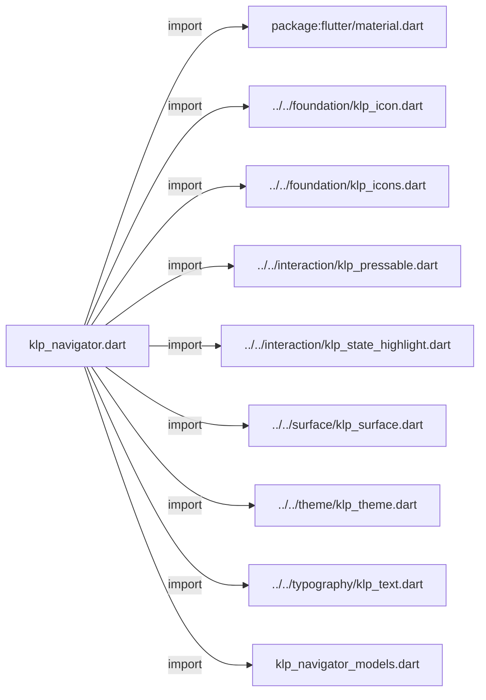
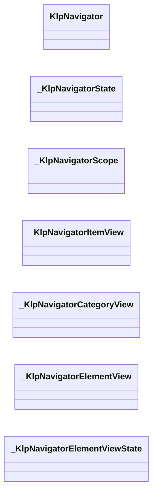
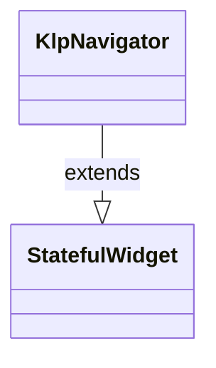
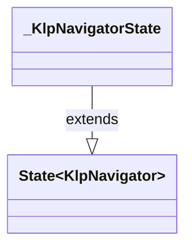
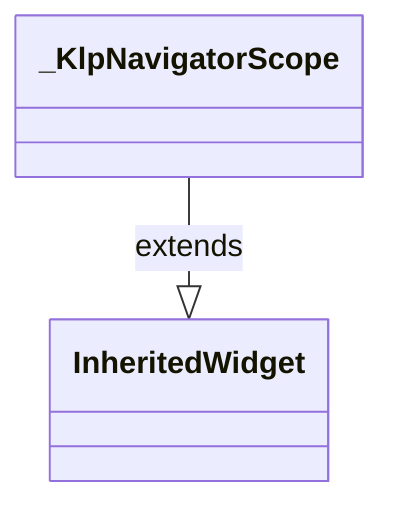
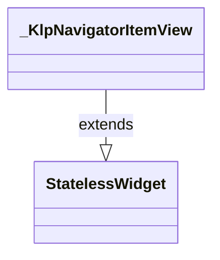
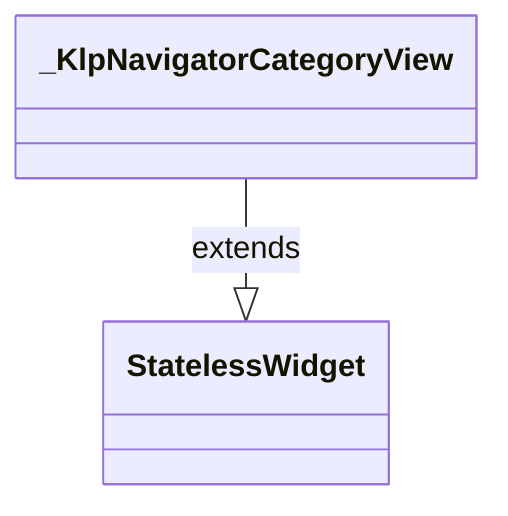
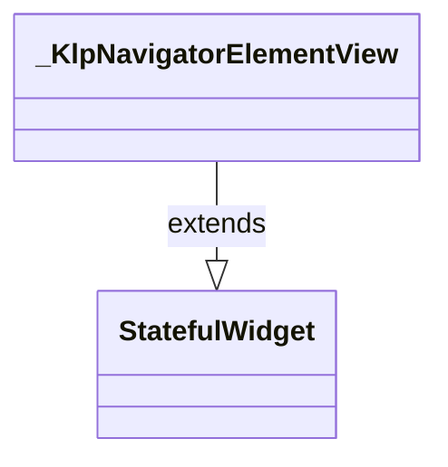
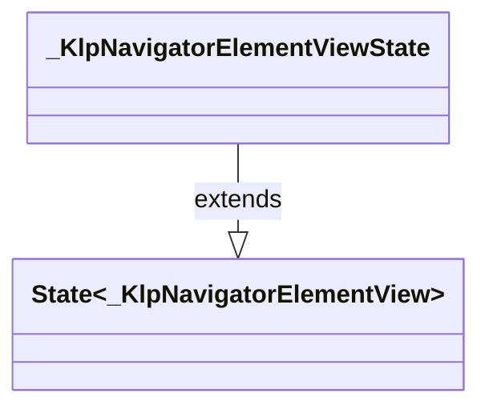

# klp_navigator.dart：直接依賴與宣告架構

[回到目錄](README.md) · [來源檔案](../../../../../lib/src/navigation/navigator/klp_navigator.dart)

## 範圍

核心是 `lib/src/navigation/navigator/klp_navigator.dart`。主要視角為該檔案明寫的 import／export／part；輔助視角為本檔宣告及 extends／implements／with／on 關係。只展開一層外部邊界。

## 直接依賴圖

## 依賴證據

| 關係 | 原始 directive | 來源 |
|---|---|---|
| import | <code>import &#x27;package:flutter/material.dart&#x27;;</code> | [lib/src/navigation/navigator/klp_navigator.dart:1](../../../../../lib/src/navigation/navigator/klp_navigator.dart#L1) |
| import | <code>import &#x27;../../foundation/klp_icon.dart&#x27;;</code> | [lib/src/navigation/navigator/klp_navigator.dart:3](../../../../../lib/src/navigation/navigator/klp_navigator.dart#L3) |
| import | <code>import &#x27;../../foundation/klp_icons.dart&#x27;;</code> | [lib/src/navigation/navigator/klp_navigator.dart:4](../../../../../lib/src/navigation/navigator/klp_navigator.dart#L4) |
| import | <code>import &#x27;../../interaction/klp_pressable.dart&#x27;;</code> | [lib/src/navigation/navigator/klp_navigator.dart:5](../../../../../lib/src/navigation/navigator/klp_navigator.dart#L5) |
| import | <code>import &#x27;../../interaction/klp_state_highlight.dart&#x27;;</code> | [lib/src/navigation/navigator/klp_navigator.dart:6](../../../../../lib/src/navigation/navigator/klp_navigator.dart#L6) |
| import | <code>import &#x27;../../surface/klp_surface.dart&#x27;;</code> | [lib/src/navigation/navigator/klp_navigator.dart:7](../../../../../lib/src/navigation/navigator/klp_navigator.dart#L7) |
| import | <code>import &#x27;../../theme/klp_theme.dart&#x27;;</code> | [lib/src/navigation/navigator/klp_navigator.dart:8](../../../../../lib/src/navigation/navigator/klp_navigator.dart#L8) |
| import | <code>import &#x27;../../typography/klp_text.dart&#x27;;</code> | [lib/src/navigation/navigator/klp_navigator.dart:9](../../../../../lib/src/navigation/navigator/klp_navigator.dart#L9) |
| import | <code>import &#x27;klp_navigator_models.dart&#x27;;</code> | [lib/src/navigation/navigator/klp_navigator.dart:10](../../../../../lib/src/navigation/navigator/klp_navigator.dart#L10) |

## 宣告關係圖

本組節點是本檔宣告；沒有箭頭的宣告未在此圖主張互相依賴。

## 宣告與成員證據

成員包含 public 與 private；簽章取自來源，省略函式本體與欄位初始值。`(inferred)` 表示來源未明寫型別；建構子只顯示參數部分，不含初始化列表。

### KlpNavigator

ClassDeclaration · public · [lib/src/navigation/navigator/klp_navigator.dart:12](../../../../../lib/src/navigation/navigator/klp_navigator.dart#L12)

<code>class KlpNavigator extends StatefulWidget</code>

來源註解摘要：Sidebar 的通用導覽組成。 Category 與 Element 沿用 Kallopis Catalog 目錄的視覺與高度；Component 是 不受固定列高限制的插槽。產品只提供資料、受控狀態與事件。

- `extends` → <code>StatefulWidget</code>：[lib/src/navigation/navigator/klp_navigator.dart:16](../../../../../lib/src/navigation/navigator/klp_navigator.dart#L16)

| 成員 | 可見性 | 簽章／型別 | 來源註解摘要 | 證據 |
|---|---|---|---|---|
| constructor <code>KlpNavigator</code> | public | <code>const KlpNavigator({ super.key, required this.items, this.expandedCategoryIds, this.expandedElementIds, this.selectedElementId, this.onCategoryToggle, this.onElementToggle, this.onElementSelected, this.indent, this.surfaceTone = KlpSurfaceTone.inset, this.scrollKey, this.scrollController, })</code> |  | [lib/src/navigation/navigator/klp_navigator.dart:18](../../../../../lib/src/navigation/navigator/klp_navigator.dart#L18) |
| field <code>items</code> | public | <code>final List&lt;KlpNavigatorItem&gt; items</code> |  | [lib/src/navigation/navigator/klp_navigator.dart:33](../../../../../lib/src/navigation/navigator/klp_navigator.dart#L33) |
| field <code>expandedCategoryIds</code> | public | <code>final Set&lt;String&gt;? expandedCategoryIds</code> |  | [lib/src/navigation/navigator/klp_navigator.dart:34](../../../../../lib/src/navigation/navigator/klp_navigator.dart#L34) |
| field <code>expandedElementIds</code> | public | <code>final Set&lt;String&gt;? expandedElementIds</code> |  | [lib/src/navigation/navigator/klp_navigator.dart:35](../../../../../lib/src/navigation/navigator/klp_navigator.dart#L35) |
| field <code>selectedElementId</code> | public | <code>final String? selectedElementId</code> |  | [lib/src/navigation/navigator/klp_navigator.dart:36](../../../../../lib/src/navigation/navigator/klp_navigator.dart#L36) |
| field <code>onCategoryToggle</code> | public | <code>final ValueChanged&lt;String&gt;? onCategoryToggle</code> |  | [lib/src/navigation/navigator/klp_navigator.dart:37](../../../../../lib/src/navigation/navigator/klp_navigator.dart#L37) |
| field <code>onElementToggle</code> | public | <code>final ValueChanged&lt;String&gt;? onElementToggle</code> |  | [lib/src/navigation/navigator/klp_navigator.dart:38](../../../../../lib/src/navigation/navigator/klp_navigator.dart#L38) |
| field <code>onElementSelected</code> | public | <code>final ValueChanged&lt;String&gt;? onElementSelected</code> |  | [lib/src/navigation/navigator/klp_navigator.dart:39](../../../../../lib/src/navigation/navigator/klp_navigator.dart#L39) |
| field <code>indent</code> | public | <code>final double? indent</code> |  | [lib/src/navigation/navigator/klp_navigator.dart:40](../../../../../lib/src/navigation/navigator/klp_navigator.dart#L40) |
| field <code>surfaceTone</code> | public | <code>final KlpSurfaceTone surfaceTone</code> |  | [lib/src/navigation/navigator/klp_navigator.dart:41](../../../../../lib/src/navigation/navigator/klp_navigator.dart#L41) |
| field <code>scrollKey</code> | public | <code>final Key? scrollKey</code> |  | [lib/src/navigation/navigator/klp_navigator.dart:42](../../../../../lib/src/navigation/navigator/klp_navigator.dart#L42) |
| field <code>scrollController</code> | public | <code>final ScrollController? scrollController</code> |  | [lib/src/navigation/navigator/klp_navigator.dart:43](../../../../../lib/src/navigation/navigator/klp_navigator.dart#L43) |
| method <code>createState</code> | public | <code>State&lt;KlpNavigator&gt; createState()</code> |  | [lib/src/navigation/navigator/klp_navigator.dart:45](../../../../../lib/src/navigation/navigator/klp_navigator.dart#L45) |

### _KlpNavigatorState

ClassDeclaration · private · [lib/src/navigation/navigator/klp_navigator.dart:49](../../../../../lib/src/navigation/navigator/klp_navigator.dart#L49)

<code>class _KlpNavigatorState extends State&lt;KlpNavigator&gt;</code>

- `extends` → <code>State&lt;KlpNavigator&gt;</code>：[lib/src/navigation/navigator/klp_navigator.dart:49](../../../../../lib/src/navigation/navigator/klp_navigator.dart#L49)

| 成員 | 可見性 | 簽章／型別 | 來源註解摘要 | 證據 |
|---|---|---|---|---|
| field <code>_expandedCategoryIds</code> | private | <code>late final Set&lt;String&gt; _expandedCategoryIds</code> |  | [lib/src/navigation/navigator/klp_navigator.dart:51](../../../../../lib/src/navigation/navigator/klp_navigator.dart#L51) |
| field <code>_expandedElementIds</code> | private | <code>late final Set&lt;String&gt; _expandedElementIds</code> |  | [lib/src/navigation/navigator/klp_navigator.dart:52](../../../../../lib/src/navigation/navigator/klp_navigator.dart#L52) |
| field <code>_selectedElementId</code> | private | <code>String? _selectedElementId</code> |  | [lib/src/navigation/navigator/klp_navigator.dart:53](../../../../../lib/src/navigation/navigator/klp_navigator.dart#L53) |
| method <code>initState</code> | public | <code>void initState()</code> |  | [lib/src/navigation/navigator/klp_navigator.dart:55](../../../../../lib/src/navigation/navigator/klp_navigator.dart#L55) |
| method <code>_initialExpandedCategories</code> | private | <code>Set&lt;String&gt; _initialExpandedCategories()</code> |  | [lib/src/navigation/navigator/klp_navigator.dart:61](../../../../../lib/src/navigation/navigator/klp_navigator.dart#L61) |
| method <code>_initialExpandedElements</code> | private | <code>Set&lt;String&gt; _initialExpandedElements()</code> |  | [lib/src/navigation/navigator/klp_navigator.dart:77](../../../../../lib/src/navigation/navigator/klp_navigator.dart#L77) |
| method <code>_initialSelectedElement</code> | private | <code>String? _initialSelectedElement()</code> |  | [lib/src/navigation/navigator/klp_navigator.dart:104](../../../../../lib/src/navigation/navigator/klp_navigator.dart#L104) |
| method <code>_toggleCategory</code> | private | <code>void _toggleCategory(String id)</code> |  | [lib/src/navigation/navigator/klp_navigator.dart:133](../../../../../lib/src/navigation/navigator/klp_navigator.dart#L133) |
| method <code>_toggleElement</code> | private | <code>void _toggleElement(String id)</code> |  | [lib/src/navigation/navigator/klp_navigator.dart:144](../../../../../lib/src/navigation/navigator/klp_navigator.dart#L144) |
| method <code>_selectElement</code> | private | <code>void _selectElement(String id)</code> |  | [lib/src/navigation/navigator/klp_navigator.dart:155](../../../../../lib/src/navigation/navigator/klp_navigator.dart#L155) |
| method <code>build</code> | public | <code>Widget build(BuildContext context)</code> |  | [lib/src/navigation/navigator/klp_navigator.dart:164](../../../../../lib/src/navigation/navigator/klp_navigator.dart#L164) |

### _KlpNavigatorScope

ClassDeclaration · private · [lib/src/navigation/navigator/klp_navigator.dart:196](../../../../../lib/src/navigation/navigator/klp_navigator.dart#L196)

<code>class _KlpNavigatorScope extends InheritedWidget</code>

- `extends` → <code>InheritedWidget</code>：[lib/src/navigation/navigator/klp_navigator.dart:196](../../../../../lib/src/navigation/navigator/klp_navigator.dart#L196)

| 成員 | 可見性 | 簽章／型別 | 來源註解摘要 | 證據 |
|---|---|---|---|---|
| constructor <code>_KlpNavigatorScope</code> | private | <code>const _KlpNavigatorScope({ required this.expandedCategoryIds, required this.expandedElementIds, required this.selectedElementId, required this.indent, required this.onCategoryToggle, required this.onElementToggle, required this.onElementSelected, required super.child, })</code> |  | [lib/src/navigation/navigator/klp_navigator.dart:198](../../../../../lib/src/navigation/navigator/klp_navigator.dart#L198) |
| field <code>expandedCategoryIds</code> | public | <code>final Set&lt;String&gt; expandedCategoryIds</code> |  | [lib/src/navigation/navigator/klp_navigator.dart:209](../../../../../lib/src/navigation/navigator/klp_navigator.dart#L209) |
| field <code>expandedElementIds</code> | public | <code>final Set&lt;String&gt; expandedElementIds</code> |  | [lib/src/navigation/navigator/klp_navigator.dart:210](../../../../../lib/src/navigation/navigator/klp_navigator.dart#L210) |
| field <code>selectedElementId</code> | public | <code>final String? selectedElementId</code> |  | [lib/src/navigation/navigator/klp_navigator.dart:211](../../../../../lib/src/navigation/navigator/klp_navigator.dart#L211) |
| field <code>indent</code> | public | <code>final double indent</code> |  | [lib/src/navigation/navigator/klp_navigator.dart:212](../../../../../lib/src/navigation/navigator/klp_navigator.dart#L212) |
| field <code>onCategoryToggle</code> | public | <code>final ValueChanged&lt;String&gt; onCategoryToggle</code> |  | [lib/src/navigation/navigator/klp_navigator.dart:213](../../../../../lib/src/navigation/navigator/klp_navigator.dart#L213) |
| field <code>onElementToggle</code> | public | <code>final ValueChanged&lt;String&gt; onElementToggle</code> |  | [lib/src/navigation/navigator/klp_navigator.dart:214](../../../../../lib/src/navigation/navigator/klp_navigator.dart#L214) |
| field <code>onElementSelected</code> | public | <code>final ValueChanged&lt;String&gt; onElementSelected</code> |  | [lib/src/navigation/navigator/klp_navigator.dart:215](../../../../../lib/src/navigation/navigator/klp_navigator.dart#L215) |
| method <code>of</code> | public | <code>static _KlpNavigatorScope of(BuildContext context)</code> |  | [lib/src/navigation/navigator/klp_navigator.dart:217](../../../../../lib/src/navigation/navigator/klp_navigator.dart#L217) |
| method <code>updateShouldNotify</code> | public | <code>bool updateShouldNotify(_KlpNavigatorScope oldWidget)</code> |  | [lib/src/navigation/navigator/klp_navigator.dart:221](../../../../../lib/src/navigation/navigator/klp_navigator.dart#L221) |

### _KlpNavigatorItemView

ClassDeclaration · private · [lib/src/navigation/navigator/klp_navigator.dart:230](../../../../../lib/src/navigation/navigator/klp_navigator.dart#L230)

<code>class _KlpNavigatorItemView extends StatelessWidget</code>

- `extends` → <code>StatelessWidget</code>：[lib/src/navigation/navigator/klp_navigator.dart:230](../../../../../lib/src/navigation/navigator/klp_navigator.dart#L230)

| 成員 | 可見性 | 簽章／型別 | 來源註解摘要 | 證據 |
|---|---|---|---|---|
| constructor <code>_KlpNavigatorItemView</code> | private | <code>const _KlpNavigatorItemView({required this.item, required this.level})</code> |  | [lib/src/navigation/navigator/klp_navigator.dart:232](../../../../../lib/src/navigation/navigator/klp_navigator.dart#L232) |
| field <code>item</code> | public | <code>final KlpNavigatorItem item</code> |  | [lib/src/navigation/navigator/klp_navigator.dart:234](../../../../../lib/src/navigation/navigator/klp_navigator.dart#L234) |
| field <code>level</code> | public | <code>final int level</code> |  | [lib/src/navigation/navigator/klp_navigator.dart:235](../../../../../lib/src/navigation/navigator/klp_navigator.dart#L235) |
| method <code>build</code> | public | <code>Widget build(BuildContext context)</code> |  | [lib/src/navigation/navigator/klp_navigator.dart:237](../../../../../lib/src/navigation/navigator/klp_navigator.dart#L237) |

### _KlpNavigatorCategoryView

ClassDeclaration · private · [lib/src/navigation/navigator/klp_navigator.dart:250](../../../../../lib/src/navigation/navigator/klp_navigator.dart#L250)

<code>class _KlpNavigatorCategoryView extends StatelessWidget</code>

- `extends` → <code>StatelessWidget</code>：[lib/src/navigation/navigator/klp_navigator.dart:250](../../../../../lib/src/navigation/navigator/klp_navigator.dart#L250)

| 成員 | 可見性 | 簽章／型別 | 來源註解摘要 | 證據 |
|---|---|---|---|---|
| constructor <code>_KlpNavigatorCategoryView</code> | private | <code>const _KlpNavigatorCategoryView({required this.category})</code> |  | [lib/src/navigation/navigator/klp_navigator.dart:252](../../../../../lib/src/navigation/navigator/klp_navigator.dart#L252) |
| field <code>category</code> | public | <code>final KlpNavigatorCategory category</code> |  | [lib/src/navigation/navigator/klp_navigator.dart:254](../../../../../lib/src/navigation/navigator/klp_navigator.dart#L254) |
| method <code>build</code> | public | <code>Widget build(BuildContext context)</code> |  | [lib/src/navigation/navigator/klp_navigator.dart:256](../../../../../lib/src/navigation/navigator/klp_navigator.dart#L256) |

### _KlpNavigatorElementView

ClassDeclaration · private · [lib/src/navigation/navigator/klp_navigator.dart:310](../../../../../lib/src/navigation/navigator/klp_navigator.dart#L310)

<code>class _KlpNavigatorElementView extends StatefulWidget</code>

- `extends` → <code>StatefulWidget</code>：[lib/src/navigation/navigator/klp_navigator.dart:310](../../../../../lib/src/navigation/navigator/klp_navigator.dart#L310)

| 成員 | 可見性 | 簽章／型別 | 來源註解摘要 | 證據 |
|---|---|---|---|---|
| constructor <code>_KlpNavigatorElementView</code> | private | <code>const _KlpNavigatorElementView({required this.element, required this.level})</code> |  | [lib/src/navigation/navigator/klp_navigator.dart:312](../../../../../lib/src/navigation/navigator/klp_navigator.dart#L312) |
| field <code>element</code> | public | <code>final KlpNavigatorElement element</code> |  | [lib/src/navigation/navigator/klp_navigator.dart:314](../../../../../lib/src/navigation/navigator/klp_navigator.dart#L314) |
| field <code>level</code> | public | <code>final int level</code> |  | [lib/src/navigation/navigator/klp_navigator.dart:315](../../../../../lib/src/navigation/navigator/klp_navigator.dart#L315) |
| method <code>createState</code> | public | <code>State&lt;_KlpNavigatorElementView&gt; createState()</code> |  | [lib/src/navigation/navigator/klp_navigator.dart:317](../../../../../lib/src/navigation/navigator/klp_navigator.dart#L317) |

### _KlpNavigatorElementViewState

ClassDeclaration · private · [lib/src/navigation/navigator/klp_navigator.dart:321](../../../../../lib/src/navigation/navigator/klp_navigator.dart#L321)

<code>class _KlpNavigatorElementViewState extends State&lt;_KlpNavigatorElementView&gt;</code>

- `extends` → <code>State&lt;_KlpNavigatorElementView&gt;</code>：[lib/src/navigation/navigator/klp_navigator.dart:321](../../../../../lib/src/navigation/navigator/klp_navigator.dart#L321)

| 成員 | 可見性 | 簽章／型別 | 來源註解摘要 | 證據 |
|---|---|---|---|---|
| field <code>_isHovered</code> | private | <code>bool _isHovered</code> |  | [lib/src/navigation/navigator/klp_navigator.dart:323](../../../../../lib/src/navigation/navigator/klp_navigator.dart#L323) |
| method <code>build</code> | public | <code>Widget build(BuildContext context)</code> |  | [lib/src/navigation/navigator/klp_navigator.dart:325](../../../../../lib/src/navigation/navigator/klp_navigator.dart#L325) |
| method <code>_buildRow</code> | private | <code>Widget _buildRow( BuildContext context, _KlpNavigatorScope scope, KlpNavigatorElement element, bool isExpanded, bool isSelected, )</code> |  | [lib/src/navigation/navigator/klp_navigator.dart:375](../../../../../lib/src/navigation/navigator/klp_navigator.dart#L375) |

## 閱讀說明與限制

箭頭只表示來源明寫的靜態關係；import 不等於呼叫。未分析動態呼叫、欄位的實際物件擁有權、狀態轉移或渲染流程；型別未進行語意解析，繼承目標保留原始型別拼寫。public／private 依 Dart 名稱前綴判斷；public 宣告不代表已由 `lib/kallopis.dart` 匯出。

本頁由 `tool/architecture_atlas` 產生；編輯來源或生成工具後重新產生，避免手改本頁。
