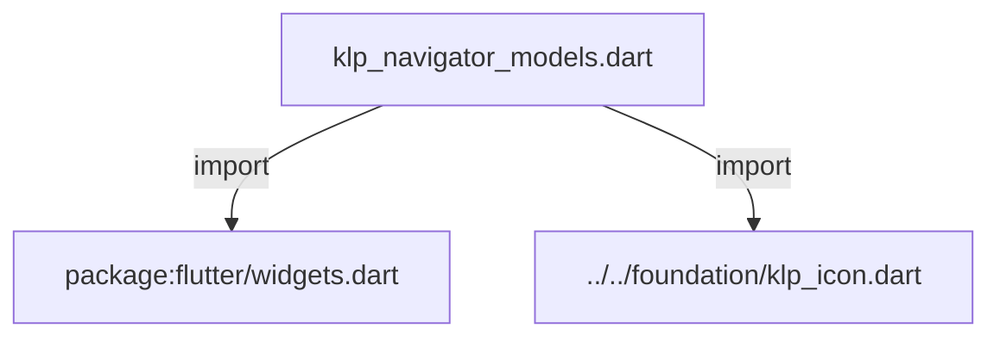
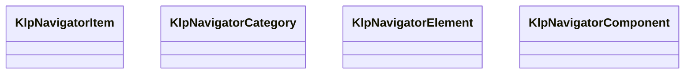
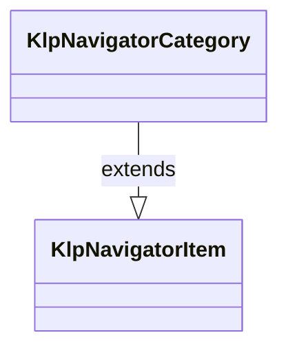
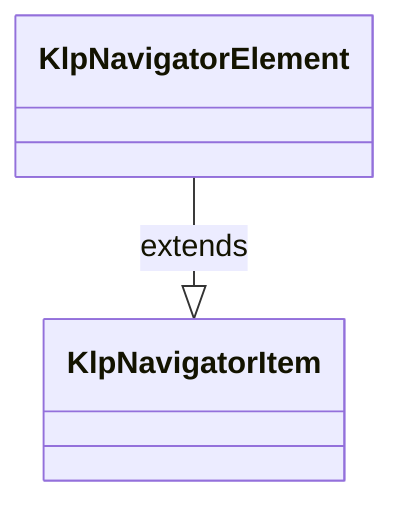
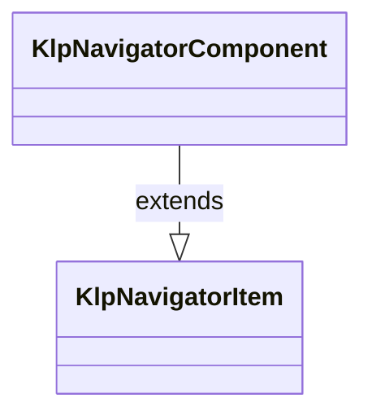

# klp_navigator_models.dart：直接依賴與宣告架構

[回到目錄](README.md) · [來源檔案](../../../../../lib/src/navigation/navigator/klp_navigator_models.dart)

## 範圍

核心是 `lib/src/navigation/navigator/klp_navigator_models.dart`。主要視角為該檔案明寫的 import／export／part；輔助視角為本檔宣告及 extends／implements／with／on 關係。只展開一層外部邊界。

## 直接依賴圖

## 依賴證據

| 關係 | 原始 directive | 來源 |
|---|---|---|
| import | <code>import &#x27;package:flutter/widgets.dart&#x27;;</code> | [lib/src/navigation/navigator/klp_navigator_models.dart:1](../../../../../lib/src/navigation/navigator/klp_navigator_models.dart#L1) |
| import | <code>import &#x27;../../foundation/klp_icon.dart&#x27;;</code> | [lib/src/navigation/navigator/klp_navigator_models.dart:3](../../../../../lib/src/navigation/navigator/klp_navigator_models.dart#L3) |

## 宣告關係圖

本組節點是本檔宣告；沒有箭頭的宣告未在此圖主張互相依賴。

## 宣告與成員證據

成員包含 public 與 private；簽章取自來源，省略函式本體與欄位初始值。`(inferred)` 表示來源未明寫型別；建構子只顯示參數部分，不含初始化列表。

### KlpNavigatorItem

ClassDeclaration · public · [lib/src/navigation/navigator/klp_navigator_models.dart:5](../../../../../lib/src/navigation/navigator/klp_navigator_models.dart#L5)

<code>sealed class KlpNavigatorItem</code>

來源註解摘要：Navigator 可注入資料的共同型別。 對外只有 [KlpNavigatorCategory]、[KlpNavigatorElement] 與 [KlpNavigatorComponent] 三種具體模型。

| 成員 | 可見性 | 簽章／型別 | 來源註解摘要 | 證據 |
|---|---|---|---|---|
| constructor <code>KlpNavigatorItem</code> | public | <code>const KlpNavigatorItem({required this.id})</code> |  | [lib/src/navigation/navigator/klp_navigator_models.dart:12](../../../../../lib/src/navigation/navigator/klp_navigator_models.dart#L12) |
| field <code>id</code> | public | <code>final String id</code> |  | [lib/src/navigation/navigator/klp_navigator_models.dart:14](../../../../../lib/src/navigation/navigator/klp_navigator_models.dart#L14) |

### KlpNavigatorCategory

ClassDeclaration · public · [lib/src/navigation/navigator/klp_navigator_models.dart:17](../../../../../lib/src/navigation/navigator/klp_navigator_models.dart#L17)

<code>final class KlpNavigatorCategory extends KlpNavigatorItem</code>

來源註解摘要：可展開與收合的一組 Navigator 項目。

- `extends` → <code>KlpNavigatorItem</code>：[lib/src/navigation/navigator/klp_navigator_models.dart:19](../../../../../lib/src/navigation/navigator/klp_navigator_models.dart#L19)

| 成員 | 可見性 | 簽章／型別 | 來源註解摘要 | 證據 |
|---|---|---|---|---|
| constructor <code>KlpNavigatorCategory</code> | public | <code>const KlpNavigatorCategory({ required super.id, required this.label, this.items = const [], this.expanded = true, this.collapsible = true, this.trailing, })</code> |  | [lib/src/navigation/navigator/klp_navigator_models.dart:21](../../../../../lib/src/navigation/navigator/klp_navigator_models.dart#L21) |
| field <code>label</code> | public | <code>final String label</code> |  | [lib/src/navigation/navigator/klp_navigator_models.dart:30](../../../../../lib/src/navigation/navigator/klp_navigator_models.dart#L30) |
| field <code>items</code> | public | <code>final List&lt;KlpNavigatorItem&gt; items</code> |  | [lib/src/navigation/navigator/klp_navigator_models.dart:31](../../../../../lib/src/navigation/navigator/klp_navigator_models.dart#L31) |
| field <code>expanded</code> | public | <code>final bool expanded</code> |  | [lib/src/navigation/navigator/klp_navigator_models.dart:32](../../../../../lib/src/navigation/navigator/klp_navigator_models.dart#L32) |
| field <code>collapsible</code> | public | <code>final bool collapsible</code> |  | [lib/src/navigation/navigator/klp_navigator_models.dart:33](../../../../../lib/src/navigation/navigator/klp_navigator_models.dart#L33) |
| field <code>trailing</code> | public | <code>final Widget? trailing</code> |  | [lib/src/navigation/navigator/klp_navigator_models.dart:34](../../../../../lib/src/navigation/navigator/klp_navigator_models.dart#L34) |

### KlpNavigatorElement

ClassDeclaration · public · [lib/src/navigation/navigator/klp_navigator_models.dart:37](../../../../../lib/src/navigation/navigator/klp_navigator_models.dart#L37)

<code>final class KlpNavigatorElement extends KlpNavigatorItem</code>

來源註解摘要：可在根層或分類內出現，並可遞迴包含子元素的 Navigator 節點。

- `extends` → <code>KlpNavigatorItem</code>：[lib/src/navigation/navigator/klp_navigator_models.dart:39](../../../../../lib/src/navigation/navigator/klp_navigator_models.dart#L39)

| 成員 | 可見性 | 簽章／型別 | 來源註解摘要 | 證據 |
|---|---|---|---|---|
| constructor <code>KlpNavigatorElement</code> | public | <code>const KlpNavigatorElement({ required super.id, required this.label, this.icon, this.children = const [], this.expandable = false, this.expanded = false, this.selected = false, this.badge, this.trailing, this.data, })</code> |  | [lib/src/navigation/navigator/klp_navigator_models.dart:41](../../../../../lib/src/navigation/navigator/klp_navigator_models.dart#L41) |
| field <code>label</code> | public | <code>final String label</code> |  | [lib/src/navigation/navigator/klp_navigator_models.dart:54](../../../../../lib/src/navigation/navigator/klp_navigator_models.dart#L54) |
| field <code>icon</code> | public | <code>final KlpIconData? icon</code> |  | [lib/src/navigation/navigator/klp_navigator_models.dart:55](../../../../../lib/src/navigation/navigator/klp_navigator_models.dart#L55) |
| field <code>children</code> | public | <code>final List&lt;KlpNavigatorElement&gt; children</code> |  | [lib/src/navigation/navigator/klp_navigator_models.dart:56](../../../../../lib/src/navigation/navigator/klp_navigator_models.dart#L56) |
| field <code>expandable</code> | public | <code>final bool expandable</code> |  | [lib/src/navigation/navigator/klp_navigator_models.dart:57](../../../../../lib/src/navigation/navigator/klp_navigator_models.dart#L57) |
| field <code>expanded</code> | public | <code>final bool expanded</code> |  | [lib/src/navigation/navigator/klp_navigator_models.dart:58](../../../../../lib/src/navigation/navigator/klp_navigator_models.dart#L58) |
| field <code>selected</code> | public | <code>final bool selected</code> |  | [lib/src/navigation/navigator/klp_navigator_models.dart:59](../../../../../lib/src/navigation/navigator/klp_navigator_models.dart#L59) |
| field <code>badge</code> | public | <code>final String? badge</code> |  | [lib/src/navigation/navigator/klp_navigator_models.dart:60](../../../../../lib/src/navigation/navigator/klp_navigator_models.dart#L60) |
| field <code>trailing</code> | public | <code>final Widget? trailing</code> |  | [lib/src/navigation/navigator/klp_navigator_models.dart:61](../../../../../lib/src/navigation/navigator/klp_navigator_models.dart#L61) |
| field <code>data</code> | public | <code>final Object? data</code> |  | [lib/src/navigation/navigator/klp_navigator_models.dart:62](../../../../../lib/src/navigation/navigator/klp_navigator_models.dart#L62) |
| getter <code>isBranch</code> | public | <code>bool get isBranch</code> |  | [lib/src/navigation/navigator/klp_navigator_models.dart:64](../../../../../lib/src/navigation/navigator/klp_navigator_models.dart#L64) |

### KlpNavigatorComponent

ClassDeclaration · public · [lib/src/navigation/navigator/klp_navigator_models.dart:67](../../../../../lib/src/navigation/navigator/klp_navigator_models.dart#L67)

<code>final class KlpNavigatorComponent extends KlpNavigatorItem</code>

來源註解摘要：不受 Navigator 固定列高限制的任意元件插槽。 搜尋框、虛線分隔線、按鈕列表等元件保留自己的高度、狀態與事件。

- `extends` → <code>KlpNavigatorItem</code>：[lib/src/navigation/navigator/klp_navigator_models.dart:71](../../../../../lib/src/navigation/navigator/klp_navigator_models.dart#L71)

| 成員 | 可見性 | 簽章／型別 | 來源註解摘要 | 證據 |
|---|---|---|---|---|
| constructor <code>KlpNavigatorComponent</code> | public | <code>const KlpNavigatorComponent({required super.id, required this.child})</code> |  | [lib/src/navigation/navigator/klp_navigator_models.dart:73](../../../../../lib/src/navigation/navigator/klp_navigator_models.dart#L73) |
| field <code>child</code> | public | <code>final Widget child</code> |  | [lib/src/navigation/navigator/klp_navigator_models.dart:75](../../../../../lib/src/navigation/navigator/klp_navigator_models.dart#L75) |

## 閱讀說明與限制

箭頭只表示來源明寫的靜態關係；import 不等於呼叫。未分析動態呼叫、欄位的實際物件擁有權、狀態轉移或渲染流程；型別未進行語意解析，繼承目標保留原始型別拼寫。public／private 依 Dart 名稱前綴判斷；public 宣告不代表已由 `lib/kallopis.dart` 匯出。

本頁由 `tool/architecture_atlas` 產生；編輯來源或生成工具後重新產生，避免手改本頁。
