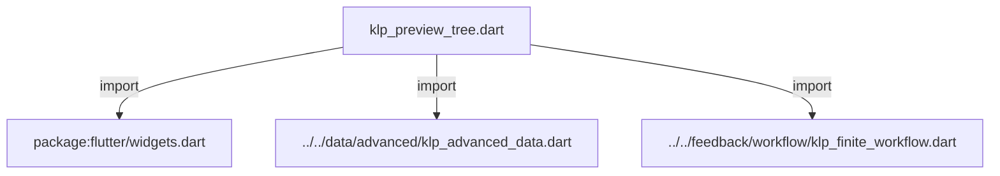
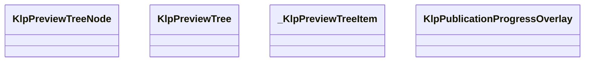
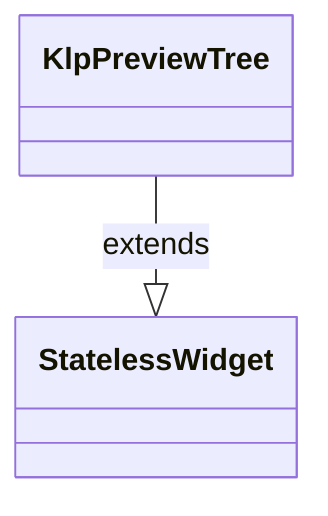
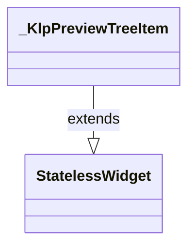
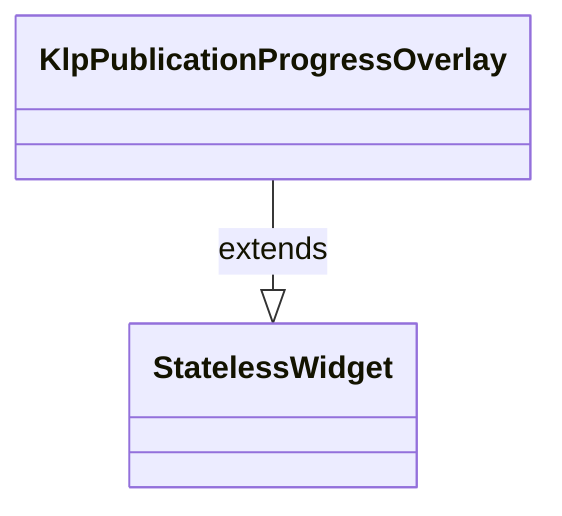

# klp_preview_tree.dart：直接依賴與宣告架構

[回到目錄](README.md) · [來源檔案](../../../../../lib/src/navigation/preview_tree/klp_preview_tree.dart)

## 範圍

核心是 `lib/src/navigation/preview_tree/klp_preview_tree.dart`。主要視角為該檔案明寫的 import／export／part；輔助視角為本檔宣告及 extends／implements／with／on 關係。只展開一層外部邊界。

## 直接依賴圖

## 依賴證據

| 關係 | 原始 directive | 來源 |
|---|---|---|
| import | <code>import &#x27;package:flutter/widgets.dart&#x27;;</code> | [lib/src/navigation/preview_tree/klp_preview_tree.dart:1](../../../../../lib/src/navigation/preview_tree/klp_preview_tree.dart#L1) |
| import | <code>import &#x27;../../data/advanced/klp_advanced_data.dart&#x27;;</code> | [lib/src/navigation/preview_tree/klp_preview_tree.dart:3](../../../../../lib/src/navigation/preview_tree/klp_preview_tree.dart#L3) |
| import | <code>import &#x27;../../feedback/workflow/klp_finite_workflow.dart&#x27;;</code> | [lib/src/navigation/preview_tree/klp_preview_tree.dart:4](../../../../../lib/src/navigation/preview_tree/klp_preview_tree.dart#L4) |

## 宣告關係圖

本組節點是本檔宣告；沒有箭頭的宣告未在此圖主張互相依賴。

## 宣告與成員證據

成員包含 public 與 private；簽章取自來源，省略函式本體與欄位初始值。`(inferred)` 表示來源未明寫型別；建構子只顯示參數部分，不含初始化列表。

### KlpPreviewTreeNode

ClassDeclaration · public · [lib/src/navigation/preview_tree/klp_preview_tree.dart:6](../../../../../lib/src/navigation/preview_tree/klp_preview_tree.dart#L6)

<code>class KlpPreviewTreeNode</code>

來源註解摘要：尚未成為 canonical artifact 的預覽樹節點。

| 成員 | 可見性 | 簽章／型別 | 來源註解摘要 | 證據 |
|---|---|---|---|---|
| constructor <code>KlpPreviewTreeNode</code> | public | <code>const KlpPreviewTreeNode({ required this.id, required this.label, required this.accessibilityLabel, this.children = const [], this.statusLabel, })</code> |  | [lib/src/navigation/preview_tree/klp_preview_tree.dart:9](../../../../../lib/src/navigation/preview_tree/klp_preview_tree.dart#L9) |
| field <code>id</code> | public | <code>final String id</code> |  | [lib/src/navigation/preview_tree/klp_preview_tree.dart:17](../../../../../lib/src/navigation/preview_tree/klp_preview_tree.dart#L17) |
| field <code>label</code> | public | <code>final String label</code> |  | [lib/src/navigation/preview_tree/klp_preview_tree.dart:18](../../../../../lib/src/navigation/preview_tree/klp_preview_tree.dart#L18) |
| field <code>accessibilityLabel</code> | public | <code>final String accessibilityLabel</code> |  | [lib/src/navigation/preview_tree/klp_preview_tree.dart:19](../../../../../lib/src/navigation/preview_tree/klp_preview_tree.dart#L19) |
| field <code>children</code> | public | <code>final List&lt;KlpPreviewTreeNode&gt; children</code> |  | [lib/src/navigation/preview_tree/klp_preview_tree.dart:20](../../../../../lib/src/navigation/preview_tree/klp_preview_tree.dart#L20) |
| field <code>statusLabel</code> | public | <code>final String? statusLabel</code> |  | [lib/src/navigation/preview_tree/klp_preview_tree.dart:21](../../../../../lib/src/navigation/preview_tree/klp_preview_tree.dart#L21) |

### KlpPreviewTree

ClassDeclaration · public · [lib/src/navigation/preview_tree/klp_preview_tree.dart:24](../../../../../lib/src/navigation/preview_tree/klp_preview_tree.dart#L24)

<code>class KlpPreviewTree extends StatelessWidget</code>

來源註解摘要：提案專用樹；語意名稱明確區分預覽節點與 canonical 導覽節點。

- `extends` → <code>StatelessWidget</code>：[lib/src/navigation/preview_tree/klp_preview_tree.dart:25](../../../../../lib/src/navigation/preview_tree/klp_preview_tree.dart#L25)

| 成員 | 可見性 | 簽章／型別 | 來源註解摘要 | 證據 |
|---|---|---|---|---|
| constructor <code>KlpPreviewTree</code> | public | <code>const KlpPreviewTree({super.key, required this.label, required this.nodes, this.enabled = true, this.onSelected})</code> |  | [lib/src/navigation/preview_tree/klp_preview_tree.dart:26](../../../../../lib/src/navigation/preview_tree/klp_preview_tree.dart#L26) |
| field <code>label</code> | public | <code>final String label</code> |  | [lib/src/navigation/preview_tree/klp_preview_tree.dart:28](../../../../../lib/src/navigation/preview_tree/klp_preview_tree.dart#L28) |
| field <code>nodes</code> | public | <code>final List&lt;KlpPreviewTreeNode&gt; nodes</code> |  | [lib/src/navigation/preview_tree/klp_preview_tree.dart:29](../../../../../lib/src/navigation/preview_tree/klp_preview_tree.dart#L29) |
| field <code>enabled</code> | public | <code>final bool enabled</code> |  | [lib/src/navigation/preview_tree/klp_preview_tree.dart:30](../../../../../lib/src/navigation/preview_tree/klp_preview_tree.dart#L30) |
| field <code>onSelected</code> | public | <code>final ValueChanged&lt;String&gt;? onSelected</code> |  | [lib/src/navigation/preview_tree/klp_preview_tree.dart:31](../../../../../lib/src/navigation/preview_tree/klp_preview_tree.dart#L31) |
| method <code>build</code> | public | <code>Widget build(BuildContext context)</code> |  | [lib/src/navigation/preview_tree/klp_preview_tree.dart:33](../../../../../lib/src/navigation/preview_tree/klp_preview_tree.dart#L33) |

### _KlpPreviewTreeItem

ClassDeclaration · private · [lib/src/navigation/preview_tree/klp_preview_tree.dart:51](../../../../../lib/src/navigation/preview_tree/klp_preview_tree.dart#L51)

<code>class _KlpPreviewTreeItem extends StatelessWidget</code>

- `extends` → <code>StatelessWidget</code>：[lib/src/navigation/preview_tree/klp_preview_tree.dart:51](../../../../../lib/src/navigation/preview_tree/klp_preview_tree.dart#L51)

| 成員 | 可見性 | 簽章／型別 | 來源註解摘要 | 證據 |
|---|---|---|---|---|
| constructor <code>_KlpPreviewTreeItem</code> | private | <code>const _KlpPreviewTreeItem({required this.node, required this.onSelected})</code> |  | [lib/src/navigation/preview_tree/klp_preview_tree.dart:52](../../../../../lib/src/navigation/preview_tree/klp_preview_tree.dart#L52) |
| field <code>node</code> | public | <code>final KlpPreviewTreeNode node</code> |  | [lib/src/navigation/preview_tree/klp_preview_tree.dart:54](../../../../../lib/src/navigation/preview_tree/klp_preview_tree.dart#L54) |
| field <code>onSelected</code> | public | <code>final ValueChanged&lt;String&gt;? onSelected</code> |  | [lib/src/navigation/preview_tree/klp_preview_tree.dart:55](../../../../../lib/src/navigation/preview_tree/klp_preview_tree.dart#L55) |
| method <code>build</code> | public | <code>Widget build(BuildContext context)</code> |  | [lib/src/navigation/preview_tree/klp_preview_tree.dart:57](../../../../../lib/src/navigation/preview_tree/klp_preview_tree.dart#L57) |

### KlpPublicationProgressOverlay

ClassDeclaration · public · [lib/src/navigation/preview_tree/klp_preview_tree.dart:75](../../../../../lib/src/navigation/preview_tree/klp_preview_tree.dart#L75)

<code>class KlpPublicationProgressOverlay extends StatelessWidget</code>

來源註解摘要：原子發布期間保持預覽樹穩定，並在其上呈現具名階段。

- `extends` → <code>StatelessWidget</code>：[lib/src/navigation/preview_tree/klp_preview_tree.dart:76](../../../../../lib/src/navigation/preview_tree/klp_preview_tree.dart#L76)

| 成員 | 可見性 | 簽章／型別 | 來源註解摘要 | 證據 |
|---|---|---|---|---|
| constructor <code>KlpPublicationProgressOverlay</code> | public | <code>const KlpPublicationProgressOverlay({super.key, required this.child, required this.visible, required this.progress})</code> |  | [lib/src/navigation/preview_tree/klp_preview_tree.dart:77](../../../../../lib/src/navigation/preview_tree/klp_preview_tree.dart#L77) |
| field <code>child</code> | public | <code>final Widget child</code> |  | [lib/src/navigation/preview_tree/klp_preview_tree.dart:79](../../../../../lib/src/navigation/preview_tree/klp_preview_tree.dart#L79) |
| field <code>visible</code> | public | <code>final bool visible</code> |  | [lib/src/navigation/preview_tree/klp_preview_tree.dart:80](../../../../../lib/src/navigation/preview_tree/klp_preview_tree.dart#L80) |
| field <code>progress</code> | public | <code>final KlpWorkflowProgress progress</code> |  | [lib/src/navigation/preview_tree/klp_preview_tree.dart:81](../../../../../lib/src/navigation/preview_tree/klp_preview_tree.dart#L81) |
| method <code>build</code> | public | <code>Widget build(BuildContext context)</code> |  | [lib/src/navigation/preview_tree/klp_preview_tree.dart:83](../../../../../lib/src/navigation/preview_tree/klp_preview_tree.dart#L83) |

## 閱讀說明與限制

箭頭只表示來源明寫的靜態關係；import 不等於呼叫。未分析動態呼叫、欄位的實際物件擁有權、狀態轉移或渲染流程；型別未進行語意解析，繼承目標保留原始型別拼寫。public／private 依 Dart 名稱前綴判斷；public 宣告不代表已由 `lib/kallopis.dart` 匯出。

本頁由 `tool/architecture_atlas` 產生；編輯來源或生成工具後重新產生，避免手改本頁。
