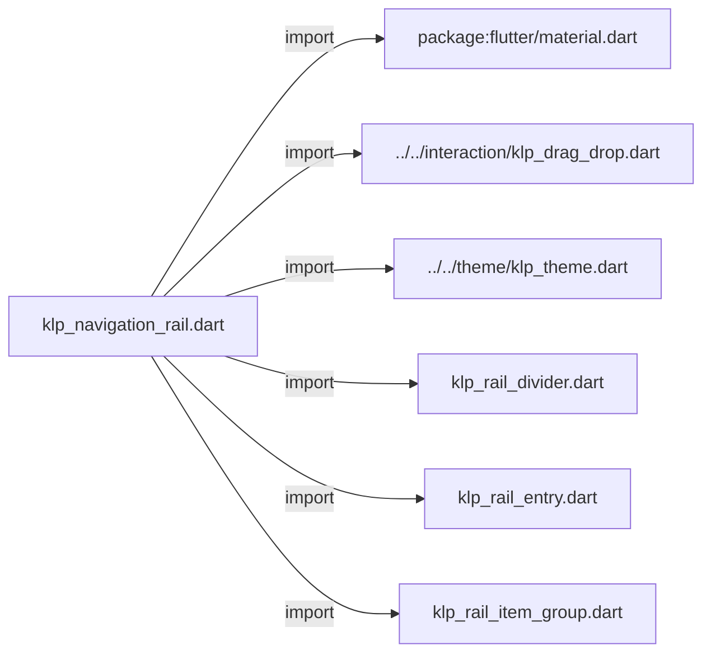
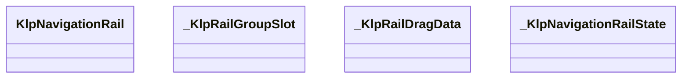
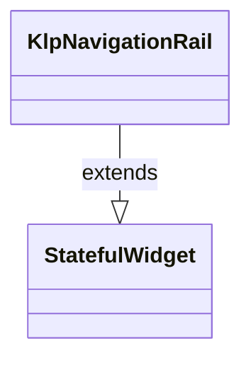
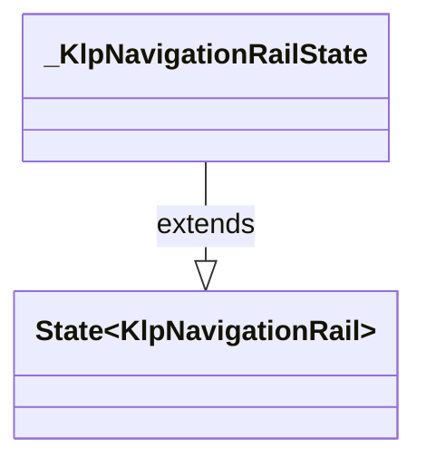

# klp_navigation_rail.dart：直接依賴與宣告架構

[回到目錄](README.md) · [來源檔案](../../../../../lib/src/navigation/rail/klp_navigation_rail.dart)

## 範圍

核心是 `lib/src/navigation/rail/klp_navigation_rail.dart`。主要視角為該檔案明寫的 import／export／part；輔助視角為本檔宣告及 extends／implements／with／on 關係。只展開一層外部邊界。

## 直接依賴圖

## 依賴證據

| 關係 | 原始 directive | 來源 |
|---|---|---|
| import | <code>import &#x27;package:flutter/material.dart&#x27;;</code> | [lib/src/navigation/rail/klp_navigation_rail.dart:1](../../../../../lib/src/navigation/rail/klp_navigation_rail.dart#L1) |
| import | <code>import &#x27;../../interaction/klp_drag_drop.dart&#x27;;</code> | [lib/src/navigation/rail/klp_navigation_rail.dart:3](../../../../../lib/src/navigation/rail/klp_navigation_rail.dart#L3) |
| import | <code>import &#x27;../../theme/klp_theme.dart&#x27;;</code> | [lib/src/navigation/rail/klp_navigation_rail.dart:4](../../../../../lib/src/navigation/rail/klp_navigation_rail.dart#L4) |
| import | <code>import &#x27;klp_rail_divider.dart&#x27;;</code> | [lib/src/navigation/rail/klp_navigation_rail.dart:5](../../../../../lib/src/navigation/rail/klp_navigation_rail.dart#L5) |
| import | <code>import &#x27;klp_rail_entry.dart&#x27;;</code> | [lib/src/navigation/rail/klp_navigation_rail.dart:6](../../../../../lib/src/navigation/rail/klp_navigation_rail.dart#L6) |
| import | <code>import &#x27;klp_rail_item_group.dart&#x27;;</code> | [lib/src/navigation/rail/klp_navigation_rail.dart:7](../../../../../lib/src/navigation/rail/klp_navigation_rail.dart#L7) |

## 宣告關係圖

本組節點是本檔宣告；沒有箭頭的宣告未在此圖主張互相依賴。

## 宣告與成員證據

成員包含 public 與 private；簽章取自來源，省略函式本體與欄位初始值。`(inferred)` 表示來源未明寫型別；建構子只顯示參數部分，不含初始化列表。

### KlpNavigationRail

ClassDeclaration · public · [lib/src/navigation/rail/klp_navigation_rail.dart:9](../../../../../lib/src/navigation/rail/klp_navigation_rail.dart#L9)

<code>class KlpNavigationRail extends StatefulWidget</code>

來源註解摘要：Workbench 的主要圖示導覽軌。 分組模式只接受 [KlpRailItemGroup]；群組之間自動加入分隔線，項目只能在 原群組內排序。

- `extends` → <code>StatefulWidget</code>：[lib/src/navigation/rail/klp_navigation_rail.dart:13](../../../../../lib/src/navigation/rail/klp_navigation_rail.dart#L13)

| 成員 | 可見性 | 簽章／型別 | 來源註解摘要 | 證據 |
|---|---|---|---|---|
| constructor <code>KlpNavigationRail</code> | public | <code>const KlpNavigationRail({ super.key, required this.top, required this.center, required this.bottom, })</code> |  | [lib/src/navigation/rail/klp_navigation_rail.dart:14](../../../../../lib/src/navigation/rail/klp_navigation_rail.dart#L14) |
| field <code>top</code> | public | <code>final KlpRailItemGroup top</code> |  | [lib/src/navigation/rail/klp_navigation_rail.dart:21](../../../../../lib/src/navigation/rail/klp_navigation_rail.dart#L21) |
| field <code>center</code> | public | <code>final KlpRailItemGroup center</code> |  | [lib/src/navigation/rail/klp_navigation_rail.dart:22](../../../../../lib/src/navigation/rail/klp_navigation_rail.dart#L22) |
| field <code>bottom</code> | public | <code>final KlpRailItemGroup bottom</code> |  | [lib/src/navigation/rail/klp_navigation_rail.dart:23](../../../../../lib/src/navigation/rail/klp_navigation_rail.dart#L23) |
| method <code>createState</code> | public | <code>State&lt;KlpNavigationRail&gt; createState()</code> |  | [lib/src/navigation/rail/klp_navigation_rail.dart:25](../../../../../lib/src/navigation/rail/klp_navigation_rail.dart#L25) |

### _KlpRailGroupSlot

EnumDeclaration · private · [lib/src/navigation/rail/klp_navigation_rail.dart:29](../../../../../lib/src/navigation/rail/klp_navigation_rail.dart#L29)

<code>enum _KlpRailGroupSlot</code>

| 成員 | 可見性 | 簽章／型別 | 來源註解摘要 | 證據 |
|---|---|---|---|---|
| enum value <code>top</code> | public | <code>top</code> |  | [lib/src/navigation/rail/klp_navigation_rail.dart:29](../../../../../lib/src/navigation/rail/klp_navigation_rail.dart#L29) |
| enum value <code>center</code> | public | <code>center</code> |  | [lib/src/navigation/rail/klp_navigation_rail.dart:29](../../../../../lib/src/navigation/rail/klp_navigation_rail.dart#L29) |
| enum value <code>bottom</code> | public | <code>bottom</code> |  | [lib/src/navigation/rail/klp_navigation_rail.dart:29](../../../../../lib/src/navigation/rail/klp_navigation_rail.dart#L29) |

### _KlpRailDragData

ClassDeclaration · private · [lib/src/navigation/rail/klp_navigation_rail.dart:31](../../../../../lib/src/navigation/rail/klp_navigation_rail.dart#L31)

<code>class _KlpRailDragData</code>

| 成員 | 可見性 | 簽章／型別 | 來源註解摘要 | 證據 |
|---|---|---|---|---|
| field <code>slot</code> | public | <code>final _KlpRailGroupSlot slot</code> |  | [lib/src/navigation/rail/klp_navigation_rail.dart:32](../../../../../lib/src/navigation/rail/klp_navigation_rail.dart#L32) |
| field <code>sourceIndex</code> | public | <code>final int sourceIndex</code> |  | [lib/src/navigation/rail/klp_navigation_rail.dart:33](../../../../../lib/src/navigation/rail/klp_navigation_rail.dart#L33) |
| constructor <code>_KlpRailDragData</code> | private | <code>const _KlpRailDragData(this.slot, this.sourceIndex)</code> |  | [lib/src/navigation/rail/klp_navigation_rail.dart:35](../../../../../lib/src/navigation/rail/klp_navigation_rail.dart#L35) |

### _KlpNavigationRailState

ClassDeclaration · private · [lib/src/navigation/rail/klp_navigation_rail.dart:38](../../../../../lib/src/navigation/rail/klp_navigation_rail.dart#L38)

<code>class _KlpNavigationRailState extends State&lt;KlpNavigationRail&gt;</code>

- `extends` → <code>State&lt;KlpNavigationRail&gt;</code>：[lib/src/navigation/rail/klp_navigation_rail.dart:38](../../../../../lib/src/navigation/rail/klp_navigation_rail.dart#L38)

| 成員 | 可見性 | 簽章／型別 | 來源註解摘要 | 證據 |
|---|---|---|---|---|
| field <code>_dragSlot</code> | private | <code>_KlpRailGroupSlot? _dragSlot</code> |  | [lib/src/navigation/rail/klp_navigation_rail.dart:39](../../../../../lib/src/navigation/rail/klp_navigation_rail.dart#L39) |
| field <code>_dropIndex</code> | private | <code>int? _dropIndex</code> |  | [lib/src/navigation/rail/klp_navigation_rail.dart:40](../../../../../lib/src/navigation/rail/klp_navigation_rail.dart#L40) |
| method <code>_accepts</code> | private | <code>bool _accepts( _KlpRailGroupSlot slot, KlpRailItemGroup group, _KlpRailDragData data, )</code> |  | [lib/src/navigation/rail/klp_navigation_rail.dart:42](../../../../../lib/src/navigation/rail/klp_navigation_rail.dart#L42) |
| method <code>_startDrag</code> | private | <code>void _startDrag(_KlpRailGroupSlot slot, int index)</code> |  | [lib/src/navigation/rail/klp_navigation_rail.dart:54](../../../../../lib/src/navigation/rail/klp_navigation_rail.dart#L54) |
| method <code>_showDropIndex</code> | private | <code>void _showDropIndex(int index)</code> |  | [lib/src/navigation/rail/klp_navigation_rail.dart:61](../../../../../lib/src/navigation/rail/klp_navigation_rail.dart#L61) |
| method <code>_showItemDrop</code> | private | <code>void _showItemDrop( BuildContext targetContext, int targetIndex, Offset globalPosition, )</code> |  | [lib/src/navigation/rail/klp_navigation_rail.dart:66](../../../../../lib/src/navigation/rail/klp_navigation_rail.dart#L66) |
| method <code>_finishDrag</code> | private | <code>void _finishDrag(KlpRailItemGroup group, _KlpRailDragData data)</code> |  | [lib/src/navigation/rail/klp_navigation_rail.dart:81](../../../../../lib/src/navigation/rail/klp_navigation_rail.dart#L81) |
| method <code>_clearDrag</code> | private | <code>void _clearDrag()</code> |  | [lib/src/navigation/rail/klp_navigation_rail.dart:93](../../../../../lib/src/navigation/rail/klp_navigation_rail.dart#L93) |
| method <code>_buildDropSlot</code> | private | <code>Widget _buildDropSlot( BuildContext context, _KlpRailGroupSlot slot, KlpRailItemGroup group, int index, )</code> |  | [lib/src/navigation/rail/klp_navigation_rail.dart:101](../../../../../lib/src/navigation/rail/klp_navigation_rail.dart#L101) |
| method <code>_buildDraggableEntry</code> | private | <code>Widget _buildDraggableEntry( BuildContext context, _KlpRailGroupSlot slot, KlpRailItemGroup group, int index, )</code> |  | [lib/src/navigation/rail/klp_navigation_rail.dart:128](../../../../../lib/src/navigation/rail/klp_navigation_rail.dart#L128) |
| method <code>_buildGroup</code> | private | <code>Widget _buildGroup( BuildContext context, _KlpRailGroupSlot slot, KlpRailItemGroup group, )</code> |  | [lib/src/navigation/rail/klp_navigation_rail.dart:174](../../../../../lib/src/navigation/rail/klp_navigation_rail.dart#L174) |
| method <code>_buildSpacedEntries</code> | private | <code>Widget _buildSpacedEntries(BuildContext context, List&lt;KlpRailEntry&gt; entries)</code> |  | [lib/src/navigation/rail/klp_navigation_rail.dart:197](../../../../../lib/src/navigation/rail/klp_navigation_rail.dart#L197) |
| method <code>_buildGroupDivider</code> | private | <code>Widget _buildGroupDivider(BuildContext context)</code> |  | [lib/src/navigation/rail/klp_navigation_rail.dart:210](../../../../../lib/src/navigation/rail/klp_navigation_rail.dart#L210) |
| method <code>_buildScrollableCenter</code> | private | <code>Widget _buildScrollableCenter(BuildContext context)</code> |  | [lib/src/navigation/rail/klp_navigation_rail.dart:217](../../../../../lib/src/navigation/rail/klp_navigation_rail.dart#L217) |
| method <code>_buildGroupedRail</code> | private | <code>Widget _buildGroupedRail(BuildContext context)</code> |  | [lib/src/navigation/rail/klp_navigation_rail.dart:240](../../../../../lib/src/navigation/rail/klp_navigation_rail.dart#L240) |
| method <code>build</code> | public | <code>Widget build(BuildContext context)</code> |  | [lib/src/navigation/rail/klp_navigation_rail.dart:261](../../../../../lib/src/navigation/rail/klp_navigation_rail.dart#L261) |

## 閱讀說明與限制

箭頭只表示來源明寫的靜態關係；import 不等於呼叫。未分析動態呼叫、欄位的實際物件擁有權、狀態轉移或渲染流程；型別未進行語意解析，繼承目標保留原始型別拼寫。public／private 依 Dart 名稱前綴判斷；public 宣告不代表已由 `lib/kallopis.dart` 匯出。

本頁由 `tool/architecture_atlas` 產生；編輯來源或生成工具後重新產生，避免手改本頁。
