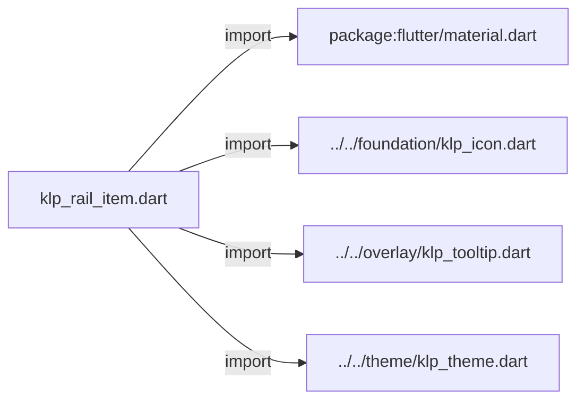
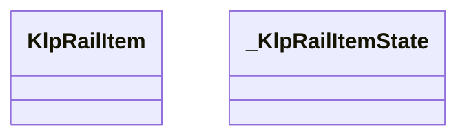
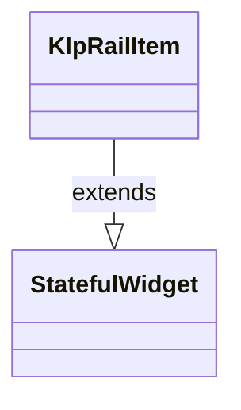
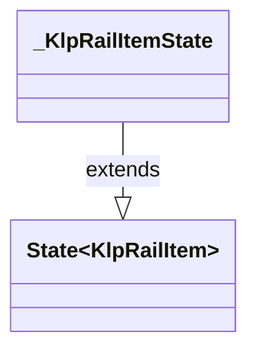

# klp_rail_item.dart：直接依賴與宣告架構

[回到目錄](README.md) · [來源檔案](../../../../../lib/src/navigation/rail/klp_rail_item.dart)

## 範圍

核心是 `lib/src/navigation/rail/klp_rail_item.dart`。主要視角為該檔案明寫的 import／export／part；輔助視角為本檔宣告及 extends／implements／with／on 關係。只展開一層外部邊界。

## 直接依賴圖

## 依賴證據

| 關係 | 原始 directive | 來源 |
|---|---|---|
| import | <code>import &#x27;package:flutter/material.dart&#x27;;</code> | [lib/src/navigation/rail/klp_rail_item.dart:1](../../../../../lib/src/navigation/rail/klp_rail_item.dart#L1) |
| import | <code>import &#x27;../../foundation/klp_icon.dart&#x27;;</code> | [lib/src/navigation/rail/klp_rail_item.dart:3](../../../../../lib/src/navigation/rail/klp_rail_item.dart#L3) |
| import | <code>import &#x27;../../overlay/klp_tooltip.dart&#x27;;</code> | [lib/src/navigation/rail/klp_rail_item.dart:4](../../../../../lib/src/navigation/rail/klp_rail_item.dart#L4) |
| import | <code>import &#x27;../../theme/klp_theme.dart&#x27;;</code> | [lib/src/navigation/rail/klp_rail_item.dart:5](../../../../../lib/src/navigation/rail/klp_rail_item.dart#L5) |

## 宣告關係圖

本組節點是本檔宣告；沒有箭頭的宣告未在此圖主張互相依賴。

## 宣告與成員證據

成員包含 public 與 private；簽章取自來源，省略函式本體與欄位初始值。`(inferred)` 表示來源未明寫型別；建構子只顯示參數部分，不含初始化列表。

### KlpRailItem

ClassDeclaration · public · [lib/src/navigation/rail/klp_rail_item.dart:7](../../../../../lib/src/navigation/rail/klp_rail_item.dart#L7)

<code>class KlpRailItem extends StatefulWidget</code>

- `extends` → <code>StatefulWidget</code>：[lib/src/navigation/rail/klp_rail_item.dart:7](../../../../../lib/src/navigation/rail/klp_rail_item.dart#L7)

| 成員 | 可見性 | 簽章／型別 | 來源註解摘要 | 證據 |
|---|---|---|---|---|
| constructor <code>KlpRailItem</code> | public | <code>const KlpRailItem({ super.key, required this.icon, required this.label, required this.onPressed, this.selected = false, this.badge, })</code> |  | [lib/src/navigation/rail/klp_rail_item.dart:8](../../../../../lib/src/navigation/rail/klp_rail_item.dart#L8) |
| field <code>icon</code> | public | <code>final KlpIconData icon</code> |  | [lib/src/navigation/rail/klp_rail_item.dart:17](../../../../../lib/src/navigation/rail/klp_rail_item.dart#L17) |
| field <code>label</code> | public | <code>final String label</code> |  | [lib/src/navigation/rail/klp_rail_item.dart:18](../../../../../lib/src/navigation/rail/klp_rail_item.dart#L18) |
| field <code>onPressed</code> | public | <code>final VoidCallback onPressed</code> |  | [lib/src/navigation/rail/klp_rail_item.dart:19](../../../../../lib/src/navigation/rail/klp_rail_item.dart#L19) |
| field <code>selected</code> | public | <code>final bool selected</code> |  | [lib/src/navigation/rail/klp_rail_item.dart:20](../../../../../lib/src/navigation/rail/klp_rail_item.dart#L20) |
| field <code>badge</code> | public | <code>final String? badge</code> |  | [lib/src/navigation/rail/klp_rail_item.dart:21](../../../../../lib/src/navigation/rail/klp_rail_item.dart#L21) |
| method <code>createState</code> | public | <code>State&lt;KlpRailItem&gt; createState()</code> |  | [lib/src/navigation/rail/klp_rail_item.dart:23](../../../../../lib/src/navigation/rail/klp_rail_item.dart#L23) |

### _KlpRailItemState

ClassDeclaration · private · [lib/src/navigation/rail/klp_rail_item.dart:27](../../../../../lib/src/navigation/rail/klp_rail_item.dart#L27)

<code>class _KlpRailItemState extends State&lt;KlpRailItem&gt;</code>

- `extends` → <code>State&lt;KlpRailItem&gt;</code>：[lib/src/navigation/rail/klp_rail_item.dart:27](../../../../../lib/src/navigation/rail/klp_rail_item.dart#L27)

| 成員 | 可見性 | 簽章／型別 | 來源註解摘要 | 證據 |
|---|---|---|---|---|
| field <code>_tooltipLink</code> | private | <code>final LayerLink _tooltipLink</code> |  | [lib/src/navigation/rail/klp_rail_item.dart:28](../../../../../lib/src/navigation/rail/klp_rail_item.dart#L28) |
| field <code>_tooltipController</code> | private | <code>final OverlayPortalController _tooltipController</code> |  | [lib/src/navigation/rail/klp_rail_item.dart:29](../../../../../lib/src/navigation/rail/klp_rail_item.dart#L29) |
| field <code>_hovered</code> | private | <code>bool _hovered</code> |  | [lib/src/navigation/rail/klp_rail_item.dart:30](../../../../../lib/src/navigation/rail/klp_rail_item.dart#L30) |
| field <code>_focused</code> | private | <code>bool _focused</code> |  | [lib/src/navigation/rail/klp_rail_item.dart:31](../../../../../lib/src/navigation/rail/klp_rail_item.dart#L31) |
| method <code>_setHovered</code> | private | <code>void _setHovered(bool value)</code> |  | [lib/src/navigation/rail/klp_rail_item.dart:33](../../../../../lib/src/navigation/rail/klp_rail_item.dart#L33) |
| method <code>_setFocused</code> | private | <code>void _setFocused(bool value)</code> |  | [lib/src/navigation/rail/klp_rail_item.dart:38](../../../../../lib/src/navigation/rail/klp_rail_item.dart#L38) |
| method <code>_syncTooltip</code> | private | <code>void _syncTooltip({required bool hovered})</code> |  | [lib/src/navigation/rail/klp_rail_item.dart:42](../../../../../lib/src/navigation/rail/klp_rail_item.dart#L42) |
| method <code>build</code> | public | <code>Widget build(BuildContext context)</code> |  | [lib/src/navigation/rail/klp_rail_item.dart:50](../../../../../lib/src/navigation/rail/klp_rail_item.dart#L50) |

## 閱讀說明與限制

箭頭只表示來源明寫的靜態關係；import 不等於呼叫。未分析動態呼叫、欄位的實際物件擁有權、狀態轉移或渲染流程；型別未進行語意解析，繼承目標保留原始型別拼寫。public／private 依 Dart 名稱前綴判斷；public 宣告不代表已由 `lib/kallopis.dart` 匯出。

本頁由 `tool/architecture_atlas` 產生；編輯來源或生成工具後重新產生，避免手改本頁。
