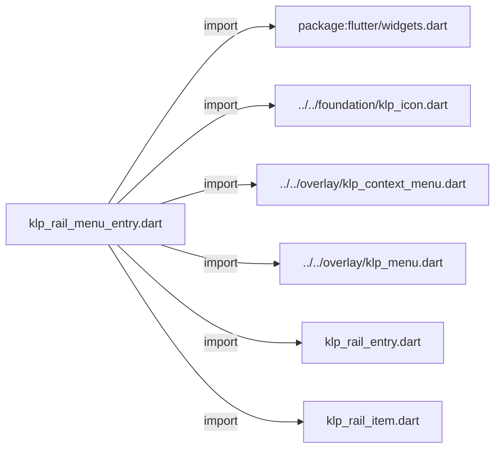
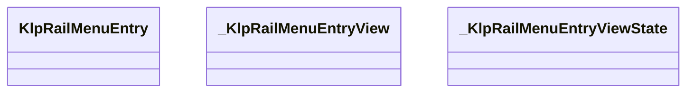
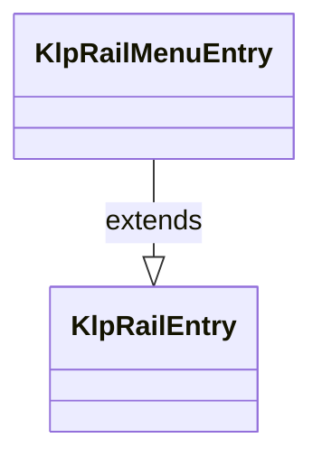
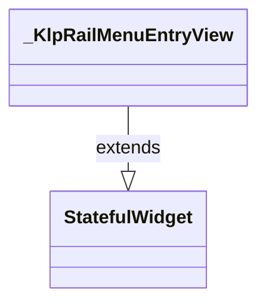
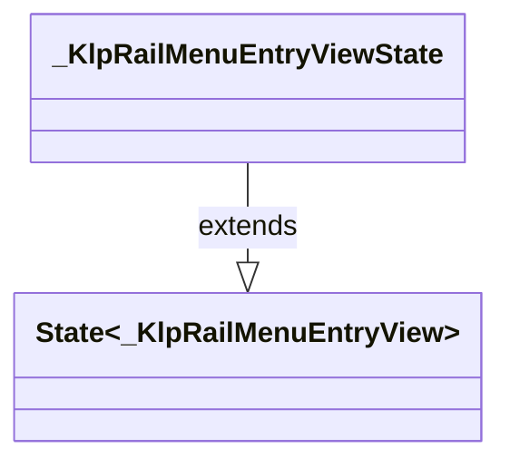

# klp_rail_menu_entry.dart：直接依賴與宣告架構

[回到目錄](README.md) · [來源檔案](../../../../../lib/src/navigation/rail/klp_rail_menu_entry.dart)

## 範圍

核心是 `lib/src/navigation/rail/klp_rail_menu_entry.dart`。主要視角為該檔案明寫的 import／export／part；輔助視角為本檔宣告及 extends／implements／with／on 關係。只展開一層外部邊界。

## 直接依賴圖

## 依賴證據

| 關係 | 原始 directive | 來源 |
|---|---|---|
| import | <code>import &#x27;package:flutter/widgets.dart&#x27;;</code> | [lib/src/navigation/rail/klp_rail_menu_entry.dart:1](../../../../../lib/src/navigation/rail/klp_rail_menu_entry.dart#L1) |
| import | <code>import &#x27;../../foundation/klp_icon.dart&#x27;;</code> | [lib/src/navigation/rail/klp_rail_menu_entry.dart:3](../../../../../lib/src/navigation/rail/klp_rail_menu_entry.dart#L3) |
| import | <code>import &#x27;../../overlay/klp_context_menu.dart&#x27;;</code> | [lib/src/navigation/rail/klp_rail_menu_entry.dart:4](../../../../../lib/src/navigation/rail/klp_rail_menu_entry.dart#L4) |
| import | <code>import &#x27;../../overlay/klp_menu.dart&#x27;;</code> | [lib/src/navigation/rail/klp_rail_menu_entry.dart:5](../../../../../lib/src/navigation/rail/klp_rail_menu_entry.dart#L5) |
| import | <code>import &#x27;klp_rail_entry.dart&#x27;;</code> | [lib/src/navigation/rail/klp_rail_menu_entry.dart:6](../../../../../lib/src/navigation/rail/klp_rail_menu_entry.dart#L6) |
| import | <code>import &#x27;klp_rail_item.dart&#x27;;</code> | [lib/src/navigation/rail/klp_rail_menu_entry.dart:7](../../../../../lib/src/navigation/rail/klp_rail_menu_entry.dart#L7) |

## 宣告關係圖

本組節點是本檔宣告；沒有箭頭的宣告未在此圖主張互相依賴。

## 宣告與成員證據

成員包含 public 與 private；簽章取自來源，省略函式本體與欄位初始值。`(inferred)` 表示來源未明寫型別；建構子只顯示參數部分，不含初始化列表。

### KlpRailMenuEntry

ClassDeclaration · public · [lib/src/navigation/rail/klp_rail_menu_entry.dart:9](../../../../../lib/src/navigation/rail/klp_rail_menu_entry.dart#L9)

<code>final class KlpRailMenuEntry extends KlpRailEntry</code>

來源註解摘要：從 Rail item 開啟既有 Kallopis 選單的結構化資料。

- `extends` → <code>KlpRailEntry</code>：[lib/src/navigation/rail/klp_rail_menu_entry.dart:10](../../../../../lib/src/navigation/rail/klp_rail_menu_entry.dart#L10)

| 成員 | 可見性 | 簽章／型別 | 來源註解摘要 | 證據 |
|---|---|---|---|---|
| field <code>icon</code> | public | <code>final KlpIconData icon</code> |  | [lib/src/navigation/rail/klp_rail_menu_entry.dart:11](../../../../../lib/src/navigation/rail/klp_rail_menu_entry.dart#L11) |
| field <code>label</code> | public | <code>final String label</code> |  | [lib/src/navigation/rail/klp_rail_menu_entry.dart:12](../../../../../lib/src/navigation/rail/klp_rail_menu_entry.dart#L12) |
| field <code>items</code> | public | <code>final List&lt;KlpMenuItemData&gt; items</code> |  | [lib/src/navigation/rail/klp_rail_menu_entry.dart:13](../../../../../lib/src/navigation/rail/klp_rail_menu_entry.dart#L13) |
| field <code>selected</code> | public | <code>final bool selected</code> |  | [lib/src/navigation/rail/klp_rail_menu_entry.dart:14](../../../../../lib/src/navigation/rail/klp_rail_menu_entry.dart#L14) |
| field <code>badge</code> | public | <code>final String? badge</code> |  | [lib/src/navigation/rail/klp_rail_menu_entry.dart:15](../../../../../lib/src/navigation/rail/klp_rail_menu_entry.dart#L15) |
| constructor <code>KlpRailMenuEntry</code> | public | <code>const KlpRailMenuEntry({ required super.id, required this.icon, required this.label, required this.items, this.selected = false, this.badge, })</code> |  | [lib/src/navigation/rail/klp_rail_menu_entry.dart:17](../../../../../lib/src/navigation/rail/klp_rail_menu_entry.dart#L17) |
| method <code>build</code> | public | <code>Widget build(BuildContext context)</code> |  | [lib/src/navigation/rail/klp_rail_menu_entry.dart:26](../../../../../lib/src/navigation/rail/klp_rail_menu_entry.dart#L26) |

### _KlpRailMenuEntryView

ClassDeclaration · private · [lib/src/navigation/rail/klp_rail_menu_entry.dart:30](../../../../../lib/src/navigation/rail/klp_rail_menu_entry.dart#L30)

<code>class _KlpRailMenuEntryView extends StatefulWidget</code>

- `extends` → <code>StatefulWidget</code>：[lib/src/navigation/rail/klp_rail_menu_entry.dart:30](../../../../../lib/src/navigation/rail/klp_rail_menu_entry.dart#L30)

| 成員 | 可見性 | 簽章／型別 | 來源註解摘要 | 證據 |
|---|---|---|---|---|
| field <code>entry</code> | public | <code>final KlpRailMenuEntry entry</code> |  | [lib/src/navigation/rail/klp_rail_menu_entry.dart:31](../../../../../lib/src/navigation/rail/klp_rail_menu_entry.dart#L31) |
| constructor <code>_KlpRailMenuEntryView</code> | private | <code>const _KlpRailMenuEntryView({required this.entry})</code> |  | [lib/src/navigation/rail/klp_rail_menu_entry.dart:33](../../../../../lib/src/navigation/rail/klp_rail_menu_entry.dart#L33) |
| method <code>createState</code> | public | <code>State&lt;_KlpRailMenuEntryView&gt; createState()</code> |  | [lib/src/navigation/rail/klp_rail_menu_entry.dart:35](../../../../../lib/src/navigation/rail/klp_rail_menu_entry.dart#L35) |

### _KlpRailMenuEntryViewState

ClassDeclaration · private · [lib/src/navigation/rail/klp_rail_menu_entry.dart:39](../../../../../lib/src/navigation/rail/klp_rail_menu_entry.dart#L39)

<code>class _KlpRailMenuEntryViewState extends State&lt;_KlpRailMenuEntryView&gt;</code>

- `extends` → <code>State&lt;_KlpRailMenuEntryView&gt;</code>：[lib/src/navigation/rail/klp_rail_menu_entry.dart:39](../../../../../lib/src/navigation/rail/klp_rail_menu_entry.dart#L39)

| 成員 | 可見性 | 簽章／型別 | 來源註解摘要 | 證據 |
|---|---|---|---|---|
| field <code>_itemKey</code> | private | <code>final GlobalKey _itemKey</code> |  | [lib/src/navigation/rail/klp_rail_menu_entry.dart:40](../../../../../lib/src/navigation/rail/klp_rail_menu_entry.dart#L40) |
| field <code>_menuController</code> | private | <code>final KlpContextMenuController _menuController</code> |  | [lib/src/navigation/rail/klp_rail_menu_entry.dart:41](../../../../../lib/src/navigation/rail/klp_rail_menu_entry.dart#L41) |
| field <code>_pointerPosition</code> | private | <code>Offset? _pointerPosition</code> |  | [lib/src/navigation/rail/klp_rail_menu_entry.dart:42](../../../../../lib/src/navigation/rail/klp_rail_menu_entry.dart#L42) |
| method <code>_openMenu</code> | private | <code>void _openMenu()</code> |  | [lib/src/navigation/rail/klp_rail_menu_entry.dart:44](../../../../../lib/src/navigation/rail/klp_rail_menu_entry.dart#L44) |
| method <code>build</code> | public | <code>Widget build(BuildContext context)</code> |  | [lib/src/navigation/rail/klp_rail_menu_entry.dart:57](../../../../../lib/src/navigation/rail/klp_rail_menu_entry.dart#L57) |

## 閱讀說明與限制

箭頭只表示來源明寫的靜態關係；import 不等於呼叫。未分析動態呼叫、欄位的實際物件擁有權、狀態轉移或渲染流程；型別未進行語意解析，繼承目標保留原始型別拼寫。public／private 依 Dart 名稱前綴判斷；public 宣告不代表已由 `lib/kallopis.dart` 匯出。

本頁由 `tool/architecture_atlas` 產生；編輯來源或生成工具後重新產生，避免手改本頁。
