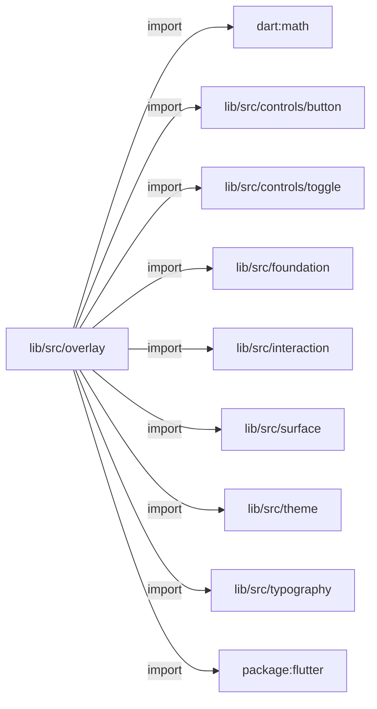
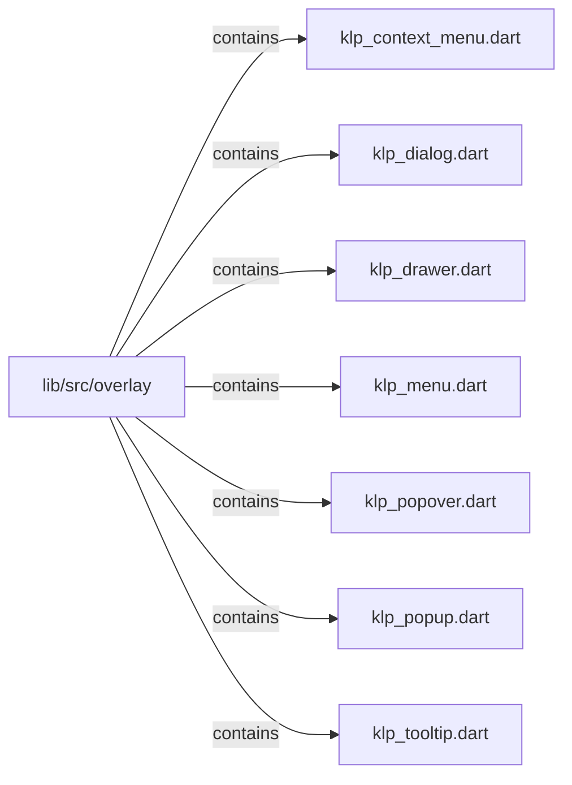

# lib/src/overlay：架構分析入口

[上一層](../README.md)

## 範圍

閱讀 `lib/src/overlay` 的直接子目錄與 Dart 檔案。結構圖表示實際檔案包含關係；依賴圖表示本層檔案明寫的 directives。每個檔案頁另列直接依賴、宣告、欄位、方法、建構子及行號證據。

## 模組閱讀重點

## 分析入口

此目錄並非每個元件都負責開啟 overlay：`KlpPopover` 只是 surface 包裝，`KlpDialog` 是對話框內容。真正的 context menu 觸發、定位與 controller 掛載從 `KlpContextMenu` 閱讀。此目錄沒有巢狀子目錄。

| 想回答的問題 | 精確符號與來源 |
| --- | --- |
| 如何以控制器開啟或關閉 context menu？ | `KlpContextMenuController.openAt`、`close`：lib/src/overlay/klp_context_menu.dart:16、18 |
| 選單 host 與狀態在哪裡？ | `KlpContextMenu`、`_KlpContextMenuState`：lib/src/overlay/klp_context_menu.dart:41、64 |
| 哪些入口只提供視覺內容？ | `KlpPopover`：lib/src/overlay/klp_popover.dart:6；`KlpDialog`：lib/src/overlay/klp_dialog.dart:10 |

重要依賴：`KlpPopover.build` 在 `klp_popover.dart:13` 建構 `KlpSurface`。`klp_context_menu.dart:5` 匯入 menu 模組；:36–40 說明重用 `KlpMenu` 與 `KlpMenuLayout.resolvePosition`。`klp_dialog.dart:8` 明確將彈出方式留給呼叫端。

## 本層直接依賴圖

箭頭以本層 Dart 檔案明寫的 directive 彙總到目標所在目錄或外部套件邊界；不遞迴將子目錄依賴算入本層。相同目標的不同 directive 類型分開計數。

| 目標邊界 | 關係 | directive 數 | 第一筆來源證據 |
|---|---|---|---|
| <code>dart:math</code> | import | 1 | [lib/src/overlay/klp_menu.dart:1](../../../../lib/src/overlay/klp_menu.dart#L1) |
| <code>lib/src/controls/button</code> | import | 1 | [lib/src/overlay/klp_dialog.dart:3](../../../../lib/src/overlay/klp_dialog.dart#L3) |
| <code>lib/src/controls/toggle</code> | import | 1 | [lib/src/overlay/klp_menu.dart:6](../../../../lib/src/overlay/klp_menu.dart#L6) |
| <code>lib/src/foundation</code> | import | 2 | [lib/src/overlay/klp_menu.dart:7](../../../../lib/src/overlay/klp_menu.dart#L7) |
| <code>lib/src/interaction</code> | import | 1 | [lib/src/overlay/klp_menu.dart:9](../../../../lib/src/overlay/klp_menu.dart#L9) |
| <code>lib/src/surface</code> | import | 7 | [lib/src/overlay/klp_dialog.dart:4](../../../../lib/src/overlay/klp_dialog.dart#L4) |
| <code>lib/src/theme</code> | import | 8 | [lib/src/overlay/klp_context_menu.dart:4](../../../../lib/src/overlay/klp_context_menu.dart#L4) |
| <code>lib/src/typography</code> | import | 2 | [lib/src/overlay/klp_dialog.dart:5](../../../../lib/src/overlay/klp_dialog.dart#L5) |
| <code>package:flutter</code> | import | 9 | [lib/src/overlay/klp_context_menu.dart:1](../../../../lib/src/overlay/klp_context_menu.dart#L1) |

### 同目錄依賴

| 來源 → 目標 | 關係 | 證據 |
|---|---|---|
| <code>klp_context_menu.dart → klp_menu.dart</code> | import | [lib/src/overlay/klp_context_menu.dart:5](../../../../lib/src/overlay/klp_context_menu.dart#L5) |

## 目錄結構圖

## 子目錄

| 目錄 | 導航 | 來源證據 |
|---|---|---|
| 無 | 目前沒有下一層目錄 | — |

## 本層檔案

| 檔案 | 宣告 | 細節 | 來源證據 |
|---|---|---|---|
| `klp_context_menu.dart` | KlpContextMenuController, KlpContextMenu, _KlpContextMenuState | [架構與 API](klp_context_menu.md) | [lib/src/overlay/klp_context_menu.dart:1](../../../../lib/src/overlay/klp_context_menu.dart#L1) |
| `klp_dialog.dart` | KlpDialog | [架構與 API](klp_dialog.md) | [lib/src/overlay/klp_dialog.dart:1](../../../../lib/src/overlay/klp_dialog.dart#L1) |
| `klp_drawer.dart` | KlpDrawerEdge, KlpDrawer | [架構與 API](klp_drawer.md) | [lib/src/overlay/klp_drawer.dart:1](../../../../lib/src/overlay/klp_drawer.dart#L1) |
| `klp_menu.dart` | KlpMenuStyle, _KlpMenuMetrics, KlpMenuItemData, KlpMenuLayout, KlpMenu, _KlpMenuState, KlpMenuItem, _KlpMenuItemState | [架構與 API](klp_menu.md) | [lib/src/overlay/klp_menu.dart:1](../../../../lib/src/overlay/klp_menu.dart#L1) |
| `klp_popover.dart` | KlpPopover | [架構與 API](klp_popover.md) | [lib/src/overlay/klp_popover.dart:1](../../../../lib/src/overlay/klp_popover.dart#L1) |
| `klp_popup.dart` | KlpPopupPanelKind, KlpPopupInteractionScope, KlpPopupBackground, KlpPopupPanel | [架構與 API](klp_popup.md) | [lib/src/overlay/klp_popup.dart:1](../../../../lib/src/overlay/klp_popup.dart#L1) |
| `klp_tooltip.dart` | KlpTooltip, KlpTooltipSurface | [架構與 API](klp_tooltip.md) | [lib/src/overlay/klp_tooltip.dart:1](../../../../lib/src/overlay/klp_tooltip.dart#L1) |

## 閱讀說明

箭頭只表示來源明寫的靜態關係；import 不等於呼叫。未分析動態呼叫、欄位的實際物件擁有權、狀態轉移或渲染流程；型別未進行語意解析，繼承目標保留原始型別拼寫。public／private 依 Dart 名稱前綴判斷；public 宣告不代表已由 `lib/kallopis.dart` 匯出。

本頁的目錄與檔案由來源清冊產生；`manifest.json` 位於本圖集根目錄，可核對 SHA-256 與覆蓋數。人工模組摘要存於 `tool/architecture_atlas/briefs/`，重新生成時保留。
