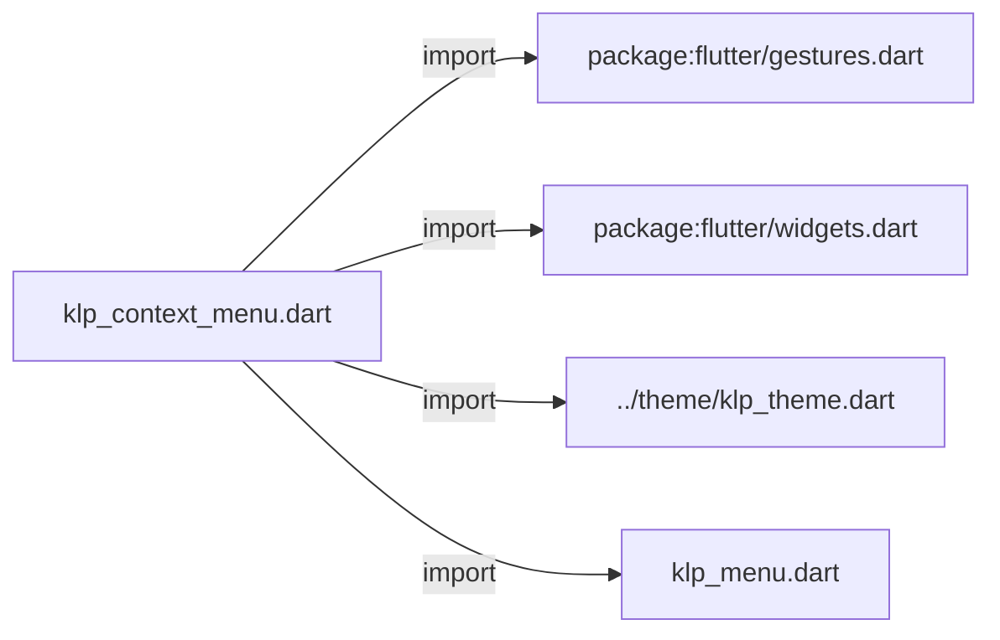
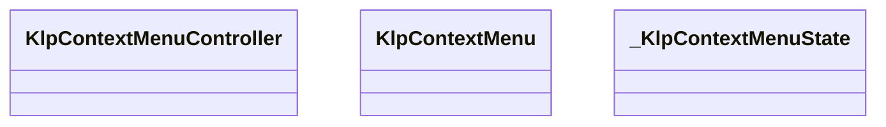
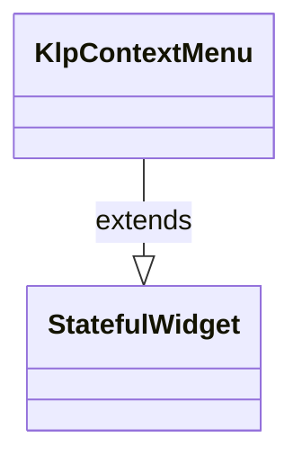
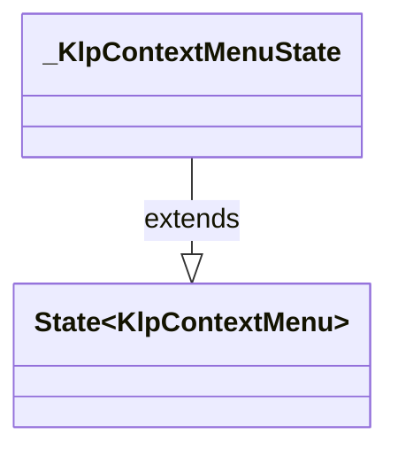

# klp_context_menu.dart：直接依賴與宣告架構

[回到目錄](README.md) · [來源檔案](../../../../lib/src/overlay/klp_context_menu.dart)

## 範圍

核心是 `lib/src/overlay/klp_context_menu.dart`。主要視角為該檔案明寫的 import／export／part；輔助視角為本檔宣告及 extends／implements／with／on 關係。只展開一層外部邊界。

## 直接依賴圖

## 依賴證據

| 關係 | 原始 directive | 來源 |
|---|---|---|
| import | <code>import &#x27;package:flutter/gestures.dart&#x27;;</code> | [lib/src/overlay/klp_context_menu.dart:1](../../../../lib/src/overlay/klp_context_menu.dart#L1) |
| import | <code>import &#x27;package:flutter/widgets.dart&#x27;;</code> | [lib/src/overlay/klp_context_menu.dart:2](../../../../lib/src/overlay/klp_context_menu.dart#L2) |
| import | <code>import &#x27;../theme/klp_theme.dart&#x27;;</code> | [lib/src/overlay/klp_context_menu.dart:4](../../../../lib/src/overlay/klp_context_menu.dart#L4) |
| import | <code>import &#x27;klp_menu.dart&#x27;;</code> | [lib/src/overlay/klp_context_menu.dart:5](../../../../lib/src/overlay/klp_context_menu.dart#L5) |

## 宣告關係圖

本組節點是本檔宣告；沒有箭頭的宣告未在此圖主張互相依賴。

## 宣告與成員證據

成員包含 public 與 private；簽章取自來源，省略函式本體與欄位初始值。`(inferred)` 表示來源未明寫型別；建構子只顯示參數部分，不含初始化列表。

### KlpContextMenuController

ClassDeclaration · public · [lib/src/overlay/klp_context_menu.dart:7](../../../../lib/src/overlay/klp_context_menu.dart#L7)

<code>class KlpContextMenuController</code>

來源註解摘要：讓子元件以既有 [KlpContextMenu] 的定位與外觀主動開啟選單。 controller 尚未掛載時呼叫不會產生作用；同一時間只應掛載到一個 context menu。

| 成員 | 可見性 | 簽章／型別 | 來源註解摘要 | 證據 |
|---|---|---|---|---|
| field <code>_open</code> | private | <code>void Function(Offset)? _open</code> |  | [lib/src/overlay/klp_context_menu.dart:11](../../../../lib/src/overlay/klp_context_menu.dart#L11) |
| field <code>_close</code> | private | <code>VoidCallback? _close</code> |  | [lib/src/overlay/klp_context_menu.dart:12](../../../../lib/src/overlay/klp_context_menu.dart#L12) |
| getter <code>isAttached</code> | public | <code>bool get isAttached</code> |  | [lib/src/overlay/klp_context_menu.dart:14](../../../../lib/src/overlay/klp_context_menu.dart#L14) |
| method <code>openAt</code> | public | <code>void openAt(Offset globalPosition)</code> |  | [lib/src/overlay/klp_context_menu.dart:16](../../../../lib/src/overlay/klp_context_menu.dart#L16) |
| method <code>close</code> | public | <code>void close()</code> |  | [lib/src/overlay/klp_context_menu.dart:18](../../../../lib/src/overlay/klp_context_menu.dart#L18) |
| method <code>_attach</code> | private | <code>void _attach({ required void Function(Offset) open, required VoidCallback close, })</code> |  | [lib/src/overlay/klp_context_menu.dart:20](../../../../lib/src/overlay/klp_context_menu.dart#L20) |
| method <code>_detach</code> | private | <code>void _detach()</code> |  | [lib/src/overlay/klp_context_menu.dart:29](../../../../lib/src/overlay/klp_context_menu.dart#L29) |

### KlpContextMenu

ClassDeclaration · public · [lib/src/overlay/klp_context_menu.dart:35](../../../../lib/src/overlay/klp_context_menu.dart#L35)

<code>class KlpContextMenu extends StatefulWidget</code>

來源註解摘要：右鍵選單：掛在任意子樹上，滑鼠右鍵或觸控長按於指標位置彈出。 選單本體重用既有的 [KlpMenu] 與 [KlpMenuItemData]——本元件只負責觸發時機、 指標定位與點外部關閉，**不重新實作選單外觀**（一條規則只能有一個實作）。 彈出位置沿用 [KlpMenuLayout.resolvePosition]，與 [KlpMenu] 在其他彈出場景 使用同一套定位邏輯，才不會有兩份互相分岔的擺放規則。

- `extends` → <code>StatefulWidget</code>：[lib/src/overlay/klp_context_menu.dart:41](../../../../lib/src/overlay/klp_context_menu.dart#L41)

| 成員 | 可見性 | 簽章／型別 | 來源註解摘要 | 證據 |
|---|---|---|---|---|
| constructor <code>KlpContextMenu</code> | public | <code>const KlpContextMenu({ super.key, required this.child, required this.label, required this.items, this.controller, })</code> |  | [lib/src/overlay/klp_context_menu.dart:42](../../../../lib/src/overlay/klp_context_menu.dart#L42) |
| field <code>child</code> | public | <code>final Widget child</code> | 掛載右鍵選單行為的子樹。 | [lib/src/overlay/klp_context_menu.dart:51](../../../../lib/src/overlay/klp_context_menu.dart#L51) |
| field <code>label</code> | public | <code>final String label</code> | 選單標題。庫不替產品決定用什麼語言說明這組動作——呼叫端必須提供。 | [lib/src/overlay/klp_context_menu.dart:54](../../../../lib/src/overlay/klp_context_menu.dart#L54) |
| field <code>items</code> | public | <code>final List&lt;KlpMenuItemData&gt; items</code> | 選單項目，重用 [KlpMenu] 既有的資料模型。 | [lib/src/overlay/klp_context_menu.dart:57](../../../../lib/src/overlay/klp_context_menu.dart#L57) |
| field <code>controller</code> | public | <code>final KlpContextMenuController? controller</code> |  | [lib/src/overlay/klp_context_menu.dart:58](../../../../lib/src/overlay/klp_context_menu.dart#L58) |
| method <code>createState</code> | public | <code>State&lt;KlpContextMenu&gt; createState()</code> |  | [lib/src/overlay/klp_context_menu.dart:60](../../../../lib/src/overlay/klp_context_menu.dart#L60) |

### _KlpContextMenuState

ClassDeclaration · private · [lib/src/overlay/klp_context_menu.dart:64](../../../../lib/src/overlay/klp_context_menu.dart#L64)

<code>class _KlpContextMenuState extends State&lt;KlpContextMenu&gt;</code>

- `extends` → <code>State&lt;KlpContextMenu&gt;</code>：[lib/src/overlay/klp_context_menu.dart:64](../../../../lib/src/overlay/klp_context_menu.dart#L64)

| 成員 | 可見性 | 簽章／型別 | 來源註解摘要 | 證據 |
|---|---|---|---|---|
| field <code>_controller</code> | private | <code>final OverlayPortalController _controller</code> |  | [lib/src/overlay/klp_context_menu.dart:65](../../../../lib/src/overlay/klp_context_menu.dart#L65) |
| field <code>_anchor</code> | private | <code>Offset _anchor</code> |  | [lib/src/overlay/klp_context_menu.dart:66](../../../../lib/src/overlay/klp_context_menu.dart#L66) |
| method <code>initState</code> | public | <code>void initState()</code> |  | [lib/src/overlay/klp_context_menu.dart:68](../../../../lib/src/overlay/klp_context_menu.dart#L68) |
| method <code>didUpdateWidget</code> | public | <code>void didUpdateWidget(KlpContextMenu oldWidget)</code> |  | [lib/src/overlay/klp_context_menu.dart:74](../../../../lib/src/overlay/klp_context_menu.dart#L74) |
| method <code>dispose</code> | public | <code>void dispose()</code> |  | [lib/src/overlay/klp_context_menu.dart:83](../../../../lib/src/overlay/klp_context_menu.dart#L83) |
| method <code>_attachController</code> | private | <code>void _attachController()</code> |  | [lib/src/overlay/klp_context_menu.dart:89](../../../../lib/src/overlay/klp_context_menu.dart#L89) |
| method <code>_openAt</code> | private | <code>void _openAt(Offset globalPosition)</code> |  | [lib/src/overlay/klp_context_menu.dart:93](../../../../lib/src/overlay/klp_context_menu.dart#L93) |
| method <code>_close</code> | private | <code>void _close()</code> |  | [lib/src/overlay/klp_context_menu.dart:98](../../../../lib/src/overlay/klp_context_menu.dart#L98) |
| method <code>_dismissingItems</code> | private | <code>List&lt;KlpMenuItemData&gt; _dismissingItems()</code> | 包一層 `onPressed`：選到項目後先關閉選單再執行原本的動作， 呼叫端不需要自己記得關閉時機。 | [lib/src/overlay/klp_context_menu.dart:102](../../../../lib/src/overlay/klp_context_menu.dart#L102) |
| method <code>build</code> | public | <code>Widget build(BuildContext context)</code> |  | [lib/src/overlay/klp_context_menu.dart:125](../../../../lib/src/overlay/klp_context_menu.dart#L125) |

## 閱讀說明與限制

箭頭只表示來源明寫的靜態關係；import 不等於呼叫。未分析動態呼叫、欄位的實際物件擁有權、狀態轉移或渲染流程；型別未進行語意解析，繼承目標保留原始型別拼寫。public／private 依 Dart 名稱前綴判斷；public 宣告不代表已由 `lib/kallopis.dart` 匯出。

本頁由 `tool/architecture_atlas` 產生；編輯來源或生成工具後重新產生，避免手改本頁。
