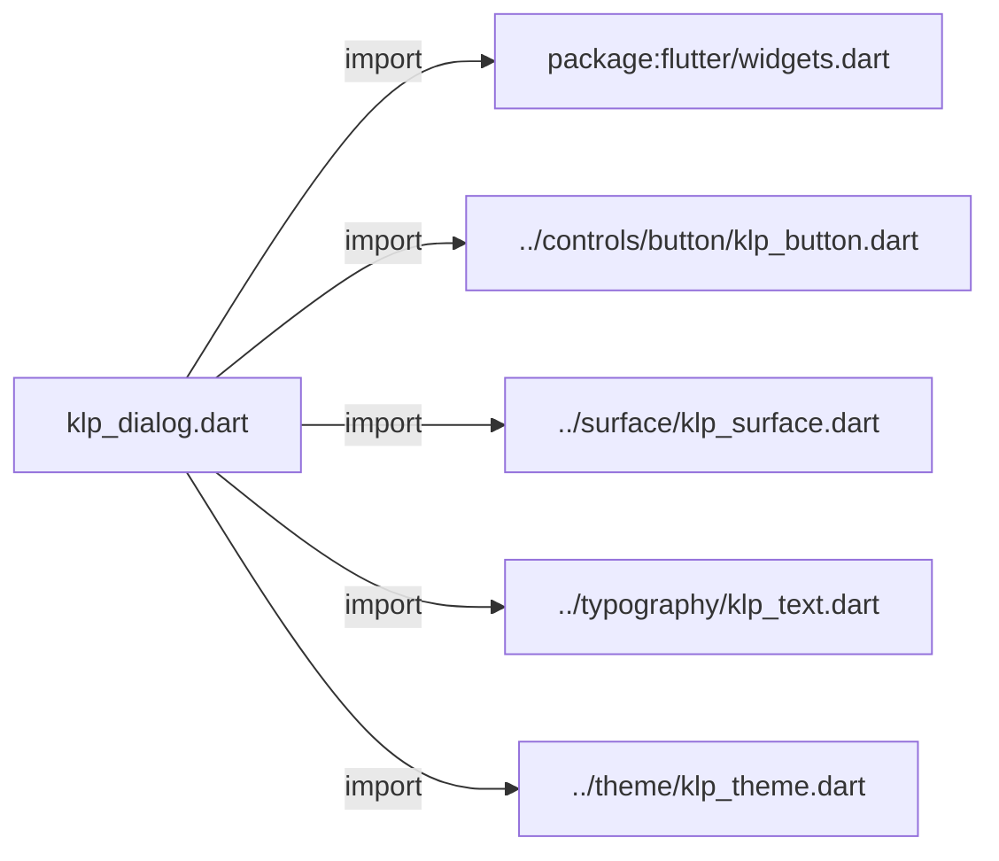
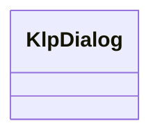
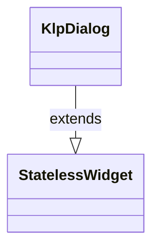

# klp_dialog.dart：直接依賴與宣告架構

[回到目錄](README.md) · [來源檔案](../../../../lib/src/overlay/klp_dialog.dart)

## 範圍

核心是 `lib/src/overlay/klp_dialog.dart`。主要視角為該檔案明寫的 import／export／part；輔助視角為本檔宣告及 extends／implements／with／on 關係。只展開一層外部邊界。

## 直接依賴圖

## 依賴證據

| 關係 | 原始 directive | 來源 |
|---|---|---|
| import | <code>import &#x27;package:flutter/widgets.dart&#x27;;</code> | [lib/src/overlay/klp_dialog.dart:1](../../../../lib/src/overlay/klp_dialog.dart#L1) |
| import | <code>import &#x27;../controls/button/klp_button.dart&#x27;;</code> | [lib/src/overlay/klp_dialog.dart:3](../../../../lib/src/overlay/klp_dialog.dart#L3) |
| import | <code>import &#x27;../surface/klp_surface.dart&#x27;;</code> | [lib/src/overlay/klp_dialog.dart:4](../../../../lib/src/overlay/klp_dialog.dart#L4) |
| import | <code>import &#x27;../typography/klp_text.dart&#x27;;</code> | [lib/src/overlay/klp_dialog.dart:5](../../../../lib/src/overlay/klp_dialog.dart#L5) |
| import | <code>import &#x27;../theme/klp_theme.dart&#x27;;</code> | [lib/src/overlay/klp_dialog.dart:6](../../../../lib/src/overlay/klp_dialog.dart#L6) |

## 宣告關係圖

本組節點是本檔宣告；沒有箭頭的宣告未在此圖主張互相依賴。

## 宣告與成員證據

成員包含 public 與 private；簽章取自來源，省略函式本體與欄位初始值。`(inferred)` 表示來源未明寫型別；建構子只顯示參數部分，不含初始化列表。

### KlpDialog

ClassDeclaration · public · [lib/src/overlay/klp_dialog.dart:8](../../../../lib/src/overlay/klp_dialog.dart#L8)

<code>class KlpDialog extends StatelessWidget</code>

來源註解摘要：對話框內容。**不負責彈出**——呼叫端自行決定用 `showDialog` 或其他方式呈現。 `secondaryLabel` 為必填：庫不替產品決定用什麼語言說「取消」。

- `extends` → <code>StatelessWidget</code>：[lib/src/overlay/klp_dialog.dart:10](../../../../lib/src/overlay/klp_dialog.dart#L10)

| 成員 | 可見性 | 簽章／型別 | 來源註解摘要 | 證據 |
|---|---|---|---|---|
| constructor <code>KlpDialog</code> | public | <code>const KlpDialog({ super.key, required this.label, required this.title, required this.child, required this.primaryLabel, required this.onPrimary, required this.secondaryLabel, this.onSecondary, })</code> |  | [lib/src/overlay/klp_dialog.dart:11](../../../../lib/src/overlay/klp_dialog.dart#L11) |
| field <code>label</code> | public | <code>final String label</code> |  | [lib/src/overlay/klp_dialog.dart:22](../../../../lib/src/overlay/klp_dialog.dart#L22) |
| field <code>title</code> | public | <code>final String title</code> |  | [lib/src/overlay/klp_dialog.dart:23](../../../../lib/src/overlay/klp_dialog.dart#L23) |
| field <code>child</code> | public | <code>final Widget child</code> |  | [lib/src/overlay/klp_dialog.dart:24](../../../../lib/src/overlay/klp_dialog.dart#L24) |
| field <code>primaryLabel</code> | public | <code>final String primaryLabel</code> |  | [lib/src/overlay/klp_dialog.dart:25](../../../../lib/src/overlay/klp_dialog.dart#L25) |
| field <code>onPrimary</code> | public | <code>final VoidCallback onPrimary</code> |  | [lib/src/overlay/klp_dialog.dart:26](../../../../lib/src/overlay/klp_dialog.dart#L26) |
| field <code>secondaryLabel</code> | public | <code>final String secondaryLabel</code> | 次要動作的文字。**沒有預設值是刻意的**——庫不替產品決定用什麼語言說「取消」。 | [lib/src/overlay/klp_dialog.dart:29](../../../../lib/src/overlay/klp_dialog.dart#L29) |
| field <code>onSecondary</code> | public | <code>final VoidCallback? onSecondary</code> |  | [lib/src/overlay/klp_dialog.dart:30](../../../../lib/src/overlay/klp_dialog.dart#L30) |
| method <code>build</code> | public | <code>Widget build(BuildContext context)</code> |  | [lib/src/overlay/klp_dialog.dart:32](../../../../lib/src/overlay/klp_dialog.dart#L32) |

## 閱讀說明與限制

箭頭只表示來源明寫的靜態關係；import 不等於呼叫。未分析動態呼叫、欄位的實際物件擁有權、狀態轉移或渲染流程；型別未進行語意解析，繼承目標保留原始型別拼寫。public／private 依 Dart 名稱前綴判斷；public 宣告不代表已由 `lib/kallopis.dart` 匯出。

本頁由 `tool/architecture_atlas` 產生；編輯來源或生成工具後重新產生，避免手改本頁。
