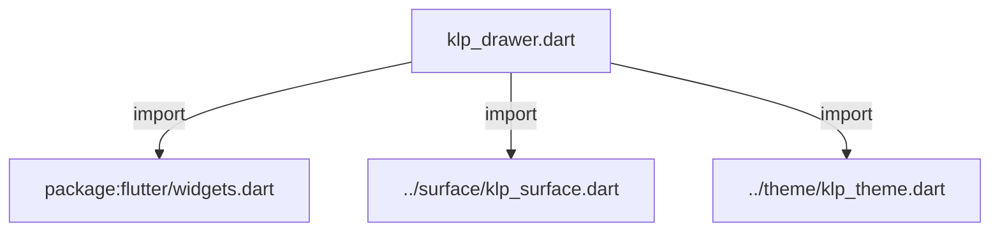
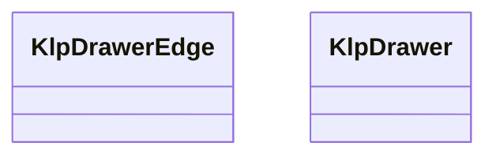
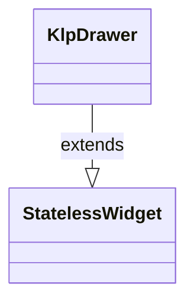

# klp_drawer.dart：直接依賴與宣告架構

[回到目錄](README.md) · [來源檔案](../../../../lib/src/overlay/klp_drawer.dart)

## 範圍

核心是 `lib/src/overlay/klp_drawer.dart`。主要視角為該檔案明寫的 import／export／part；輔助視角為本檔宣告及 extends／implements／with／on 關係。只展開一層外部邊界。

## 直接依賴圖

## 依賴證據

| 關係 | 原始 directive | 來源 |
|---|---|---|
| import | <code>import &#x27;package:flutter/widgets.dart&#x27;;</code> | [lib/src/overlay/klp_drawer.dart:1](../../../../lib/src/overlay/klp_drawer.dart#L1) |
| import | <code>import &#x27;../surface/klp_surface.dart&#x27;;</code> | [lib/src/overlay/klp_drawer.dart:3](../../../../lib/src/overlay/klp_drawer.dart#L3) |
| import | <code>import &#x27;../theme/klp_theme.dart&#x27;;</code> | [lib/src/overlay/klp_drawer.dart:4](../../../../lib/src/overlay/klp_drawer.dart#L4) |

## 宣告關係圖

本組節點是本檔宣告；沒有箭頭的宣告未在此圖主張互相依賴。

## 宣告與成員證據

成員包含 public 與 private；簽章取自來源，省略函式本體與欄位初始值。`(inferred)` 表示來源未明寫型別；建構子只顯示參數部分，不含初始化列表。

### KlpDrawerEdge

EnumDeclaration · public · [lib/src/overlay/klp_drawer.dart:6](../../../../lib/src/overlay/klp_drawer.dart#L6)

<code>enum KlpDrawerEdge</code>

來源註解摘要：面板從畫面邊緣滑入的方向。`bottom` 即一般所稱的 sheet。

| 成員 | 可見性 | 簽章／型別 | 來源註解摘要 | 證據 |
|---|---|---|---|---|
| enum value <code>left</code> | public | <code>left</code> |  | [lib/src/overlay/klp_drawer.dart:7](../../../../lib/src/overlay/klp_drawer.dart#L7) |
| enum value <code>right</code> | public | <code>right</code> |  | [lib/src/overlay/klp_drawer.dart:7](../../../../lib/src/overlay/klp_drawer.dart#L7) |
| enum value <code>top</code> | public | <code>top</code> |  | [lib/src/overlay/klp_drawer.dart:7](../../../../lib/src/overlay/klp_drawer.dart#L7) |
| enum value <code>bottom</code> | public | <code>bottom</code> |  | [lib/src/overlay/klp_drawer.dart:7](../../../../lib/src/overlay/klp_drawer.dart#L7) |

### KlpDrawer

ClassDeclaration · public · [lib/src/overlay/klp_drawer.dart:9](../../../../lib/src/overlay/klp_drawer.dart#L9)

<code>class KlpDrawer extends StatelessWidget</code>

來源註解摘要：從邊緣滑入的面板：側邊欄、篩選面板，或（[KlpDrawerEdge.bottom] 方向）行動裝置 常見的 sheet。 **不負責彈出**——呼叫端決定用什麼容器承載這個 widget（例如 `KlpOverlayHost`、`Stack` 或 `Overlay`），並透過 [open] 驅動顯示與否； 本元件只負責滑入滑出的動畫、遮罩與「點遮罩關閉」這個互動。呼叫端持有 [open] 的狀態，本元件本身不追蹤開關。

- `extends` → <code>StatelessWidget</code>：[lib/src/overlay/klp_drawer.dart:16](../../../../lib/src/overlay/klp_drawer.dart#L16)

| 成員 | 可見性 | 簽章／型別 | 來源註解摘要 | 證據 |
|---|---|---|---|---|
| constructor <code>KlpDrawer</code> | public | <code>const KlpDrawer({ super.key, required this.open, required this.child, this.edge = KlpDrawerEdge.right, this.size, this.onScrimTap, this.barrierDismissible = true, })</code> |  | [lib/src/overlay/klp_drawer.dart:17](../../../../lib/src/overlay/klp_drawer.dart#L17) |
| field <code>open</code> | public | <code>final bool open</code> | 是否展開。 | [lib/src/overlay/klp_drawer.dart:28](../../../../lib/src/overlay/klp_drawer.dart#L28) |
| field <code>child</code> | public | <code>final Widget child</code> | 面板內容。 | [lib/src/overlay/klp_drawer.dart:31](../../../../lib/src/overlay/klp_drawer.dart#L31) |
| field <code>edge</code> | public | <code>final KlpDrawerEdge edge</code> | 從哪個邊緣滑入。`bottom` 即一般所稱的 sheet。 | [lib/src/overlay/klp_drawer.dart:34](../../../../lib/src/overlay/klp_drawer.dart#L34) |
| field <code>size</code> | public | <code>final double? size</code> | 面板尺寸：[KlpDrawerEdge.left]／[KlpDrawerEdge.right] 為寬度， [KlpDrawerEdge.top]／[KlpDrawerEdge.bottom] 為高度。 `null` 表示沿用 theme 的預設面板尺寸。 | [lib/src/overlay/klp_drawer.dart:39](../../../../lib/src/overlay/klp_drawer.dart#L39) |
| field <code>onScrimTap</code> | public | <code>final VoidCallback? onScrimTap</code> | 點遮罩時呼叫，用於關閉面板。 | [lib/src/overlay/klp_drawer.dart:42](../../../../lib/src/overlay/klp_drawer.dart#L42) |
| field <code>barrierDismissible</code> | public | <code>final bool barrierDismissible</code> | 點遮罩是否關閉——即遮罩是否攔截點擊事件。收合時遮罩一律不攔截， 不受此旗標影響。 | [lib/src/overlay/klp_drawer.dart:46](../../../../lib/src/overlay/klp_drawer.dart#L46) |
| method <code>build</code> | public | <code>Widget build(BuildContext context)</code> |  | [lib/src/overlay/klp_drawer.dart:48](../../../../lib/src/overlay/klp_drawer.dart#L48) |

## 閱讀說明與限制

箭頭只表示來源明寫的靜態關係；import 不等於呼叫。未分析動態呼叫、欄位的實際物件擁有權、狀態轉移或渲染流程；型別未進行語意解析，繼承目標保留原始型別拼寫。public／private 依 Dart 名稱前綴判斷；public 宣告不代表已由 `lib/kallopis.dart` 匯出。

本頁由 `tool/architecture_atlas` 產生；編輯來源或生成工具後重新產生，避免手改本頁。
