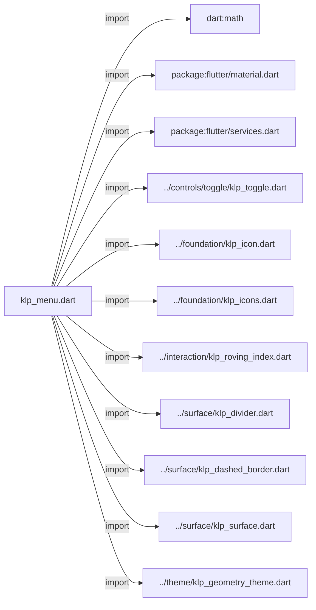
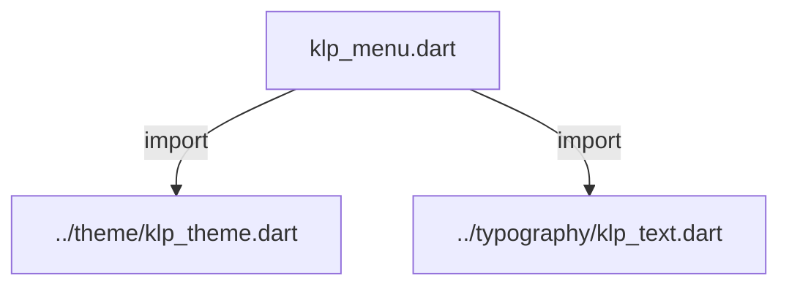
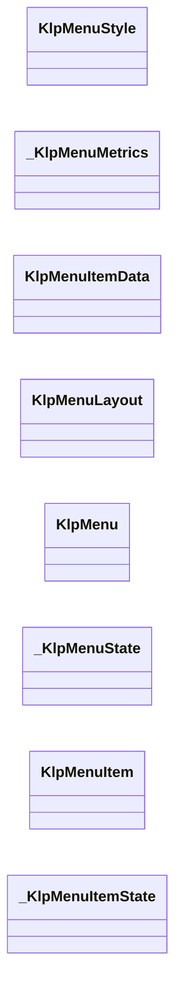
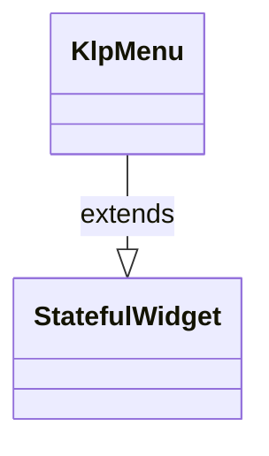
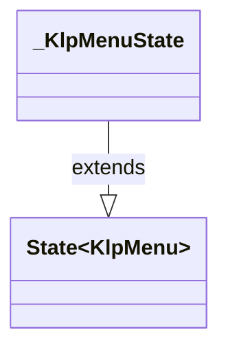
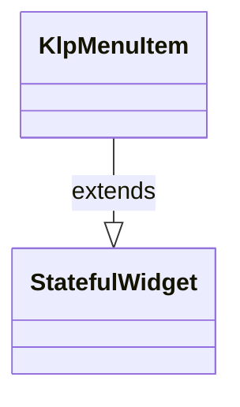
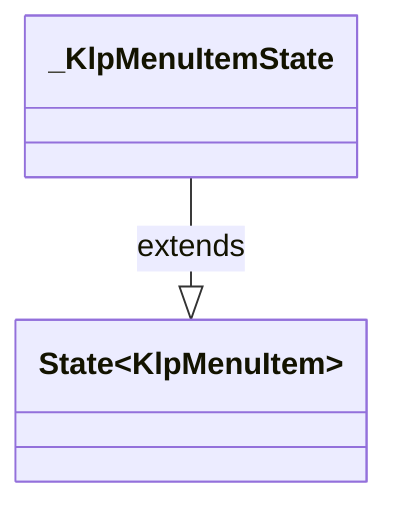

# klp_menu.dart：直接依賴與宣告架構

[回到目錄](README.md) · [來源檔案](../../../../lib/src/overlay/klp_menu.dart)

## 範圍

核心是 `lib/src/overlay/klp_menu.dart`。主要視角為該檔案明寫的 import／export／part；輔助視角為本檔宣告及 extends／implements／with／on 關係。只展開一層外部邊界。

## 直接依賴圖

## 依賴證據

| 關係 | 原始 directive | 來源 |
|---|---|---|
| import | <code>import &#x27;dart:math&#x27; as math;</code> | [lib/src/overlay/klp_menu.dart:1](../../../../lib/src/overlay/klp_menu.dart#L1) |
| import | <code>import &#x27;package:flutter/material.dart&#x27;;</code> | [lib/src/overlay/klp_menu.dart:3](../../../../lib/src/overlay/klp_menu.dart#L3) |
| import | <code>import &#x27;package:flutter/services.dart&#x27;;</code> | [lib/src/overlay/klp_menu.dart:4](../../../../lib/src/overlay/klp_menu.dart#L4) |
| import | <code>import &#x27;../controls/toggle/klp_toggle.dart&#x27;;</code> | [lib/src/overlay/klp_menu.dart:6](../../../../lib/src/overlay/klp_menu.dart#L6) |
| import | <code>import &#x27;../foundation/klp_icon.dart&#x27;;</code> | [lib/src/overlay/klp_menu.dart:7](../../../../lib/src/overlay/klp_menu.dart#L7) |
| import | <code>import &#x27;../foundation/klp_icons.dart&#x27;;</code> | [lib/src/overlay/klp_menu.dart:8](../../../../lib/src/overlay/klp_menu.dart#L8) |
| import | <code>import &#x27;../interaction/klp_roving_index.dart&#x27;;</code> | [lib/src/overlay/klp_menu.dart:9](../../../../lib/src/overlay/klp_menu.dart#L9) |
| import | <code>import &#x27;../surface/klp_divider.dart&#x27;;</code> | [lib/src/overlay/klp_menu.dart:10](../../../../lib/src/overlay/klp_menu.dart#L10) |
| import | <code>import &#x27;../surface/klp_dashed_border.dart&#x27;;</code> | [lib/src/overlay/klp_menu.dart:11](../../../../lib/src/overlay/klp_menu.dart#L11) |
| import | <code>import &#x27;../surface/klp_surface.dart&#x27;;</code> | [lib/src/overlay/klp_menu.dart:12](../../../../lib/src/overlay/klp_menu.dart#L12) |
| import | <code>import &#x27;../theme/klp_geometry_theme.dart&#x27;;</code> | [lib/src/overlay/klp_menu.dart:13](../../../../lib/src/overlay/klp_menu.dart#L13) |
| import | <code>import &#x27;../theme/klp_theme.dart&#x27;;</code> | [lib/src/overlay/klp_menu.dart:14](../../../../lib/src/overlay/klp_menu.dart#L14) |
| import | <code>import &#x27;../typography/klp_text.dart&#x27;;</code> | [lib/src/overlay/klp_menu.dart:15](../../../../lib/src/overlay/klp_menu.dart#L15) |

## 宣告關係圖

本組節點是本檔宣告；沒有箭頭的宣告未在此圖主張互相依賴。

## 宣告與成員證據

成員包含 public 與 private；簽章取自來源，省略函式本體與欄位初始值。`(inferred)` 表示來源未明寫型別；建構子只顯示參數部分，不含初始化列表。

### KlpMenuStyle

ClassDeclaration · public · [lib/src/overlay/klp_menu.dart:17](../../../../lib/src/overlay/klp_menu.dart#L17)

<code>abstract final class KlpMenuStyle</code>

來源註解摘要：[KlpMenu] 系列元件共用的文字角色，目前只有一項。獨立成類別是為了讓未來 若要新增更多共用樣式常數時有現成的落點，不必再改動呼叫端。

| 成員 | 可見性 | 簽章／型別 | 來源註解摘要 | 證據 |
|---|---|---|---|---|
| field <code>textRole</code> | public | <code>static const KlpTextRole textRole</code> |  | [lib/src/overlay/klp_menu.dart:20](../../../../lib/src/overlay/klp_menu.dart#L20) |

### _KlpMenuMetrics

ClassDeclaration · private · [lib/src/overlay/klp_menu.dart:23](../../../../lib/src/overlay/klp_menu.dart#L23)

<code>abstract final class _KlpMenuMetrics</code>

| 成員 | 可見性 | 簽章／型別 | 來源註解摘要 | 證據 |
|---|---|---|---|---|
| method <code>width</code> | public | <code>static double width(BuildContext context)</code> |  | [lib/src/overlay/klp_menu.dart:24](../../../../lib/src/overlay/klp_menu.dart#L24) |
| method <code>headerHeight</code> | public | <code>static double headerHeight(BuildContext context)</code> |  | [lib/src/overlay/klp_menu.dart:26](../../../../lib/src/overlay/klp_menu.dart#L26) |
| method <code>horizontalPadding</code> | public | <code>static double horizontalPadding(BuildContext context)</code> |  | [lib/src/overlay/klp_menu.dart:28](../../../../lib/src/overlay/klp_menu.dart#L28) |
| method <code>itemHeight</code> | public | <code>static double itemHeight(BuildContext context)</code> |  | [lib/src/overlay/klp_menu.dart:30](../../../../lib/src/overlay/klp_menu.dart#L30) |
| method <code>iconSize</code> | public | <code>static double iconSize(BuildContext context)</code> |  | [lib/src/overlay/klp_menu.dart:31](../../../../lib/src/overlay/klp_menu.dart#L31) |
| method <code>iconGap</code> | public | <code>static double iconGap(BuildContext context)</code> |  | [lib/src/overlay/klp_menu.dart:32](../../../../lib/src/overlay/klp_menu.dart#L32) |
| method <code>iconOpticalOffsetY</code> | public | <code>static double iconOpticalOffsetY(BuildContext context)</code> |  | [lib/src/overlay/klp_menu.dart:34](../../../../lib/src/overlay/klp_menu.dart#L34) |
| method <code>panelRadius</code> | public | <code>static double panelRadius(BuildContext context)</code> |  | [lib/src/overlay/klp_menu.dart:37](../../../../lib/src/overlay/klp_menu.dart#L37) |
| method <code>menuBlurRadius</code> | public | <code>static double menuBlurRadius(BuildContext context)</code> |  | [lib/src/overlay/klp_menu.dart:38](../../../../lib/src/overlay/klp_menu.dart#L38) |
| method <code>menuOffsetY</code> | public | <code>static double menuOffsetY(BuildContext context)</code> |  | [lib/src/overlay/klp_menu.dart:40](../../../../lib/src/overlay/klp_menu.dart#L40) |

### KlpMenuItemData

ClassDeclaration · public · [lib/src/overlay/klp_menu.dart:44](../../../../lib/src/overlay/klp_menu.dart#L44)

<code>class KlpMenuItemData</code>

來源註解摘要：[KlpMenu] 裡的一個項目。 [toggleValue] 非 null 時項目會額外畫出一個開關指示，用於「這個選項本身是 一個可切換設定」的情境（例如選單裡的「顯示隱藏檔案」）；[hasSubmenu] 只是 畫出展開箭頭的視覺提示，實際的子選單彈出邏輯不歸這個資料類別管，由呼叫端 自行處理 [onPressed]。[separatedBefore] 在這個項目之前插入一條分隔線， 用來把選單切成語意上的幾組。

| 成員 | 可見性 | 簽章／型別 | 來源註解摘要 | 證據 |
|---|---|---|---|---|
| constructor <code>KlpMenuItemData</code> | public | <code>const KlpMenuItemData({ required this.label, required this.onPressed, this.key, this.icon, this.shortcut, this.toggleValue, this.hasSubmenu = false, this.danger = false, this.separatedBefore = false, this.dashedSeparatorBefore = false, this.selected = false, this.enabled = true, })</code> |  | [lib/src/overlay/klp_menu.dart:52](../../../../lib/src/overlay/klp_menu.dart#L52) |
| field <code>label</code> | public | <code>final String label</code> |  | [lib/src/overlay/klp_menu.dart:70](../../../../lib/src/overlay/klp_menu.dart#L70) |
| field <code>onPressed</code> | public | <code>final VoidCallback onPressed</code> |  | [lib/src/overlay/klp_menu.dart:71](../../../../lib/src/overlay/klp_menu.dart#L71) |
| field <code>key</code> | public | <code>final Key? key</code> |  | [lib/src/overlay/klp_menu.dart:72](../../../../lib/src/overlay/klp_menu.dart#L72) |
| field <code>icon</code> | public | <code>final KlpIconData? icon</code> |  | [lib/src/overlay/klp_menu.dart:73](../../../../lib/src/overlay/klp_menu.dart#L73) |
| field <code>shortcut</code> | public | <code>final String? shortcut</code> |  | [lib/src/overlay/klp_menu.dart:74](../../../../lib/src/overlay/klp_menu.dart#L74) |
| field <code>toggleValue</code> | public | <code>final bool? toggleValue</code> |  | [lib/src/overlay/klp_menu.dart:75](../../../../lib/src/overlay/klp_menu.dart#L75) |
| field <code>hasSubmenu</code> | public | <code>final bool hasSubmenu</code> |  | [lib/src/overlay/klp_menu.dart:76](../../../../lib/src/overlay/klp_menu.dart#L76) |
| field <code>danger</code> | public | <code>final bool danger</code> |  | [lib/src/overlay/klp_menu.dart:77](../../../../lib/src/overlay/klp_menu.dart#L77) |
| field <code>separatedBefore</code> | public | <code>final bool separatedBefore</code> |  | [lib/src/overlay/klp_menu.dart:78](../../../../lib/src/overlay/klp_menu.dart#L78) |
| field <code>dashedSeparatorBefore</code> | public | <code>final bool dashedSeparatorBefore</code> | 在此項目前以虛線分組；不可與 [separatedBefore] 同時使用。 | [lib/src/overlay/klp_menu.dart:81](../../../../lib/src/overlay/klp_menu.dart#L81) |
| field <code>selected</code> | public | <code>final bool selected</code> |  | [lib/src/overlay/klp_menu.dart:82](../../../../lib/src/overlay/klp_menu.dart#L82) |
| field <code>enabled</code> | public | <code>final bool enabled</code> |  | [lib/src/overlay/klp_menu.dart:83](../../../../lib/src/overlay/klp_menu.dart#L83) |

### KlpMenuLayout

ClassDeclaration · public · [lib/src/overlay/klp_menu.dart:86](../../../../lib/src/overlay/klp_menu.dart#L86)

<code>abstract final class KlpMenuLayout</code>

來源註解摘要：計算 [KlpMenu] 彈出時的尺寸與位置，供呼叫端在插入 overlay 之前先算好座標。 [KlpMenu] 本身不負責定位——它假設自己已經被放在正確的座標上。這裡的計算 之所以要在 build 之前完成，是因為 overlay 通常要在 `showMenu` 一類的 API 呼叫時就給出目標位置，那時還沒有已渲染的 widget 可以量測，因此改用 [estimatedHeight] 這種按項目數推算高度的方式，而不是實際排版量測。 [resolvePosition]／[resolveSubmenuPosition] 都會把結果夾在 viewport 內， 避免選單超出螢幕邊界。

| 成員 | 可見性 | 簽章／型別 | 來源註解摘要 | 證據 |
|---|---|---|---|---|
| getter <code>width</code> | public | <code>static double get width</code> |  | [lib/src/overlay/klp_menu.dart:95](../../../../lib/src/overlay/klp_menu.dart#L95) |
| method <code>widthOf</code> | public | <code>static double widthOf(BuildContext context)</code> |  | [lib/src/overlay/klp_menu.dart:98](../../../../lib/src/overlay/klp_menu.dart#L98) |
| method <code>estimatedHeight</code> | public | <code>static double estimatedHeight({ required BuildContext context, required int itemCount, int separatorCount = 0, })</code> |  | [lib/src/overlay/klp_menu.dart:100](../../../../lib/src/overlay/klp_menu.dart#L100) |
| method <code>resolvePosition</code> | public | <code>static Offset resolvePosition({ required Offset anchor, required Size viewport, required BuildContext context, required int itemCount, int separatorCount = 0, })</code> |  | [lib/src/overlay/klp_menu.dart:113](../../../../lib/src/overlay/klp_menu.dart#L113) |
| method <code>resolveSubmenuPosition</code> | public | <code>static Offset resolveSubmenuPosition({ required Offset parentPosition, required Size viewport, required BuildContext context, required int itemCount, int separatorCount = 0, })</code> |  | [lib/src/overlay/klp_menu.dart:145](../../../../lib/src/overlay/klp_menu.dart#L145) |

### KlpMenu

ClassDeclaration · public · [lib/src/overlay/klp_menu.dart:186](../../../../lib/src/overlay/klp_menu.dart#L186)

<code>class KlpMenu extends StatefulWidget</code>

來源註解摘要：彈出式選單面板：標題列加上一組 [KlpMenuItemData]。 只畫面板本身（含陰影與圓角），不處理定位或觸發——插入 overlay 的位置請用 [KlpMenuLayout] 先算好，選單的顯示／關閉時機也由呼叫端（通常是 `showMenu` 或自訂 overlay）控制。 **鍵盤**：`↓`／`↑` 在項目間移動高亮（跳過 [KlpMenuItemData.enabled] 為 `false` 的項目，並在頭尾之間循環），`Home`／`End` 跳到首／尾一個可用項目， `Enter`／`Space` 觸發目前高亮的項目，`Escape` 呼叫 [onEscape]（通常用來關閉 選單，由呼叫端決定要不要提供）。索引移動的規則沿用 [KlpRovingIndex]，與 [KlpCombobox] 共用同一套實作，不是第二份重寫。 高亮的視覺沿用既有的 hover／focus 語言（[KlpMenuItem] 的 `active` 底色）， 不是新增的第三種視覺；只有 [KlpMenuItemData.selected]（真正的選取狀態）才會 用高對比的選取底色。 選單預設會在第一次 build 時自動取得鍵盤焦點（[autofocus]），因為選單通常是 剛彈出的 overlay，此時畫面上不會有其他東西持有焦點；若呼叫端要自行控制焦點 時機（例如選單嵌在一般版面裡而非彈出層），可以把 [autofocus] 設為 `false`。

- `extends` → <code>StatefulWidget</code>：[lib/src/overlay/klp_menu.dart:205](../../../../lib/src/overlay/klp_menu.dart#L205)

| 成員 | 可見性 | 簽章／型別 | 來源註解摘要 | 證據 |
|---|---|---|---|---|
| constructor <code>KlpMenu</code> | public | <code>const KlpMenu({ super.key, required this.label, required this.items, this.autofocus = true, this.onEscape, })</code> |  | [lib/src/overlay/klp_menu.dart:206](../../../../lib/src/overlay/klp_menu.dart#L206) |
| field <code>label</code> | public | <code>final String label</code> |  | [lib/src/overlay/klp_menu.dart:214](../../../../lib/src/overlay/klp_menu.dart#L214) |
| field <code>items</code> | public | <code>final List&lt;KlpMenuItemData&gt; items</code> |  | [lib/src/overlay/klp_menu.dart:215](../../../../lib/src/overlay/klp_menu.dart#L215) |
| field <code>autofocus</code> | public | <code>final bool autofocus</code> | 是否在選單出現時自動取得鍵盤焦點，才能立刻用方向鍵操作。預設 `true`。 | [lib/src/overlay/klp_menu.dart:218](../../../../lib/src/overlay/klp_menu.dart#L218) |
| field <code>onEscape</code> | public | <code>final VoidCallback? onEscape</code> | 按下 `Escape` 時呼叫。庫不擅自決定「按 Escape 要做什麼」——通常是呼叫端 用來關閉選單，未提供時 `Escape` 不會有任何效果。 | [lib/src/overlay/klp_menu.dart:222](../../../../lib/src/overlay/klp_menu.dart#L222) |
| method <code>createState</code> | public | <code>State&lt;KlpMenu&gt; createState()</code> |  | [lib/src/overlay/klp_menu.dart:224](../../../../lib/src/overlay/klp_menu.dart#L224) |

### _KlpMenuState

ClassDeclaration · private · [lib/src/overlay/klp_menu.dart:228](../../../../lib/src/overlay/klp_menu.dart#L228)

<code>class _KlpMenuState extends State&lt;KlpMenu&gt;</code>

- `extends` → <code>State&lt;KlpMenu&gt;</code>：[lib/src/overlay/klp_menu.dart:228](../../../../lib/src/overlay/klp_menu.dart#L228)

| 成員 | 可見性 | 簽章／型別 | 來源註解摘要 | 證據 |
|---|---|---|---|---|
| field <code>_highlightedIndex</code> | private | <code>int _highlightedIndex</code> |  | [lib/src/overlay/klp_menu.dart:229](../../../../lib/src/overlay/klp_menu.dart#L229) |
| method <code>_isEnabled</code> | private | <code>bool _isEnabled(int index)</code> |  | [lib/src/overlay/klp_menu.dart:231](../../../../lib/src/overlay/klp_menu.dart#L231) |
| method <code>_handleKey</code> | private | <code>KeyEventResult _handleKey(FocusNode node, KeyEvent event)</code> |  | [lib/src/overlay/klp_menu.dart:233](../../../../lib/src/overlay/klp_menu.dart#L233) |
| method <code>build</code> | public | <code>Widget build(BuildContext context)</code> |  | [lib/src/overlay/klp_menu.dart:295](../../../../lib/src/overlay/klp_menu.dart#L295) |

### KlpMenuItem

ClassDeclaration · public · [lib/src/overlay/klp_menu.dart:373](../../../../lib/src/overlay/klp_menu.dart#L373)

<code>class KlpMenuItem extends StatefulWidget</code>

來源註解摘要：[KlpMenu] 裡單一項目的渲染，自行追蹤 hover／focus 以決定背景與前景色。 選取狀態（[KlpMenuItemData.selected]）與 hover／focus 共用同一套「active」 視覺，但前景色只有選取或停用時才會變——hover 只加背景高亮， 與一般控制項的互動語言一致。一般透過 [KlpMenu] 間接使用， 只有要在選單容器之外單獨畫一個選單項目時才需要直接用它。

- `extends` → <code>StatefulWidget</code>：[lib/src/overlay/klp_menu.dart:379](../../../../lib/src/overlay/klp_menu.dart#L379)

| 成員 | 可見性 | 簽章／型別 | 來源註解摘要 | 證據 |
|---|---|---|---|---|
| constructor <code>KlpMenuItem</code> | public | <code>const KlpMenuItem({ super.key, required this.data, this.keyboardHighlighted = false, })</code> |  | [lib/src/overlay/klp_menu.dart:380](../../../../lib/src/overlay/klp_menu.dart#L380) |
| field <code>data</code> | public | <code>final KlpMenuItemData data</code> |  | [lib/src/overlay/klp_menu.dart:386](../../../../lib/src/overlay/klp_menu.dart#L386) |
| field <code>keyboardHighlighted</code> | public | <code>final bool keyboardHighlighted</code> | 由容器（例如 [KlpMenu]）以鍵盤方向鍵移動出的高亮狀態。視覺上等同 hover／focus，不影響前景色——與 [KlpMenuItemData.selected] 是兩件事： 後者是「真的被選取」，會提亮前景色與底色。 | [lib/src/overlay/klp_menu.dart:391](../../../../lib/src/overlay/klp_menu.dart#L391) |
| method <code>createState</code> | public | <code>State&lt;KlpMenuItem&gt; createState()</code> |  | [lib/src/overlay/klp_menu.dart:393](../../../../lib/src/overlay/klp_menu.dart#L393) |

### _KlpMenuItemState

ClassDeclaration · private · [lib/src/overlay/klp_menu.dart:397](../../../../lib/src/overlay/klp_menu.dart#L397)

<code>class _KlpMenuItemState extends State&lt;KlpMenuItem&gt;</code>

- `extends` → <code>State&lt;KlpMenuItem&gt;</code>：[lib/src/overlay/klp_menu.dart:397](../../../../lib/src/overlay/klp_menu.dart#L397)

| 成員 | 可見性 | 簽章／型別 | 來源註解摘要 | 證據 |
|---|---|---|---|---|
| field <code>_hovered</code> | private | <code>bool _hovered</code> |  | [lib/src/overlay/klp_menu.dart:398](../../../../lib/src/overlay/klp_menu.dart#L398) |
| field <code>_focused</code> | private | <code>bool _focused</code> |  | [lib/src/overlay/klp_menu.dart:399](../../../../lib/src/overlay/klp_menu.dart#L399) |
| method <code>build</code> | public | <code>Widget build(BuildContext context)</code> |  | [lib/src/overlay/klp_menu.dart:401](../../../../lib/src/overlay/klp_menu.dart#L401) |

## 閱讀說明與限制

箭頭只表示來源明寫的靜態關係；import 不等於呼叫。未分析動態呼叫、欄位的實際物件擁有權、狀態轉移或渲染流程；型別未進行語意解析，繼承目標保留原始型別拼寫。public／private 依 Dart 名稱前綴判斷；public 宣告不代表已由 `lib/kallopis.dart` 匯出。

本頁由 `tool/architecture_atlas` 產生；編輯來源或生成工具後重新產生，避免手改本頁。
