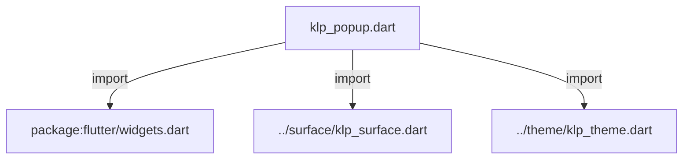
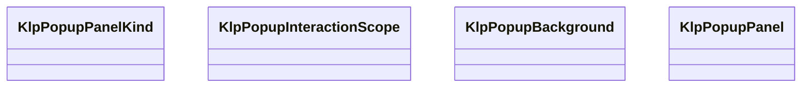
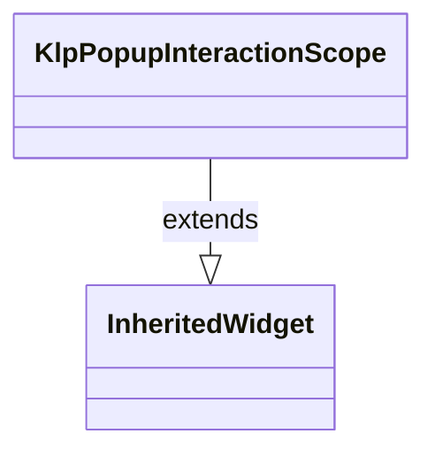
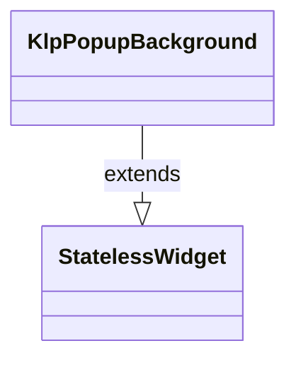
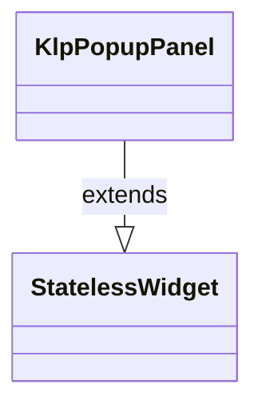

# klp_popup.dart：直接依賴與宣告架構

[回到目錄](README.md) · [來源檔案](../../../../lib/src/overlay/klp_popup.dart)

## 範圍

核心是 `lib/src/overlay/klp_popup.dart`。主要視角為該檔案明寫的 import／export／part；輔助視角為本檔宣告及 extends／implements／with／on 關係。只展開一層外部邊界。

## 直接依賴圖

## 依賴證據

| 關係 | 原始 directive | 來源 |
|---|---|---|
| import | <code>import &#x27;package:flutter/widgets.dart&#x27;;</code> | [lib/src/overlay/klp_popup.dart:1](../../../../lib/src/overlay/klp_popup.dart#L1) |
| import | <code>import &#x27;../surface/klp_surface.dart&#x27;;</code> | [lib/src/overlay/klp_popup.dart:3](../../../../lib/src/overlay/klp_popup.dart#L3) |
| import | <code>import &#x27;../theme/klp_theme.dart&#x27;;</code> | [lib/src/overlay/klp_popup.dart:4](../../../../lib/src/overlay/klp_popup.dart#L4) |

## 宣告關係圖

本組節點是本檔宣告；沒有箭頭的宣告未在此圖主張互相依賴。

## 宣告與成員證據

成員包含 public 與 private；簽章取自來源，省略函式本體與欄位初始值。`(inferred)` 表示來源未明寫型別；建構子只顯示參數部分，不含初始化列表。

### KlpPopupPanelKind

EnumDeclaration · public · [lib/src/overlay/klp_popup.dart:6](../../../../lib/src/overlay/klp_popup.dart#L6)

<code>enum KlpPopupPanelKind</code>

來源註解摘要：Popup 面板的固定尺寸種類。

| 成員 | 可見性 | 簽章／型別 | 來源註解摘要 | 證據 |
|---|---|---|---|---|
| enum value <code>standard</code> | public | <code>standard</code> |  | [lib/src/overlay/klp_popup.dart:7](../../../../lib/src/overlay/klp_popup.dart#L7) |
| enum value <code>large</code> | public | <code>large</code> |  | [lib/src/overlay/klp_popup.dart:7](../../../../lib/src/overlay/klp_popup.dart#L7) |

### KlpPopupInteractionScope

ClassDeclaration · public · [lib/src/overlay/klp_popup.dart:9](../../../../lib/src/overlay/klp_popup.dart#L9)

<code>class KlpPopupInteractionScope extends InheritedWidget</code>

來源註解摘要：供 App frame 注入視窗標題列保留範圍。

- `extends` → <code>InheritedWidget</code>：[lib/src/overlay/klp_popup.dart:10](../../../../lib/src/overlay/klp_popup.dart#L10)

| 成員 | 可見性 | 簽章／型別 | 來源註解摘要 | 證據 |
|---|---|---|---|---|
| constructor <code>KlpPopupInteractionScope</code> | public | <code>const KlpPopupInteractionScope({ super.key, required this.topInset, required super.child, })</code> |  | [lib/src/overlay/klp_popup.dart:11](../../../../lib/src/overlay/klp_popup.dart#L11) |
| field <code>topInset</code> | public | <code>final double topInset</code> |  | [lib/src/overlay/klp_popup.dart:17](../../../../lib/src/overlay/klp_popup.dart#L17) |
| method <code>topInsetOf</code> | public | <code>static double topInsetOf(BuildContext context)</code> |  | [lib/src/overlay/klp_popup.dart:19](../../../../lib/src/overlay/klp_popup.dart#L19) |
| method <code>updateShouldNotify</code> | public | <code>bool updateShouldNotify(KlpPopupInteractionScope oldWidget)</code> |  | [lib/src/overlay/klp_popup.dart:22](../../../../lib/src/overlay/klp_popup.dart#L22) |

### KlpPopupBackground

ClassDeclaration · public · [lib/src/overlay/klp_popup.dart:26](../../../../lib/src/overlay/klp_popup.dart#L26)

<code>class KlpPopupBackground extends StatelessWidget</code>

來源註解摘要：Popup 的背景遮罩。點擊 panel 以外的可互動背景時呼叫 [onDismiss]。 若位於 [KlpPopupInteractionScope] 之下，scope 的頂部範圍只負責顯示遮罩， 不會接收 pointer，因此視窗標題列的拖動與雙擊事件優先。

- `extends` → <code>StatelessWidget</code>：[lib/src/overlay/klp_popup.dart:30](../../../../lib/src/overlay/klp_popup.dart#L30)

| 成員 | 可見性 | 簽章／型別 | 來源註解摘要 | 證據 |
|---|---|---|---|---|
| constructor <code>KlpPopupBackground</code> | public | <code>const KlpPopupBackground({ super.key, required this.child, required this.onDismiss, })</code> |  | [lib/src/overlay/klp_popup.dart:31](../../../../lib/src/overlay/klp_popup.dart#L31) |
| field <code>child</code> | public | <code>final KlpPopupPanel child</code> |  | [lib/src/overlay/klp_popup.dart:37](../../../../lib/src/overlay/klp_popup.dart#L37) |
| field <code>onDismiss</code> | public | <code>final VoidCallback onDismiss</code> |  | [lib/src/overlay/klp_popup.dart:38](../../../../lib/src/overlay/klp_popup.dart#L38) |
| method <code>build</code> | public | <code>Widget build(BuildContext context)</code> |  | [lib/src/overlay/klp_popup.dart:40](../../../../lib/src/overlay/klp_popup.dart#L40) |

### KlpPopupPanel

ClassDeclaration · public · [lib/src/overlay/klp_popup.dart:67](../../../../lib/src/overlay/klp_popup.dart#L67)

<code>class KlpPopupPanel extends StatelessWidget</code>

來源註解摘要：Popup 的固定尺寸 surface。內容內距由 [child] 自己擁有。

- `extends` → <code>StatelessWidget</code>：[lib/src/overlay/klp_popup.dart:68](../../../../lib/src/overlay/klp_popup.dart#L68)

| 成員 | 可見性 | 簽章／型別 | 來源註解摘要 | 證據 |
|---|---|---|---|---|
| constructor <code>KlpPopupPanel</code> | public | <code>const KlpPopupPanel({ super.key, required this.kind, required this.child, })</code> |  | [lib/src/overlay/klp_popup.dart:69](../../../../lib/src/overlay/klp_popup.dart#L69) |
| field <code>standardSize</code> | public | <code>static const Size standardSize</code> | 普通表單面板固定為 600×816，對應建立頻道等完整輸入流程。 | [lib/src/overlay/klp_popup.dart:76](../../../../lib/src/overlay/klp_popup.dart#L76) |
| field <code>largeSize</code> | public | <code>static const Size largeSize</code> |  | [lib/src/overlay/klp_popup.dart:77](../../../../lib/src/overlay/klp_popup.dart#L77) |
| field <code>kind</code> | public | <code>final KlpPopupPanelKind kind</code> |  | [lib/src/overlay/klp_popup.dart:79](../../../../lib/src/overlay/klp_popup.dart#L79) |
| field <code>child</code> | public | <code>final Widget child</code> |  | [lib/src/overlay/klp_popup.dart:80](../../../../lib/src/overlay/klp_popup.dart#L80) |
| method <code>build</code> | public | <code>Widget build(BuildContext context)</code> |  | [lib/src/overlay/klp_popup.dart:82](../../../../lib/src/overlay/klp_popup.dart#L82) |

## 閱讀說明與限制

箭頭只表示來源明寫的靜態關係；import 不等於呼叫。未分析動態呼叫、欄位的實際物件擁有權、狀態轉移或渲染流程；型別未進行語意解析，繼承目標保留原始型別拼寫。public／private 依 Dart 名稱前綴判斷；public 宣告不代表已由 `lib/kallopis.dart` 匯出。

本頁由 `tool/architecture_atlas` 產生；編輯來源或生成工具後重新產生，避免手改本頁。
